This content is for Harness [FirstGen](../../../../getting-started/harness-first-gen-vs-harness-next-gen.md). Switch to [NextGen](/docs/platform/role-based-access-control/add-user-groups). Harness provides Role-Based Access Control (RBAC) via User and User Group Account and Application permissions.

Users' login access is managed at the user level, and users' account and application permissions are managed via User Groups.

### Visual Summary

Here is an overview of Harness RBAC. It shows how a user is authenticated via its User settings and authorized via its User Group Account and Application Permissions.

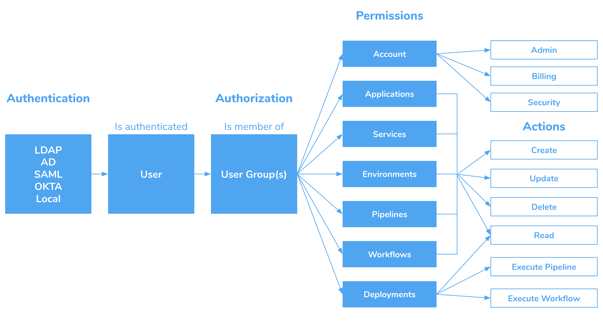
### Default User Groups

Each Harness account includes default User Groups to help you organize your users. The following table describes the default Harness User Groups.

|  |  |  |
| --- | --- | --- |
| **Default Group** | **Account Permissions** | **Application Permissions** |
| Account Administrator | &bull;&nbsp;Create/Delete Application  &bull;&nbsp; Manage Users & Groups  &bull;&nbsp; Manage Template Library  &bull;&nbsp; [Administer Other Account Functions](#administer_other_account_functions_permissions) |  &bull;&nbsp;All Permission Types  &bull;&nbsp;All Applications  &bull;&nbsp;Actions: Create, Read, Update, Delete, Execute Pipeline, and Execute Workflow |
| Production Support | No Account Permissions | * **Pipelines:** All Applications; Filters: Production Pipelines; Actions: Create, Read, Update, Delete  &bull;&nbsp;**Services:** All Applications; Filters: All Services; Actions: Create, Read, Update, Delete  &bull;&nbsp;**Provisioners:** All Applications; Filters: All Provisioners; Actions: Create, Read, Update, Delete  &bull;&nbsp;**Environments:** All Applications; Filters: Production Environments; Actions: Create, Read, Update, Delete  &bull;&nbsp;**Workflows:** All Applications; Filters: Workflow Templates, Production Workflows; Actions: Create, Read, Update, Delete  &bull;&nbsp;**Deployments:** All Applications; Filters: Production Environments; Actions: Read, Execute Pipeline, Execute Workflow |
| Non-Production Support | No Account Permissions |   &bull;&nbsp;**Pipelines:** All Applications; Filters: Non-Production Pipelines; Actions: Create, Read, Update, Delete  &bull;&nbsp;**Services:** All Applications; Filters: All Services; Actions: Create, Read, Update, Delete  &bull;&nbsp;**Provisioners:** All Applications; Filters: All Provisioners; Actions: Create, Read, Update, Delete  &bull;&nbsp;**Environments:** All Applications; Filters: Non-Production Environments; Actions: Create, Read, Update, Delete  &bull;&nbsp;**Workflows:** All Applications; Filters: Workflow Templates, Non-Production Workflows; Actions: Create, Read, Update, Delete  &bull;&nbsp;**Deployments:** All Applications; Filters: Non-Production Environments; Actions: Read, Execute Pipeline, Execute Workflow |

### To Add Users

The following procedure adds a new user to a Harness account.

There is no limit to the number of users you may add. Harness Community Edition support 5 users.To add a user, do the following:

1. Click **Security**, and click **Access Management**.
2. Click **Users**. The **Users** page appears.
3. Click **Add User**. The **Add User** dialog appears.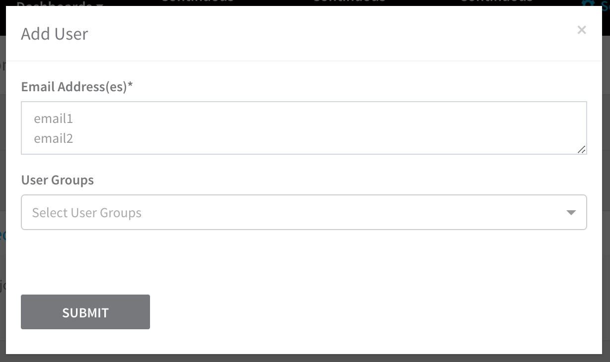

4. Enter the email address(es) that user will use to log into the Harness platform.
5. If you have User Groups defined, select the User Groups for this user. You can add a user before they are verified. You can also add this user to a group from the group's **Add Members** dialog when you manage the group.
6. Click **SUBMIT**. The user is added. The name provided for the user says **user not registered**.
The user will receive a verification email at the address(es) you provided. When the user logs into Harness, the user creates a password, the email address is verified, and the user name is updated.  
You can reset the password in the user's information in **Users**.

#### Invite and User TTL

Each email invite has a TTL of 7 days. Additional invites can be resent to the same address for 30 days using the resend option.

After 30 days the user must be removed, added again, and invited again.

### To Add a User Group

The following procedure creates a new User Group and defines permissions for its users:

1. Click **Security**, and click **Access Management**.
2. Click **User Groups**. The **User Groups** page appears.
3. Create the User Group.
	1. Click **Add User Group**. The **Add User Group** dialog appears.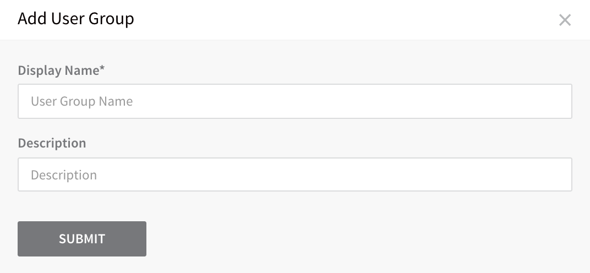

	2. Enter a name and description for the new User Group, and click **SUBMIT**. The management page for the new group appears.
4. Add users to the group.
	1. Click **Member Users**. The **Add Members** dialog appears.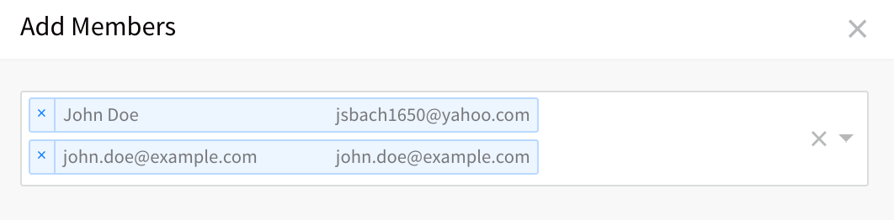

	2. Click in the text area and select the members for the group, and then click **SUBMIT**. The **Member Users** section of the group page is updated with the new members.
5. Set **Account** Permissions.
	1. In **Account Permissions**, enable one or more of the account permissions for this group. For most users, you will enable only the **Create/Delete** Application permissions. For more information, see [Permissions](#permissions).
    
	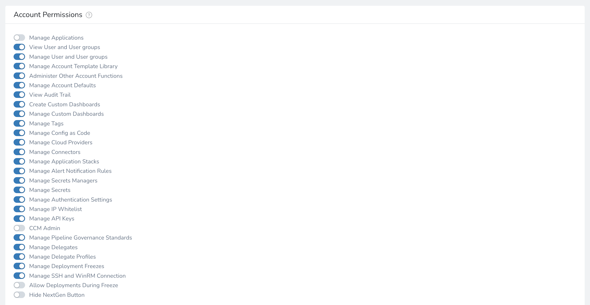

6. Add **Application** Permissions.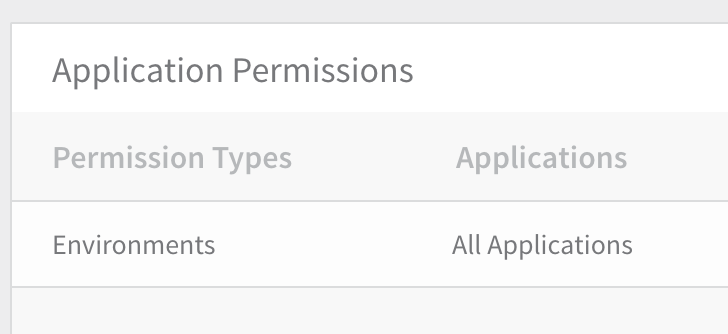

	1. Click **Add Permissions**. The **Add Application Permission** dialog appears.
	2. In **Permission Type**, select the permissions to apply to the group. These are the Harness components you want the group's members to use. For example, if you click **Services**, you can then use the **Filter** field to select the services on which the permission will apply. (For details, see [Permissions](#permissions) below.)
	3. In **Application**, select the applications where the permission will apply.
	4. In **Filter**, select the entities (within the applications you selected in **Application**) that the group can use.
	5. In **Action**, select the action(s) you want to authorize the group to perform.
	6. Click **SUBMIT**. The User Groups page's **Application Permissions** section is updated.

### Permissions Overview

Both sets of Permissions—Account Permissions and Application Permissions—are set on each group. Before setting these permissions, it's important to understand how they interact with each other:

* **Account permissions** affect the high-level permissions for the users in a group, such as the ability to add an application, manage users and groups, and manage their account.
* **Application permissions** affect the low-level permissions for the users in a group, such as the ability to place **Usage Scope** on a secret that applies to a specific service.

For most users, you will want to apply **Application permissions**. **Account** **permissions** are primarily for administration.

#### Permissions Are Additive

When a Harness User is a member of two or more User Groups, that user's permissions are a union (a combination) of both User Groups' permissions.

#### Permissions Example

A user group might have the **Account permission** to add an application, but only the **Application permission** to add services:

Users in this group will be able to create applications and add Services to them, but not will not be able to add Environments, Workflows, or other Application components.

### Account Permissions

Account-level permissions are enabled in each **User Group** page, under **Account Permissions**.

Account permissions enable the following Harness features:

|  |  |
| --- | --- |
| **Account Permission** | **Details** |
| **Manage Applications** | This permission is for managing Harness Application defaults.You can create, update, and delete Applications in your account. For the group to add entities to the Application, you must add **Application Permissions**. |
| **View Users and User Groups** | Read-only permission for the Users and User Groups in Access Management. |
| **Manage Users and Groups** | Create, update, and delete Users and User Groups.Enable/disable Account Permissions on User Groups. |
| **Manage Account Template Library** | Create, update, and delete Account Level Templates in the Template Library.See [Use Templates](../../../continuous-delivery/concepts-cd/deployment-types/use-templates.md). |
| **Administer Other Account Functions** | This permission is a catch-all for actions that are not covered by the other permissions.See [Administer Other Account Functions Permissions](#administer_other_account_functions_permissions) below. |
| **Manage Account Defaults** | This permission is for managing Harness account defaults. For **Harness Application defaults**, use the **Manage Applications** permission.Create, update, and delete Application Defaults. See [Create Default Application Directories and Variables](../../../continuous-delivery/model-cd-pipeline/applications/set-default-application-directories-as-variables.md). |
| **View Audit Trail** | View the Audit Trail events. See [Audit Trail](../auditing-howtos/audit-trail.md). |
| **Create Custom Dashboards** | Create Custom Dashboards.Without this permission, you can still view and operate on a dashboard that has been [shared with you](../../fg-monitoring/sharing.md).See [Custom Dashboards Overview](../../fg-monitoring/custom-dashboards.md). |
| **Manage Custom Dashboards** | Manage Custom Dashboards.Without these permissions, you can still view and operate on a dashboard that has been [shared with you](../../fg-monitoring/sharing.md).See [Custom Dashboards Overview](../../fg-monitoring/custom-dashboards.md). |
| **Manage Tags** | Create, update, and delete Tags (key/value pairs) that can be attached to Application components, and impose Allowed Values restrictions on Tags.See [Using Tags](../../account/tags/tags.md). |
| **Manage Config as Code** | Enable Git Sync for Harness Accounts and Applications. See [Harness Account-Level Git Sync](../../config-as-code/harness-account-level-sync.md) and [Harness Application-Level Git Sync](../../config-as-code/harness-application-level-sync.md).You can also make changes using the **Configuration as Code** UI option. See [Edit Harness Components as YAML](../../config-as-code/edit-the-code-in-harness.md). |
| **Manage Cloud Providers** | Create, update, and delete **Cloud Providers**. If this permission is not enabled, the users within the user groups will be able to only view the **Cloud Providers** and their settings.See [Add Cloud Providers](../../account/manage-connectors/cloud-providers.md). |
| **Manage Connectors** | Create, update, and delete **Connectors** (**Artifact Servers**, **Source Repo Providers**, **Verification Providers**, and **Collaboration Providers**).If this permission is not enabled, the Users within the User Groups will be able to only view the **Connectors**.See [Connectors Overview](../../account/manage-connectors/harness-connectors.md). |
| **Manage Application Stacks** | Create, update, and delete Application Stacks. See [Add Application Stacks](../../account/manage-appstacks/catalog.md). |
| **Manage Alert Notification Rules** | Create, update, and delete the notification alert settings configured for the account. See [Manage Alert Notifications](../../account/manage-notegroups/manage-alert-notifications.md). |
| **Manage Secrets Managers** | Add, update, and delete Secrets Managers. If this permission is not enabled, the users within the user groups will be able to only view the list of Secrets Managers.See [Add a Secrets Manager](../secrets-management/add-a-secrets-manager.md) and [Scope Secret Managers to Applications and Environments](../secrets-management/scope-secret-managers-to-applications-and-environments.md). |
| **Manage Secrets** | Add secrets for Account-level settings (Cloud Providers, Connectors, etc) and any Applications on which the user has the Application Permissions **Create**, **Read**, **Update**.If this permission is not enabled, the users within the User Groups will be able to view the secrets only (**Encrypted Text** and **Encrypted Files**).**Secret Usage Scope:** The Applications and Environments in a secret's Usage Scope must match the User Group Application Permissions' Applications and Environments. To use a secret, the Application Permission must be **Update**.**Secrets in Delegate Profiles:** If you have **Manage Secrets** enabled, you can use the **Scope to Account** feature of encrypted text and files secrets, and use those secrets in [Delegate Profiles](../../account/manage-delegates/run-scripts-on-the-delegate-using-profiles.md) for usernames, passwords, etc. See [Using Secrets in a Profile](../../account/manage-delegates/use-a-secret-in-a-delegate-profile.md).See [Managing Harness Secrets](../secrets-management/managing-harness-secrets.md). |
| **Manage Authentication Settings** | Configure Authentication Settings.See [Authentication Settings](authentication-settings.md). |
| **Manage IP Whitelist** | Configure IPs to be whitelisted.See [IP Whitelist Management](access-management.md). |
| **Manage API Keys** | Create, update, and delete API Keys.See [API Keys](api-keys.md) |
| **CE Admin** | Enables the User Group members to administer CE for the account.Permissions include enabling CE, creating CE Explorer reports and budgets, and subscribing users to receive email reports.See [Continuous Efficiency Overview](../../../../cloud-cost-management/2-getting-started-ccm/1-continuous-efficiency-overview.md). |
| **CE Viewer** | View CE Explorer reports. See [Continuous Efficiency Overview](../../../../cloud-cost-management/2-getting-started-ccm/1-continuous-efficiency-overview.md).Soon the CE Viewer permission will enable users to subscribe people to CE email reports (not CE Explorer reports). This functionality is pending. |
| **Manage Pipeline Governance Standards** | Create, update, and delete Pipeline Governance Standards. See [Pipeline Governance](../governance-howtos/pipeline-governance.md). |
| **Manage Deployment Freezes** | Create, update, and delete Deployment Freeze windows. See [Deployment Freeze](../governance-howtos/deployment-freeze.md) and [Pause All Triggers using Deployment Freeze](../../../continuous-delivery/model-cd-pipeline/triggers/freeze-triggers.md). |
| **Manage Delegates** | Enables User Group members to add, update, and configure [Harness Delegates](../../account/manage-delegates/delegate-installation.md) for the account. |
| **Manage Delegate Profiles** | Enables User Group members to add, update, and configure [Delegate Profiles](../../account/manage-delegates/run-scripts-on-the-delegate-using-profiles.md). |
| **Manage SSH and WinRM Connection** | Enables User Group members to add, update and delete SSH Keys and WinRM Connection Credentials. |
| **Allow Deployments During Freeze** | Enables Admin members to deploy even if there is an active Deployment Freeze window. See [Deployment Freeze](../governance-howtos/deployment-freeze.md). |
| **Hide NextGen Button** | Hides the `Launch Harness Next Generation` option from the UI. |

#### Administer Other Account Functions Permissions

The **Administer Other Account Functions Permissions** permission is a catch-all for multiple permissions, described below.

##### Using a Harness API key

If you are using the Harness API and your API key uses a User Group with **Administer Other Account Functions Permissions** enabled, these are the things that you can do:

* View Delegate Selectors.
* Create Harness User Group, Delete Harness User Group, Update Harness User Group members, List Harness User Group.
* Update Triggers.
* List Delegate Profiles, list Delegates with the same profile.

##### Using the Harness Manager

If your User belongs to a User Group with **Administer Other Account Functions Permissions** enabled, these are the things that you can do:

* Start CCM Trial
* Change the default experience between FirstGen and NextGen.
* Create/Update/Delete Delegate Profiles, Update Delegate Selector (listing is supported by just logging into Harness).
* Create/Update/Delete Delegate Scoping Rules (listing is supported by just logging into Harness).
* Update Scopes, Update Tags, Update Delegates, Update Delegate Description Update Delegate Approval Status, Delete Delegate, Generating Download URL
* Create/Update/Delete Resource Constraints.
* Update Triggers.
* Delete Artifact Stream.
* Authorize Trigger for specific Environment.
* Manage CCM Connectors.

### Application Permissions

Application permissions enable you to perform any activity on an Application level. This includes applying **Secrets Management** and some **Account** settings to specific Applications and Environments, via **Usage Scope**. It also includes adding and modifying Tags on Application components.

#### Enable Application Permissions

To enable a User Group to manage an Application, add Application Permissions for the Application, and include the Create, Read, Update, and Delete permissions as required. These permissions are called Actions in Application Permissions.

#### Application Templates Permissions

To enable a User Group to manage specific or all Application-level Templates, you use the **Application Templates** Permission Type.

Next, in **Application**, select the Application with the Templates. In **Filter**, select a specific Application Template or All Application Templates.

In **Action**, select the Create, Read, Update, and Delete permissions as required.

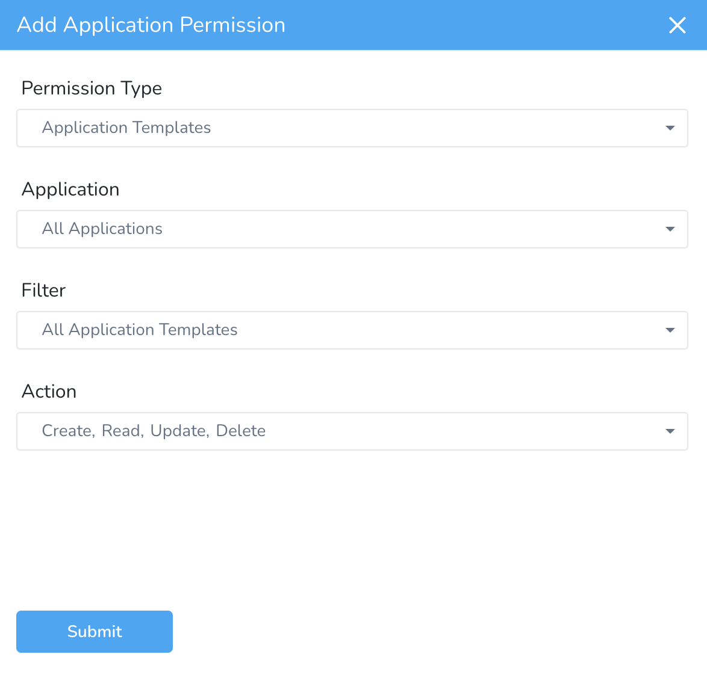

#### Exclude Applications

Currently, this feature is in Beta and behind a Feature Flag. Contact [Harness Support](https://mail.google.com/mail/?view=cm&fs=1&tf=1&to=support@harness.io) to enable the feature. Feature Flags can only be removed for Harness Professional and Essentials editions. Once the feature is released to a general audience, it is available for Trial and Community Editions.You can exclude applications when assigning permissions to User Groups in Harness.

Exclusion is only applicable to Applications and not to Filters or Actions.For selecting applications while assigning permissions, you can choose one of the following options:

* **All Applications** - This assigns permissions for all of your existing applications as well as any new ones you add later.
* **Include Selected** - This assigns permissions for the applications you select. Any new application that you add afterward must be selected separately for permission assignment.  
Let's look at an example. If you click **Include Selected** and select App 1, App 2, and App 3, permissions are assigned to these 3 applications only. For an application App 7 that you add later, you must select it separately to assign permissions to it.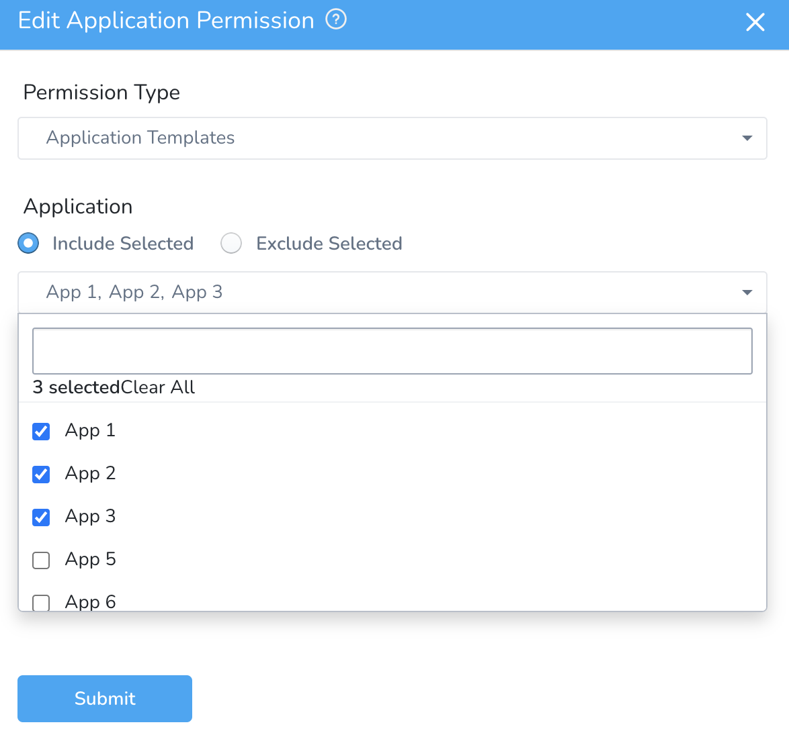

* **Exclude Selected** - This assigns permissions to all your applications except the selected ones. This applies to all of your existing applications as well as any new ones you add later.  
Let's look at an example. If you click **Exclude Selected** and select App 1, App 2 and App 3, permissions are assigned to all the applications except these 3 applications.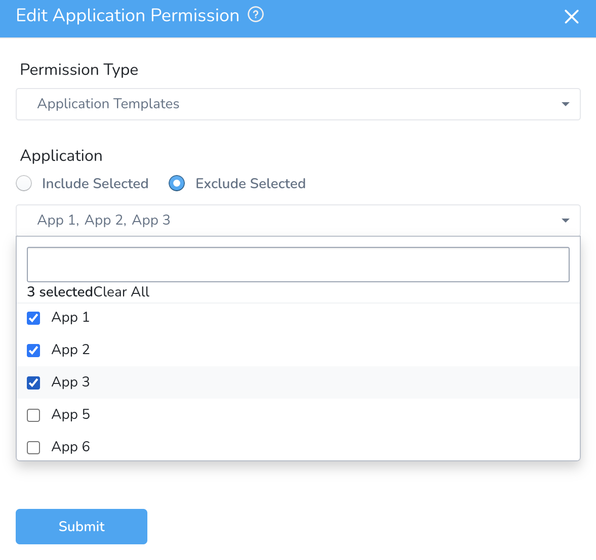

If you choose **Exclude Selected**, you can no longer pick **All Applications.**

#### Assign Workflows and Pipelines to User Groups

Currently, this feature is in Beta and behind a Feature Flag. Contact [Harness Support](https://mail.google.com/mail/?view=cm&fs=1&tf=1&to=support@harness.io) to enable the feature. Feature Flags can only be removed for Harness Professional and Essentials editions. Once the feature is released to a general audience, it is available for Trial and Community Editions.To enable a User Group to manage a specific Workflow or Pipeline, you must use the **Workflows** or **Pipelines** Permission Type and include the Create, Read, Update, and Delete permissions as required. Select one of the following options to filter the permissions based on Environments or Entities:

* **By Environments/By Workflows** — This will give access to all the workflows that use the environment you select, or as per the entities. Other workflows using the same environment won't be accessible.

You must have Create Workflow permission to create a new workflow in a particular Environment. To create a workflow that uses an Environment, you must have workflow permission with **Create** action type for that Environment.* **By** **Environments/By** **Pipelines** — This will give access to all the workflows that use the environment you select, or as per the pipeline you select.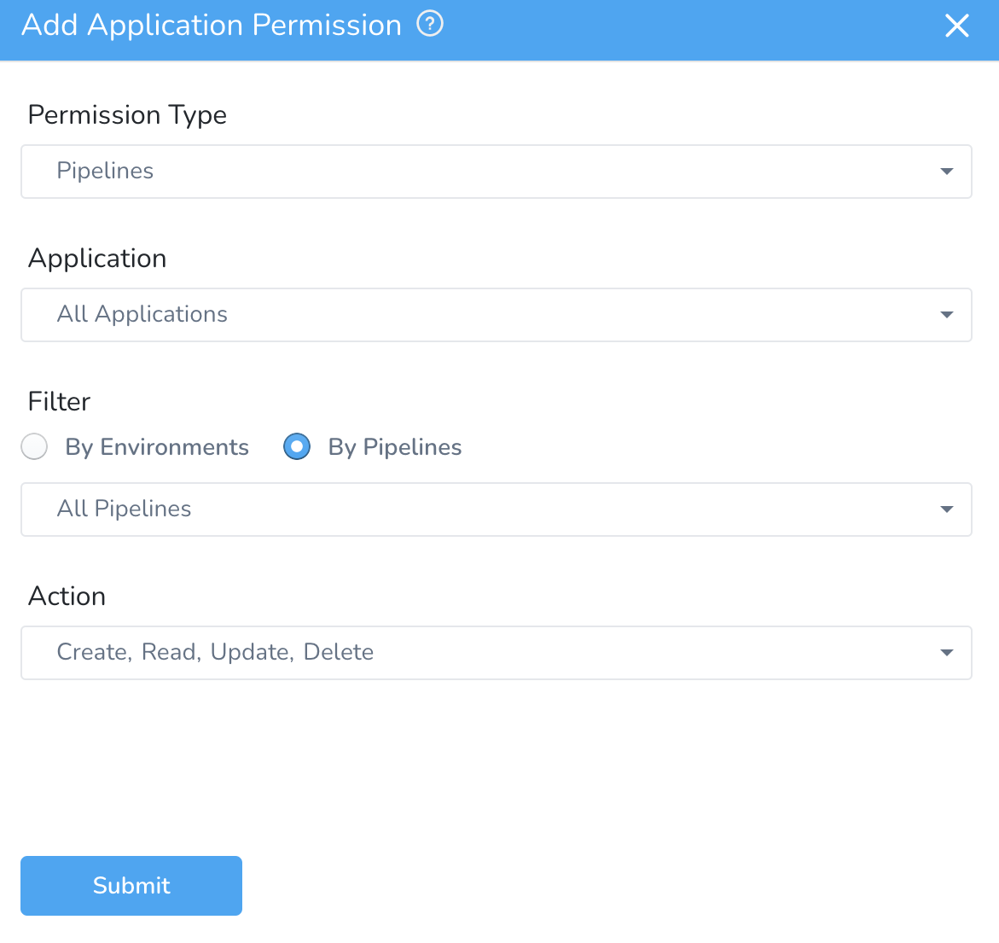

You must have Create Pipeline permission to create a new pipeline in a particular Environment. To create a pipeline that uses an Environment, you must have pipeline permission with **Create** action type for that Environment.Select **All Workflows** or **All Pipelines** to assign permissions for all Workflows or Pipelines.

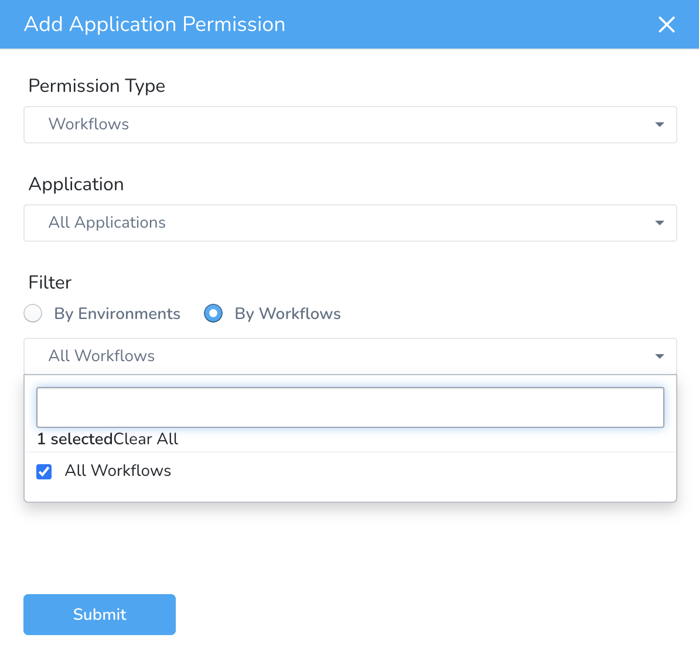
To provide access to Workflows/Pipelines for a specific application, select the application in **Application** and then select the workflows/pipelines.

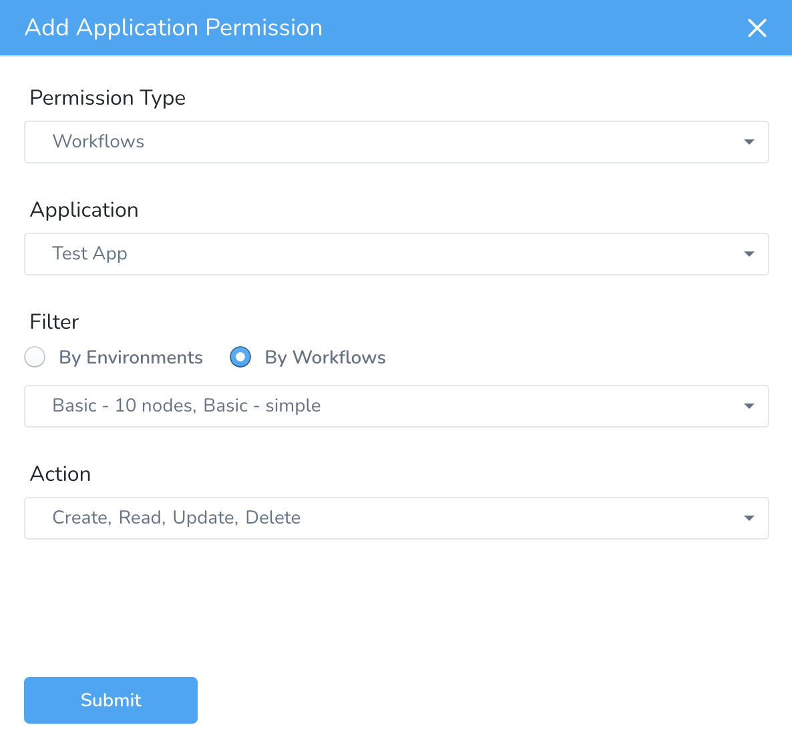

#### Deploying, Aborting, and Rolling Back Workflows and Pipelines

The following permission types and actions are needed for deploying, aborting, and rolling back Workflows and Pipelines.

##### Deployments

To enable a User Group to deploy Workflows and Pipelines, you must use the **Deployments** Permission Type.

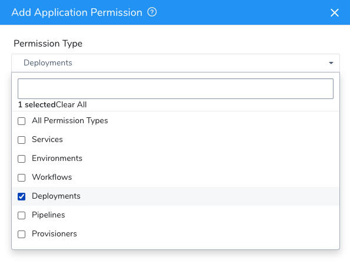
The **Workflows** and **Pipelines** Permission Types are used for Create, Read, Update, and Delete permissions.

#### Production and Non-Production Pipelines and Permissions

You can filter the permissions to include either a Production Pipeline or a Non-production Pipeline.

When a Pipeline contains only all non-production stages, it is called as a Non-production Pipeline.

If a non-production environment is selected for the permission, the user will be able to trigger the pipeline as long as all the stages are deployed to non-production environments.

If a Pipeline has both non-production and production stages, the user needs to have access to all the production and non-production Environments to be able to trigger the Pipeline.

##### Deploy Pipelines in Specific Environments

You can restrict deployments in certain Environments by filtering the Deployment permissions by Pipeline. Only the Pipelines you choose can be deployed in the selected Environments.

If you have Execute Permissions on Pipelines from included Applications, you can run them from excluded Applications.

Currently, this feature is behind the Feature Flag `PIPELINE_PER_ENV_DEPLOYMENT_PERMISSION`. Contact [Harness Support](https://mail.google.com/mail/?view=cm&fs=1&tf=1&to=support@harness.io) to enable the feature.To select Pipelines to deploy to specific Environments, select the Environment in **Filter** and **Execute Pipeline** in **Action**.

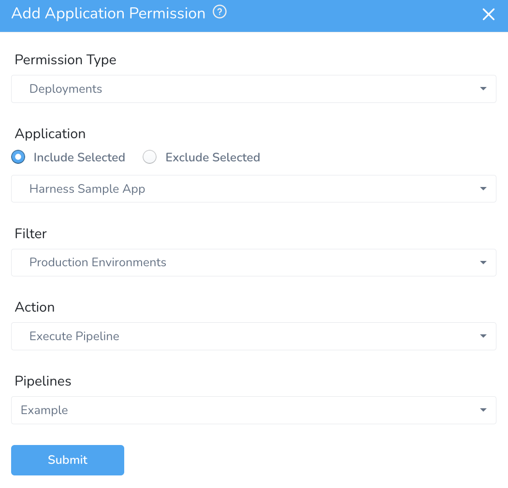
Only those Environments for which you have Deployment permissions can be used to deploy templated Pipelines using Environment templates.

##### Abort and Rollback

To enable a User Group to abort or rollback Workflows and Pipelines, the **Execute** action is required.

#### Restricting Usage

You can restrict who can apply settings—such as **Secrets Management** and some **Account** settings—to specific Application entities. These are set up in the **Usage Scope** section of the corresponding setting's dialog. For example, here is the **Usage Scope** section of an **Artifact Server** dialog:

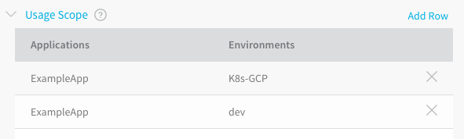
In this case, the Artifact Server may be used by the **ExampleApp** Application in both **K8s-GCP** and **dev** Environments.

For a User to modify **Usage Scope**, the User must belong to a Group that has **read** and **update** **Application** permissions for the Application and components on which the restrictions are placed.

1. In **Usage Scope**, click the drop-down under **Applications**, and click the name of the Application.
2. In **Environments**, click the name of the Environment.

#### Build Workflows and Environment-based Application Permissions

If you create Application Permissions that apply to Environments they do not apply to Build Workflows because Build Workflows do not have Environments.

### Permissions and Configure as Code

Permissions for Harness [Configure as Code](../../config-as-code/configuration-as-code.md) YAML files are the same as those for the Harness Manager UI.

For example, to edit the YAML for a Harness Application, the User Group Account and Application permissions must be as follows:

* **Account Permissions:** A user's Harness User Group must have the Account Permission **Manage Applications** enabled.
* **Applications Permissions:** A user's Harness User Group must have the Application Permission **Update** enabled for the specific Applications.

### Related Topics

* [Authentication Settings](authentication-settings.md)
* [SSO Provider Overview](sso-provider-overview.md)

