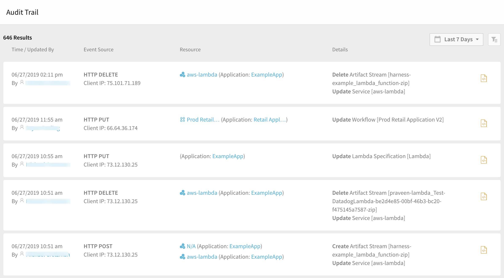
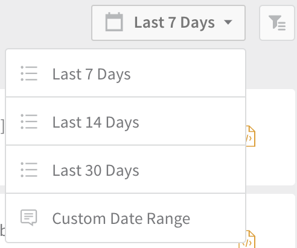
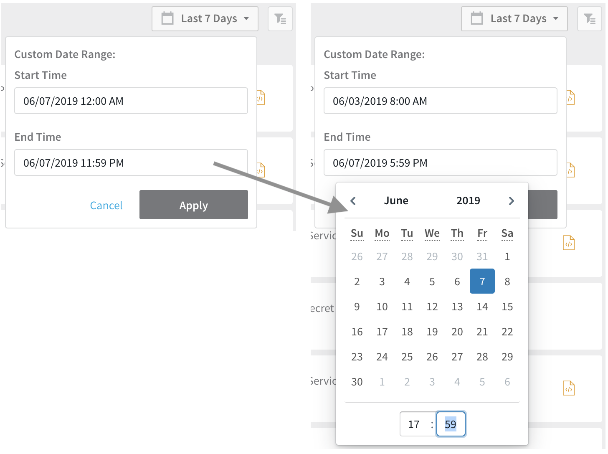
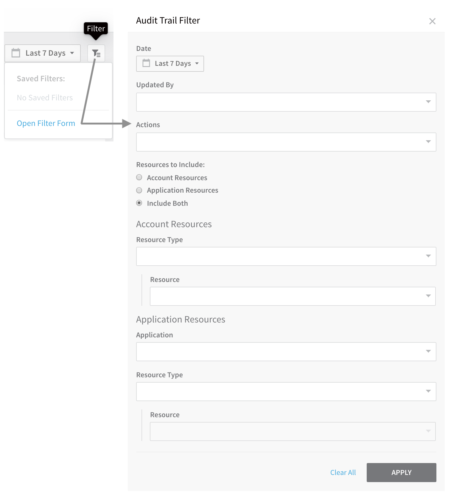
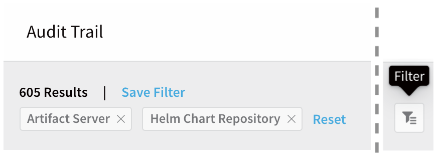
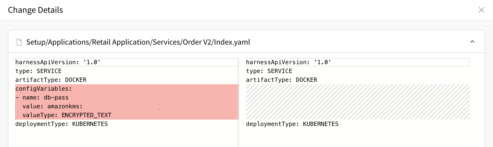

This content is for Harness [FirstGen](../../../../get-started/harness-first-gen-vs-harness-next-gen.md). Switch to [NextGen](/docs/platform/governance/audit-trail/audit-trail).Harness provides auditing of events for many Harness account, Applications, and Application components. The Audit Trail enables you to track and review all events in one place.

The Audit Trail feature covers events in accounts and Applications. To see your deployment history use Harness Manager's **Continuous Deployment**. See [Filtering Deployments](../../../continuous-delivery/concepts-cd/deployments-overview/filtering-deployments.md).

## Video Summary

## Before You Begin

* [Users and Permissions](../access-management-howtos/users-and-permissions.md)
* [Application Components](../../../continuous-delivery/model-cd-pipeline/applications/application-configuration.md)

## Limitations

* Audit data retention is 6 months. Harness reserves the right to delete audit data after 6 months. You can request a longer retention period by contacting Harness. For example, if you require audit data for legal discoveries, etc, contact Harness and we can help.
* There can be a lag of a few minutes for events to show up in the Audit Trail. If you do not see an event immediately, wait a minute and then refresh your browser.

## View an Audit Trail

To view your account's audit trail: From Harness Manager, select **Continuous Security** **>** **Audit Trail**. The **Audit Trail** page appears, displaying a record for each event that changed the setup of your Harness account, Applications, or Application components.

For each event record, this view shows the:

* Date and time.
* User who made the change (**Updated By**).
* Underlying REST API call (**Event Source**).
* Harness entity and Application affected (**Resource**).
* Details summary.

From here, you have multiple options to [modify this view](#modify) and [display event details](#details).

## Modify the Audit Trail View

You can restrict the Audit Trail's displayed events by date and time, or define detailed filters by these and other criteria.

### Set Date/Time Range

Use the Date Picker to restrict events to a predefined date range, or to a custom date/time range:

Selecting **Custom Date Range** enables you to set arbitrary limits by date and time of day:

### Filter Audit Events

Click the Filter button to open a dialog where you can set multiple conditions on the events displayed:

This dialog provides the following options. Your selections are cumulative—they combine to restrict the Audit Trail's display:

|  |  |
| --- | --- |
| **Field** | **Description** |
| **Date** | This is identical to the Date Picker control (see [Set Date/Time Range](#date_time)). |
| **Updated By** | Select one or more users, to view only events they performed. (Select **Git Sync** to see changes per commit.) |
| **Actions** | Select one or more of the basic CRUD actions—**Create**, **Update**, and **Delete**—to view only matching events. |
| **Resources to Include** | Filter by **Account Resources**, **Application Resources**, or **Include Both**. The broadest choice (**Include Both**) displays the most fields in the dialog's lower section—which, conversely, enables you to filter the displayed events most narrowly. |

#### Account Resources

|  |  |
| --- | --- |
| **Field** | **Description** |
| **Resource Type** | Select one or more account-wide resource types: **Artifact Server**, **Collaboration Provider**, **Connection Attributes**, **Cloud Provider**, **Encrypted Records** (secrets), **Load Balancer**, (access-control) **Role**, **Setting**, **Source Repo Provider**, and **Template**. Your selections will display only events that modified these resource types. |
| **Resource** | Select one or more resources matching the type(s) you've defined in the **Resource Type** field. (Options appear here only if you've selected at least one **Resource Type**. The displayed options are themselves filtered by your **Resource Type** selections.) |

#### Application Resources
|  |  |
| --- | --- |
| **Field** | **Description** |
| **Application** | Select a single Application defined in your organization's account. |
| **Resource Type** | Select a single type of Application-level resource: **Service**, **Environment**, **Workflow**, **Pipeline**, **Trigger**, **Provisioner**, or **Template**. |
| **Resource** | Select a single resource of the type you've defined in the **Resource Type** field. (This control is available only if you've selected an **Application** and **Resource Type**.) |

After making selections in this dialog:

* Use any field's **X** control to clear entries in that field.
* Use the **Clear All** link to reset the whole dialog.
* Click **APPLY** to immediately filter the Audit Trail's displayed events according to your selections.

Once you've applied a filter, you can share your filtered view of the Audit Trail with other Harness users by copying its URL from your browser's address bar.

### Update or Save Filters

Once you've applied any filters to the Audit Trail display, controls along the top allow you to update, remove, or save your filter selections:

* To remove a single filter from the Audit Trail display, click its **X** box.
* To remove all filters, click **Reset**. (There is no undo for this action.)
* To name and save your current set of filters, click **Save Filter**. (Saved filters will appear on the Filter button's submenu.)
* To fine-tune filters, click the Filter button. (This reopens the **Audit Trail Filter** dialog with your current filter settings.)

## View Audit Trail Event Details

Within each of the Audit Trail's events, you can click links to display further information about the event:

|  |  |
| --- | --- |
|  | Click a user's name for details about the user who performed the action. |
|  | Click a resource name to open the Details page for that resource (in this case, a Service). |
|  | Click an Application name to open the Details page for that Application. |
|  | Click a link in the **Details** column to expand details about an event. |
|  | ​Click the **YAML Diff** icon to see the actual configuration changes that Harness recorded for an event. |

As shown in the example below, the resulting diff view indicates deletions and insertions in the underlying YAML.

