Currently, this feature is behind the `NEW_DEPLOYMENT_FREEZE` feature flag. Contact [Harness Support](mailto:support@harness.io) to enable the feature.Deployment Freeze is a Harness Governance feature that stops all Harness deployments. A deployment freeze helps ensure stability during periods of low engineering and support activity, such as holidays, trade shows, or company events. For steps to freeze deployments through Harness API, see [Use Deployment Freeze API](../../techref-category/api/use-deployment-freeze-api.md).

### Before You Begin

* [Deployments Overview](/docs/category/general-deployment-features)
* [Workflows](../../../continuous-delivery/model-cd-pipeline/workflows/workflow-configuration.md)
* [Create a Pipeline](../../../continuous-delivery/model-cd-pipeline/pipelines/pipeline-configuration.md)
* Make sure you have **Administer Other Account Functions** permissions to access Governance in Harness. For more information, see [Account Permissions](../access-management-howtos/users-and-permissions.md#account-permissions).

### Deployment Freeze Overview

Typically, the more automated a deployment is, the safer it becomes. Automated deployments remove the errors that cause risk because they are a continual process.

Yet, there are times when even the few personnel needed for Harness deployments are occupied with other events, such as holidays. In these cases, freezing deployments helps prevent deployments from introducing new issues.

Freezing Harness deployments does not mean that changes aren't happening in the deployment environment. User and system events are always taking place, and your microservice dependencies remain active.

When a deployment freeze window is enabled:

* Deployments cannot be started manually or using a Trigger.
* Active deployments are allowed to complete.
* During execution if a Pipeline hits a stage with an Environment that has a deployment freeze enabled, then the Pipeline gets rejected. You can resume the rejected Pipelines from the previous state once the deployment freeze window is over. See [Resume Pipeline Deployments](../../../continuous-delivery/concepts-cd/deployments-overview/resume-a-pipeline-deployment.md).
* If the first stage of a Pipeline (or a Workflow) uses an Environment that has a deployment freeze enabled, then you need to wait for the deployment freeze window to be over before triggering the deployment. See [Trigger Workflows and Pipelines](../../../continuous-delivery/model-cd-pipeline/triggers/add-a-trigger-2.md).

### Step: Add a Freeze Window

Perform the following steps to add a Freeze Window:

1. In the **Deployment Governance** page, click **Add freeze window**.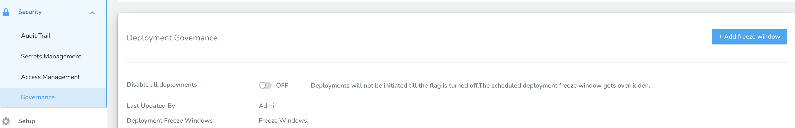

2. In **Deployment Freeze Window**, in **Name**, enter a name for your freeze window.
3. In **Freeze Window**, select **Applications** and **Environment Type** to restrict the Deployment Freeze Window to one or multiple Harness Applications.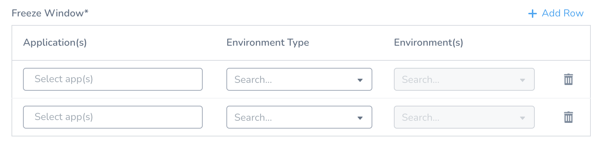

	1. In **Application**, select the application. You can select multiple Applications.
	2. In **Environment Type**, select the environment type.
	3. In **Environment**, select the Environment. **Environment(s)** option is enabled only if you select a Harness **Application** and **Specific Environment(s)** in the **Environment Type**.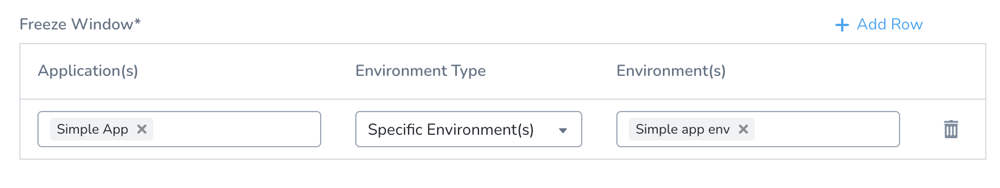

	4. For **Excluded application(s)**, see [Option: Excluded application(s)](#option_excluded_application_s) below.
	5. In **Service(s)**, select one or more Services to freeze deployment for the same.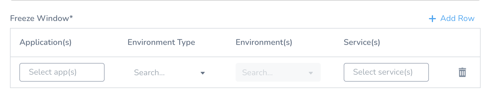
The default value for Service(s) is **All Services** when you select multiple Applications.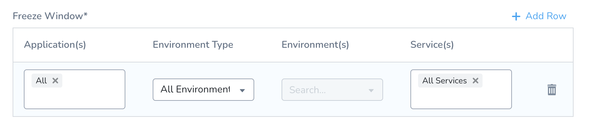
To add Freeze Window for a specific Service, select the Application and Environment corresponding to that Service.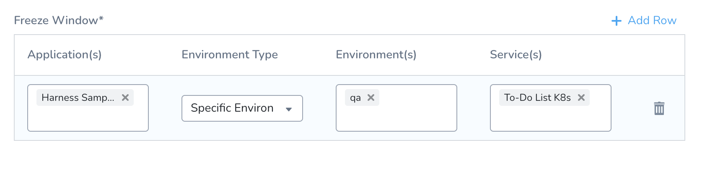

Currently, this feature is behind the Feature Flag `NEW_DEPLOYMENT_FREEZE`. Contact [Harness Support](mailto:support@harness.io) to enable the feature.1. Click **Add Row** to add more Applications, Environment Type, and Environment.
2. In **Select** **Time Zone**, select a timezone from the drop-down list.
3. Select **Create a Schedule** or **Start Now**.

### Option: Excluded application(s)

Currently, this feature is behind the feature flags `NEW_DEPLOYMENT_FREEZE` and `SPG_NEW_DEPLOYMENT_FREEZE_EXCLUSIONS`. Contact [Harness Support](mailto:support@harness.io) to enable the feature.The **Excluded application(s)** option can exclude Harness Applications from a freeze window. 

1. First, in **Application(s)**, enter **All**.
2. Next, in **Excluded application(s)**, enter the Applications to exclude.

The deployment freeze will be applied to all Applications but the ones you enter in **Excluded application(s)**.

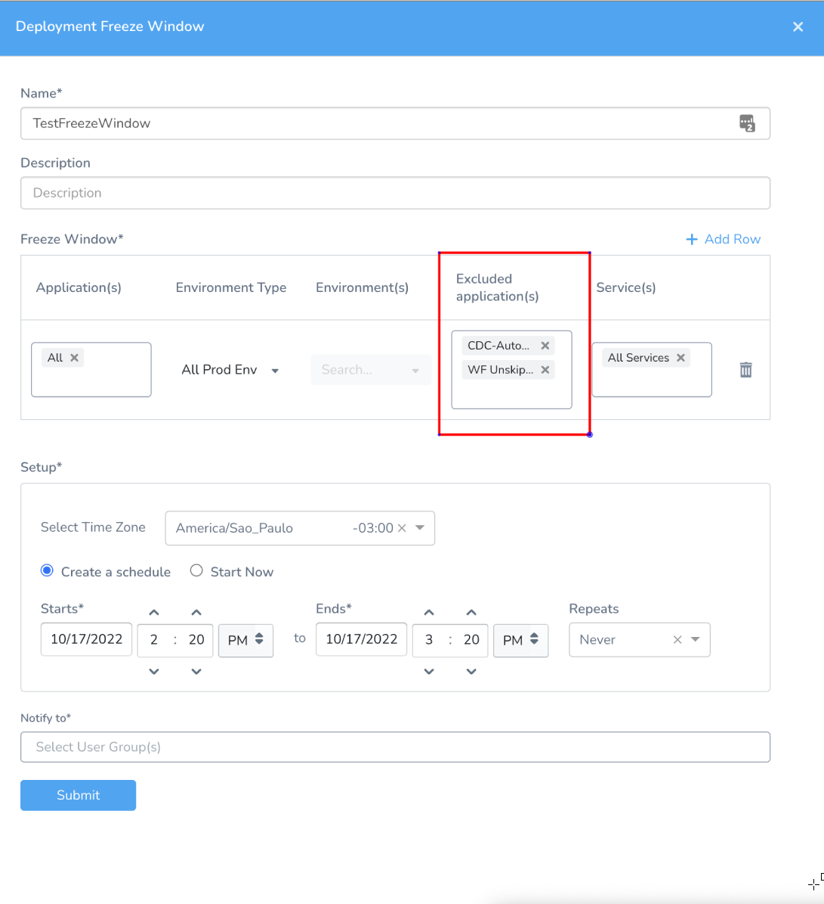

#### Configuration as Code

Excluded application(s) is also available in Configuration as Code YAML. You can configure it in the Governance > Deployment Governance.yaml file.

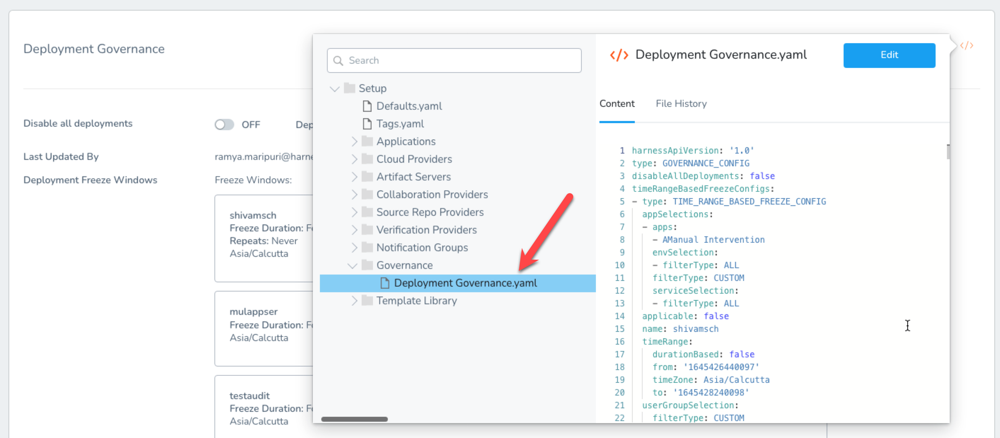
The exclusions should be configured in the `excludeAppSelections` field in the YAML file. The `envSelection.filterType: ALL` should be set first.

#### GraphQL API

You can use the field `excludeFreezeWindows` in the `createDeploymentFreeze` and `updateDeploymentFreeze` mutations. 

This field is used to specify exclusions for the freeze windows, and its format is exactly the same as the currently existing `freezeWindows` field for these mutations.

### Option: Start Now

If you select **Start Now**, simply select how long you want the freeze to last in **Duration**.

### Option: Create a Schedule

The **Create a Schedule** option allow you to schedule the freeze and set how often it repeats.

In **Starts** and **Ends**, use the date picker to set a start and end **date** and **time**. The freeze window should be of minimum 30 minutes.

The date and times use [UTC](https://time.is/UTC).

In **Repeats**, select how often the to repeat the freeze.

In **Until**, select **Forever** or **On**.

The default for **Forever** is 5 years from the current date.

In **On**, enter a date when the freeze schedule ends.

Let's say your Start and End dates are June 15, 2021, 6:45 pm – June 15, 2021, 7:15 pm.

* **Daily:** the freeze will happen every day from 6:45 pm to 7:15 pm until the **On** date.
* **Weekly:** June 15th is a Tuesday, so the freeze will happen every Tuesday until the **On** date.
* **Monthly:** the freeze will happen on the 15th of every month until the **On** date.
* **Annually:** the freeze will happen every year on June 15th until the **On** date.

### Step: Notifications

In **Notify to** select the user group(s) to notify when the deployment freeze starts.

For information on setting up the notification channels for a User Group, see [User Notifications and Alert Settings](../../account/manage-notegroups/notification-groups.md).

The added user group is notified of the activation and deactivation of the deployment freeze window.

Use **All** to notify all User Groups.

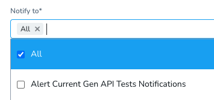
### Step: Submit

Click **Submit**.

The **Deployment Governance** page now displays the Deployment Freeze Window that you've set.

By default when you add a Deployment Freeze Window, it's in OFF mode. Slide the slider to **ON** to enable the deployment freeze window.

### Enable Deployment Freeze

Perform the following steps to freeze both manual and Trigger-based deployments:

1. In Harness Manager, in **Security**, select **Governance**. The **Deployment** **Governance** settings appear.
2. Slide the **Disable all deployments** slider to **ON** to enable the deployment freeze.If the **Deployment Freeze** is set to **ON**, then all the deployments are frozen and the scheduled Deployment Freeze Windows are not used. The scheduled deployment freeze window gets overridden.
3. In **Deployment Governance**, in **Deployment Freeze Windows**, slide the slider to **ON** for the deployment freeze window for which you want to enable the deployment freeze.
4. You can also view **Last Updated By** and all the scheduled **Deployment Freeze Windows** details.

### Verify Deployment Freeze

When the **Deployment Freeze** setting is enabled, the **Start New Deployment** button is disabled in **Continuous Deployments**.

The following other Harness Manager elements are also disabled:

* Rerun deployment button in **Deployments**.
* **Deploy** button in Workflow.
* **Deploy** button in Pipeline.

If the **Deployment Freeze** setting is not enabled, but a Deployment Freeze Window is in effect, the **Start New Deployment** button is not disabled, but an error message appears when it is clicked.

### Disable Deployment Freeze

To disable Deployment Freeze (including any scheduled Freeze Windows), just move the **Disable all deployment** page's slider back to **OFF**, and then click **Confirm** when prompted.

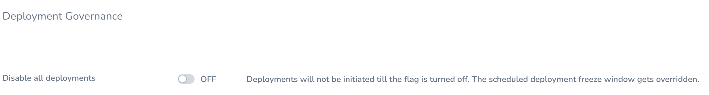
### Override Deployment Freeze

You can start a deployment even if there is an active Deployment Freeze window. You must be an Admin with the **Allow Deployments During Freeze** permission to do [this](../access-management-howtos/users-and-permissions.md)**.** To override the deployment freeze window, just start, resume, or rerun the deployment for an Application, Workflow, or Pipeline with an active deployment freeze window, click **Confirm**.

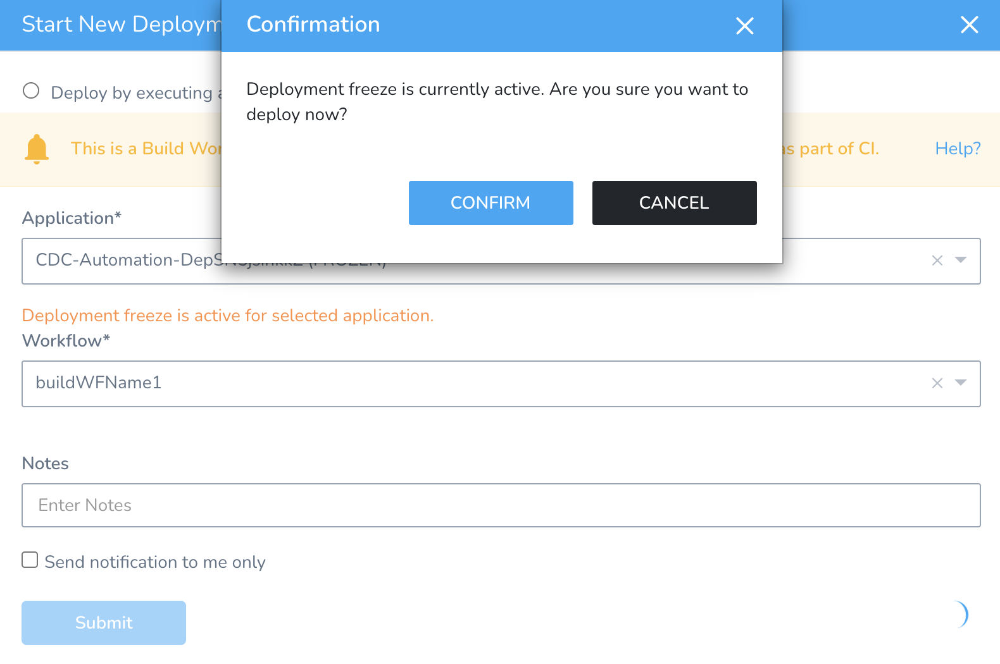
If you start deployment by overriding an active deployment freeze and then toggle off the override permission while waiting for runtime inputs, the deployment continues to run.### Aborting or Rolling Back Deployments Running when Freeze Begins

If there is a deployment running when the freeze window begins, you can Roll back or Abort that deployment.

### Next Steps

Review the following Harness features that help you monitor and control deployments:

* [24/7 Service Guard Overview](../../../continuous-delivery/continuous-verification/continuous-verification-overview/concepts-cv/24-7-service-guard-overview.md)
* [Continuous Verification](../../../continuous-delivery/continuous-verification/continuous-verification-overview/concepts-cv/what-is-cv.md)

