The Pipeline Governance feature is behind a feature flag. Contact [Harness Support](mailto:support@harness.io) to enable the feature.Harness Pipeline Governance feature enables you to measure how conformant your Pipelines are with your regulatory and operations standards.

### Before You Begin

* Make sure you have **Administer Other Account Functions** permissions to access Governance in Harness. For more information, see [Account Permissions](../access-management-howtos/users-and-permissions.md#account-permissions).

### High-Level Governance Process

Using Harness Pipeline Governance is a simple process. After you create Workflows that perform or verify some regulatory operation, you describe them using [Tags](../../account/tags/tags.md).

Next, you use those Tags to create rules in a Pipeline Governance Standard. You assign a weight to each rule to indicate how important it is.

The standards are used to score the conformance of Pipelines. A score lets you measure the conformance level of the Workflows a Pipeline contains.

You can see the score before you deploy a Pipeline, and during Pipeline Approval steps.

Below is an example of a Pipeline Governance Standard and how a Pipeline Approval step measures conformance with the standard during deployment:

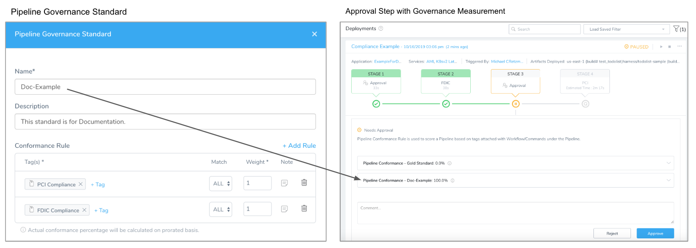
Let's take a high-level view of the major steps:

1. Create Workflows and Pipelines that meet or perform regulatory operations for your application.
2. Add [Tags](../../account/tags/tags.md) to your Workflows to identify what operations they perform, such as PCI, FDIC, etc. Here are two Workflows with Tags that identify their regulatory operations: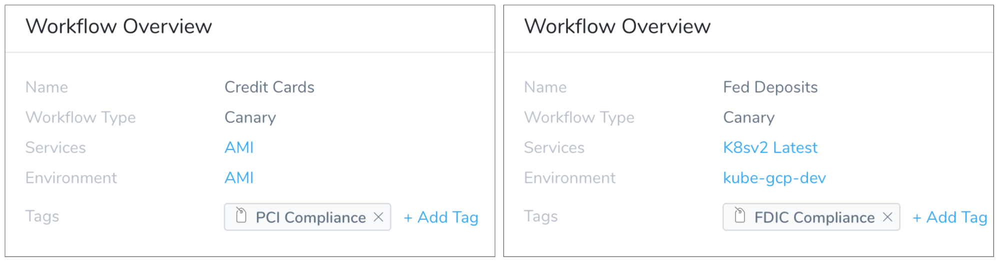

3. Add Pipeline Governance Standards to your Harness Application:
	1. Create Governance Standards rules in **Pipeline Governance** by selecting the Tags you added.
	2. Weight each rule to set its importance. In this example, both rules are weighted as 1, meaning they are equally important: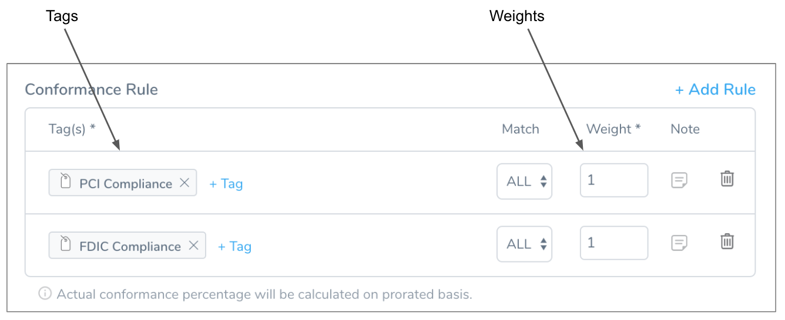

4. Measure conformance before and during deployment:  
  
Before you deploy a Pipeline that has Governance Standards applied to it, Harness displays the conformance as a percentage. The following example shows a score of 100% because the Pipeline contains both conformance Workflows: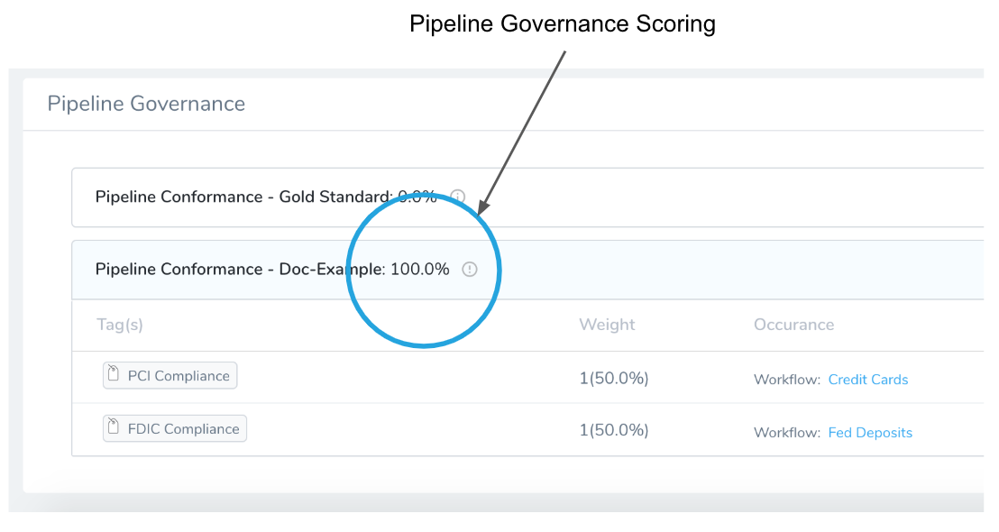
During Pipeline deployment, any Approval steps in the Pipeline measure how the Pipeline meets all Governance Standards. This measurement allows you to decide to approve or reject the Pipeline deployment.

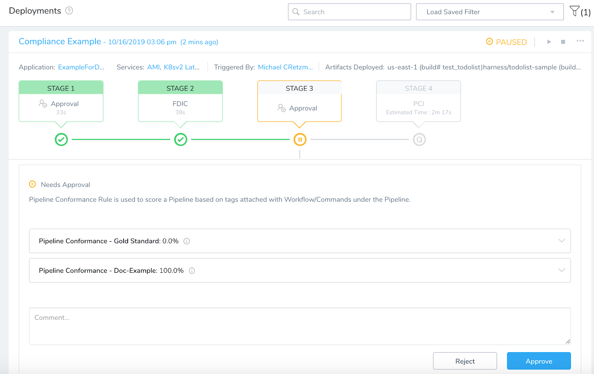
In this topic, we will cover adding Pipeline Governance Standards and measuring conformance before and during deployment.

Learn how to add Tags to your Applications, Workflows, and Pipelines in [Using Tags](../../account/tags/tags.md).

### Prerequisites

This topic covers creating and applying Pipeline Governance Standards, and assumes you are familiar with Harness Tags (see [Using Tags](../../account/tags/tags.md)).

This topic assumes that you have the following prerequisites:

* A Pipeline containing Workflows that meet or evaluate standards and regulations.
* Tags on the Workflows that indicate their regulatory function, such as **PCI Compliance**.

Here is an example of a Pipeline containing two Workflows, each tagged with a Tag that describes their regulatory conformance:

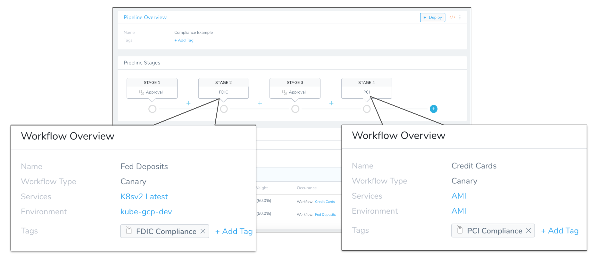

### Add a Pipeline Governance Standard

A Pipeline Governance Standard is comprised of rules. A rule contains one or more of the Tags assigned to your conformance Workflows. Each rule is given a weight relative to its importance.

To add a Pipeline Governance Standard, do the following:

1. Before you begin, review [Prerequisites](pipeline-governance.md#prerequisites).
2. In Harness, click **Continuous Security**, and then click **Governance**. The Governance page displays the existing Pipeline Governance standards.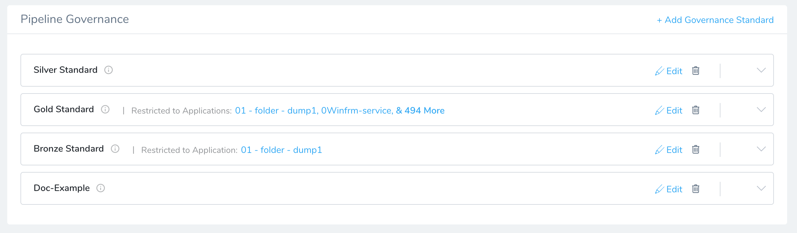

3. Click **Add Governance Standard**. The Pipeline Governance Standard settings appear.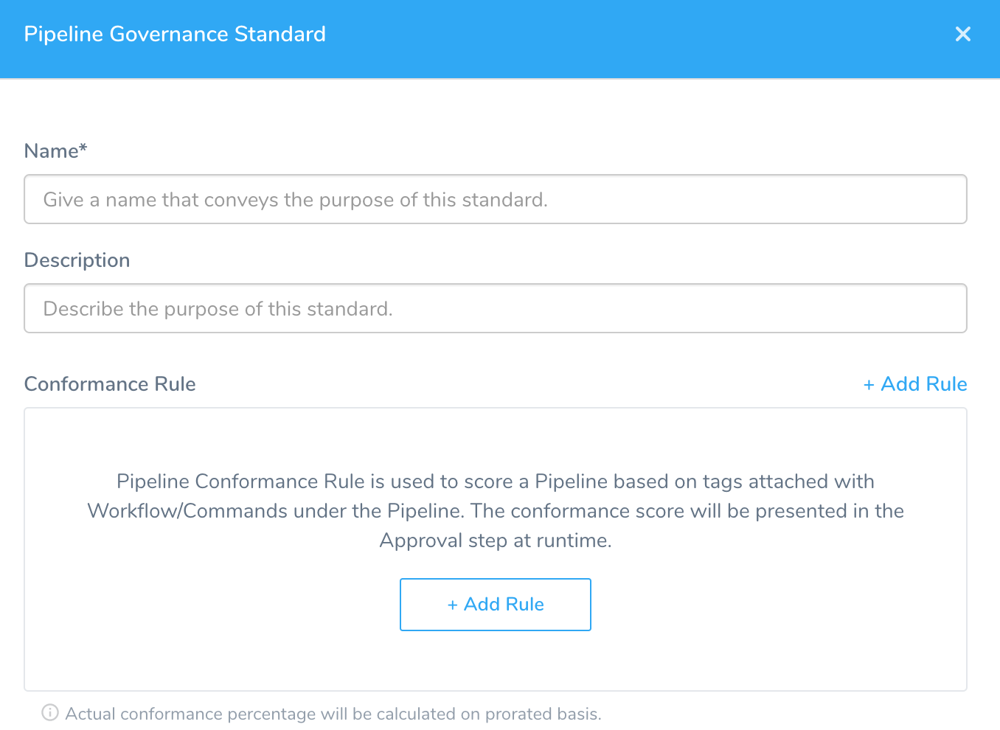

4. In **Name**, enter a name that will identify the standard when it appears in Pipelines and Pipeline Approval steps.
5. In **Description**, describe what the standard will evaluate, like **FDIC Compliance**.
6. In **Conformance Rule**, click **Add Rule**. Define the **Conformance Rule** for the standard as described below.

#### Define Conformance Rules

Conformance Rules are a combination of the following:

* **Tags** you have assigned to Workflows.
* **Matching** requirements for the Tags, such as ANY or ALL.
* **Weights** that you assign to each rule to define its importance relative to other rules.

To define a conformance rule, do the following:

1. In **Conformance Rule**, click **Tag**. The Tag search appears.
2. Select the Tag that you want to add to the rule, and then click **Submit**. For example, if you have a Workflow with the Tag **PCI Compliance**, you would select **PCI Compliance** in the Tag search.

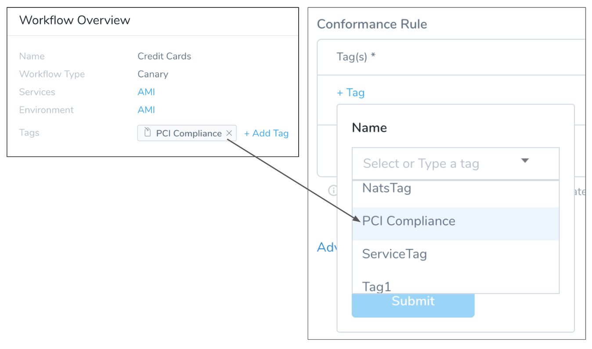
You can also create the Tag and add it to the Workflow later. Typically, Tags are added to the Workflow first.1. Add as many Tags as you need to identify the Workflows that the rule applies to.
2. If you added multiple Tags, in **Match**, select **ALL** to apply the rule only when all the Tags are present in a Pipeline, or **ANY** to apply the rule when any of the Tags are present.
3. In **Weight**, enter a value to define the importance of the rule. You might what to create all of the rules first, and then assign their weights.  
  
When your standard is displayed in a Pipeline or Pipeline Approval step, its weights are presented as a percentage using the formula *Weight / Sum of Weight = Percentage*.  
  
For example, here the rules are weighted 4 and 6, and when they are displayed in a Pipeline, they are scored 40% and 60%: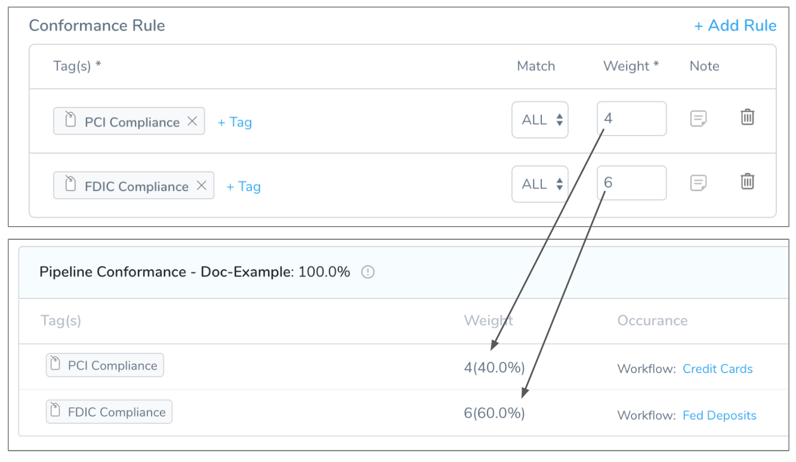

4. For each rule, click the **Note** icon to add any notes that can provide information for other users.
5. Repeat the above steps to add more rules, if needed.
6. Click **Submit**. The new Pipeline Governance Standard is added to the **Governance** page under **Pipeline Governance**.

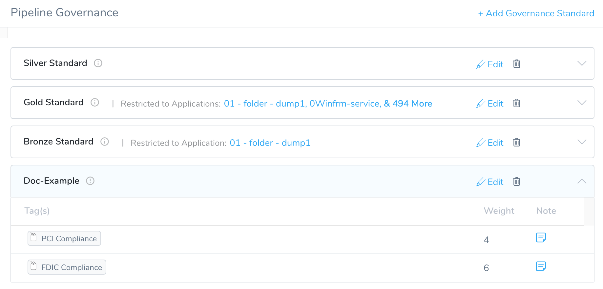
By default, this standard is available to every Application in your Harness account. Every Pipeline you open or create will display this standard and indicate how the Pipeline measures up. In a new Pipeline with no steps, you can see that the standard has a 0% score for each rule and their **Occurrence** is empty:

In a Pipeline that includes a only one Workflow assigned a rule's Tag, the weight is **4(40%)** and the total score is **40%**:

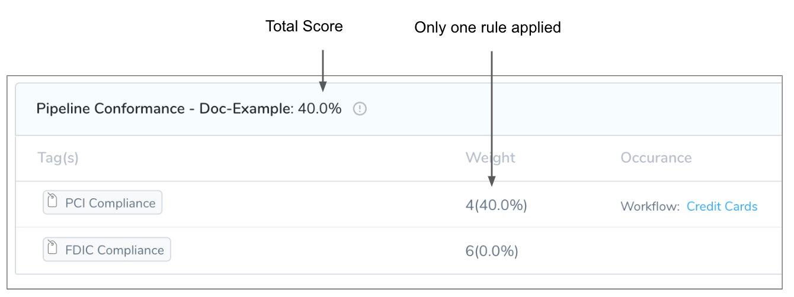

#### Scope Standards using Advanced Settings

By default, when you create a Pipeline Governance Standard it is available to every Application in your account. Consequently, it appears on every Pipeline and as part of every Approval step.

If the default scope of a Pipeline Governance Standard is too wide, in the **Advanced Settings** of the Pipeline Governance Standard you can limit the Applications that can use the standard.

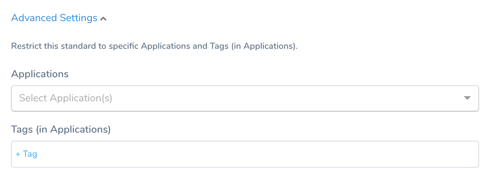
To limit the Applications that can use the standard, do the following:

1. Click **Advanced Settings** to expand it.
2. In **Applications**, select the Applications that may use the standard.
3. In **Tags**, select the Tags of Applications and Pipelines that may use the standard.
4. Click **Submit**.

The standard is now limited to the Applications you selected and/or components tagged with the Tags you selected.

#### Drafting Pipeline Governance Standards Without Applying Them

If you want to draft a Pipeline Governance Standard, but not have it appear in every Application, Pipeline, and Approval step in your account, you can scope the standard to a Tag that is not applied to any Application or Pipeline.

For example, you can create a Tag in [Tags Management](../../account/tags/tags.md) named **Draft Compliance**, and not apply it to any Application or Pipeline. Then, in **Advanced Settings**' in the Pipeline Governance Standard, select **Draft Compliance** in **Tags**:

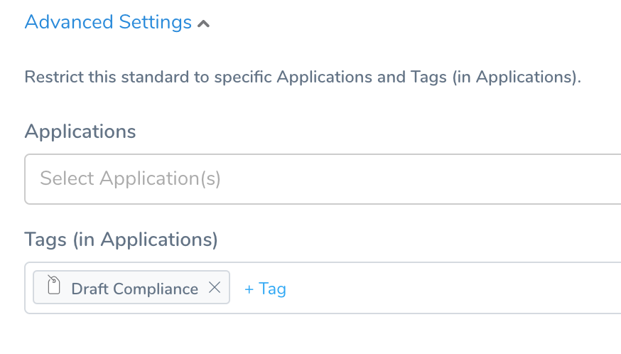
Now the draft Pipeline Governance Standard is not applied to any Application or Pipeline.

### Measure Conformance Before Deployment

When you open a Pipeline in Harness, you will see all of the Pipeline Governance Standards available to it, and their individual scores.

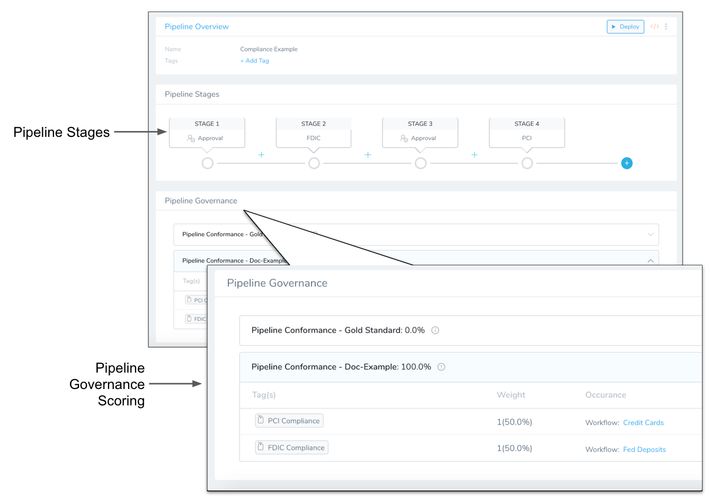
The scores indicate how many of the Tags that define the Pipeline Governance Standard are present in the Pipeline's Workflows, and their relative weight.

Scoring provides you with an overall view of the conformance of your Pipeline, helping you to make an educated decision on whether or not to deploy the Pipeline.

In some cases, a Pipeline Governance Standard might not be relevant but it is displayed in a Pipeline page because it has not been scoped to specific Applications and Pipelines. To scope a Pipeline Governance Standard, see [Scope Standards using Advanced Settings](pipeline-governance.md#scope-standards-using-advanced-settings).

### Measure Conformance During Deployment

Approval steps in Pipelines display the Pipeline Governance Standards available to that Pipeline.

For example, here is an Approval step in a Pipeline displaying two standards and their scores:

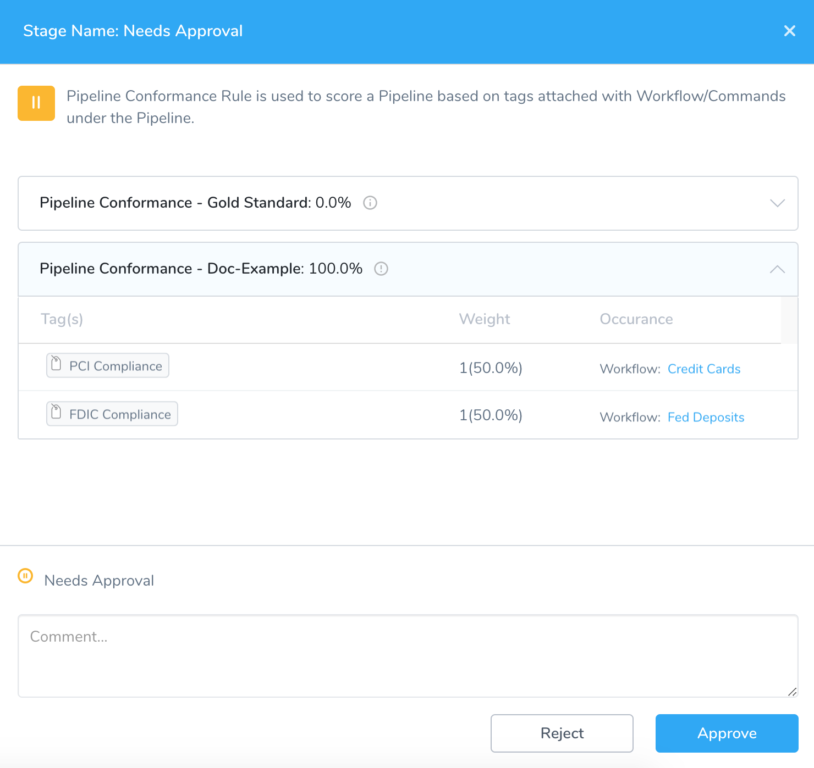
The **Gold Standard** has a score of **0%** because no Workflow in the Pipeline includes the Tags defined in the Gold Standard.

The **Doc-Example** has a score of 100% because the Workflows in the Pipeline, or Pipeline itself, include the Tags defined in **Doc-Example**.

Now you can evaluate the conformance of the Pipeline before approving its deployment.

### Related Topics

* [Using Tags](../../account/tags/tags.md)
* [Approvals](../../../continuous-delivery/model-cd-pipeline/approvals/approvals.md)

