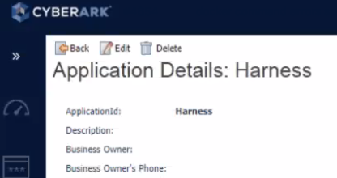

You can use [CyberArk](https://docs.cyberark.com/Product-Doc/OnlineHelp/Portal/Docs.html) for your Harness secrets. CyberArk protects all privileged account passwords and SSH keys in a highly-secure central repository to prevent the loss, theft or unauthorized sharing of these credentials.

In this topic:

* [Before You Begin](#before_you_begin)
* [Step 1: Configure Secrets Manager](#step_1_configure_secrets_manager)
* [Step 2: App ID](#step_2_app_id)
* [Step 3: CyberArk URL](#step_3_cyber_ark_url)
* [Step 4: Client Certificate PEM](#step_4_client_certificate_pem)
* [Limitations](#limitations)
* [Next Steps](#next_steps)

### Before You Begin

* See [Harness Key Concepts](../../../starthere-firstgen/harness-key-concepts.md).
* See [Secrets Management Overview](secret-management.md).
* Make sure that the Harness Delegate is able to connect to the CyberArk URL.

### Step 1: Configure Secrets Manager

1. Select **Security** > **Secrets Management**. The **Secrets Management** page appears.
2. Click **Configure Secrets Managers**. In the resulting **Secrets Managers** page, the **Status** column indicates the **Default** provider.
3. Click **Add Secrets Manager**. The **Configure Secrets Manager** dialog appears.
4. Select **CyberArk** from the drop down list.

### Step 2: App ID

The unique **ApplicationId** of the application.

### Step 3: CyberArk URL

Enter the base URL of the server hosting CyberArk's Central Credential Provider.

If you encounter errors, try ending the base URL in a forward slash (/).

### Step 4: Client Certificate PEM

A client certificate PEM is required if the App ID referenced is configured with authentication using a client certificate. Paste in the user credentials certificate to use for CyberArk connections. Use **pbcopy** to avoid any text formatting issues.

### Step 5: Usage Scope

See [Scope Secret Managers to Applications and Environments](scope-secret-managers-to-applications-and-environments.md).

### Limitations

When you use CyberArk as the Harness Secrets Manager, be aware that Harness is not be able to write new secrets, just read existing ones created directly via Cyberark. See [Referencing Existing External Secrets](secret-management.md#referencing-existing-secrets).

Due to CyberArk API limitations, credentials for new [Connectors](../../account/manage-connectors/harness-connectors.md) and [Cloud Providers](../../account/manage-connectors/cloud-providers.md) are encrypted and stored in the [Harness SecretStore](secret-management.md#harness-secret-store-aws-kms) instead of CyberArk.

You cannot create Harness Encrypted Files using CyberArk.

