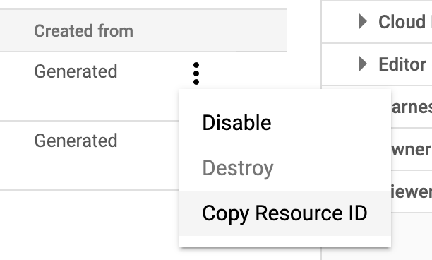
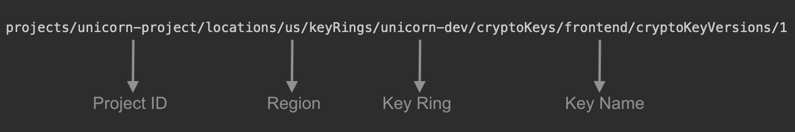
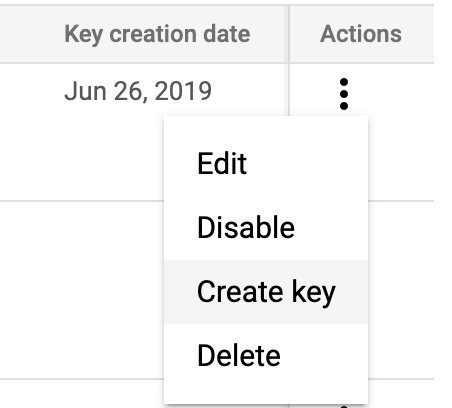
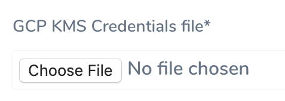

This content is for Harness [FirstGen](../../../../getting-started/harness-first-gen-vs-harness-next-gen.md). Switch to [NextGen](/docs/platform/secrets/secrets-management/add-google-kms-secrets-manager).You can use Google [Cloud Key Management Service](https://cloud.google.com/kms/) (Cloud KMS) as your secrets manager. Once Google KMS is added as a Secrets Manager, you can create encrypted secrets in Google KMS and use them in your Harness account.

You can also use a Google Cloud Secrets Manager as a Harness Secrets Manager. See [Add a Google Cloud Secrets Manager](add-a-google-cloud-secrets-manager.md).In this topic:

* [Before You Begin](#before_you_begin)
* [Step 1: Configure Secrets Manager](#step_1_configure_secrets_manager)
* [Step 2: Display Name](#step_2_display_name)
* [Step 3: Gather the Required Details](#step_3_gather_the_required_details)
* [Step 4: Attach Service Account Key (Credentials) File](add-a-google-cloud-kms-secrets-manager.md#step-4-attach-service-account-key-credentials-file)
* [Limitations](#limitations)
* [Next Steps](#next_steps)

### Before You Begin

* See [Harness Key Concepts](../../../starthere-firstgen/harness-key-concepts.md).
* See [Secrets Management Overview](secret-management.md).

### Step 1: Configure Secrets Manager

1. Select **Security** > **Secrets Management**. The **Secrets Management** page appears.
2. Click **Configure Secrets Managers**. In the resulting **Secrets Managers** page, the **Status** column indicates the **Default** provider.
3. Click **Add Secrets Manager**. The **Configure Secrets Manager** dialog appears.
4. Select **Google KMS** from the drop down list.

### Step 2: Display Name

Enter an arbitrary name to identify this secrets manager. The name can include letters, numbers, spaces, and the following characters: `' - !`

### Step 3: Gather the Required Details

To fill in the **Configure Secrets Manager** dialog's remaining fields, log into [Google Cloud Console](https://console.cloud.google.com/) and follow these steps:

1. Create or select your project.
2. Select **Security** > **Cryptographic****Keys**.
3. Select a key ring. (If no key ring is present, create one.)To create resources in this or the next step, see Google Cloud's [Creating Symmetric Keys](https://cloud.google.com/kms/docs/creating-keys) topic.
4. Select a key within the ring. (If no key ring is present, create one.)
5. To the right of your key's **Enabled & Primary** Version, open the Actions ⋮ menu, then select **Copy Resource ID**.
A reference to the key is now on your clipboard.
6. Paste the reference into an editor. You can now copy and paste its substrings into each of the Harness **Configure Secrets Manager** dialog's remaining fields—**Project ID**, **Region**, **Key Ring**, **Key Name**—as shown below.

### Step 4: Attach Service Account Key (Credentials) File

Export your Google Cloud service account key, and attach it to the Harness **Configure Secrets Manager** dialog, as follows:

1. In the Google Cloud Console, select **IAM & admin** > **Service Accounts**.
2. Scroll to the service account you want to use. (If no service account is present, create one.)
3. Grant this service account the `cloudkms.cryptoKeyEncrypterDecrypter` permission. (See Google Cloud's [Using Cloud IAM with KMS](https://cloud.google.com/kms/docs/iam#granting_permissions_to_use_keys) topic.)
4. Open your service account's Actions ⋮ menu, then select **Create key.**

5. In the resulting **Create private key** dialog, select the **JSON** option, create the key, and download it to your computer.
6. Return to Harness Manager's **Configure Secrets Manager** dialog. Under **GCP KMS Credentials File**, click the **Choose File** button, and upload the key file you just exported from Google Cloud.

7. Click **Submit**. Your Google Cloud KMS will now appear in Harness Manager's **Secrets Managers** list, labeled with the **Display Name** you assigned.

### Step 5: Usage Scope

See [Scope Secret Managers to Applications and Environments](scope-secret-managers-to-applications-and-environments.md).

