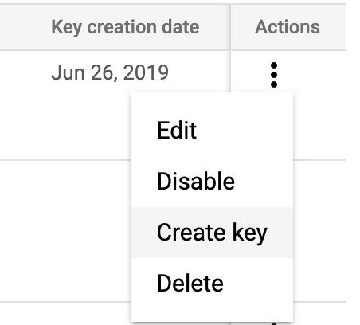

You can use your [Google Cloud Secret Manager](https://cloud.google.com/secret-manager/docs) (GSM) as a secrets manager in Harness.

Once you connect your GSM to Harness, you can store the secrets and other sensitive information you use in Harness in your GSM.

Harness also supports [Google KMS as a secrets manager](add-a-google-cloud-kms-secrets-manager.md).In this topic:

* [Before You Begin](#before_you_begin)
* [Limitations](#limitations)
* [Supported Platforms and Technologies](#supported_platforms_and_technologies)
* [Review: Permissions](#review_permissions)
* [Step 1: Add a Secrets Manager](#step_1_add_a_secrets_manager)
* [Step 2: Display Name](#step_2_display_name)
* [Step 3: Attach Service Account Key (Credentials) File](#step_3_attach_service_account_key_credentials_file)
* [Step 4: Usage Scope](#step_4_usage_scope)
* [Option: Reference Existing Secrets](add-a-google-cloud-secrets-manager.md#option-reference-existing-secrets)
* [Option: Migrate Existing Secrets to GSM](#option_migrate_existing_secrets_to_gsm)
* [Notes](#notes)
* [See Also](#see_also)
* [Configure As Code](#configure_as_code)

### Before You Begin

* See [Harness Key Concepts](../../../starthere-firstgen/harness-key-concepts.md).
* See [Secrets Management Overview](secret-management.md).

### Limitations

* Secrets saved to GSM must follow the naming limitations of GSM. In GSM, secret names can only contain English letters (A-Z), numbers (0–9), dashes (-), and underscores (\_).
* The maximum size for encrypted files saved to GSM is 64KiB.
* Harness Secrets saved to GSM are assigned to a GCP region automatically. An automatic assignment is the same as not selecting the **Regions** setting when creating a secret in GSM.
* GSM secret labels aren't supported in Harness at this time.
* **Versions:**
	+ GSM versions aren't supported in Harness at this time. Harness only supports the latest version of the secret.
	+ When you change the content of a secret stored by Harness in GSM, a new version of that secret is created. That is the latest version, and that version is used by Harness.
	+ When you delete a secret in Harness that is stored in GSM, the entire secret is deleted, not just a version.
* An existing GSM secret's name cannot be updated using the Harness Secret Manager. Only the content of the secret is updated.
* **Migration:** You can migrate **inline secrets** (existing secrets created in Harness) to and from your Harness GSM secrets manager. Any [secret references](reference-existing-secrets.md) to secrets in your GSM secrets manager are not migrated.

### Supported Platforms and Technologies

See [Supported Platforms and Technologies](../../../starthere-firstgen/supported-platforms.md).

### Review: Permissions

* **Harness Permissions:** to add a GSM secret manager, a Harness User must belong to a Harness User Group with the **Manage Secrets Managers** Account Permission.
* **GCP Permissions:** The GCP Service Account you use in the **Google Secrets Manager Credentials File** should have the following IAM roles:
	+ `roles/secretmanager.admin` for Harness to be able to manage existing secrets and create new ones.
	+ `roles/secretmanager.viewer` and `roles/secretmanager.secretAccessor` and `roles/secretmanager.secretVersionManager` for Harness to be able to read secrets from your GCP secret manager.

See [Managing secrets](https://cloud.google.com/secret-manager/docs/access-control) from Google.

### Step 1: Add a Secrets Manager

1. Select **Security** > **Secrets Management**. The **Secrets Management** page appears.
2. Click **Configure Secrets Managers**. On the **Secrets Managers** page, the **Status** column indicates the default provider.
3. Click **Add Secrets Manager**. The **Configure Secrets Manager** dialog appears.
4. Select **GCP Secrets Manager**.

### Step 2: Display Name

Enter a display name for the secrets manager.

The name can include letters, numbers, spaces, and the following characters: `' - !`

### Step 3: Attach Service Account Key (Credentials) File

Export your Google Cloud service account key, and attach it to the Harness **Configure Secrets Manager** dialog, as follows:

1. In the Google Cloud console, select **IAM & admin** > **Service account**.
2. Scroll to the service account you want to use. If no service account is present, create one.
3. Grant this service account the GSM permissions needed.  
To do this, edit the service account and click **Permissions**. Click **Roles**, and then add the roles needed.  
See [Managing secrets](https://cloud.google.com/secret-manager/docs/access-control) from Google.
4. Open your service account's Actions ⋮ menu, then select **Create key.**

5. In the resulting **Create private key** dialog, select the **JSON** option, create the key, and download it to your computer.
6. Return to Harness Manager's **Configure Secrets Manager** dialog.
7. In **Google Secrets Manager Credentials File**, click the **Choose File** button, and upload the key file you just exported from Google Cloud.
8. Click **Submit**. Your GSM will now appear in Harness Manager's **Secrets Managers** list, labeled with the **Display Name** you assigned.

### Step 4: Usage Scope

See [Scope Secret Managers to Applications and Environments](scope-secret-managers-to-applications-and-environments.md).

### Option: Reference Existing Secrets

Create new Encrypted Text and File secrets in Harness using the existing secrets in Google Cloud Secret Manager.

See [Reference Existing Secret Manager Secrets](reference-existing-secrets.md).

### Option: Migrate Existing Secrets to GSM

You can migrate **inline secrets** from the Harness Secrets Manager to GSM.

See [Migrate Secrets between Secrets Managers](migrate-secrets-between-secrets-managers.md).

### Notes

* In [Harness Audit Trail](../auditing-howtos/audit-trail.md), the event for adding a GSM secret manager is `Google Secrets Manager Connected`.
* You can see a secret's usage in Harness. See [View Secrets Usage](managing-harness-secrets.md).

### See Also

* [Use Encrypted Text Secrets](use-encrypted-text-secrets.md)
* [Use Encrypted File Secrets](use-encrypted-file-secrets.md)
* [Secrets and Log Sanitization](../../techref-category/techref-security/secrets-and-log-sanitization.md)
* [Scope Secret Managers to Applications and Environments](scope-secret-managers-to-applications-and-environments.md)

### Configure As Code

To see how to configure the settings in this topic using YAML, configure the settings in the UI first, and then click the **YAML** editor button.

