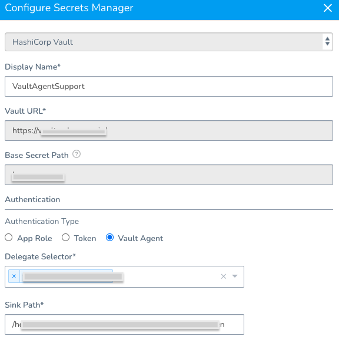
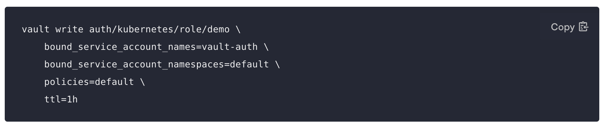
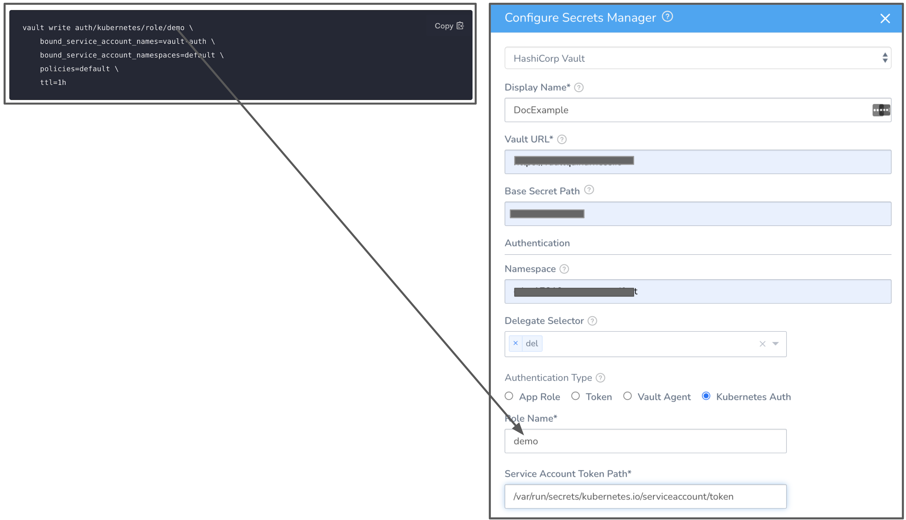
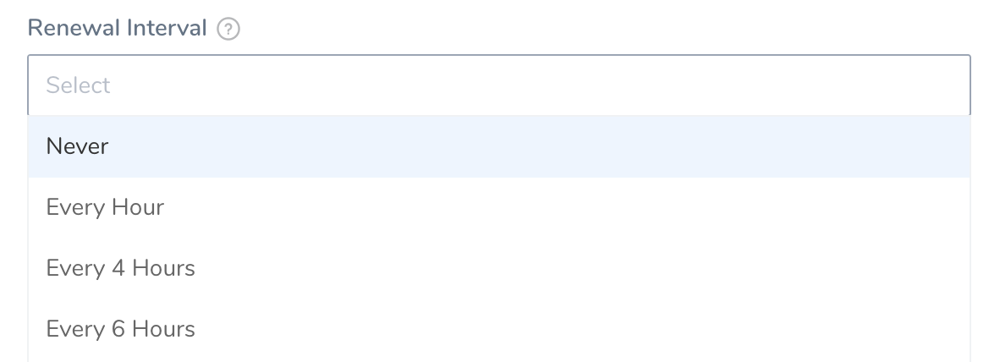
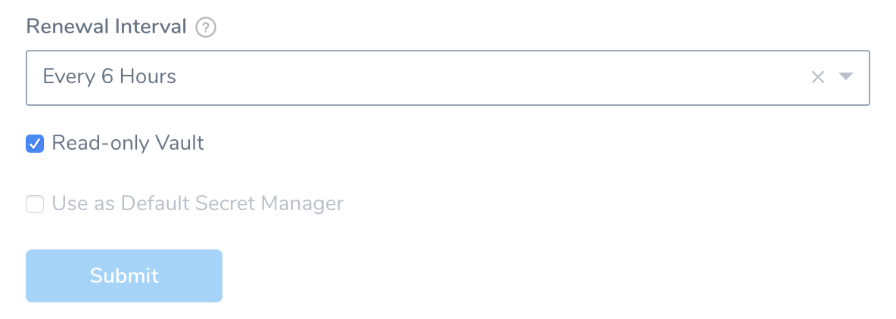

This content is for Harness [FirstGen](../../../../getting-started/harness-first-gen-vs-harness-next-gen.md). Switch to [NextGen](/docs/platform/Secrets/Secrets-Management/add-hashicorp-vault).To store and use encrypted secrets (such as access keys), you can add a HashiCorp Vault Secrets Manager.

### Before You Begin

* See [Harness Key Concepts](../../../starthere-firstgen/harness-key-concepts.md).
* See [Secrets Management Overview](secret-management.md).
* Make sure that the Harness Delegate is able to connect to the Vault URL.

### Step 1: Configure Secrets Manager

1. Select **Security** > **Secrets Management**. The **Secrets Management** page appears.
2. Click **Configure Secrets Managers**. In the resulting **Secrets Managers** page, the **Status** column indicates the **Default** provider.
3. Click **Add Secrets Manager**. The **Configure Secrets Manager** dialog appears.
4. Select **HashiCorp Vault** or **HashiCorp Vault Secrets Engine - SSH** from the drop down list.
	1. For HashiCorp Vault, enter the following information — **Display Name,** **Vault URL,** and **Base Secret Path.**  
	For more information, see [Vault documentation](https://www.vaultproject.io/docs/index.html).
	2. For **HashiCorp Vault Secrets Engine - SSH**, in **Vault URL**, enter the Vault URL for the Vault server running the Secrets Engine.  
	See [Add HashiCorp Vault Signed SSH Certificate Keys](add-hashi-corp-vault-signed-ssh-certificate-keys.md).
5. Select the **Delegate Selector** under Authentication.
6. Select the Authentication Type — **Token,** **App Role,** **Vault Agent, or** **Kubernetes Auth**.

### Option: Namespace

Enter the root URL for the Vault namespace you want to use for new and existing secrets.

For example, **education** or **education/training**.

If you do not enter a value, the default namespace is used.

The App Role ID or Token you use to authenticate in this Harness Secret Manager must be able to access the namespace.

For more information, see [Secure Multi-Tenancy with Namespaces](https://learn.hashicorp.com/tutorials/vault/namespaces) from HashiCorp.

### Option: Token

For Harness, the **Token** option requires [periodic tokens](https://www.vaultproject.io/docs/concepts/tokens#periodic-tokens) (tokens that have renewal options).

To create a periodic token, make sure to specify a period in the token creation command:


```
vault token create -policy=harness -period=768h
```
Next, use the new token with Harness.

If you want to verify the renewal manually, use the command:


```
vault token lookup <token_id>
```
You will see an additional period field specifying the period of the token. To verify renewal, wait until the period expires and run the lookup command again.

### Option: App Role Method

The App Role option enables the Harness Vault Secrets Manager to authenticate with Vault-defined roles.

The Vault AppRole method allows multiple roles to be defined, corresponding to different applications, and each with different levels of access. To authenticate with Vault, the application is assigned a static Role ID and a dynamically generated Secret ID, which are both required to log in and fetch a Vault token.

The SecretId should not expire and it should be valid until it is manually revoked. Harness uses the App Role ID and Secret ID you supply to fetch a Vault Auth Token dynamically whenever there is a CRUD operation of secrets related to this Vault. For example, when creating a secret in this Vault, Harness internally uses this App Role Id and Secret ID and makes a call to vault via the delegate to generate a token. Now, this token is used to make the actual secret creation call to vault. This token is never received on the Harness side. It resides in the delegate and is destroyed after the creation of the secret.

For more information, see [RoleID](https://www.vaultproject.io/docs/auth/approle.html#roleid) and [Authenticating Applications with HashiCorp Vault AppRole](https://www.hashicorp.com/blog/authenticating-applications-with-vault-approle) from HashiCorp.

If you encounter errors, setting [token\_num\_uses](https://www.vaultproject.io/api-docs/auth/approle#token_num_uses) to `0` can often resolve problems.

#### Permissions

The Vault AppRole ID or the Periodic Token used in either of the authentication options needs to have an ACL policy attached for Harness to use it. Typically, you create the policy first, then create the AppRole or Periodic Token and attach the policy.

In the policy examples below: If you've created a [Read-only Vault Secrets Manager](#read_only_vault), this secrets manager needs only read and list permissions on Vault. It does not need—and cannot assume—create, update, or delete permissions.If the secrets are in the Secret Engine named “secret”, the following permissions are required in the policy.


```
path "secret/*" {  
    capabilities = ["create", "update", "list", "read", "delete"]  
}
```
If the secrets are in a subfolder, such as secrets/harness, the policy will look like this:


```
path "secret/harness/*" {  
capabilities = ["create", "list", "read", "update", "delete"]  
}  
path "secret/harness" {  
   capabilities = ["list", "read"]  
}
```
These examples apply only for a **v1** secret engine. If you are planning to use a secret engine with version 2 (versioned secret engine), then the policies are different as explained [here](https://www.vaultproject.io/docs/secrets/kv/kv-v2). Go through this link to understand the correct permissions required for your use case.If the Vault Secrets Manager needs to renew tokens, the following permissions are needed:


```
path "auth/token/renew-self"  
{  
 capabilities = ["read", "update"]  
}
```
### Option: Vault Agent

For a detailed walkthrough, see [How to integrate Harness with Vault using Vault Agent (Delegate)](https://community.harness.io/t/hashicorp-vault-2022-review-how-to-integrate-harness-with-vault-using-vault-agent-delegate/11710) from Harness Community.This option enables the Harness Vault Secrets Manager to authenticate with the Auto-Auth functionality of the [Vault Agent](https://www.vaultproject.io/docs/agent/autoauth).

To authenticate with Vault Agent, make sure you have configured it on the required environment, with entries for **method** and **sinks**. For more information, see [Vault Agent](https://www.vaultproject.io/docs/agent).

In the **Sink Path** field, enter any sink path you have in your Vault Agent Configuration. This is the path of the encrypted file with tokens. The specified Delegate reads this file through file protocol (file://).




### Option: Kubernetes Auth

Currently, this feature is behind the Feature Flag `ENABLE_K8S_AUTH_IN_VAULT`. Contact [Harness Support](mailto:support@harness.io) to enable the feature.This option uses a Kubernetes Service Account Token to authenticate with Vault. With this method of authentication, you can easily add a Vault token into a Kubernetes Pod.

To authenticate with Kubernetes Auth, make sure you have created a role in the vault inside `auth/kubernetes/role`. This role authorizes the "vault-auth" service account in the default namespace and it gives it the default policy. This is also where you'll find the **service account name** and **namespace** that will be used to access the vault endpoint.

[
](./static/add-a-hashi-corp-vault-secrets-manager-63.png)
For more information, see [Kubernetes Auth Method](https://www.vaultproject.io/docs/auth/kubernetes#configuration).

In **Role Name**, enter the role you have configured in the Vault.


In **Service Account Token Path**enter the JSON Web Token (JWT) path. This is the path where the JWT token is mounted. The default path of this token is `/var/run/secrets/kubernetes.io/serviceaccount/token`.

For more information, see [Service Account Tokens](https://kubernetes.io/docs/reference/access-authn-authz/authentication/#service-account-tokens).

### Step 2: Select Secret Engine and Version

Once you have entered the required fields, you can choose to **Fetch the Secret Engine** or **Manually Enter Secret Engine**.

#### Fetch Secret Engine

If you want Harness to automatically fetch secret engines, include this read permission for **sys/mounts** In the ACL policy.


```
path "sys/mounts"{  
 capabilities = ["read"]  
}
```
Click **Fetch Secret Engine**.

Harness will populate the Secret Engine drop-down with the list of engines and their versions.

Select the engine you want to use.

#### Manually enter Secret Engine

If you don’t want to or cannot add the ACL policy (with read permission for sys/mounts) in the Secret Manager, perform the following steps:

1. Identify the engine version of the Secret Manager in Vault.
2. In **Secret Engine Name**, enter the name of the Secret Engine.
3. In **Version**, select the engine version from the drop down list.

You cannot change the Secret Engine later. Harness blocks editing this setting later because there might be secrets that are created/referenced in this secret engine. Changing the secret engine might break references to those secrets. To migrate secrets, see [Migrate Secrets between Secrets Managers](migrate-secrets-between-secrets-managers.md).### Step 3: Renewal Interval

In **Renew Interval**, you can (optionally) select how often Harness Delegate reloads the Vault access token.


You can expect a delay during the Vault renewal. A periodic job runs to check if there has to be a renewal resulting in a delay of no more than 2 minutes.### Review: Validating Non-Read Only Vault Secrets Managers

To validate a non-read only Vault Secrets Manager, Harness creates a dummy secret in the secret engine.

The event for creating the dummy secret this will show up on [Audit Trail](/docs/platform/Governance/Audit-Trail/audit-trail) as if the user who initiated the creation of the Vault Secrets Manager created the secret. The path of the secret is as follows:

v2 Secret Engine:

`<SECRET_ENGINE_NAME>/data/<BASE_PATH>/harness_vault_validation#value`

v1 Secret Engine:

`<SECRET_ENGINE_NAME>/<BASE_PATH>/harness_vault_validation#value`

The secret can fail because of various reasons.

1. Using the Token/App Role, the Vault authentication is not successful.
2. The following **permission** is not available in any of the policies attached to the Token/App Role. If this permission is not available, the user will not be able to fetch the list of secret engines from the customer vault and Harness will show a single option of Secret Engine named **“secret”** with version 2 which might be incorrect for the customer.Make sure to add the permission to a policy attached to the Token/App Role as follows:


```
         path “sys/mounts”{  
            capabilities = ["read"]  
            }    
```

3. The policy attached to the Token/AppRole does not provide the **write**permission in the specified path. Make sure you update the policies and permissions.

### Step 4: Read-only Vault

If required by your organization's security practices, select the **Read-only Vault** check box. This selection authorizes Harness to read secrets from Vault, but not to create or manage secrets within Vault.


Once you have filled out the dialog, click **Submit**.

##### Read-only Limitations

If you select **Read-only Vault**, there are several limitations on the resulting Harness Vault Secrets Manager. First, as shown by the above screenshot's disabled **Use as Default Secrets Manager** option, a read-only secrets manager cannot be Harness' default secrets manager.

Also, a read-only Harness Vault Secrets Manager:

* Cannot be used in the **Add Encrypted File** dialog.
* Cannot create inline secrets in the **Add Encrypted Text** modal.
* Cannot migrate (deprecate) its secrets to another secrets manager.
* Cannot have secrets migrated to it from another secrets manager.

### Step 5: Usage Scope

See [Scope Secret Managers to Applications and Environments](scope-secret-managers-to-applications-and-environments.md).

