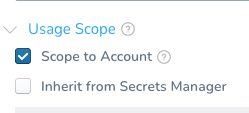
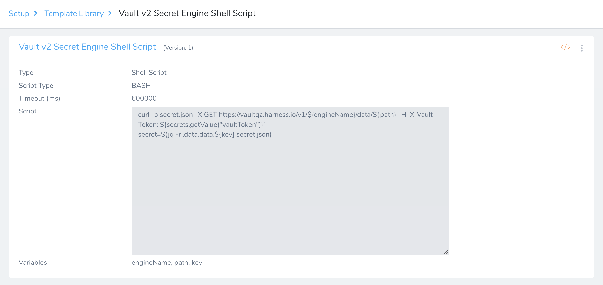
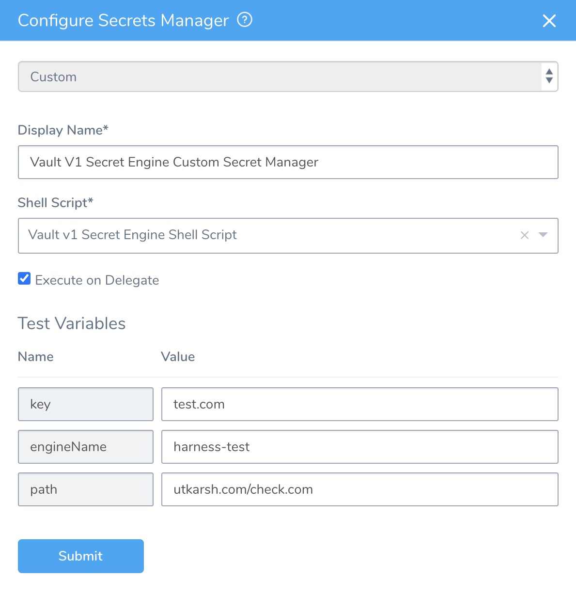

This content is for Harness [FirstGen](../../../../get-started/harness-first-gen-vs-harness-next-gen.md). Switch to [NextGen](/docs/platform/tecrets/tecrets-management/custom-secret-manager).Harness provides first-class support and built-in integration for some of the third party Secret Managers. You can configure and make use of other Secrets Managers using the Custom Secrets Manager. It's a shell script that you can execute anywhere that fetches the secret and shares it with Harness. It can be run on a Delegate or a remote machine connected to a Delegate.

In this topic:

* [Before You Begin](#before_you_begin)
* [Review: Read-Only Secret Manager](#review_read_only_secret_manager)
* [Step 1. Create an Encrypted Text Secret](#step_1_create_an_encrypted_text_secret)
* [Step 2: Add Connection Attributes for Target Hosts](#step_2_add_connection_attributes_for_target_hosts)
* [Step 3. Create a Shell Script Template](#step_3_create_a_shell_script_template)
* [Step 4. Configure Custom Secrets Manager](#step_4_configure_custom_secrets_manager)
* [Step 5. Use the Custom Secrets Manager](#step_5_use_the_custom_secrets_manager)
* [Limitations](#limitations)

### Before You Begin

* See [Harness Key Concepts](../../../starthere-firstgen/harness-key-concepts.md).
* See [Secrets Management Overview](secret-management.md).

### Limitations

* You cannot migrate secrets to or from Custom Secrets Managers.
* If you make any changes to the Shell Script Template they are not automatically updated in the Custom Secrets Manager that uses that Shell Script Template. To update the Custom Secrets Manager, reselect the Shell Script Template in the Custom Secrets Manager's **Shell Script** setting.

### Review: Read-Only Secret Manager

Harness Custom Secrets Manager is a read-only Secrets Manager. Harness can read/decrypt secrets, but it cannot write secrets to the Custom Secrets Manager.

### Step 1. Create an Encrypted Text Secret

Using a configured Secrets Manager, create an Encrypted Text secret to access the third party Secrets Manager.

Ensure that **Usage Scope** is set to **Scope to Account**.

For more information on creating Encrypted Text Secret, see [Add Encrypted Text](use-encrypted-text-secrets.md#step-1-add-encrypted-text).

Make sure that the secret you create to access your third party Secrets Manager is selected as Scope to Account. It will not be used for any Application.

### Step 2: Add Connection Attributes for Target Hosts

If you want to run the Shell Script on a target host and not on the Harness Delegate, you must first create the required connection attributes.

* To access an SSH-based Custom Secrets Manager, create an SSH credential first. See [Add SSH Keys](add-ssh-keys.md) for the procedure to create SSH credentials.
* To access a WinRM-based Custom Secrets Manager, create a WinRM connection first. See [Add WinRM Connection Credentials](add-win-rm-connection-credentials.md) for more information.

This does not apply if you want to run the Custom Secrets Manager on the Harness Delegate.

### Step 3. Create a Shell Script Template

Create a Shell Script Template. For more information on creating a Shell Script Template and adding it to the Template Library, see [Create Shell Script Template](../../../continuous-delivery/concepts-cd/deployment-types/use-templates.md#create-shell-script-template).

Note the following points while creating the template.

* The variable in the Shell Script Template that gets the value must be named **secret**.
* Custom secret manager does not support dynamic or runtime values for the variables. All parameters/variables are static and pre-defined. For example, users cannot pass `${workflow.variable...}` or `${env.name}` to the Shell Script Template.

Here’s an example Shell Script Template created for Custom Secrets Manager.

In this example, this script assigns the secret variable to your final value. Here are the details of the entries in the script.

* This script makes a cURL call to the API URL of the third party Secrets Manager and gets the output to the file secret.json.
* It includes some parameters such as engine name and path.
* It uses an existing, already configured Secrets Manager for the API access.
* After getting the file, as shown in the example, it gets the secret by using a third party tool like jq to retrieve the key from the data object. The key is also a parameter that can be assigned later.

All the parameters (engine name, path, and key in this case) can be defined as Variables while creating or editing the Shell Script Template.

Note: Template library add ons like default variable values, script output, and default timeout are not supported in Custom Secrets Manager configuration.

### Step 4. Configure Custom Secrets Manager

Make sure you enter the following details.

#### Display Name

Enter a name for the Custom Secrets Manager.

#### Shell Script

Select the Shell Script from the Template Library that you have created for running the Custom Secrets Manager.

#### Execute on Delegate

Select this if you want to run the Shell Script on Harness Delegate. 

If you want to run it in another host, enter the following details.

#### Target Host

Enter the name of the Target Host.

#### Templatize Connection Attribute

If you select this option, the Connection Attribute will be a part of the Test Variables. 

For example, on a single target host, if you want to access different secrets with different keys for different users with a single Shell Script, you can templatize the connection attribute and enter its value while creating the secret.

#### Connection Attribute

Select an SSH key/WinRM Connection Credential to access the Target Host.

#### Working Directory

Enter the path to the directory on the Target Host.

#### Test Variables

Enter test values for the variables defined while creating the Shell Script Template. You must enter these values to verify if the custom Secrets Manager can be accessed and the script within can be executed to get the secret value. You can use a dummy secret or one of the secrets that are already configured for this validation.

### Step 5. Use the Custom Secrets Manager

Create an Encrypted Text using the Custom Secrets Manager you created earlier. Enter the name and values of all the Input Variables defined while creating the Shell Script Template. 

For more information on creating Encrypted Text Secret, see [Add Encrypted Text](use-encrypted-text-secrets.md#step-1-add-encrypted-text).

If you want to create a secret on a Target Host Custom Secrets Manager, you must also select the Connection Attribute.

