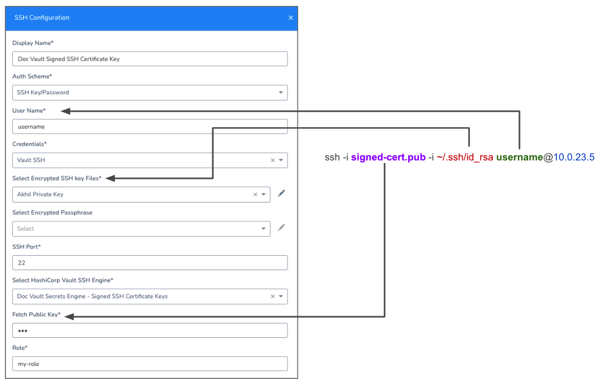
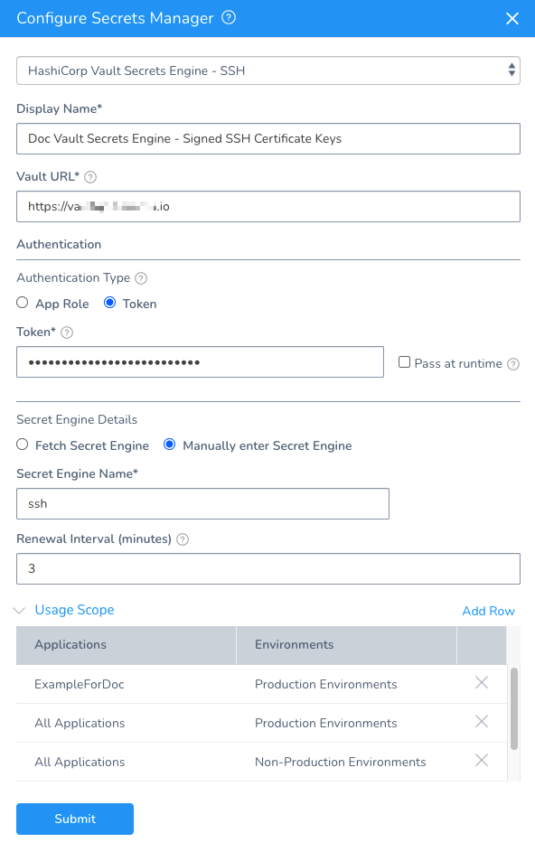

Currently, this feature is behind a Feature Flag. Contact [Harness Support](mailto:support@harness.io) to enable the feature. Feature Flags can only be removed for Harness Professional and Essentials editions. Once the feature is released to a general audience, it's available for Trial and Community Editions.You can use Vault Secrets Engine Signed SSH Certificates in Harness.

Vault Secrets Engine provides signed public keys. SSH certificate authentication helps you avoid the common challenges with SSH public key authentication (rekeying, scaling, etc).

The setup process is simple. You add your private key to Harness as an encrypted key file, specify the Vault SSH Engine to use, paste in the public key, and specify the Vault role used for signing client keys.

This topic assumes you are familiar with creating Signed SSH Certificates in Vault and have a running HashiCorp Secrets Engine. For more information, see [Signed SSH Certificates](https://www.vaultproject.io/docs/secrets/ssh/signed-ssh-certificates) from Vault.In this topic:

* [Before You Begin](add-hashi-corp-vault-signed-ssh-certificate-keys.md#before-you-begin)
* [Supported Platforms and Technologies](add-hashi-corp-vault-signed-ssh-certificate-keys.md#undefined)
* [Visual Summary](add-hashi-corp-vault-signed-ssh-certificate-keys.md#visual-summary)
* [Step 1: Add a Harness Vault Secrets Engine Secrets Manager](add-hashi-corp-vault-signed-ssh-certificate-keys.md#step-1-add-a-harness-vault-secrets-engine-secrets-manager)
* [Step 2: Create SSH Key](add-hashi-corp-vault-signed-ssh-certificate-keys.md#step-2-create-ssh-key)
* [Step 3: Credentials](add-hashi-corp-vault-signed-ssh-certificate-keys.md#step-3-credentials)
* [Step 4: Select Encrypted SSH key Files](add-hashi-corp-vault-signed-ssh-certificate-keys.md#step-4-select-encrypted-ssh-key-files)
* [Option: Select Encrypted Passphrase](add-hashi-corp-vault-signed-ssh-certificate-keys.md#option-select-encrypted-passphrase)
* [Step 5: SSH Port](add-hashi-corp-vault-signed-ssh-certificate-keys.md#step-5-ssh-port)
* [Step 6: Select HashiCorp Vault SSH Engine](add-hashi-corp-vault-signed-ssh-certificate-keys.md#step-6-select-hashi-corp-vault-ssh-engine)
* [Step 7: Fetch Public Key](add-hashi-corp-vault-signed-ssh-certificate-keys.md#step-7-fetch-public-key)
* [Step 8: Add Role](add-hashi-corp-vault-signed-ssh-certificate-keys.md#step-8-add-role)
* [Step 9: Test and Submit](add-hashi-corp-vault-signed-ssh-certificate-keys.md#step-9-test-and-submit)

### Before You Begin

* [Harness Key Concepts](../../../starthere-firstgen/harness-key-concepts.md)
* [Secrets Management Overview](secret-management.md)
* [Add a HashiCorp Vault Secrets Manager](add-a-hashi-corp-vault-secrets-manager.md)
* [Use HashiCorp Vault Secrets Manager API](../../techref-category/api/use-hashi-corp-vault-secrets-manager-api.md)

### Supported Platforms and Technologies

See [Supported Platforms and Technologies](../../../starthere-firstgen/supported-platforms.md).

### Visual Summary

With Vault Secrets Engine Signed SSH Certificates, a Vault server acts as the SSH CA.

You add the trusted public key to all target host's SSH configuration (and restart the SSH service to pick up the changes). This process can be manual or automated using a configuration management tool.

When you SSH into a host machine using the signed key, you supply both the signed public key from Vault **and** the corresponding private key as authentication to the SSH call. For example:


```
$ ssh -i signed-cert.pub -i ~/.ssh/id_rsa username@10.0.23.5 
```
In Harness, you are simply providing the same information in the Harness SSH Key settings:


Next, you use the SSH key in a Harness Infrastructure Definition as the target host(s) connection method.

During deployment, the Harness Delegate connects to the Vault server and exchanges the public key for a new certificate.

Since both the target host(s) and Harness trust the Vault server certificates, the Delegate uses the certificate to successfully create an SSH session with the target host(s).

### Step 1: Add a Harness Vault Secrets Engine Secrets Manager

Follow the steps in [Add a HashiCorp Vault Secrets Manager](add-a-hashi-corp-vault-secrets-manager.md) to add the Vault Secrets Engine for SSH Certificate Keys.

In **Configure Secrets Manager**, you simply select **HashiCorp Vault Secrets Engine - SSH**.

The rest of the setting are described in [Add a HashiCorp Vault Secrets Manager](add-a-hashi-corp-vault-secrets-manager.md).

You will enter the Vault URL for the Vault server running the Secrets Engine.

Ensure you select the Secrets Engine that will validate the public key from Vault and your corresponding private key.

When you are done, the Secrets Manager will look something like this:




### Step 2: Create SSH Key

In **Secrets Management**, click **SSH**, and then click **Add SSH Key**. The **SSH Configuration** settings appear.

Enter a name that identifies the SSH key in **Display Name**.

In **Auth Scheme**, select **SSH Key/Password**.

In **User Name**, enter the name of the user specified when generating the public key (for example, `ssh-keygen -t rsa -C "user@example.com"`).

Users are mapped to roles. They can be mapped many to one.

### Step 3: Credentials

In **Credentials**, select **Vault SSH**. The setting will change for HashiCorp Vault SSH Engine.

### Step 4: Select Encrypted SSH key Files

In **Select Encrypted SSH key Files**, select or create a new Harness Encrypted File using your private key.

For details on Harness Encrypted Files, see [Use Encrypted File Secrets](use-encrypted-file-secrets.md).

### Option: Select Encrypted Passphrase

In **Select Encrypted Passphrase**, select the SSH key [passphrase](https://www.ssh.com/ssh/passphrase) from the drop down if one is required.

It is **not** required by default for HashiCorp Vault SSH Engine.

### Step 5: SSH Port

In **SSH Port**, leave the default 22 or enter in a different port if needed.

### Step 6: Select HashiCorp Vault SSH Engine

Select the **HashiCorp Vault Secrets Engine - SSH** Secrets Manager you added earlier.

Ensure you select the Secrets Engine that will validate the public key from Vault and your corresponding private key.

### Step 7: Fetch Public Key

Paste in the contents of the public key.

### Step 8: Add Role

Enter the role name of the Vault role used for signing client keys.

For example, if you create a role with `vault write ssh-client-signer/roles/my-role`, enter **my-role** in the Role setting in Harness.

### Step 9: Test and Submit

Click **Test**.

Enter the public address the host you want to connect to use the SSH key.

Click **Run**.

Harness should show a successful test of the SSH key. If you have errors, check [Troubleshooting](https://www.vaultproject.io/docs/secrets/ssh/signed-ssh-certificates#troubleshooting) from Vault.

Click **Submit**.

Now you can use this SSH key in Harness Infrastructure Definition Connection Attributes settings when defining connection setting to a target hosts.

See [Add an Infrastructure Definition](../../../continuous-delivery/model-cd-pipeline/environments/infrastructure-definitions.md).

