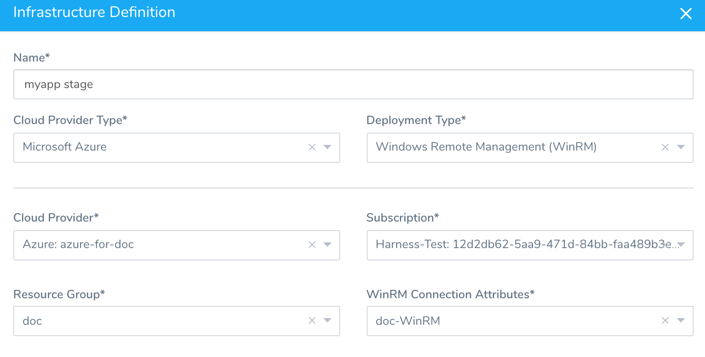

You can set up a WinRM connection and then use it as a **Deployment Type** in an Environment's Service Infrastructure.

### Before You Begin

* See [Harness Key Concepts](../../../starthere-firstgen/harness-key-concepts.md).
* See [Secrets Management Overview](secret-management.md).

### Review: Limitations

Secrets cannot contain special characters without escaping. For example, if the secret contains a `$` like `ab$c` it will fail.

Escape any special characters in your secrets: `ab\$c`.

### Step 1: Set Up the WinRM Connection

In **Secrets Management**, under **Execution Credentials**, click **WinRM Connection**.

The WinRM Connection Attributes dialog appears.

### Step 2: Display Name

Name to identify the connection. You will use this name to identify this connection when setting up the **Connection Attributes** in the environment **Service Infrastructure**.

### Step 3: Auth Scheme

Specifies the mechanism used to authenticate the credentials used in this connection. Select **NTLM**.

### Step 4: Domain

The Active Directory domain name where the user account in the credentials is registered. This can be left blank when using a local user.

### Step 5: User Name

The user account credentials for this connection. The user must belong to the same Active Directory domain as the Windows instances that this connection uses. These are the same user account credentials you would use to log into the VM using a remote connection such as Microsoft Remote Desktop.

In cases when **Domain** is blank (local user), you can put **./** before the user name. The **./** prefix is equivalent to `local_host_or_ip\user`.

### Step 6: Select Encrypted Password

Make sure you use a Harness Encrypted Text secret to save the password and refer it using this option. Either select an existing secret from the drop down list or create a new one by clicking **+ Create Encrypted Text**.

For more information on creating Encrypted Text, see  [Harness Encrypted Text secret](use-encrypted-text-secrets.md).

### Step 7: Use SSL

Enables an HTTPS connection instead of an HTTP connection. SSL is recommended.

When you select **Use SSL**, the port number in **WinRM Port** changes to the HTTPS port **5986** automatically.

When **Use SSL** port is not selected, the port number is set to the HTTP port **5985**.

### Step 8: Skip Cert Check

When connected over HTTPS (**Use SSL** in enabled), the client does not validate server certificate.

### Step 9: Use No Profile

When you run a script, PowerShell will first load profiles and then run the script.

You might not know what the profile contains, so it can result in unexpected behavior.

Select this option to make the PowerShell session run without loading the Windows PowerShell profile, like running `PowerShell -NoProfile`.

See [The NoProfile parameter](https://docs.microsoft.com/en-us/powershell/module/microsoft.powershell.core/about/about_profiles?view=powershell-7#the-noprofile-parameter) from Microsoft.

### Step 10: WinRM Port

Specifies the network port on the remote computer to use.

To connect to a remote computer, the remote computer must be listening on the port that the connection uses. The default ports are 5985, which is the WinRM port for HTTP, and **5986**, which is the WinRM port for HTTPS.

To determine what ports WinRM is listening on, use the command:

`winrm e winrm/config/listener`

### Step 11: Test the Connection

Click **Test** to ensure that the connection is successful. Once the connection is successful, click **Submit**.

Generally, the Harness Delegate and the target node will be in the same subnet and so the private IP address of the target host can be used.

If the Harness Delegate cannot resolve the private address of the target node, try the public address. Some cloud networking scenarios prevent private address resolution.

### Step 12: Update the Infrastructure Definition

In **Infrastructure Definition**, the Infrastructure Definition dialog will look like this:

### Troubleshooting

The WinRM Connection simply checks a log in. When you use the WinRM Connection to perform deployment operations other errors might occur.

In general, the errors result from port conflicts or the WinRM settings on the target host are not set up correctly.

See:

* [Troubleshooting](../../../firstgen-troubleshooting/troubleshooting-harness.md)
* [IIS Best Practices and Troubleshooting](../../../continuous-delivery/dotnet-deployments/5-best-practices-and-troubleshooting.md)

