This content is for Harness [FirstGen](../../../../get-started/harness-first-gen-vs-harness-next-gen.md). Switch to [NextGen](/docs/platform/tecrets/tecrets-management/azure-key-vault).This topic outlines how to use [Azure Key Vault](https://docs.microsoft.com/en-us/azure/key-vault/key-vault-whatis) to maintain your Harness secrets. It includes these sections:

* [Before You Begin](#before_you_begin)
* [Visual Overview](#visual_overview)
* [Step 1: Create Azure Reader Role](#step_1_create_azure_reader_role)
	+ [Azure Portal](#azure_portal)
	+ [PowerShell Command](#power_shell_command)
* [Step 2: Configure Secrets Manager in Harness](#step_2_configure_secrets_manager_in_harness)
* [Step 3: Set Display Name](#step_3_set_display_name)
* [Step 4: Select Environment](#step_4_select_environment)
* [Step 5: Enter Client ID and Tenant ID](#step_5_enter_client_id_and_tenant_id)
* [Option: Enter Subscription](#option_enter_subscription)
* [Step 6: Create and Exchange Authentication Key](#step_6_create_and_exchange_authentication_key)
* [Step 7: Fetch Vault](#step_7_fetch_vault)
* [Step 8: Usage Scope](#step_8_usage_scope)
* [Step 9: Save the Secrets Manager](#step_9_save_the_secrets_manager)
* [Step 10: Make Key Vaults Writable](#step_10_make_key_vaults_writable)
* [Option: Use Existing Azure Key Vault Secrets](#option_use_existing_azure_key_vault_secrets)
* [Next Steps](#next_steps)

### Before You Begin

* Review [Secrets Management](secret-management.md) for Harness' overall approach to managing secrets.
* Review Microsoft's documentation as necessary, starting with [What Is Azure Key Vault?](https://docs.microsoft.com/en-us/azure/key-vault/key-vault-overview) and [Azure Key Vault Basic Concepts](https://docs.microsoft.com/en-us/azure/key-vault/key-vault-whatis).
* We assume that you have an Azure account set up and ready to use.
* Make sure that the Harness Delegate is able to connect to this URL: `https://<vault_name>.vault.azure.net`  
`<vault_name>` is the name of the vault selected from the dropdown while configuring the Azure Vault.

### Visual Overview

Azure Key Vault safeguards cryptographic keys and secrets, encrypting authentication keys, storage account keys, data encryption keys, .pfx files, and passwords.

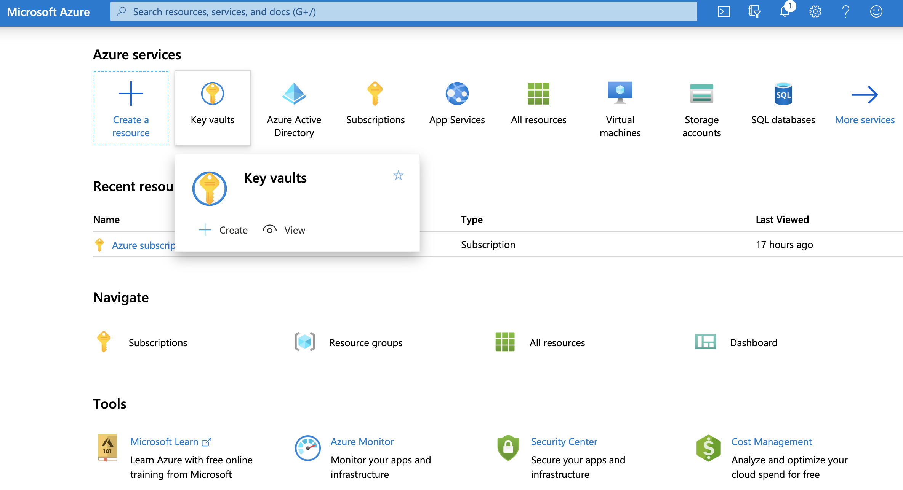


### Step 1: Create Azure Reader Role

To enable Harness to later fetch your Azure vaults (in [Step 7](#step_7) below), you must first set up a **Reader** role in Azure. You can do this two ways:

* [Azure Portal](#azure_portal)
* [PowerShell Command](#powershell_command)

#### Azure Portal

To create a **Reader** role in the Azure portal UI:

1. Navigate to Azure's **Subscriptions** page.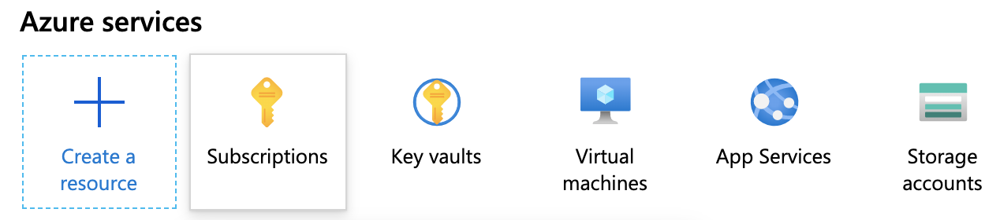

2. Under **Subscription name**, select the subscription where your vaults reside.
**Tip:** Copy and save the **Subscription ID**. You can paste this value into Harness Manager below at [Option: Enter Subscription](#subscription).
3. Select your **Subscription’s Access control (IAM)** property.

4. On the resulting **Access control (IAM)** page, select **Add a role assignment**.
5. In the resulting right pane, set the **Role** to **Reader**.

6. Accept the default value: **Assign access to**: **Azure AD user**, **group, or service principal**.
7. In the **Select** drop-down, select the name of your Azure App registration.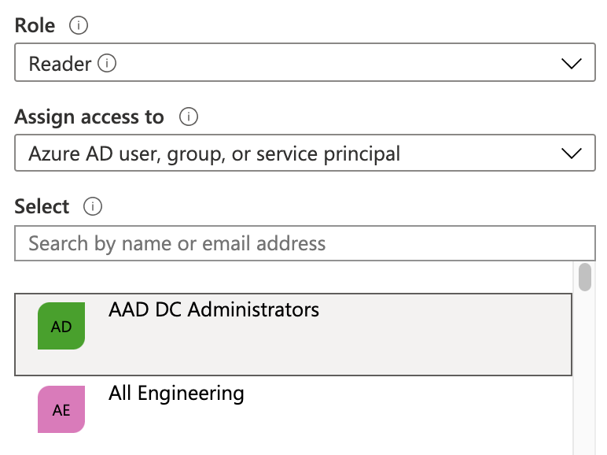

8. Click **Save**.
9. On the **Access control (IAM)** page, select the **Role assignments** tab. Make sure your new role now appears under the **Reader** group.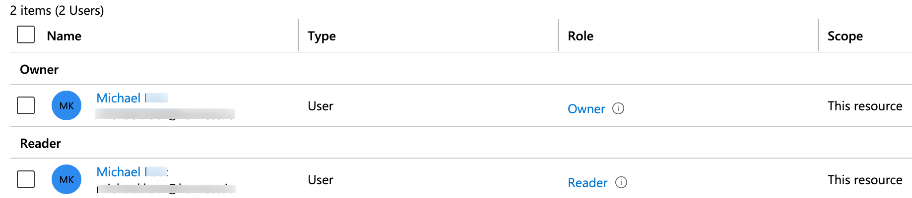


Microsoft Azure's [Manage subscriptions](https://docs.microsoft.com/en-us/azure/cost-management-billing/manage/add-change-subscription-administrator#to-assign-a-user-as-an-administrator) documentation adds details about the above procedure, but focuses on the **Administrator** rather than the **Reader** role.

#### PowerShell Command

You can also create a **Reader** role programmatically via this PowerShell command, after gathering the required parameters:


```
New-AzRoleAssignment -ObjectId <object_id> -RoleDefinitionName "Reader" -Scope /subscriptions/<subscription_id>
```
For details and examples, see Microsoft Azure's [Add or remove role assignments](https://docs.microsoft.com/en-us/azure/role-based-access-control/role-assignments-powershell#application-at-a-subscription-scope) documentation.

### Step 2: Configure Secrets Manager in Harness

To set up Azure Key Vault as a Harness Secrets Manager:

1. In **Security**, select **Secrets Management**, and then click **Configure Secrets Managers.**  
In the resulting **Secrets Managers** page, the **Status** column indicates the **Default** provider.
2. Click **Add Secrets Manager**. The **Configure Secrets Manager** settings appear.
3. Select **Azure Key Vault** from the drop-down list.  
  
Key Vault stores and manages secrets as sequences of octets (8-bit bytes), with a maximum size of 25k bytes each. For more information, see [Azure Key Vault secrets](https://docs.microsoft.com/en-us/azure/key-vault/secrets/about-secrets).If you set up Azure Key Vault as your *default* secrets manager in Harness, any secret that you save afterwards must be named according to [Azure Key Vault conventions](https://docs.microsoft.com/en-us/azure/key-vault/about-keys-secrets-and-certificates).


### Step 3: Set Display Name

In the **Configure Secrets Manager** dialog's **Display Name** field, enter an arbitrary name to identify this key vault within Harness Manager.

### Step 4: Select Environment

Harness supports [Azure Government](https://docs.microsoft.com/en-us/azure/azure-government/) (Gov Cloud) and Azure Global (global Azure) environments. You can read about their differences in [Compare Azure Government and global Azure](https://docs.microsoft.com/en-us/azure/azure-government/compare-azure-government-global-azure) from Azure.

In **Environment**, select **Azure Global** or **US Government**. Most accounts use **Azure Global**.

### Step 5: Enter Client ID and Tenant ID

This dialog's **Client ID** and **Tenant ID** entries correspond to the fields highlighted below in the Azure UI:


To provide these values:

1. In Azure, navigate to the **Azure Active Directory** > **App registrations** page, then select your App registration. (For details, see Azure's [Quickstart: Register an application with the Microsoft identity platform](https://docs.microsoft.com/en-us/azure/active-directory/develop/quickstart-v1-add-azure-ad-app).)
2. Copy the **Application (client) ID** for the Azure App registration you are using, and paste it into the Harness dialog's **Client ID** field.
3. Copy the **Directory (tenant) ID** of the Azure Active Directory (AAD) where you created your application, and paste it into the Harness dialog's **Tenant ID** field. (For details, see Microsoft Azure's [Get values for signing in](https://docs.microsoft.com/en-us/azure/active-directory/develop/howto-create-service-principal-portal#get-values-for-signing-in) topic.)

### Option: Enter Subscription

In the **Subscription** field, you can optionally enter your Azure Subscription ID (GUID).

To find this ID, navigate to Azure's **Subscriptions** page, as outlined above in [Step 1: Create Azure Reader Role](#step_1). From the resulting list of subscriptions, copy the **Subscription ID** beside the subscription that contains your vaults.


If you do not enter a GUID, Harness uses the default subscription for the [Client ID](#step_4) you've provided above.

### Step 6: Create and Exchange Authentication Key

Generate an authentication key in Azure, and add it to Harness Manager as an application password:

1. Navigate to Azure's **Certificates & secrets** page. (For details, see Microsoft Azure's [Create a new application secret](https://docs.microsoft.com/en-us/azure/azure-resource-manager/resource-group-create-service-principal-portal#get-application-id-and-authentication-key) documentation.)
2. In the resulting page’s **Client secrets** section, select **New client secret**.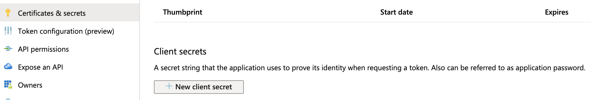

3. Enter a **Description** and expiration option, then click **Add**.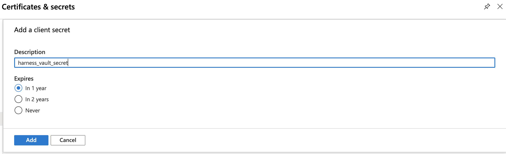

4. Find your new key in the **Client secrets** section, and copy its value to your clipboard.
This is your only chance to view this key's value in Azure. Store the value somewhere secure, and keep it on your clipboard.
5. Paste the key into Harness’ **Key** field.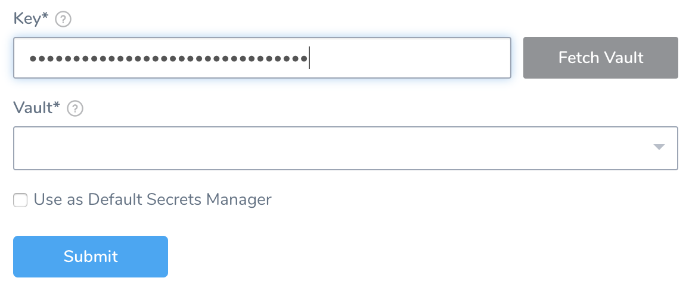


### Step 7: Fetch Vault

1. Click **Fetch Vault**.  
After a slight delay, the **Vault** drop-down list populates with vaults corresponding to your client secret.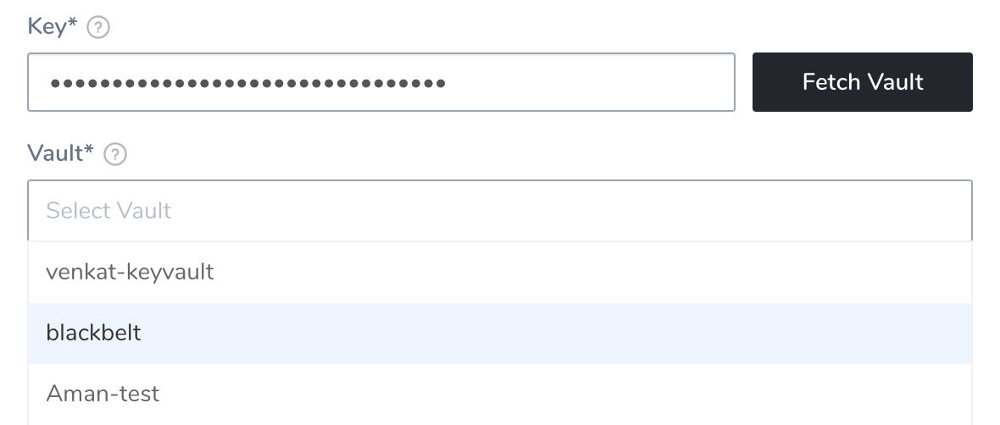

2. From the **Vault** drop-down, select the vault to use.

If these controls do not respond as expected, double-check whether you have successfully configured [Step 1: Create Azure Reader Role](#step_1) above.

### Step 8: Usage Scope

See [Scope Secret Managers to Applications and Environments](scope-secret-managers-to-applications-and-environments.md).

### Step 9: Save the Secrets Manager

1. If you choose to make Azure Key Vault your Harness default, select **Use as Default Secrets Manager**.
2. To save your configured Secrets Manager, click **Submit**.Harness does not validate your configuration upon save.

### Step 10: Make Key Vaults Writable

For every key vault that you'll want to write to, you must follow this procedure:

1. Navigate to Azure 's **Key vaults** page.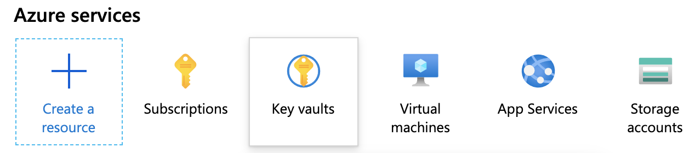

2. Select the Vault instance that matches Harness Manager's **Vault** field.
3. Select **Settings** > **Access policies**.
4. In the **Access policies** page’s main area, click **Add access policy**.
5. On the resulting **Add access policy** page, use the **Configure from template** drop-down to select **Key & Secret Management**.

6. Click **Select principal**.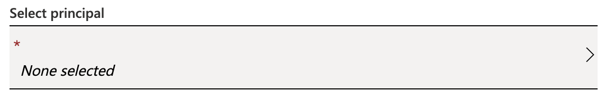

7. In the resulting **Principal** pane at right, enter the name of the App registration whose **Client ID**, **Tenant ID**, **Key**, and **Vault** you’ve entered (above) in Harness Manager.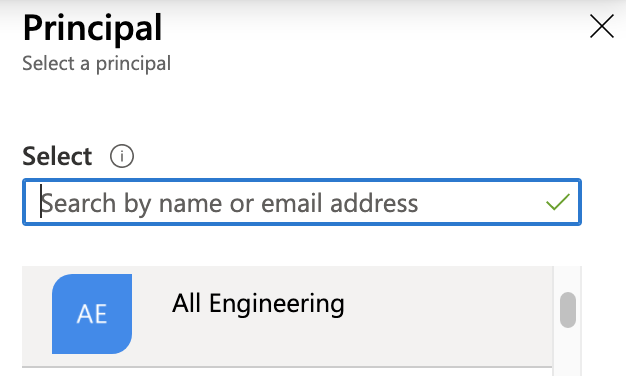

8. Click **Select** to select this App registration.
9. Repeat the above steps (as needed) to make your other vaults writable.

### Option: Use Existing Azure Key Vault Secrets

You can create a Harness secret that refers to an existing secret in Azure Key Vault, using that secret's name (for example: `azureSecret`). You can also specify the secret's version (for example: `azureSecret/05`).

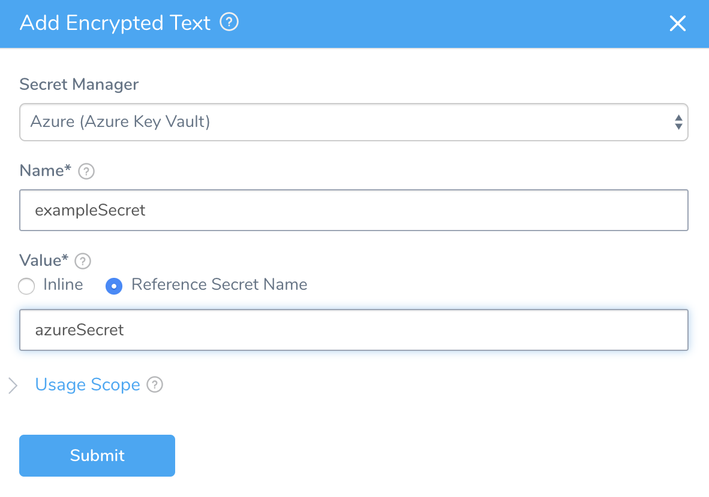


### Next Steps

* Refer back to [Secrets Management](secret-management.md) for other secrets storage options.

