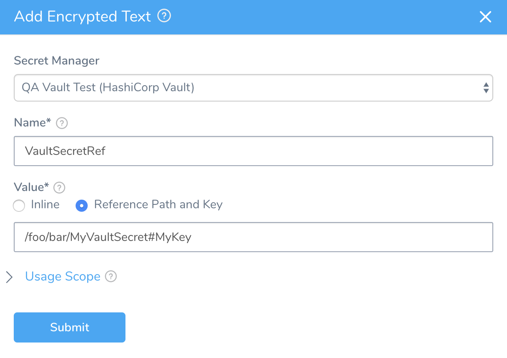
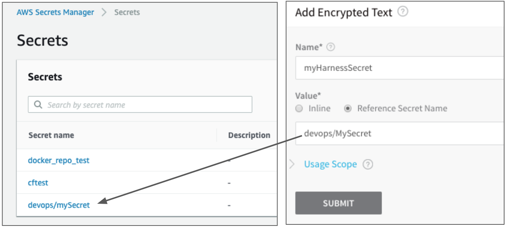
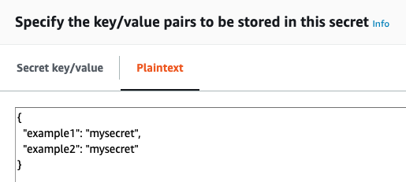
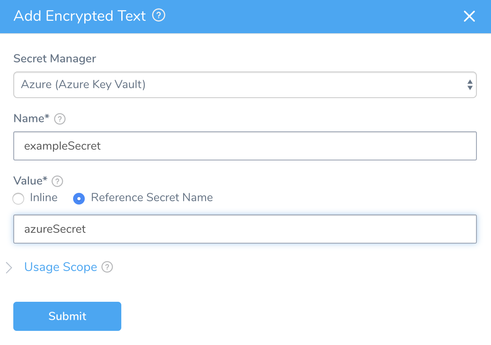
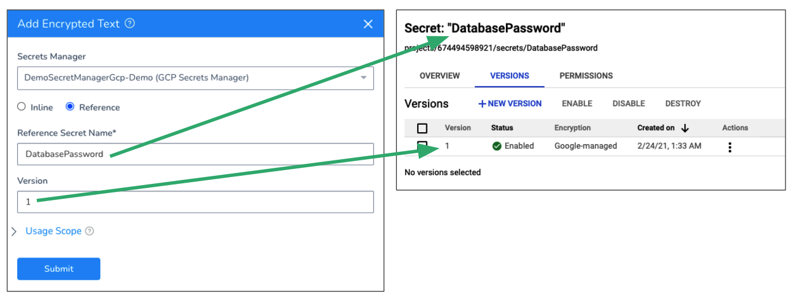

This content is for Harness [FirstGen](../../../../get-started/harness-first-gen-vs-harness-next-gen.md). Switch to [NextGen](/docs/platform/secrets/secrets-management/reference-existing-secret-manager-secrets).If you already have secrets created in a secrets manager such as HashiCorp Vault or AWS Secrets Manager, you do not need to re-create the existing secrets in Harness.

Harness does not query the secrets manager for existing secrets, but you can create a secret in Harness that references an existing secret in HashiCorp Vault or AWS Secrets Manager. No new secret is created in those providers. If you delete the secret in Harness, it does not delete the secret in the provider.

In this topic:

* [Before You Begin](reference-existing-secrets.md#before-you-begin)
* [Option: Vault Secrets](reference-existing-secrets.md#option-vault-secrets)
* [Option: AWS Secrets Manager Secrets](reference-existing-secrets.md#option-aws-secrets-manager-secrets)
	+ [Referencing Secret Keys](reference-existing-secrets.md#referencing-secret-keys)
* [Option: Azure Key Vault Secrets](reference-existing-secrets.md#option-azure-key-vault-secrets)
* [Option: Google Cloud Secret Manager](reference-existing-secrets.md#option-google-cloud-secret-manager)
* [Next Steps](reference-existing-secrets.md#next-steps)

### Before You Begin

* See [Add an AWS Secrets Manager](add-an-aws-secrets-manager.md).
* See [Add a HashiCorp Vault Secrets Manager](add-a-hashi-corp-vault-secrets-manager.md).
* See [Add Azure Key Vault Secrets](azure-key-vault.md).

### Option: Vault Secrets

You can create a Harness secret that refers to the existing Vault secret using a path and key, such as `/path/secret_key#my_key`.

In the above example, `/foo/bar` is the pre-existing path, `MyVaultSecret` is the secret name, and `MyKey` is the key used to lookup the secret value.

Do not prepend the Vault secrets engine to the path. In the above example, if the secret (`/foo/bar/MyVaultSecret#MyKey`) had been generated by a Vault secrets engine named `harness-engine`, it would reside in this full path `/harness-engine/foo/bar/MyVaultSecret#MyKey`. However, in the **Value** field, you would enter only `/foo/bar/MyVaultSecret#MyKey`.This Harness secret is simply a reference pointing to an existing Vault secret. Deleting this Harness secret will not delete the Vault secret referred to by this secret.

You can also reference pre-existing Vault secrets in the Harness YAML editor, as described in [Encrypted Information in YAML](../../techref-category/configuration-as-code-yaml/harness-yaml-code-reference.md#encrypted-information-in-yaml).

### Option: AWS Secrets Manager Secrets

You can create a Harness secret that refers to an existing secret in AWS Secrets Manager using the name of the secret, and a prefix if needed. For example, `devops/mySecret`.

##### Referencing Secret Keys

In AWS Secrets Manager, your secrets are specified as key-value pairs, using a JSON collection:

To reference a specific key in your Harness secret, add the key name following the secret name, like `secret_name#key_name`. In the above example, the secret is named **example4docs**. To reference the **example1** key, you would enter `example4docs#example1`.

### Option: Azure Key Vault Secrets

You can create a Harness secret that refers to an existing secret in Azure Key Vault, using that secret's name (for example: `azureSecret`). You can also specify the secret's version (for example: `azureSecret/05`).

### Option: Google Cloud Secret Manager

You can create a Harness secret that refers to an existing secret in Google Cloud Secret Manager.

In Secrets Manager, select the Google Cloud Secrets Manager you added to Harness. See [Add a Google Cloud Secrets Manager](add-a-google-cloud-secrets-manager.md).

In **Reference Secret Name**, enter the name of an existing secret in GCP.

In **Version**, enter the secret version you want to use.

In **Region**, enter the location of the secret. If the secret is **Automatically replicated**, leave this empty.

### Next Steps

* [Migrate Secrets Between Secrets Managers](migrate-secrets-between-secrets-managers.md)

