You reference Harness secrets in your Workflows and other settings using the expression `${secrets.getValue("secret_name")}`, where `secret_name` refers to the name you entered when you added the secret in Harness. In this
 case, you are referring to a single secret.


In some cases, you might want to select different secrets each time you deploy a Workflow.


You can use Harness Shell Script templates and Workflow or Service Config Variables to select or substitute the secret name at Workflow runtime.


In this topic:


* [Before You Begin](#before_you_begin)
* [Visual Summary](#visual_summary)
* [Supported Platforms and Technologies](#undefined)
* [Step 1: Create Secrets](#step_1_create_secrets)
* [Step 2: Create the Shell Script Template](#step_2_create_the_shell_script_template)
* [Option: Create the Workflow Variable](#option_create_the_workflow_variable)
* [Option: Create the Service Config Variable and Environment Overrides](#option_create_the_service_config_variable_and_environment_overrides)
* [Step 3: Add the Template to the Workflow](#step_3_add_the_template_to_the_workflow)
* [Step 4: Deploy the Workflow](#step_4_deploy_the_workflow)
* [Configure As Code](#configure_as_code)


### Before You Begin


* [Use Encrypted Text Secrets](use-encrypted-text-secrets.md)
* [Set Workflow Variables](../../../continuous-delivery/model-cd-pipeline/workflows/add-workflow-variables-new-template.md)
* [Add Service Config Variables](../../../continuous-delivery/model-cd-pipeline/setup-services/add-service-level-config-variables.md)
* [Create a Shell Script Workflow Step Template](../../account/manage-templatelib/create-a-shell-script-workflow-step-template.md)
* [Secrets and Log Sanitization](../../techref-category/techref-security/secrets-and-log-sanitization.md)


### Visual Summary


You create a Shell Script template that uses a variable to replace the value of the secret name in the `${secrets.getValue("secret_name")}` expression.


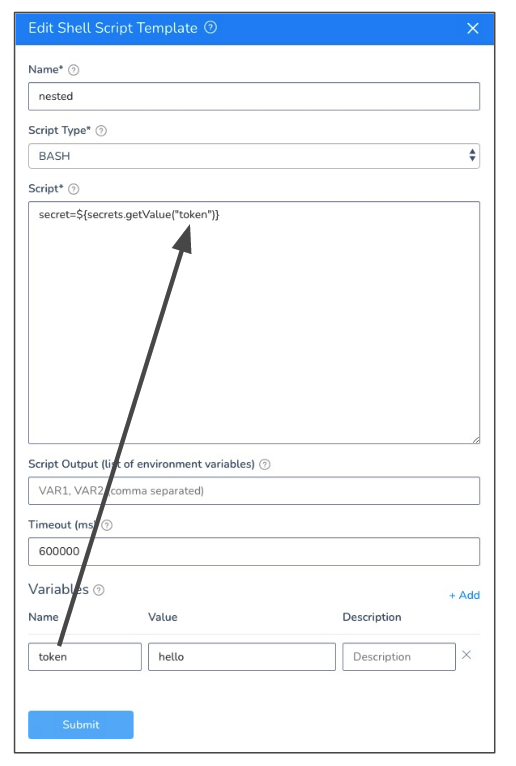


In the following example, you can see the Shell Script template uses a Workflow variable in **Value** to replace the secret name in the script. When the Workflow is deployed, you enter in a new variable name.


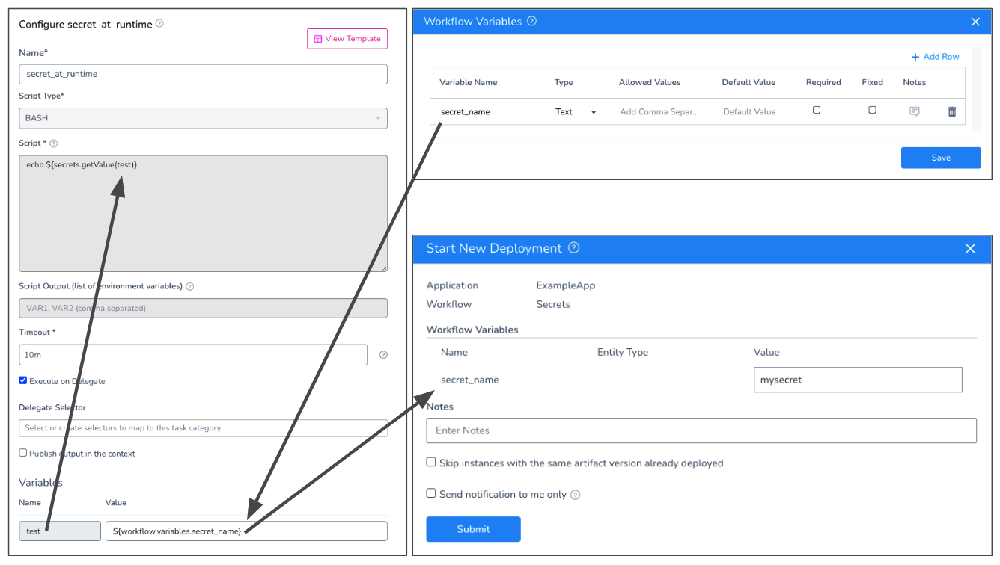


You can also perform the same substitution using Service Config Variables and
 [Environment Overrides](../../../continuous-delivery/model-cd-pipeline/environments/override-service-files-and-variables-in-environments.md):


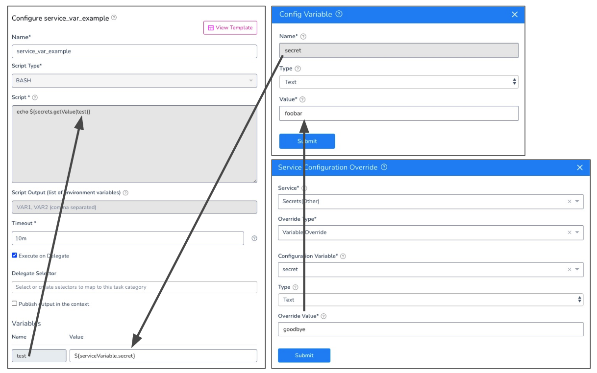


In this use case, you can have a single Service Config Variable and multiple Environments that override the variable with their own values. You can then
 [templatize the Workflow](../../../continuous-delivery/model-cd-pipeline/workflows/templatize-a-workflow-new-template.md) and select a different Environment each time you deploy.


### Supported Platforms and Technologies


See
 [Supported Platforms and Technologies](../../../starthere-firstgen/supported-platforms.md).


### Step 1: Create Secrets


Create the text secret you want to use in your Shell Script template.


Give the secret a name that is easy for your users to identify.


For this example, we'll use a secret named `hello`.


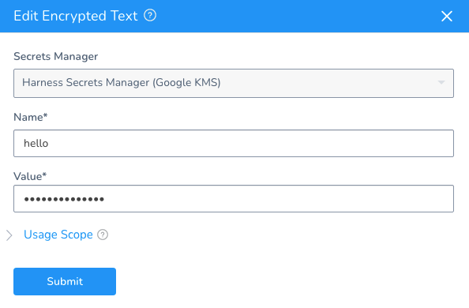


You can use file secrets, also, but we cover text secrets in this topic.


See:


* [Use Encrypted Text Secrets](use-encrypted-text-secrets.md)
* [Use Encrypted File Secrets](use-encrypted-file-secrets.md)


### Step 2: Create the Shell Script Template


Next, we will create a Shell Script template that we can add to any Workflow.


You can create a Shell Script Workflow Step template in the account Template Library or the
 [Application Templates](../../../continuous-delivery/concepts-cd/deployment-types/use-templates.md).
Create a **Shell Script** template. See
 [Create a Shell Script Workflow Step Template](../../account/manage-templatelib/create-a-shell-script-workflow-step-template.md).


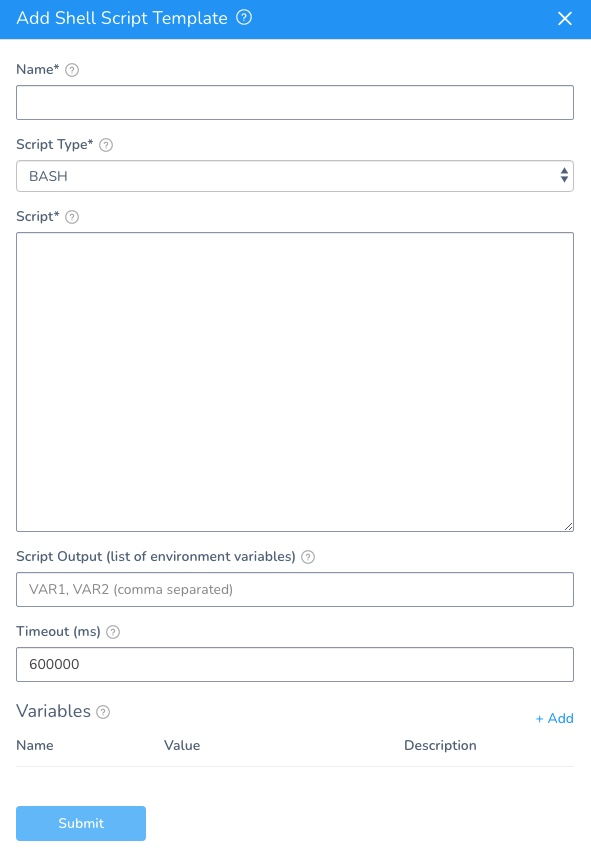


In **Script**, enter a script that includes the text secret expression `${secrets.getValue("token")}`.


You do not need to use an actual secret name because you will use a variable to replace it. In this example, we use `${secrets.getValue("token")}`. You can use any other name.


Ensure that you use quotes.
In **Variables**, add a new variable.


In the variable **Name**, enter the secret name in your expression (in our example, `token`).


In the variable **Value**, enter a default value for the secret name. For example, `hello`.


You can enter the Workflow or Service Config variable expression in **Value** now, but it is easier to enter it in when you add the template to the Workflow. That way, you can use any Workflow variable or Service Config Variable expression.


When you are done, the Shell Script template will look something like this:


You can see that the variable `token` in **Variables** will replace the value in the `${secrets.getValue("token")}` expression with `hello`.


When you add the template to the Workflow, you will replace `hello` with a Workflow or Service Config variable expression.


### Option: Create the Workflow Variable


If you want to use a Workflow variable to replace the secret name at deployment runtime, create the Workflow variable. See
 [Set Workflow Variables](../../../continuous-delivery/model-cd-pipeline/workflows/add-workflow-variables-new-template.md).


Here's an example that includes multiple options:


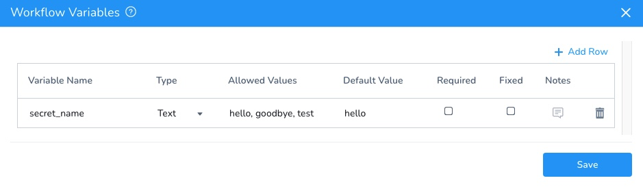


Later, when you add this Workflow variable to the template, you will reference it as `${workflow.variables.secret_name}`.


### Option: Create the Service Config Variable and Environment Overrides


Instead of using a Workflow variable in the template, you can use a Service Config Variable.


In the Service your Workflow will deploy, create a Service Config Variable. See
 [Add Service Config Variables](../../../continuous-delivery/model-cd-pipeline/setup-services/add-service-level-config-variables.md).


In our example, the variable is named `secret`.


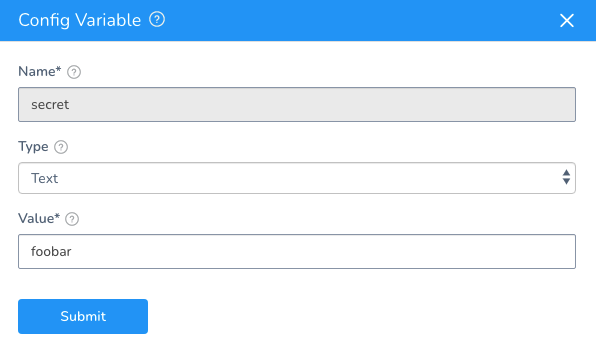


Later, when you add this Service Config Variable to the template, you will reference it as `${serviceVariable.secret}`.


Next, in each Environment that your Workflow will use, you can create a Service Configuration Override. The Service Configuration Override will provide a new value for the Service Config Variable.


Here is an example where the Service Configuration Override uses the secret name `goodbye` to override the Service Config Variable:


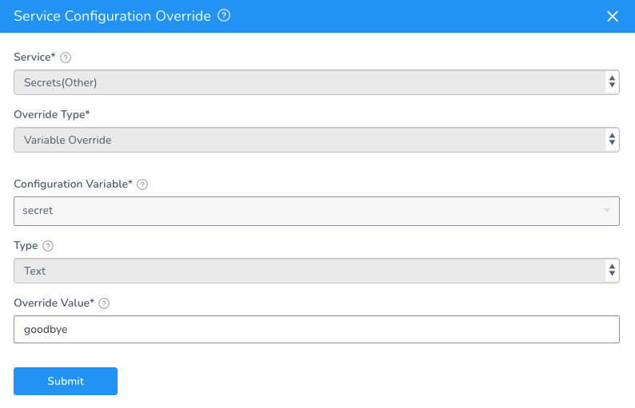


In your Workflow, you can templatize the Environment setting so that you can select different Environments, and their Service Configuration Overrides, when you deploy the Workflow. See
 [Templatize a Workflow](../../../continuous-delivery/model-cd-pipeline/workflows/templatize-a-workflow-new-template.md).


### Step 3: Add the Template to the Workflow


In your Harness Workflow, click **Add Step**, and then click **Template Library**.


Locate the template you created and click **Link** or **Copy**.


In **Variables**, in **Value**, replace the default with the expression for your Workflow or Service Config Variable.


Here is an example using the Workflow variable:


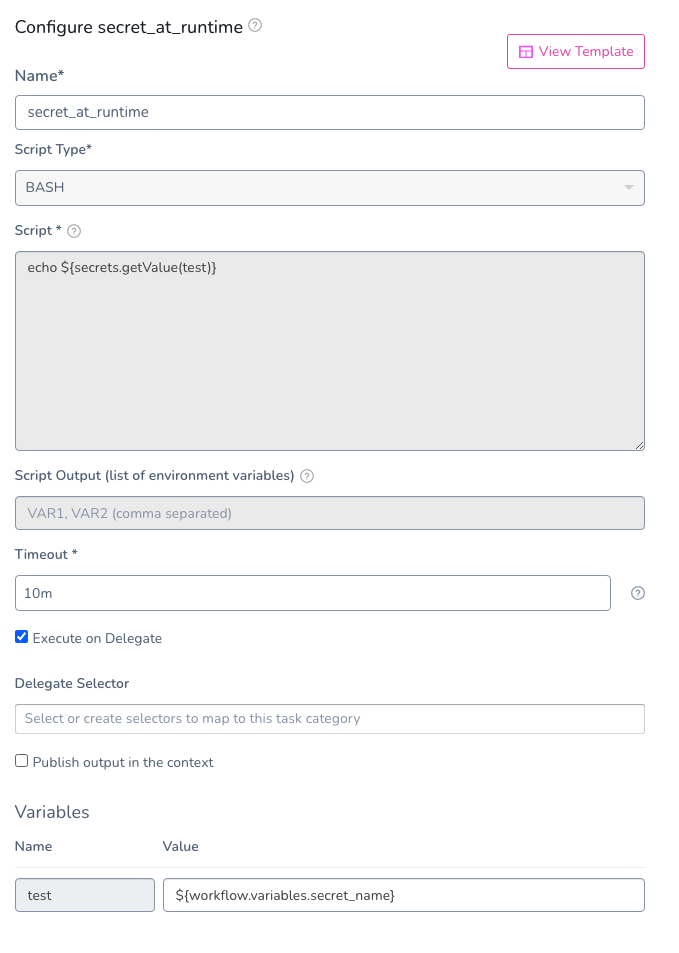


Here is an example using the Service Config Variable:


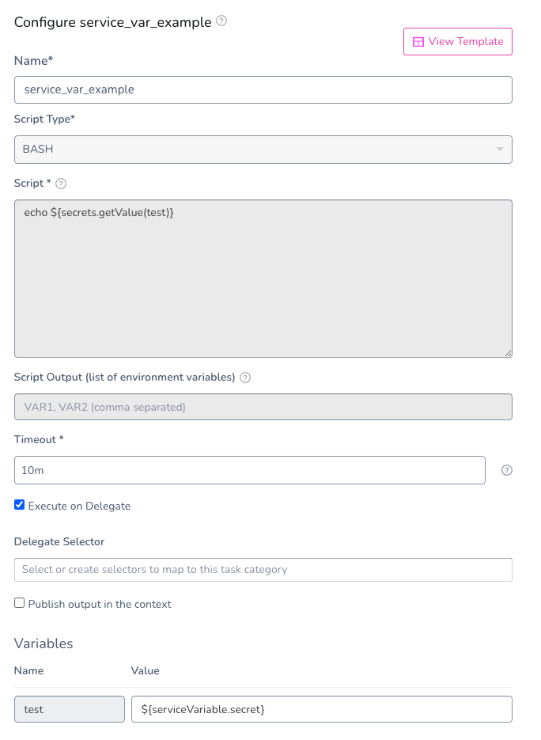


If you are using a Service Config Variable, ensure you add the template to a Workflow section that can access the Service. A Pre-deployment section
 cannot access Service Config Variables.


### Step 4: Deploy the Workflow


In the Workflow, click **Deploy**.


If you are using a Workflow variable, you will be prompted to provide a value for the variable. This value will be used in the template, and it must be the name of an existing secret.


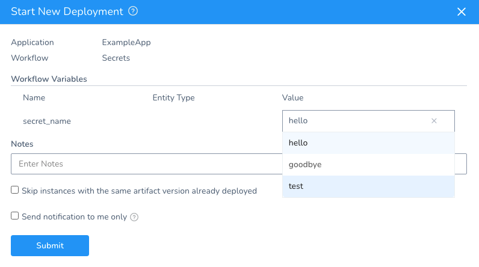


If you use a
 [Trigger](../../../continuous-delivery/model-cd-pipeline/triggers/add-a-trigger-2.md) to execute the Workflow, you will select a secret name in the Trigger. You can also
 [pass values into the Workflow using a Trigger](../../../continuous-delivery/model-cd-pipeline/expressions/passing-variable-into-workflows.md).
In the **Deployments** page, click the template step to see that the secret was substituted:


```
Executing command ...  
**************  
Command completed with ExitCode (0)
```

In the step **Details**, click more options (**︙**) , and then click **View Execution Context**. In **Execution Context**, you can see the secret name that was used.


Here is the **Execution Context** for a template using a Workflow variable:


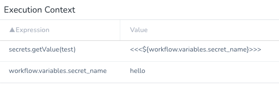


Here is the **Execution Context** for a template using a Service Config Variable:


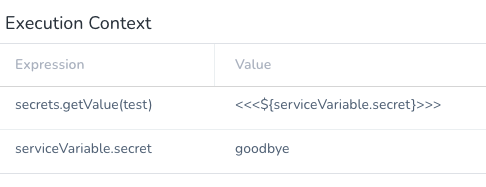


That's it. You have successfully selected a secret at deployment runtime.


### Configure As Code


To see how to configure the settings in this topic using YAML, configure the settings in the UI first, and then click the **YAML** editor button.

