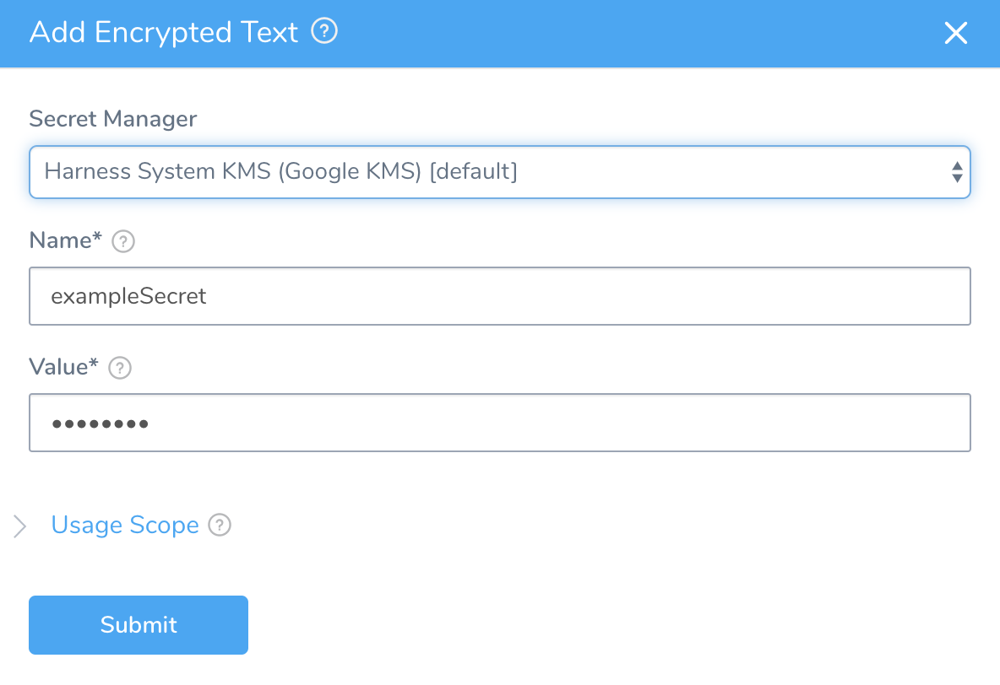
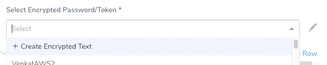

You can encrypt any text and reference it in Harness Application entities or connections.

### Before You Begin

* See [Harness Key Concepts](../../../starthere-firstgen/harness-key-concepts.md).
* Make sure you add the required Secrets Manager. See [Add a Secrets Manager](add-a-secrets-manager.md).

### Step 1: Add Encrypted Text

1. In **Secrets Management**, click **Encrypted Text**.
2. Click **Add Encrypted Text**. The **Add Encrypted Text** dialog appears.

3. Select the **Secrets Manager** you will use to encrypt this secret.
4. Enter a name for the encrypted text. This is the name you will use to reference the text elsewhere in your applications.
5. Enter a value for the encrypted text.
6. **Scope to Account** - If your Harness User account is part of a User Group with the **Administer Other Account Functions** permission enabled, you will see the **Scope to Account** option. Select **Scope to Account** to make this encrypted text secret available to Delegate Profile scripts only. Only secrets scoped to the account are available to use in Delegate Profiles.
7. For **Usage Scope**, see [Restrict Secrets Usage](restrict-secrets-usage.md).
8. Click **Submit**.

### Step 2: Use the Encrypted Text in Services

When you are in an Application entity such as a Service, you can use the encrypted text. For example:

1. In a Service's **Configuration** section, click **Add Variable**. The **Config Variable** dialog appears.
2. Enter a name for the variable, and then, in **Type**, select **Encrypted Text**.
3. In **Value**, select the secret you created in **Secrets Management**.
4. Click **Submit** and the secret will be used at runtime.

### Step 3: Using the Encrypted Text in Connectors

All of the passwords and keys used in Harness Connectors (Cloud Providers, Artifact Servers, Verification Providers, Source Repo Providers, and Collaboration Providers) are stored as Encrypted Text secrets in Harness.

You create the Encrypted Text secret first and then select it in the Connector. Or you can create it from the Connector by clicking **Create Encrypted Text**:


You can also edit it in the Connector.

### Step 4: Reference the Encrypted Text

For an Encrypted Text secret that has been scoped to an Application (using its **Usage Scope** settings), you reference the secret in an Application component using the expression: `${secrets.getValue("secret_name")}`.

For example, if you have text secret named doc-secret you can reference it in a Workflow [Shell Script](../../../continuous-delivery/model-cd-pipeline/workflows/capture-shell-script-step-output.md) step like this:


```
echo "text secret is: " ${secrets.getValue("doc-secret")}
```
For Encrypted Text used in a Service's **Config Variables**, you reference them in the Workflow using the Service with the variable `${serviceVariable.var_name}` .

Avoid using $ in your secret value. If your secret value includes $, you must use single quotes when you use the expression in a script.

### Step 5: Add a Secret to a File at Runtime

When a text secret has been scoped to Account-level using the **Scope to Account** setting, it can be referenced in a Delegate Profile as part of a script and written to a file as well. For example, here is a secret decoded from [base64](https://linux.die.net/man/1/base64) and written to a file:

`echo ${secrets.getValue("my_secret")} | base64 -d > /path/to/file.txt`

This example uses base64, but you can also write a secret to a file without it:

`echo '${secrets.getValue("long_secret")}' > /tmp/secretvalue.txt`

If you do not use base64 and the secret value contains any character that is interpreted by the shell, it might cause issues.

In this case, you can use a here document special-purpose code block:


```
cat >/harness/secret_exporter/values.txt << 'EOF'  
MySecret:${secrets.getValue("test")}  
EOF
```
### Review: Valid Characters in Secret Names

Secret names may only contain alphanumeric characters, `-`, `_` and `\`.

### Review: Quotes and Secrets in a Script

By default, secret expressions use quotes for the secret name: `${secrets.getValue("secret_name")}`.

If the secret value itself includes quotes, either single or double, and anywhere in the secret value, you must use the opposite quote when you use the expression in a script (echo, etc).

While uncommon, you might need quotes in the secret value for interpreting environment variables, etc.

If you do not use the opposite quote you will expose the secret value.Single quote example:

Here, the secret value is `'mysecret'` and the name is `secret_name`. To echo, use double quotes:

`echo "${secrets.getValue('secret_name')}"`

`echo "${secrets.getValue("secret_name")}"`

Double quote example:

Here, the secret value is `"mysecret"` and the name is `secret_name` .

`echo '${secrets.getValue('secret_name')}'`

Avoid using $ in your secret value. If your secret value includes $, you must use single quotes when you use the expression in a script.  
For example, if your secret value is `'my$secret'` , and the name is `secret_name`, to echo, use single quotes:  
 `echo '${secrets.getValue("secret_name")}'`

### Secrets in YAML Code

The example below applies to the values.yaml used by the secret manifest for either Kubernetes and Native Helm deployments. See [Kubernetes or Native Helm?](../../../continuous-delivery/concepts-cd/deployments-overview/deployments-overview.md#kubernetes-or-native-helm).When you plan to use your secrets in YAML content, make sure you follow the quoting mechanism needed by YAML syntax.

For example, if the secret value is "foo: bar" and the secret has:


>  `stringData: {{.Values.secret}}`
> 
> 

It will resolve as follows:


>  `stringData: foo: bar`
> 
> 

This is not recognized as the lack of quotes and presence of extra space will lead to errors while executing the workflow.

#### Solution

To avoid this, follow the quoting mechanism suggested by YAML syntax, as follows:


> `stringData: {{.Values.secret | quote}}`
> 
> 

It will resolve as follows:


>  `stringData: "foo: bar"`
> 
> 

### Review: Secrets in Outputs

When a secret is displayed in an output, Harness substitutes the secret value with asterisks so that the secret value is never displayed. Harness replaces each character in the name with an asterisk (\*).

For example, here the secret values for repo username and password are replaced with `*****`:


```
helm repo add --username **** --password **** nginx https://charts.bitnami.com/bitnami
```
If you accidentally use a very common value in your secret, like whitespace, the `*` substitution might appear in multiple places in the output.

If you see output similar to this, review your secret and fix the error.

If an operation within a script changes the value of the secret and Harness cannot match it to the expression, the newly modified string is displayed in the output exposing the secret value. If the modification is minor, the secret value can be easily deciphered which is a security concern.See [Secrets and Log Sanitization](../../techref-category/techref-security/secrets-and-log-sanitization.md).

### Review: Secret Scope

When creating secrets, it's important to understand their scope in your Harness account.

A user can only create a secret according to the scope set by its Harness User permissions.

For example, if you have access to Application A only, you can create a secret scoped to Application A.

If you have access to Application A and B, you may still narrow the secret's scope to Application A only.

If the scope of a secret is only Application A, then only users with Read permission for Application A may see that secret. Users with Write permission to Application A may edit it also.

For steps, see [Restrict Secrets Usage](restrict-secrets-usage.md).

### Review: Secrets and Caching

When a secret stored in Custom Secret Manager is used in background jobs, it is fetched from the source and put in the cache.

By default, secrets are cached for 1 hour. When a secret is used, the cache is refreshed and the 1 hour limit starts again. When the 1 hour limit is reached, the secret is removed from the cache and is added back to the cache the next time it’s accessed.

If the secret is not in the cache when Harness fetches the secret, then the secret is fetched from the source and put in cache.

[Harness Support](mailto:support@harness.io) can increase the default cache expiry limit for your account. Harness can also disable secret caching entirely if you want.