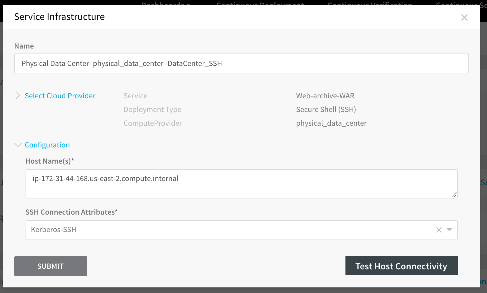

Harness supports SSH server authentication using Kerberos, enabling you to SSH into a target host via the Kerberos protocol. For a quick Kerberos summary, see [Explain like I’m 5: Kerberos](https://www.roguelynn.com/words/explain-like-im-5-kerberos/) by Lynn Root.

In this topic:

* [Before You Begin](#before_you_begin)
* [Step 1: Access SSH Configuration](#step_1_access_ssh_configuration)
* [Step 2: Auth Scheme](#step_2_auth_scheme)
* [Step 3: Principal](#step_3_principal)
* [Step 4: Realm](#step_4_realm)
* [Step 5: TGT Generation](#step_5_tgt_generation)
* [Step 6: Keytab File Path](#step_6_keytab_file_path)

### Before You Begin

* See [Harness Key Concepts](../../../starthere-firstgen/harness-key-concepts.md).
* See [Secrets Management Overview](secret-management.md).
* Make sure you can generate TGT using `kinit` command on the machine where the Delegate is running. For more information about `kinit` command, see [kinit documentation](https://web.mit.edu/kerberos/krb5-1.12/doc/user/user_commands/kinit.html).

### Step 1: Access SSH Configuration

1. In Secrets Management, click **SSH**.
2. Click **Add SSH Key**. The **SSH Configuration** dialog appears.
3. Enter a **Display Name** for the SSH credentials.

### Step 2: Auth Scheme

Select **Kerberos**.

### Step 3: Principal

Principal is a string that names a specific entity to which a set of credentials may be assigned. Enter the account name associated with the Kerberos account, such as **johndoe**.

### Step 4: Realm

Realm is the logical network served by a single Kerberos database and a set of Key Distribution Centers (KDCs). Typically, this is the domain where the service (that the user is trying to authenticate with) is located. For example: **US-EAST-2.COMPUTE.INTERNAL**.Typically, the target host(s) that your SSH connection is intending to authenticate with via Kerberos are located in a domain name with the same name you enter in **Realm**. For example, **ip-172-31-44-168.us-east-2.compute.internal**. The realm naming convention is all uppercase letters to differentiate the realm from the internet domain, but the **Realm** field does not enforce the convention.

### Step 5: TGT Generation

Select one of the following options:

* **Key Tab File Path (on Delegate)** - You can choose this option to generate a new TGT from the KDC every time you authenticate with the service. This ensures that the TGT is always valid and not expired when you try to authenticate.
* **Password** - Select a password for TGT generation. Make sure you use a Harness Encrypted Text secret to save the password and refer to it using this option. Either select an existing secret from the drop down list or create a new one by clicking **+ Create Encrypted Text**. For more information on creating Encrypted Text, see [Harness Encrypted Text secret](use-encrypted-text-secrets.md).
* **None** - Select this option to skip TGT Generation. If you select this option, you must ensure that the TGT that is on the server running the Harness delegate is always available.

### Step 6: Keytab File Path

This field is displayed if you select **Key Tab File Path** for **TGT Generation**. Enter the file path to the keytab file on the server running the Harness delegate. For example, **/home/johndoe/a.keytab**. The file is not uploaded to Harness.

To use the Kerberos SSH connection to connect to a target host, you select it in **SSH Connection Attributes** while specifying the target host in the Service Infrastructure/ [Infrastructure Definition](../../../continuous-delivery/model-cd-pipeline/environments/environment-configuration.md#add-an-infrastructure-definition) settings of an environment.

In this example, the target host that you want to use Kerberos authentication with is entered in **Host Name(s)**.

Note that the domain name used to identify the hosts in the **Host Name(s)** field is likely to be the same as the domain name you entered in **Realm** when configuring the SSH connection.

