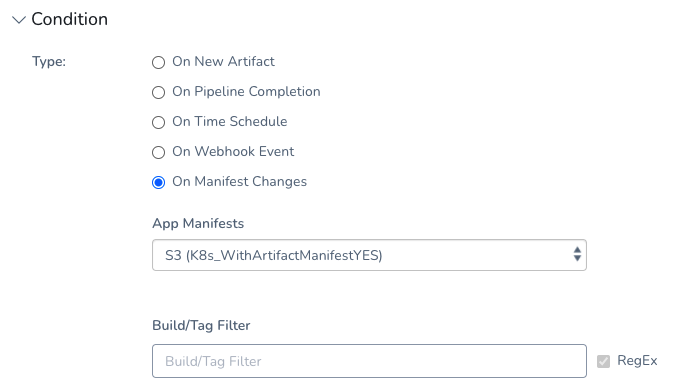

As discussed in [Deploy Helm Charts](../../../continuous-delivery/kubernetes-deployments/deploy-a-helm-chart-as-an-artifact.md), you can deploy the Helm chart without adding your artifact to Harness.

Instead, the Helm chart identifies the artifact. Harness installs the chart, gets the artifact from the repo, and then installs the artifact. We call this a *Helm chart deployment*.

This topic explains how to set up a Helm chart deployment using the Harness GraphQL API.

### Before You Begin

* [Deploy Helm Charts](../../../continuous-delivery/kubernetes-deployments/deploy-a-helm-chart-as-an-artifact.md): review this topic to learn how to create a Helm chart deployment using the Harness Manager UI.

### Option: Create Harness Helm Chart Deployment

This topic covers how to specify the Helm chart as artifact when you execute your Workflow or Pipeline manually or programmatically via the API, including API Triggers.

If this is your first Helm chart deployment, follow the steps in [Deploy Helm Charts](../../../continuous-delivery/kubernetes-deployments/deploy-a-helm-chart-as-an-artifact.md) to create the Helm Chart as Artifact deployment.

Next, you will use the API to execute this deployment and specify the chart version to use.

### Step 1: Specify Helm Chart Version and Start Execution

You execute the Workflow or Pipeline using the mutation `StartExecutionInput.serviceInputs`. You specify the Helm chart and version using `manifestValueInput`.

You will need the Application Id, Workflow Id (`entityId`), Service name, Manifest Source **Display Name** from the Service, and chart version number.

Here is an example:


```
mutation{  
  startExecution(input: {applicationId: "mtvPmU4AQ6aHrtjItnh1OQ"  
  entityId: "AZAlHrc7TNeSwPTcvcjAtg"  
  executionType: WORKFLOW  
  serviceInputs: {  
    name: "Kubernetes Example"  
    manifestValueInput: {  
      valueType: VERSION_NUMBER  
      versionNumber: {  
        appManifestName: "aerospike"  
        versionNumber: "0.1.5"  
      }  
    }  
  }}){  
    execution{  
      id  
      status  
    }  
  }  
}
```
The execution status appears:


```
{  
  "data": {  
    "startExecution": {  
      "execution": {  
        "id": "rFtzYRNuSJ66mQ6dAViqqg",  
        "status": "RUNNING"  
      }  
    }  
  }  
}
```
### Step 2: Query the Execution

You can query the Workflow or Pipeline executions to get the artifact sources used using `ExecutionInputs.serviceManifestInputs`.

Here's an example of a Workflow query:


```
query{  
  executionInputs(applicationId: "mtvPmU4AQ6aHrtjItnh1OQ"  
  entityId: "AZAlHrc7TNeSwPTcvcjAtg"  
  executionType: WORKFLOW){  
    serviceManifestInputs{  
      id  
      name  
      artifactType  
      artifactSources {  
        artifacts(limit:10){  
          nodes{  
            artifactSource {  
              id  
            }  
          }  
        }  
      }  
    }  
  }  
}
```
### Option: Create and Update Trigger

To create a Trigger for a Workflow or Pipeline, the Trigger Condition must be `conditionType: ON_NEW_MANIFEST`.

You use `TriggerConditionInput.manifestConditionInput` to specify the chart version and App Manifest.

This is the same as selecting these in the UI:


Here's a Pipeline Trigger example:


```
mutation{  
  createTrigger(input: {  
    applicationId: "YHgzTw6_QI6TtHjJ8FZbfQ"  
    name: "Test-trigger-11342"  
    condition: {  
      conditionType: ON_NEW_MANIFEST  
      manifestConditionInput: {  
        versionRegex: "1.3.*"  
        appManifestId: "SIQku8n5QSS33WYN7Qa1iw"  
      }  
    }  
    action: {  
      entityId: "_zPc3iTRS2q-ui1rwIVrEw"  
      executionType: PIPELINE  
      variables: [  
        {  
          name: "Environment"  
          variableValue:   
          {  
            type:NAME  
            value:"prod"  
          }  
        }  
        {  
          name: "Service"  
          variableValue:   
          {  
            type:NAME  
            value:""  
          }  
        }	  
        {  
          name: "InfraDefinition_KUBERNETES"  
          variableValue:   
          {  
            type:NAME  
            value:""  
          }  
        }	  
      ]  
      manifestSelections: {  
        manifestSelectionType:LAST_DEPLOYED  
        pipelineId:"_zPc3iTRS2q-ui1rwIVrEw"  
        versionRegex:""  
        workflowId:""  
        serviceId: "-shnKF_iRZ-cCI8eXvtgrg"  
      }  
      artifactSelections: {  
        artifactSelectionType: LAST_DEPLOYED_PIPELINE  
        serviceId: "-shnKF_iRZ-cCI8eXvtgrg"  
        pipelineId:"_zPc3iTRS2q-ui1rwIVrEw"  
      }  
    }  
  }){  
    trigger{  
      id  
      name  
      description  
      createdAt  
      createdBy{  
        email  
        name  
      }  
    }  
  }  
}
```
To update or query the Trigger for the chart information, you need the Trigger Id or name. You can query for these using the Application Id:


```
{  
  triggers(filters: [{application: {operator: EQUALS, values: ["mtvPmU4AQ6aHrtjItnh1OQ"]}}], limit: 100, offset: 2) {  
    nodes {  
      id  
      name  
    }  
  }  
}
```
To update the Trigger, use the Trigger name:


```
mutation{  
  updateTrigger(input: {  
    applicationId: "YHgzTw6_QI6TtHjJ8FZbfQ"  
    name: "Test-trigger-11342"  
    condition: {  
      conditionType: ON_NEW_MANIFEST  
      manifestConditionInput: {  
        versionRegex: "1.3.*"  
        appManifestId: "SIQku8n5QSS33WYN7Qa1iw"  
      }  
    }  
    action: {  
      entityId: "_zPc3iTRS2q-ui1rwIVrEw"  
      executionType: PIPELINE  
      variables: [  
        {  
          name: "Environment"  
          variableValue:   
          {  
            type:NAME  
            value:"prod"  
          }  
        }  
        {  
          name: "Service"  
          variableValue:   
          {  
            type:NAME  
            value:""  
          }  
        }	  
        {  
          name: "InfraDefinition_KUBERNETES"  
          variableValue:   
          {  
            type:NAME  
            value:""  
          }  
        }	  
      ]  
      manifestSelections: {  
        manifestSelectionType:LAST_DEPLOYED  
        pipelineId:"_zPc3iTRS2q-ui1rwIVrEw"  
        versionRegex:""  
        workflowId:""  
        serviceId: "-shnKF_iRZ-cCI8eXvtgrg"  
      }  
      artifactSelections: {  
        artifactSelectionType: LAST_DEPLOYED_PIPELINE  
        serviceId: "-shnKF_iRZ-cCI8eXvtgrg"  
        pipelineId:"_zPc3iTRS2q-ui1rwIVrEw"  
      }  
    }  
  }){  
    trigger{  
      id  
      name  
      description  
      createdAt  
      createdBy{  
        email  
        name  
      }  
    }  
  }  
}
```
To query the Trigger, use the Trigger Id:


```
query{  
  trigger(triggerId: "TRIGGER_ID"){  
    id  
    name  
    condition{  
     triggerConditionType  
			... on OnNewManifest{  
        appManifestId  
        serviceId  
        versionRegex  
      }  
    }  
    action{  
      manifestSelections{  
        manifestSelectionType  
        serviceId  
        serviceName  
        ...on LastCollectedManifest{  
          appManifestId  
          versionRegex  
        }  
      }  
    }  
  }  
}
```
The output will provide the chart information:


```
{  
  "data": {  
    "trigger": {  
      "id": "ezwJDT_BRN2yPiQGyv2YRA",  
      "name": "test1",  
      "condition": {  
        "triggerConditionType": "NEW_MANIFEST",  
        "appManifestId": "McaUBAo7SBKFUYYgOHg_cA",  
        "serviceId": "mwuH-qpATZCi6APZe9Zjkg",  
        "versionRegex": null  
      },  
      "action": {  
        "manifestSelections": [  
          {  
            "manifestSelectionType": "LAST_COLLECTED",  
            "serviceId": "mwuH-qpATZCi6APZe9Zjkg",  
            "serviceName": "K8s_WithArtifactManifestYES",  
            "appManifestId": "McaUBAo7SBKFUYYgOHg_cA",  
            "versionRegex": null  
          },  
          {  
            "manifestSelectionType": "LAST_COLLECTED",  
            "serviceId": "e89AtMBsRXmSJhala5kh7w",  
            "serviceName": "ExpressionSupport HELM V2",  
            "appManifestId": "odcpa_Q2TnSZKQ4bJcrjaw",  
            "versionRegex": null  
          }  
        ]  
      }  
    }  
  }  
}
```
