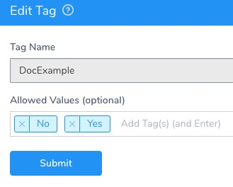
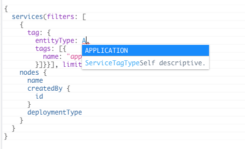
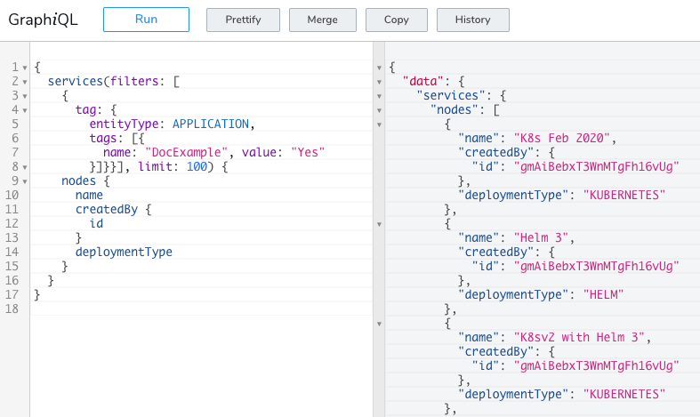

Harness provides advanced tagging features for all or your Harness [Application entities](../../../continuous-delivery/model-cd-pipeline/applications/application-configuration.md) (Services, Environments, Workflows, etc), as described in [Assign Metadata Using Tags](../../account/tags/tags.md) and [Apply Filters Using Tags](../../account/tags/apply-filters-using-tags.md).

You can use Tags to search for entities, ensuring that you only return the entities tagged with a specific name and value.


### Before You Begin

* [Manage Tags](../../account/tags/manage-tags.md)
* [Apply Filters Using Tags](../../account/tags/apply-filters-using-tags.md)

### Step 1: Assign Tags to your Harness Entities

Harness Tags are `name:value` pairs you can add to Harness Application entities.

For instructions, see [Assign Metadata Using Tags](../../account/tags/tags.md) and [Apply Filters Using Tags](../../account/tags/apply-filters-using-tags.md).

To see the available Tags in your Harness account, click **Setup**, and then click **Tags Management**. Each Tag pairs a name with one of more values:



Once you have Tags assigned, you can filter your API queries with them.

### Step 2: Use TagFilter

`TagFilter` uses a Harness entity type of and the `name:value` pair of a Tag to filter queries:


```
{  
  services(filters: [{tag: {entityType: <EntityType>, tags: [{name: "<NAME>", value: "<VALUE>"}]}}], limit: 100) {  
    nodes {  
      name  
    }  
  }  
}
```
The supported entity types are dependent on what you are querying.

For example, if you are querying services, only APPLICATION is supported, which you can see when building the query:



The entity types that might be available include the following: 

* APPLICATION
* ARTIFACT
* CLOUD\_PROVIDER
* COLLABORATION\_PROVIDER
* CONNECTOR
* DEPLOYMENT
* ENVIRONMENT
* INSTANCE
* PIPELINE
* SERVICE
* TRIGGER
* WORKFLOW

The `tags: [{name: "<NAME>", value: "<VALUE>"}]}}]` segment of the query uses the `TagInput` format:


```
name: String  
value: String
```
You simply need to select an entity type and a Tag `name:value` pair.

Let's look at a query that returns all Applications using the **DocExample** Tag and a value of **Yes**.


```
{  
  services(filters: [  
    {  
      tag: {  
        entityType: APPLICATION,   
        tags: [{  
          name: "DocExample", value: "Yes"  
        }]}}], limit: 100) {  
    nodes {  
      name  
      createdBy {  
        id  
      }  
      deploymentType  
    }  
  }  
}
```
All Applications using that Tag are returned:


