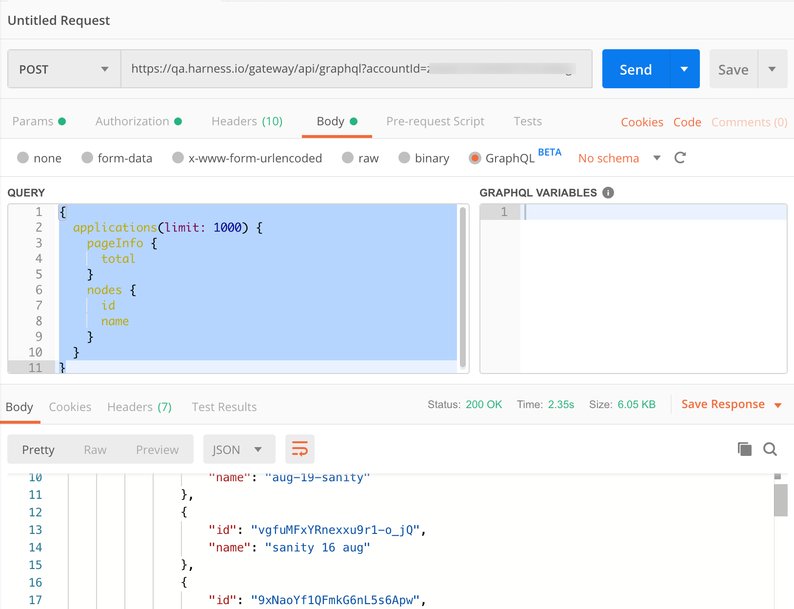
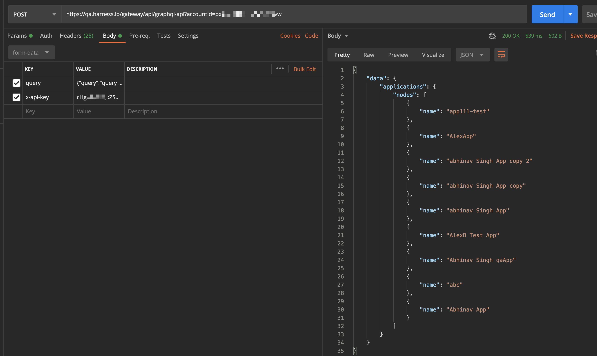
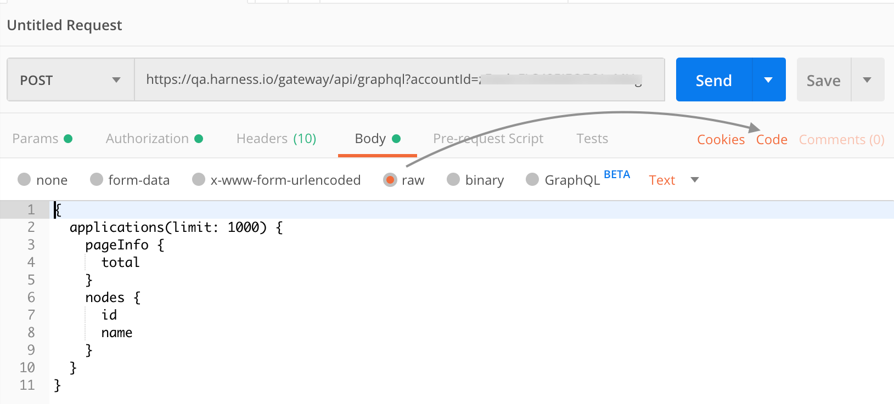
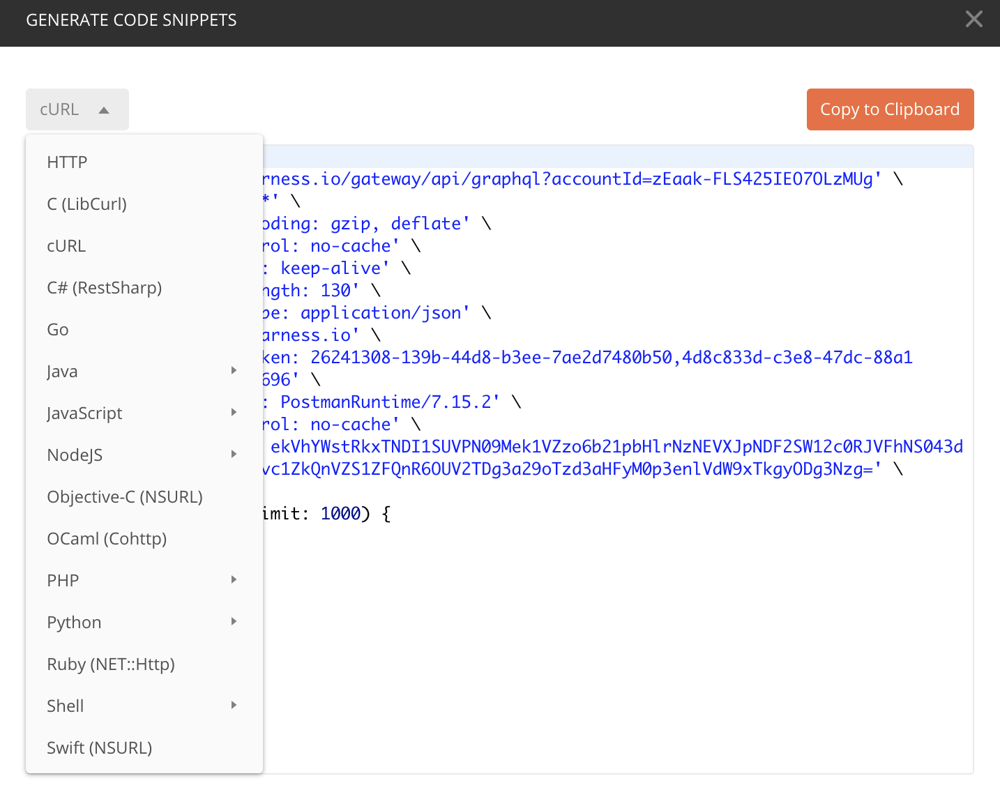
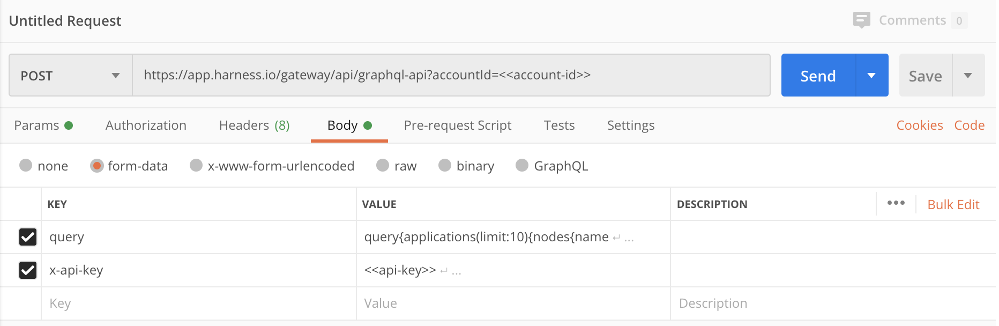
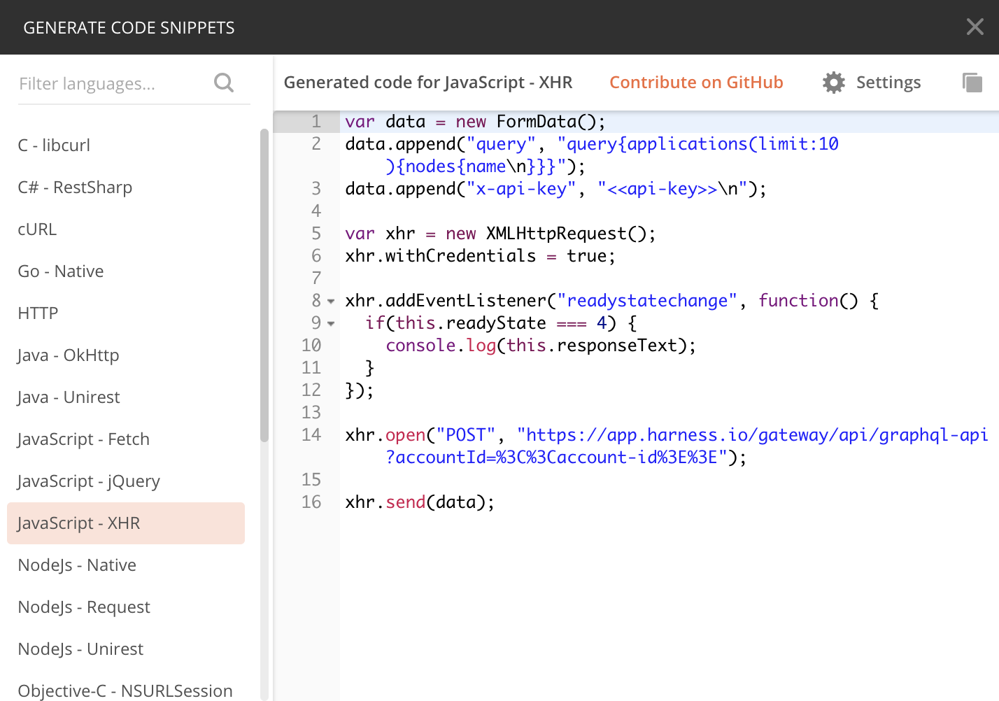

This section outlines how to use [Postman](https://www.postman.com/downloads/) (version 7.2 or higher) to run a GraphQL query, how to use APIs in a web app, and the process to automatically regenerate your query in any programming language that Postman supports.

In this topic:

* [Before You Begin](graph-ql-apis-for-browser-based-automation.md#before-you-begin)
* [Query Harness GraphQL in Postman](graph-ql-apis-for-browser-based-automation.md#query-harness-graph-ql-in-postman)
* [Build Language-Specific Queries in Postman](graph-ql-apis-for-browser-based-automation.md#build-language-specific-queries-in-postman)
* [Use the Harness API in Your Web App](graph-ql-apis-for-browser-based-automation.md#use-the-harness-api-in-your-web-app)

### Before You Begin

* [Harness API](harness-api.md)

### Query Harness GraphQL in Postman

This section shows how to transfer a GraphQL query from the [Harness API Explorer](#api_explorer) to Postman. You'll copy and paste your Harness account ID, [API Key](#/article/smloyragsm-api-keys), and the query itself.

If you face CORS issues, use [Harness API in Your Web App](graph-ql-apis-for-browser-based-automation.md#use-the-harness-api-in-your-web-app).

##### API Endpoint


```
https://app.harness.io/gateway/api/graphql?accountId=<your-harness-account-id>
```
##### Step: Query in Postman

1. Copy your Harness account ID from your browser's address bar.
2. In Postman, set up a **POST** request of this form, ending in your Harness account ID: `https://app.harness.io/gateway/api/graphql?accountId=<your-harness-account-id>`  
For [on-prem installations](https://docs.harness.io/article/gng086569h-harness-on-premise-versions), substitute your organization's subdomain and domain, in this form:  
`https://harness.<your-domain>/gateway/api/graphql?accountId=<your-harness-account-id>\`  
  
For example:  
`https://harness.bigcompany.com/gateway/api/graphql?accountId=<your-harness-account-id>`
3. Select Postman's **Authorization** tab.
4. Set the **Type** drop-down to **API Key**.
5. In the resulting right panel, set the **Key** to `x-api-key`.
6. From Harness Manager, copy your API key's value to your clipboard, as outlined in [API Keys](../../security/access-management-howtos/api-keys.md).
7. In Postman's right panel, paste this value into the **Value** field. (Accept the **Add to: Header** default.)  
  
Your Postman setup will now look something like this:

8. In the [Harness API Explorer](#api_explorer), click **COPY** to grab your query.
9. In Postman, select the **Body** tab > **GraphQL** radio button.
10. Paste your query into Postman's **QUERY** box.
11. Click **Send** to run the query. Verify the response in the response **Body** panel below.


You can also use this syntax (notice `-api`):


```
POST https://app.harness.io/gateway/api/graphql-api?accountId=<<account-id>>
```
But you need to pass parameters in a different way:




### Build Language-Specific Queries in Postman

Here is how to convert your query into your programming language of choice. We assume that you've already pasted your GraphQL query into Postman's **QUERY** box.

1. In Postman, select the **raw** radio button (not the **GraphQL** radio button).
2. Select Postman's **Code** tab.

3. In the resulting **GENERATE CODE SNIPPETS** window, select your target language from the drop-down at upper left. This displays the generated snippet for that language.

4. Click **Copy to Clipboard**.
5. Paste and verify the translated query in your chosen environment.

### Use the Harness API in Your Web App

This topic describes how to use Harness APIs in your web app. Here are the details of the API endpoint and parameters:

##### API Endpoint


```
POST https://app.harness.io/gateway/api/graphql?accountId=<<account-id>> 
```
##### Query Parameter


|  |  |
| --- | --- |
| `accountId` | Specify Harness account ID in the query. |

##### Header Parameter

The header must be **empty.** The browser automatically attaches the correct Content-Type header for the form-data body parameter. Also ensure that if you have any option like `withCredentials`, it is set to false.

##### Body Parameter

Body parameters are constructed as the form-data.


|  |  |
| --- | --- |
| `query` | Specify a query. You can get a query using [Harness API Explorer](harness-api.md#api-explorer).For example,
```
query{applications(limit: 10) {nodes {name}}}
```
 |
| `x-api-key` | Specify a unique identifier. For more information, see [API Keys](../../security/access-management-howtos/api-keys.md). |

##### Step: Use API in Your Web App

To build browser-based queries in Postman, perform the following steps:

1. Copy your Harness account ID from your browser's address bar.
2. In Postman, set up a **POST** request of this form, ending in your Harness account ID:  
`https://app.harness.io/gateway/api/graphql?accountId=<<account-id>>`
3. In Body tab of Postman select, **form-data**.
4. Add `query` in the **KEY**.
5. Add `x-api-key` in the **KEY** and set its value as the API key.

6. Click **Send** to run the query. Verify the response in the response **Body** panel.
7. Click **Code** to get code in different languages for the request.


