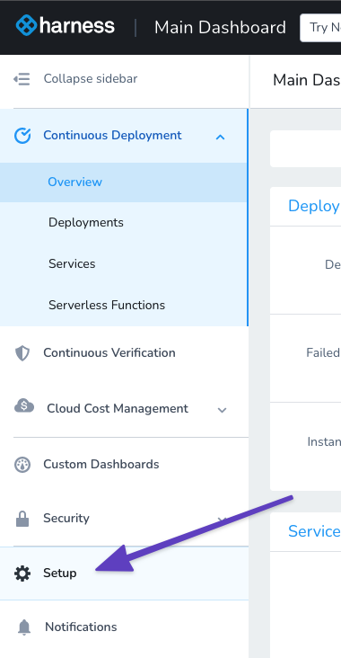
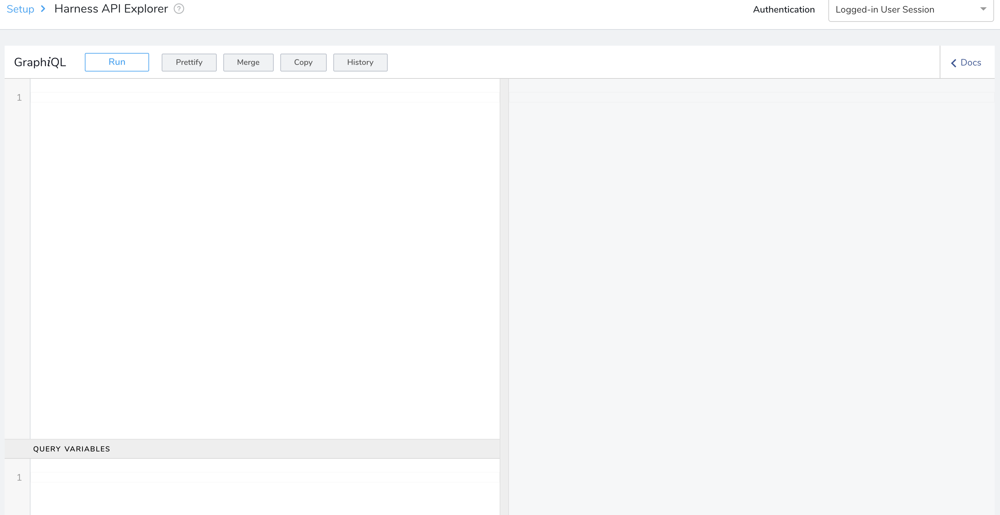
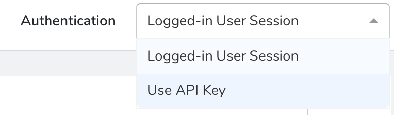
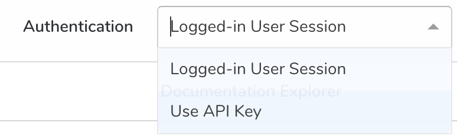
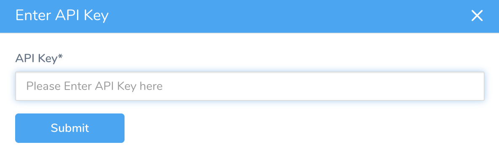
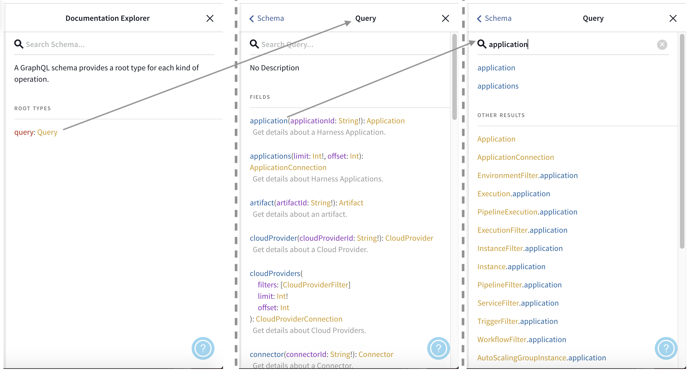
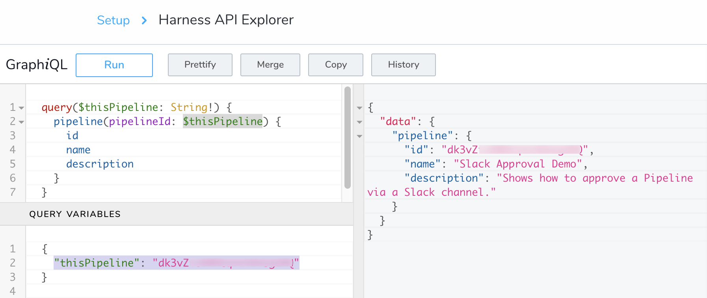

The Harness API Explorer allows you to construct and perform API queries and see their responses. You can use the Explorer to examine the API's structure, to build and test queries against your data, and to optimize your queries.

Harness' API Explorer is an instance of [GraphiQL](https://github.com/graphql/graphiql), which is a "graphical interactive in-browser GraphQL IDE."

The Harness API Explorer is intended primarily as a testing tool. When you're ready to build your queries into working code, see [Building Applications Using Postman](graph-ql-apis-for-browser-based-automation.md).

### Before You Begin

* [​Introduction to Harness GraphQL API](harness-api.md)
* [API Schema and Structure](api-schema-and-structure.md)

### Step 1: Authenticate

1. In Harness, click **Setup.**   

   

2. Click **Harness API Explorer**.

3. In **Authentication**, select **Logged-in User Session** or **Use API Key**. The authentication determines what data you can query and retrieve via the API. By default, when you launch the **API Explorer**, you authenticate using a session key.

  Authenticating with an alternative key can provide access to a different scope of data.
	
	1. **Switch Keys (Administrators)**: Members of **Account Administrator** [User Group](../../security/access-management-howtos/users-and-permissions.md#default-user-groups) can use the **Authentication** drop-down list to select a different API key from the Harness account.

	2. **Enter Keys (Non-Administrators)**: Non-administrators (with appropriate access) can perform the following steps to authenticate using an alternative API key:
		1. Obtain the key from your organization, and copy it to your clipboard, as outlined in [API Keys](../../security/access-management-howtos/api-keys.md).
    
		2. In the **API Explorer**, in **Authentication,** select **Use API Key.**
       
       

		3. Enter the **API Key**.
    
       

		4. Click **SUBMIT.** The key is now active and is displayed in the Authentication drop-down.To query the Harness API in your custom applications, your working code must pass an appropriate API Key from your Harness account as an `x-api-key` header. For more information, see [Building Applications Using Postman](graph-ql-apis-for-browser-based-automation.md).

### Step 2: Make API Calls

1. Form a call. The two types of allowed operations in Harness GraphQL API are **queries** and **mutations** (updates).  

  **Query example**:  

  ```
  query {  
    applicationByName(name: "Test App") {  
      id  
      name  
    }  
  }
  ```
  
  **Mutation example**:
  ```
  mutation createapp($app: CreateApplicationInput!) {  
    createApplication(input: $app) {  
      clientMutationId  
      application {  
        name  
        id  
      }  
    }  
  }
  ```
2. Traverse or search the schema. Click **Docs** to see the available API objects.
3. In **Docs**, click **Query** in the **Documentation Explorer** pane to see top-level API objects. Or, type field or property names into the Documentation Explorer's search box to see child properties.

4. Define variables in the **QUERY VARIABLES** pane, and call them in the query pane. In the following example, we pass the required `pipelineId` argument as a variable named `$thisPipeline`.

    
    
    The `!` following the type means that this field is *required*.Here is the revised query, incorporating the new variable:  

    ```
    query($thisPipeline: String!) {  
      pipeline(pipelineId: $thisPipeline) {  
        id  
        name  
        description  
      }  
    }
    ```
    Here is the format for passing the value in the **QUERY VARIABLES** pane:  

    ```
    {  
      "thisPipeline": "<pipelineId>"  
    }
    ```
    
5. Click **Run**. The response is displayed. Here is an example:


### Next Steps

* [Use API to Retrieve IDs by Name](use-api-to-retrieve-i-ds-by-name.md)
* [Use Cloud Providers API](use-cloud-providers-api.md)
* [Use Audit Trails API](use-audit-trails-api.md)
* [Use Workflows API](use-workflows-api.md)
* [Use Users and Groups API](sample-queries-create-users-user-groups-and-assign-permissions.md)
* [Use Harness Applications API](use-harness-applications-api.md)
* [Use Pipelines API](use-pipelines-api.md)
* [Use Services API](use-services-api.md)
* [Encrypted Text API](api-encrypted-text.md)
* [Encrypted Files API](api-encrypted-files.md)
* [SSH Credentials API](api-ssh-credentials.md)
* [WinRM Credentials API](api-win-rm-credentials.md)

