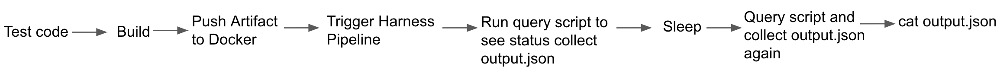

You can use automation scripts with Harness GraphQL APIs to query Harness deployment information. The gathered information can be used in Grafana Dashboards, Jenkins Pipeline scripts, or data aggregators to get high-level details about the delivery of software, development behaviors, and optimization opportunities.

Most times, when a user triggers a deployment from their CI tool, it calls on to Harness via Webhook. They expect a status result of the deployment at the end of the CI pipeline to keep the information consistent in both the platforms. One way to retrieve this information is through the GraphQL API.

This topic uses a sample automation script to collect the execution data of a Kubernetes Guestbook Application deployment from a Pipeline. The automation script allows you to retrieve the deployment information once it's completed.

## Review: Use Cases

* Use automation scripts with Harness GraphQL APIs to query Harness deployment information.
* Gather information about the execution of the latest Pipeline. Send this information to Jenkins or Splunk for auditing or tracking the status.
* Gather the deployment execution details and send them to the Grafana dashboard.

## Pre-requisites

* Harness API Key. For more information, see [API Keys](../../security/access-management-howtos/api-keys.md).
* A working query. You can test your queries in [Harness API Explorer](harness-api-explorer.md) and port it to Postman or Insomnia to test and generate the code. Then build curl commands or clients to interact with [Harness API](harness-api.md).
* CI job that calls out to Harness and triggers a deployment.

## Step 1: Fetch the Required Information

You need to fetch the following information:

* [Application ID and name](leverage-graph-ql-api-in-automation-scripts.md#request-fetch-application-id)
* [Pipeline ID of the Application](leverage-graph-ql-api-in-automation-scripts.md#request-fetch-pipeline-id)
* [Pipeline execution status based on the selected ID](leverage-graph-ql-api-in-automation-scripts.md#request-fetch-pipeline-execution-status)

Use the following query to fetch the Application ID.

This scenario is using the **Guestbook Application** as an example.

#### Request: Fetch the Application ID


```
{  
  applications(limit: 20) {  
    nodes {  
      id  
      name  
    }  
  }  
}
```
#### Response: Application ID


```
{  
  "data": {  
    "applications": {  
      "nodes": [  
        {  
          "id": "HDcOMfsNQKOBzq7LiTaXKw",  
          "name": "sampleApp"  
        },  
        {  
          "id": "XKVhkc3aQJuGZKVnRRHFwg",  
          "name": "nationwide"  
        },  
        {  
          "id": "R9QrzTNZRqCVer8Dacss3w",  
          "name": "Duck"  
        },  
        {  
          "id": "S6msRlHoQR67QSR4qFnixA",  
          "name": "GoldenCanary"  
        },  
        {  
          "id": "Set7eXETQhWrbnkWJv9YDw",  
          "name": "referenceRegulated"  
        },  
        {  
          "id": "wLluQCvhQG2MKFF0CsiZIw",  
          "name": "demo-bb"  
        },  
        {  
          "id": "TqYKzP_FQXeSao4zF3RCTg",  
          "name": "iHerb"  
        },  
        {  
          "id": "xX72aa1hRjyP3vH63wtFjA",  
          "name": "Venkat Test App"  
        },  
        {  
          "id": "Q5a-0mv0SrmvlohpoO4Z1w",  
          "name": "Blackbelt Interview"  
        },  
        {  
          "id": "HsntscW1QzqUYNYIVkoePQ",  
          "name": "TodoList "  
        },  
        {  
          "id": "mzkRCNTJTiW7NP3Zr1HgTA",  
          "name": "CloudFormation"  
        },  
        {  
          "id": "Te49-ANgQBmxfOTMTZjU-w",  
          "name": "Guestbook Application"  
        },  
        {  
          "id": "uNssxDijTtGh_4aL1XOjZA",  
          "name": "Tools-K8"  
        },  
        {  
          "id": "jne1JFlpRJGlx4YuTZzq6A",  
          "name": "WinRM"  
        },  
        {  
          "id": "AVsMVDJlTdm4gXcAhO4_KA",  
          "name": "PCF-App"  
        },  
        {  
          "id": "8bQH_vJsSYyJu0wLta98Pg",  
          "name": "Infrastructure Provisioning"  
        },  
        {  
          "id": "4Jz5HXKPT2azVjM9kk6QQg",  
          "name": "Lambda Application"  
        },  
        {  
          "id": "ZGwyDTieTvyBLsiwdHvjng",  
          "name": "Helm Application"  
        },  
        {  
          "id": "6rWOcE1oRM2fFs0d1m0n7A",  
          "name": "K8s V2 Application"  
        },  
        {  
          "id": "dMDrr7fxSlyyM9Ic3Tbf4A",  
          "name": "AMI Application"  
        }  
      ]  
    }  
  }  
}  

```
Here is the name and ID of **Guestbook Application**:


```
{  
  "id": "Te49-ANgQBmxfOTMTZjU-w",  
  "name": "Guestbook Application"  
}
```
Use this Application ID to fetch the associated Pipeline IDs.

#### Request: Fetch the Pipeline ID


```
{  
  application(applicationId: "SgF_NViyTSKf74WkhGd0ZA") {  
    pipelines(limit: 10) {  
      nodes {  
        id  
        name  
        description  
        createdBy {  
          id  
        }  
      }  
    }  
  }  
}
```
If you receive the error `Exception while fetching data (/application) : User not authorized`, it might be because you are using an entity ID other than an Application ID.#### Response: Pipeline ID


```
{  
  "data": {  
    "application": {  
      "pipelines": {  
        "nodes": [  
          {  
            "id": "-1ePdvZqTnqeSwQgOi7Iyw",  
            "name": "Rancher Guestbook Cluster Pipeline",  
            "description": "Deploying Guestbook to Dev Rancher Environment",  
            "createdBy": {  
              "id": "0kkF-d-RQBGTOQvTqrsjUQ"  
            }  
          },  
          {  
            "id": "39luUPz8RvqOwQNx6DT-WA",  
            "name": "Deploy Guestbook",  
            "description": "Deploy Guestbook Application",  
            "createdBy": {  
              "id": "0kkF-d-RQBGTOQvTqrsjUQ"  
            }  
          }  
        ]  
      }  
    }  
  }  
}
```
The following Pipelines are associated with this Application:

* Rancher Guestbook Cluster Pipeline
* Deploy Guestbook

Provide Deploy Guestbook's Pipeline ID in the following [query](leverage-graph-ql-api-in-automation-scripts.md#request-fetch-the-pipeline-execution-status):

#### Request: Fetch the Pipeline Execution Status


```
{  
  executions(  
    filters: [{ pipeline: { operator: EQUALS, values: ["39luUPz8RvqOwQNx6DT-WA"] } }]  
    limit: 1  
  ) {  
    nodes {  
      application {  
        name  
      }  
      status  
      startedAt  
    }  
  }  
}
```
#### Response: Pipeline Execution Status


```
{  
    "data": {  
        "executions": {  
            "nodes": [  
                {  
                    "application": {  
                        "name": "Guestbook Application"  
                    },  
                    "status": "SUCCESS",  
                    "startedAt": 1578992401367  
                }  
            ]  
        }  
    }  
}
```
The last Pipeline execution deployment is displayed in epoch time.

## Step 2: Build a Script

Here is a sample script that runs the curl command and allows you to check deployment status in the CI tool using an account ID (`<YOUR_ACCOUNT_ID>`) and Harness [API key](../../security/access-management-howtos/api-keys.md) (`<API_KEY>`).


```
curl 'https://app.harness.io/gateway/api/graphql?accountId=<YOUR_ACCOUNT_ID>' \  
-H 'authority: app.harness.io' \  
-H 'origin: https://app.harness.io' \  
-H 'content-type: application/json' \  
-H 'accept: */*' \  
-H 'sec-fetch-site: same-origin' \  
-H 'sec-fetch-mode: cors' \  
-H 'referer: https://app.harness.io/' \  
-H 'accept-encoding: gzip, deflate, br' \  
-H 'accept-language: en-US,en;q=0.9' \  
--header 'x-api-key:<API_KEY>' \  
--data-binary '{"query":"{userByName(name: \"John Doe\") {id name}}" }'
```
## Step 3: Use the Automation Script in Your CI Tool

You can use the automation script in your CI Tool.

1. Click **Manual Trigger** to get the curl details. For more information, see [Manual Triggers and Git Webhooks](../../../continuous-delivery/model-cd-pipeline/triggers/add-a-trigger-2.md#manual-triggers-and-git-webhooks).

2. Enter the curl Webhook payload from your Pipeline Trigger in Harness.
3. Place that Trigger into the desired step in your CI Pipeline.
4. Let your Pipeline trigger the Query Script.  
  
A result like this is displayed in your `output.json`.  
  

```
{"data":{"executions":{"nodes":[{"application":{"name":"Guestbook Application"},"status":"SUCCESS","startedAt":1579165200753}]}}}  
{"metaData":{},"resource":null,"responseMessages":[]}{"metaData":{},"resource":null,"responseMessages":[]}
```

Here is a sample CI flow:




## Gather Deployment Execution Details

Harness GraphQL API allows you to gather deployment execution details for the last twenty-four hours and pass that information in JSON format.

Leverage on this query to gather your deployment history. You can share this information with your audit and security teams. The business requirement could be:

* When did these deployments happen?
* When did they start and finish?
* What Application was deployed?
* What was the status of the deployment?


```
 executions(filters: {startTime: {operator: AFTER, value: 1579669889000}, endTime: {operator: BEFORE, value: 1579756289000}}, limit: 100, offset: 0) {  
   nodes {  
     id  
     application {  
       name  
     }  
     endedAt  
     status  
     startedAt  
     status  
   }  
 }  
}
```
You can also collect this information via a curl command:


```
curl 'https://app.harness.io/gateway/api/graphql?accountId=<YOUR_ACCOUNT_ID>' -H 'authority: app.harness.io' -H 'pragma: no-cache' -H 'cache-control: no-cache' -H 'authorization: Bearer <YOUR_TOKEN>' -H 'origin: https://app.harness.io' -H 'content-type: application/json' -H 'accept: */*' -H 'sec-fetch-site: same-origin' -H 'sec-fetch-mode: cors' -H 'referer: https://app.harness.io/' -H 'accept-encoding: gzip, deflate, br' -H 'accept-language: en-GB,en-US;q=0.9,en;q=0.8' --data-binary '{"query":"{\n  executions(filters: {startTime: {operator: AFTER, value: 1579669889000}, endTime: {operator: BEFORE, value: 1579756289000}}, limit: 100, offset: 0) {\n    nodes {\n      id\n      application {\n        name\n      }\n      endedAt\n      status\n      startedAt\n      status\n    }\n  }\n}\n","variables":null}' --compressed
```
The time values passed for this query follows Unix Time. You can use [Epoch and Unix Timestamp Conversion Tools](https://www.epochconverter.com/) to convert.

The command returns the data in JSON format that can be parsed into Splunk or any other auditing tool for business consumption. 

## Summary

This is how you can leverage on Harness GraphQL APIs to gather deployment status and collect that information in your CI tool. 

This allows the CD tool to be the source of truth for the deployment and CI tools to act as a reference. It also provides the flexibility to decouple CI and CD so that your CI pipeline isn’t dependent on a successful deployment.

