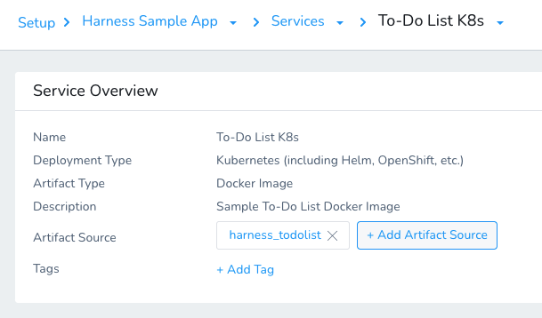
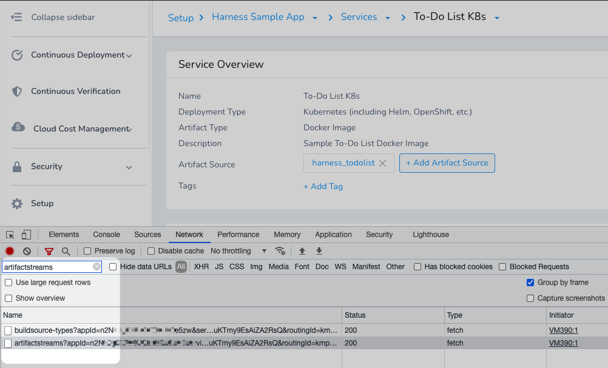
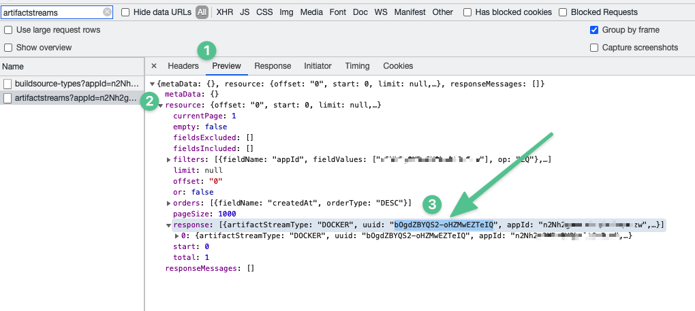

Harness performs artifact polling frequently, but in some cases you might have deleted an artifact or version from your repo as part of your Pipeline approval process and want to sync with the repo on demand.

Harness provides the `artifactCleanup()` mutation to sync the artifact versions collected by Harness with the Artifact Source you set up in your Harness Service.

The mutation remove any artifacts and versions that have been deleted at the source from Harness.

This topic describes how to use the Harness API to sync and clean up the artifact list available to you in Harness.

### Before You Begin

* [​Introduction to Harness GraphQL API](harness-api.md)
* [Harness API Explorer](harness-api-explorer.md)
* [API Schema and Structure](api-schema-and-structure.md)
* [Fetch Artifact Type Details Using GraphQL APIs](fetch-artifact-type-using-graph-ql-apis.md)
* [Fetch Deployment Artifact Information using GraphQL APIs](fetch-deployment-artifact-information.md)

### Supported Platforms and Technologies

See [Supported Platforms and Technologies](../../../starthere-firstgen/supported-platforms.md).

### Limitations

The `artifactCleanup()` GraphQL mutation works with the following [Artifact Source](../../../continuous-delivery/model-cd-pipeline/setup-services/service-types-and-artifact-sources.md) types:

* ECR
* GCR
* ACR
* Docker Registry
* JFrog Artifactory
* Nexus v2 and v3
* Amazon AMI
* Azure VMSS
* [Custom Artifact Sources](../../../continuous-delivery/model-cd-pipeline/setup-services/custom-artifact-source.md)

If you try to use the mutation on any unsupported Artifact Source types, you will see an error like this:


```
{  
  "data": {  
    "artifactCleanup": {  
      "message": "Clean up not supported for artifact Stream type: JENKINS"  
    }  
  }  
}
```
### Step 1: Obtain Artifact Stream Id

The `artifactCleanup()` mutation includes an `artifactStreamId` parameter that identifies the Artifact Source you want to sync with. The `artifactStreamId` takes the universally unique identifier (UUID) of the Artifact Source.

Let's look at how to obtain the UUID.

In Harness, open the Service with the Artifact Source you want to sync with.



In your browser, open Dev Tools. The following example is for Chrome.

Click **Network**, and select **All**.

In **Filter**, enter **artifactstreams**.

The artifact stream request is displayed.



Click the **artifactstreams?appId=...** message.

Click **Preview**, and then expand **resource**.

In response, you will see the UUID (`uuid`) for the Artifact Source.



Copy and save the UUID value.

### Step 2: Sync the Artifact Stream via API

In Harness, click **Setup**, and then click **Harness API Explorer**.

In the editor, paste the `artifactCleanup()` mutation and use the Artifact Source uuid in `artifactStreamId`. For example:


```
mutation {  
  artifactCleanup(input: {artifactStreamId: "bOgdZBYQS2-oHZMwEZTeIQ"}) {  
    message  
  }  
}
```
Click **Run**.

The output will display the successful clean up of Harness' Artifact Source history.


```
{  
  "data": {  
    "artifactCleanup": {  
      "message": "Cleanup successful for Artifact stream with id: bOgdZBYQS2-oHZMwEZTeIQ"  
    }  
  }  
}
```
