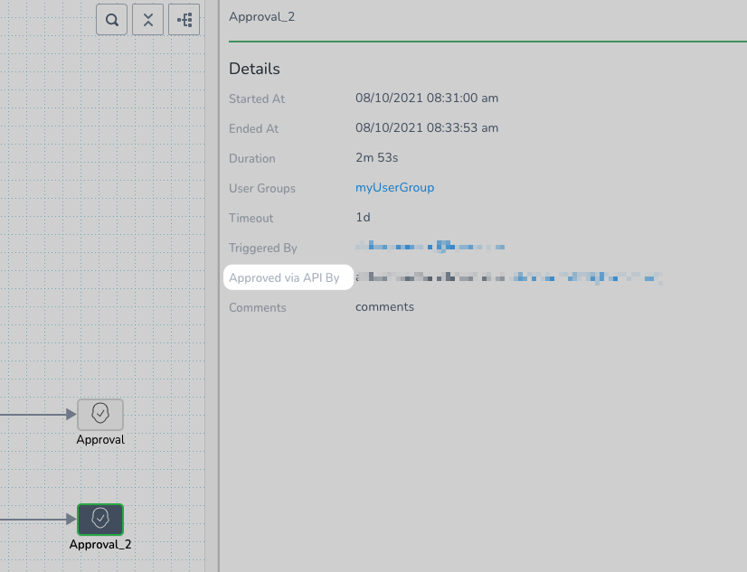

You can query for the pending Approval steps and stages of a Workflow or Pipeline using Harness `approvalDetails` GraphQL API.

Once you have found the Approval step or stage, you can use the `approveOrRejectApprovals` mutation to approve or reject it.

### Before You Begin

* [Harness UI Approvals](../../../continuous-delivery/model-cd-pipeline/approvals/approvals.md)
* [Jira Approvals](../../../continuous-delivery/model-cd-pipeline/approvals/jira-based-approvals.md)
* [ServiceNow Approvals](../../../continuous-delivery/model-cd-pipeline/approvals/service-now-ticketing-system.md)

### Supported Platforms and Technologies

See [Supported Platforms and Technologies](../../../starthere-firstgen/supported-platforms.md).

### Requirements

The `approvalDetails` GraphQL API uses the same RBAC required for the Approval step type. The API can be run using a user session or API key, as described in [Harness API Explorer](harness-api-explorer.md).

For example, if the Approval is a Harness UI Approval step, you must be a member of the User Group(s) selected as approvers for that step in order to use the API to accept/reject the step.

### Step: Get Application and Execution Ids

To use the `approvalDetails` API you need the Ids of the Application and Workflow/Pipeline execution where the approval steps/stages are located.

In the API, you will enter them like this:


```
approvalDetails(applicationId: "[Application Id]", executionId: "[execution Id]"){  
...  
}
```
You can get these Ids using the GraphQL API. See:

* [Use Harness Applications API](use-harness-applications-api.md)
* [Use Workflows API](use-workflows-api.md)
* [Use Pipelines API](use-pipelines-api.md)

Also, you can see these Ids in the URL of an execution in the Deployments page.

### Step: Query Approvals by Execution

The following example shows how to query a Workflow execution for all its Approval steps, including all of the available types (Jira, ServiceNow, Shell Script, User Group):


```
{  
  approvalDetails(applicationId: "_2rA0SO7TE-AAurQv-GiIA", executionId: "0dyqdgJ0TE2rrHII5JISGw") {  
    approvalDetails {  
      approvalId  
      approvalType  
      stepName  
      stageName  
      startedAt  
      triggeredBy {  
        name  
        email  
      }  
      willExpireAt  
      ... on UserGroupApprovalDetails {  
        approvers  
        approvalId  
        approvalType  
        stepName  
        stageName  
        startedAt  
        executionId  
        triggeredBy {  
          name  
          email  
        }  
        willExpireAt  
        variables {  
          name  
          value  
        }  
      }  
      ... on ShellScriptDetails {  
        approvalId  
        approvalType  
        retryInterval  
        stageName  
        stepName  
        startedAt  
        triggeredBy {  
          email  
          name  
        }  
        willExpireAt  
      }  
      ... on SNOWApprovalDetails {  
        approvalCondition  
        approvalId  
        approvalType  
        currentStatus  
        rejectionCondition  
        stageName  
        startedAt  
        stepName  
        ticketType  
        ticketUrl  
        triggeredBy {  
          email  
          name  
        }  
        willExpireAt  
      }  
      ... on JiraApprovalDetails {  
        approvalCondition  
        approvalId  
        approvalType  
        currentStatus  
        issueKey  
        issueUrl  
        rejectionCondition  
        stepName  
        stageName  
        startedAt  
        triggeredBy {  
          email  
          name  
        }  
        willExpireAt  
      }  
    }  
  }  
}
```
In this example, the Workflow only contains User Group Approval step (Harness UI Approvals), so the results are for Approval steps of the `USER_GROUP` type:


```
{  
  "data": {  
    "approvalDetails": {  
      "approvalDetails": [  
        {  
          "approvalId": "IyqEFWtTQSer0xcTvoy2SQ",  
          "approvalType": "USER_GROUP",  
          "stepName": "Approval_2",  
          "stageName": null,  
          "startedAt": "1628609788702",  
          "triggeredBy": {  
            "name": "john.doe@harness.io",  
            "email": "john.doe@harness.io"  
          },  
          "willExpireAt": "1628696188702",  
          "approvers": [  
            "myUserGroup"  
          ],  
          "executionId": "0dyqdgJ0TE2rrHII5JISGw",  
          "variables": null  
        },  
        {  
          "approvalId": "2AScQdfqSOCYTPdHAsXRsQ",  
          "approvalType": "USER_GROUP",  
          "stepName": "Approval",  
          "stageName": null,  
          "startedAt": "1628609788693",  
          "triggeredBy": {  
            "name": "john.doe@harness.io",  
            "email": "john.doe@harness.io"  
          },  
          "willExpireAt": "1628696188693",  
          "approvers": [  
            "Account Administrator"  
          ],  
          "executionId": "0dyqdgJ0TE2rrHII5JISGw",  
          "variables": null  
        }  
      ]  
    }  
  }  
}
```
### Step: Approve or Reject Approval

To approve or reject an Approval step, you need the Application, Execution, and Approval step Ids. The Approval step Id is displayed in the results of the `approvalDetails` query:


```
{  
  "data": {  
    "approvalDetails": {  
      "approvalDetails": [  
        {  
          "approvalId": "IyqEFWtTQSer0xcTvoy2SQ",  
          "approvalType": "USER_GROUP",  
          "stepName": "Approval_2",  
...
```
Once you have the Ids, you use the mutation approveOrRejectApprovals to approve/reject. The `approveOrRejectApprovals` mutation includes an `action` parameter where you approve/reject the step/stage.

The `action` parameter has two values:

* APPROVE
* REJECT

Here's an example:


```
mutation {  
 approveOrRejectApprovals(input: {  
  action: APPROVE  
  approvalId: "jupRo7KxTamKSJyR4BXc5A"  
  applicationId: "iDnsEHm6SH-3au-yEaeaRA"  
  comments: "Testing"  
  executionId: "p1AuqRjLTDCrbvBKuENzxQ"  
  clientMutationId: "testing"  
  })  
  {  
  success  
  clientMutationId  
  }  
}
```
If the Approval contains variables, you can provide values for the variable in the mutation using `variableInputs`:


```
mutation {  
 approveOrRejectApprovals(input: {  
  action: APPROVE  
  approvalId: "jupRo7KxTamKSJyR4BXc5A"  
  applicationId: "iDnsEHm6SH-3au-yEaeaRA"  
  comments: "Testing"  
  executionId: "p1AuqRjLTDCrbvBKuENzxQ"  
  clientMutationId: "testing"  
  variableInputs: [ {  
    name: "var1"  
    value: "var1Value"  
  },   
  {  
    name: "var2"  
    value: "var2Value"}],  
  })  
  {  
  success  
  clientMutationId  
  }  
}
```
Whether an Approval step is approved/rejected via the GraphQL API is highlighted in the Deployment details:


