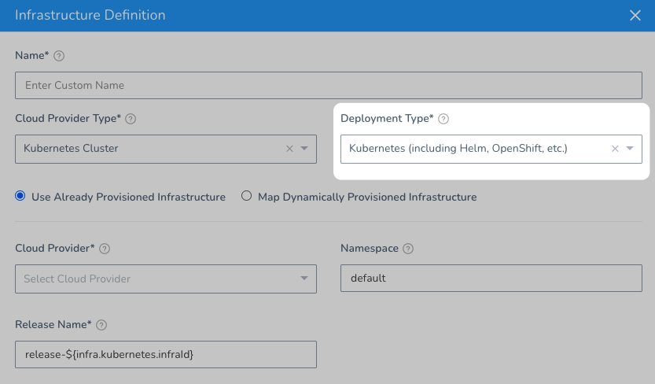

This topic lists example queries that you can execute against the Harness Infrastructure Definition API.

See [Add an Infrastructure Definition](../../../continuous-delivery/model-cd-pipeline/environments/infrastructure-definitions.md) for basic information.
### Before You Begin

* [​Introduction to Harness GraphQL API](harness-api.md)
* [Harness API Explorer](harness-api-explorer.md)
* [API Schema and Structure](api-schema-and-structure.md)

### Query Multiple Infrastructure Definitions by Deployment

Use the `deploymentType` parameter to query for all Infrastructure Definitions by their deployment type.

The deployment type is defined in the **Deployment Type** setting in an Infrastructure Definition.


For example, here's a query for Kubernetes deployment types:


```
query{  
  infrastructureDefinitions(filters:{  
    deploymentType:{  
      values:"KUBERNETES"  
      operator:EQUALS  
    }  
  }  
  limit:10  
  offset:0){  
    nodes{  
      id  
      name  
      deploymentType  
    }  
  }  
}
```
The output will look something like this:


```
{  
  "data": {  
    "infrastructureDefinitions": {  
      "nodes": [  
        {  
          "id": "72arASCuTDai7_v2hXH96A",  
          "name": "k8s-infradef-2",  
          "deploymentType": "Kubernetes"  
        },  
        {  
          "id": "cIBZ5NGFTt2RuoSjZXtexA",  
          "name": "meenakshi-gcp-k8s",  
          "deploymentType": "Kubernetes"  
        },  
        {  
          "id": "2e1HPTeTTsGBfx_xW-aE5g",  
          "name": "meenakshi-k8s-infra-def",  
          "deploymentType": "Kubernetes"  
        }  
      ]  
    }  
  }  
}
```
### Query Infrastructure Definitions by Environment ID

You can query for all the Infrastructure Definitions that belong to a Harness Environment using the Environment ID and deployment type.


```
{  
  environment(environmentId: "KMoH2VGAQ3eP2ZWE2PMOng") {  
    id  
    name  
    infrastructureDefinitions(filters: {deploymentType: {values: "KUBERNETES", operator: EQUALS}}, limit: 10, offset: 0) {  
      nodes {  
        id  
        name  
        deploymentType  
      }  
    }  
  }  
}
```
The output will look something like this:


```
{  
  "data": {  
    "environment": {  
      "id": "KMoH2VGAQ3eP2ZWE2PMOng",  
      "name": "Development",  
      "infrastructureDefinitions": {  
        "nodes": [  
          {  
            "id": "25PERz2eQvS_y6P0Zsphfw",  
            "name": "nginx-tiny-webserver",  
            "deploymentType": "Kubernetes"  
          },  
          {  
            "id": "dvIxVMQQThCz59xnQ7ZftQ",  
            "name": "nginx-multiservice",  
            "deploymentType": "Kubernetes"  
          },  
          {  
            "id": "SBj-I6vhSxm8WqCGD40AWA",  
            "name": "istio-multiservice",  
            "deploymentType": "Kubernetes"  
          }  
        ]  
      }  
    }  
  }  
}
```
### Query Infrastructure Definitions by Infrastructure Definition ID

You can simply query for an Infrastructure Definition by its ID.


```
query{  
  infrastructureDefinition(infrastructureId:"25PERz2eQvS_y6P0Zsphfw"){  
    id  
    name  
    deploymentType  
  }  
}
```
The output will look something like this:


```
{  
  "data": {  
    "infrastructureDefinition": {  
      "id": "25PERz2eQvS_y6P0Zsphfw",  
      "name": "nginx-tiny-webserver",  
      "deploymentType": "Kubernetes"  
    }  
  }  
}
```
### Query Infrastructure Definitions by Name

You can simply query for an Infrastructure Definition by name.


```
{  
  infrastructureDefinitionByName(infrastructureName: "nginx-tiny-webserver", environmentId: "KMoH2VGAQ3eP2ZWE2PMOng") {  
    id  
    name  
    deploymentType  
  }  
}
```
The output will look something like this:


```
{  
  "data": {  
    "infrastructureDefinitionByName": {  
      "id": "25PERz2eQvS_y6P0Zsphfw",  
      "name": "nginx-tiny-webserver",  
      "deploymentType": "Kubernetes"  
    }  
  }  
}
```
### See Also

* [Harness StartExecution API Deep Dive](use-harness-start-execution-api.md)

