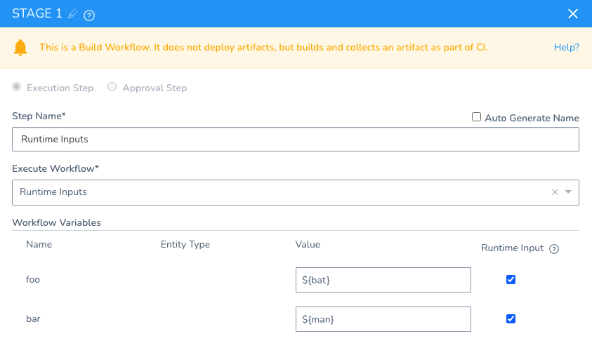
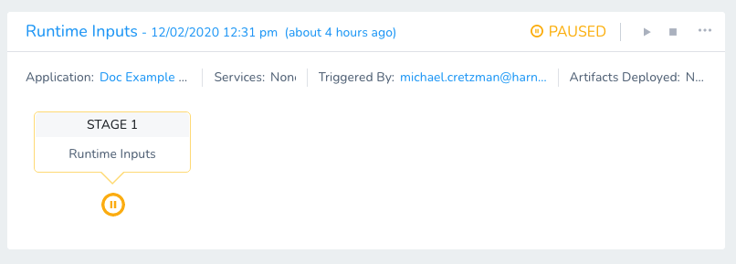

This topic lists sample queries on how to use Pipeline APIs.

## Before You Begin

* [​Introduction to Harness GraphQL API](harness-api.md)
* [Harness API Explorer](harness-api-explorer.md)
* [API Schema and Structure](api-schema-and-structure.md)

## Fetch Pipeline ID

Use this query to get `pipelineId` .

### Request


```
{  
  pipelineByName(applicationId: "-XXXXqR6QIeXXXz-VuwIzA", pipelineName: "Test Pipeline") {  
    id  
  }  
}
```
### Response


```
{  
  "data": {  
    "pipelineByName": {  
      "id": "XXyXrXusQSiK2P2M8wXXXX"  
    }  
  }  
}
```
## Show Details About a Pipeline

This example returns basic information about a specified Pipeline. It corresponds to a `GET` operation in a REST API.

### Request


```
{  
  pipeline(pipelineId: "<pipelineId>") {  
    id  
    name  
    description  
  }  
}
```
### Response


```
{  
  "data": {  
    "pipeline": {  
      "id": "XXyUrJusQSiK2P2M8wXXXX",  
      "name": "Test Pipeline",  
      "description": null  
    }  
  }  
}
```
## Fetch a List of Pipelines

This example iterates through Pipelines—using specified `limit` and `offset`values—to return basic details.

### Request


```
{  
  pipelines(limit: 5, offset: 5) {  
    nodes {  
      id  
      name  
      description  
      createdAt  
    }  
    pageInfo {  
      total  
    }  
  }  
}
```
### Response


```
{  
  "data": {  
    "pipelines": {  
      "nodes": [  
        {  
          "id": "XXXXqR6QIeXXXz-VuwIXX",  
          "name": "Test Pipeline",  
          "description": null,  
          "createdAt": 1588243374775  
        },  
        {  
          "id": "XXiHq2XXXiHt5oKq0hXxx",  
          "name": "Generate Installer Only",  
          "description": null,  
          "createdAt": 1588215490568  
        },  
        {  
          "id": "XxxXXwFDQCa2FNtzCfxxxx",  
          "name": "admin portal qa deployment",  
          "description": null,  
          "createdAt": 1586314977682  
        },  
        {  
          "id": "6XxX4YZHRDaU4auEibiXXX",  
          "name": "Admin Portal dev Deployment",  
          "description": null,  
          "createdAt": 1586254024638  
        },  
        {  
          "id": "xxxXyXm4QlOg76a19Gev1g",  
          "name": "Stress Deployment",  
          "description": "Stress Deployment",  
          "createdAt": 1584571141143  
        }  
      ],  
      "pageInfo": {  
        "total": 47  
      }  
    }  
  }  
}
```
## Show Pipelines for a Given Application

This sample queries by `applicationId` to return details about corresponding Pipelines.


```
{  
  pipelines(  
    filters: [  
      { application: { operator: EQUALS, values: ["<ApplicationID>"] } }  
    ]  
    limit: 5  
    offset: 2  
  ) {  
    nodes {  
      id  
      name  
      description  
      createdAt  
    }  
    pageInfo {  
      total  
    }  
  }  
}
```
## Show Deployments for a Given Pipeline

This sample queries by `pipelineId` to return details on up to 5 deployments.

The Environment filter works only after the Workflow execution is completed.  
  
For example, you have two Workflows in your Pipeline, `WF1: ENV1` and `WF2: ENV2`. The `ENV1` filter will work at the Pipeline level only after the `WF1` has completed the execution.
```
{  
  executions(  
    filters: [{ pipeline: { operator: EQUALS, values: ["<pipelineId>"] } }]  
    limit: 5  
  ) {  
    pageInfo {  
      total  
    }  
    nodes {  
      id  
    }  
  }  
}
```
### Example


```
{  
    executions(limit: 5, filters: [{  
        application: {  
            operator: EQUALS,  
            values: ["xXxxxU-YYaaabb1x"]  
        },  
        status: {  
            operator: NOT_IN,  
            values: ["SUCCESS", "FAILED"]  
        },  
        environment: {  
            operator: EQUALS,  
            values: "xxxyy1aa2xx-xxyyAA12aa"  
        }  
    }]) {  
        nodes {  
            application {  
                id  
                name  
            }  
            id  
            startedAt  
            status  
        }  
    }  
}
```
## Show All Execution Stages and Inputs for a Pipeline

Here is a more advanced query for Pipeline executions. It includes `runtimeInputVariables` to display any available input variables that have been selected as runtime inputs. Runtime inputs are discussed later in this topic.

Note that `pipelineExecutionId` is the execution ID for a Pipeline's deployment. It is not the Pipeline ID.

### Request


```
{  
  execution(executionId: "<pipelineExecutionId>") {  
    id  
    ... on PipelineExecution {  
      status  
      pipelineStageExecutions {  
        pipelineStageElementId  
        pipelineStageName  
        pipelineStepName  
        ... on ApprovalStageExecution {  
          approvalStepType  
          status  
        }  
        ... on WorkflowStageExecution {  
          runtimeInputVariables {  
            allowedValues  
            defaultValue  
            allowMultipleValues  
            fixed  
            name  
            required  
            type  
          }  
          status  
          workflowExecutionId  
        }  
      }  
    }  
  }  
}
```
### Response


```
{  
  "data": {  
    "execution": {  
      "id": "cExMXpGKTmaAjAVorTyNUg",  
      "status": "PAUSED",  
      "pipelineStageExecutions": [  
        {  
          "pipelineStageElementId": "Qg6qYodwT1y7aT3xebvK9g",  
          "pipelineStageName": "STAGE 1",  
          "pipelineStepName": "Dev Stage",  
          "runtimeInputVariables": null,  
          "status": "SUCCESS",  
          "workflowExecutionId": "YWjm1iBAT8WlHwfW17sS6Q"  
        },  
        {  
          "pipelineStageElementId": "Qg6qYodwT1y7aT3xebvK9g",  
          "pipelineStageName": "STAGE 1",  
          "pipelineStepName": "Dev Stage",  
          "runtimeInputVariables": null,  
          "status": "SUCCESS",  
          "workflowExecutionId": "zPAnRXXPQU6JSBMhOT5ahA"  
        },  
        {  
          "pipelineStageElementId": "vCHInJVFT6-LlDaUi_Elqg",  
          "pipelineStageName": "STAGE 2",  
          "pipelineStepName": "Approval 1",  
          "approvalStepType": "USER_GROUP",  
          "status": "SUCCESS"  
        },  
        {  
          "pipelineStageElementId": "7E1BuchaRHebaqNj3p-caA",  
          "pipelineStageName": "STAGE 2",  
          "pipelineStepName": "UAT-Stage",  
          "runtimeInputVariables": [  
            {  
              "allowedValues": null,  
              "defaultValue": null,  
              "allowMultipleValues": false,  
              "fixed": false,  
              "name": "Service",  
              "required": true,  
              "type": "Service"  
            },  
            {  
              "allowedValues": null,  
              "defaultValue": null,  
              "allowMultipleValues": true,  
              "fixed": false,  
              "name": "Infra2",  
              "required": true,  
              "type": "Infrastructure definition"  
            }  
          ],  
          "status": "PAUSED",  
          "workflowExecutionId": null  
        },  
        {  
          "pipelineStageElementId": "KniOwVT7T1C1zgoZAMKDUA",  
          "pipelineStageName": "STAGE 4",  
          "pipelineStepName": "Approval 3",  
          "approvalStepType": "USER_GROUP",  
          "status": "QUEUED"  
        },  
        {  
          "pipelineStageElementId": "0lkxhuFGTkO7uO3ahGjkRg",  
          "pipelineStageName": "STAGE 5",  
          "pipelineStepName": "Prod Stage",  
          "runtimeInputVariables": null,  
          "status": "QUEUED",  
          "workflowExecutionId": null  
        }  
      ]  
    }  
  }  
}
```
## Show Manifest as Artifact and Version for a Given Pipeline Execution

This sample queries by `serviceId` and `environmentId` to return up to 1000 deployments.

### Request


```
{  
  executions(filters: [{service: {operator: EQUALS, values: "<SERVICE_ID>"}}, {environment: {operator: EQUALS, values: "<ENV_ID>"}}], limit: 1000) {  
    nodes {  
      id  
      application {  
        id  
        name  
        tags {  
          name  
          value  
        }  
      }  
      ... on WorkflowExecution {  
        startedAt  
        endedAt  
        status  
        artifacts {  
          id  
          buildNo  
          artifactSource {  
            id  
            name  
          }  
        }  
        manifests {  
          id  
          applicationManifestId  
          createdAt  
          description  
          name  
          version  
        }  
      }  
      ... on PipelineExecution {  
        memberExecutions {  
          nodes {  
            id  
            ... on WorkflowExecution {  
              startedAt  
              endedAt  
              status  
              artifacts {  
                id  
                buildNo  
                artifactSource {  
                  id  
                  name  
                }  
              }  
              manifests {  
                id  
                applicationManifestId  
                createdAt  
                description  
                name  
                version  
              }  
            }  
          }  
        }  
      }  
    }  
  }  
}
```
### Response


```
{  
  "data": {  
    "executions": {  
      "nodes": [  
        {  
          "id": "Fo-JkFhBSNmfw0zntYBSMw",  
          "application": {  
            "id": "JywU2x9eRXKxHzbwVNpNUQ",  
            "name": "Helm Native and K8s Labs",  
            "tags": []  
          },  
          "startedAt": 1648663401775,  
          "endedAt": 1648663416827,  
          "status": "SUCCESS",  
          "artifacts": [],  
          "manifests": [  
            {  
              "id": "WPJO33aYQpa9pb2P1K_Lkw",  
              "applicationManifestId": "dTw9qQ2PRh620q_UtLugwg",  
              "createdAt": "1648510919244",  
              "description": "A Helm chart for Kubernetes",  
              "name": "nginx-with-version-page",  
              "version": "2.8.0+master-gabs"  
            }  
          ]  
        }  
      ]  
    }  
  }  
}
```
## Service Details for a Paused Pipeline


```
query {  
  runtimeExecutionInputsToResumePipeline(  
    applicationId: "AqOO-_1QRUyRuFZw_-CaGg",  
  	pipelineExecutionId: "VxB68QrIT2i7uOb7Mmlq_Q",  
  	pipelineStageElementId: "eLup2oGST62X-DxOkrtA5Q",   
  	variableInputs: [{  
    	name: "testInfra",  
    	variableValue : {  
      	type: NAME,  
      	value: "qa"  
    	}  
  	}, {  
    	name: "service",  
    	variableValue : {  
      	type: NAME,  
      	value: "demo-service"  
    	}  
  	}]) {  
    serviceInputs {  
      id,  
      name,  
      artifactSources {  
        name,  
        id,  
        artifacts(limit: 100) {  
          nodes {  
          	buildNo  
            id  
        	}  
        }  
      }  
    }  
  }  
}
```
## Find the Workflows used in a Pipeline Deployment

The following query finds the Workflows used in a Pipeline deployment:


```
{  
  executions(limit: 100, includeIndirectExecutions: true) {  
    nodes {  
      ... on PipelineExecution {  
        pipeline {  
          name  
          id  
        }  
        memberExecutions {  
          nodes {  
            ... on WorkflowExecution {  
              workflow {  
                name  
                id  
              }  
            }  
          }  
        }  
      }  
    }  
  }  
}
```
## Runtime Input Settings

Sometimes, the inputs and settings for all of the Workflows in a Pipeline are not known before you deploy. Some inputs and settings can depend on the execution of the previous stages in the Pipeline.

For example, you might have an Approval step as part of the Workflow or Pipeline. Once the approval is received, you want to resume the next stage of the Pipeline execution by providing new inputs.

To do this, when you add an Execution Step stage to your Pipeline, use **Runtime Input Settings**.

For steps on performing this in the Harness Manager UI, see [Create a Pipeline](../../../continuous-delivery/model-cd-pipeline/pipelines/pipeline-configuration.md).

### Start Execution Mutation

Let's use a simple Pipeline with one stage:


To execute this Pipeline and provide runtime inputs, the mutation is:


```
mutation {  
  startExecution(input: {  
    applicationId: "oxC_i2CWRCehwxfrabQxlA",  
  	entityId: "chkZlROZRt-Dl30olb-Mqg",  
    executionType: PIPELINE,  
    variableInputs: [  
      {  
        name: "foo",  
        variableValue: {  
          type: EXPRESSION,  
          value: "${bat}"  
        },  
        name: "bar",  
        variableValue: {  
          type: EXPRESSION,  
          value: "${man}"  
        }  
      }  
    ],  
    serviceInputs: []  
  }) {  
    execution {  
      id  
    }  
  }  
}
```
The response is the Pipeline execution ID:


```
{  
  "data": {  
    "startExecution": {  
      "execution": {  
        "id": "EFoCrXb4Qem9RE-cQSHc8g"  
      }  
    }  
  }  
}
```
And you can see that the Pipeline is started, but paused awaiting the inputs:


The `variableInputs` are not mandatory.

### Execution and Executions Query

Next, you can take the Pipeline execution ID in the response and use it to query everything about the execution:

### Request


```
query {  
  execution(executionId: "EFoCrXb4Qem9RE-cQSHc8g") {  
    id,  
    ... on PipelineExecution {  
      status,  
      pipelineStageExecutions {  
        pipelineStageElementId  
        pipelineStageName  
        pipelineStepName  
        ... on ApprovalStageExecution {  
          approvalStepType  
          status  
        }  
        ... on WorkflowStageExecution {  
          runtimeInputVariables {  
            allowedValues  
            defaultValue  
            allowMultipleValues  
            fixed  
            name  
            required  
            type  
          }  
          status  
          workflowExecutionId  
        }  
      }  
    }  
  }  
}
```
### Response


```
{  
  "data": {  
    "execution": {  
      "id": "EFoCrXb4Qem9RE-cQSHc8g",  
      "status": "PAUSED",  
      "pipelineStageExecutions": [  
        {  
          "pipelineStageElementId": "PV4i7tsQQe25_cKU3OU1CQ",  
          "pipelineStageName": "STAGE 1",  
          "pipelineStepName": "Runtime Inputs",  
          "runtimeInputVariables": [  
            {  
              "allowedValues": null,  
              "defaultValue": "",  
              "allowMultipleValues": false,  
              "fixed": false,  
              "name": "bat",  
              "required": false,  
              "type": "Text"  
            },  
            {  
              "allowedValues": null,  
              "defaultValue": "",  
              "allowMultipleValues": false,  
              "fixed": false,  
              "name": "man",  
              "required": false,  
              "type": "Text"  
            }  
          ],  
          "status": "PAUSED",  
          "workflowExecutionId": null  
        }  
      ]  
    }  
  }  
}
```
As you can see, the status is `PAUSED` because Harness is awaiting values for the runtime inputs. The [Continue Pipeline Execution Mutation](#continue_pipeline_execution_mutation) section shows how to provide those values and resume the execution.

From the above query, you need to gather the `id` and `pipelineStageElementId`. You will also need the Application ID.

### Service Variables Required Query

In most cases, you will need to collect the Service inputs for artifact sources being deployed. You can do this using `runtimeExecutionInputsToResumePipeline` and listing the inputs using `serviceInputs`:


```
query {  
  runtimeExecutionInputsToResumePipeline(  
    applicationId: "aqtcyTUSTTuNhrjkDR1UAA",  
    pipelineExecutionId: "cExMXpGKTmaAjAVorTyNUg",  
    pipelineStageElementId: "Qg6qYodwT1y7aT3xebvK9g",  
    variableInputs: [{  
    	name: "bat",  
    	variableValue : {  
      	type: NAME,  
      	value: "foo"  
    	}  
    },   
    {  
      name: "man",  
      variableValue : {  
      	type: NAME,  
      	value: "bar"  
    	}  
    }]) {  
    serviceInputs {  
      id,  
      name,  
      artifactSources {  
        name,  
        id,  
        artifacts(limit: 100) {  
          nodes {  
            buildNo  
            id  
          }  
        }  
      }  
    }  
  }  
}
```
### Continue Pipeline Execution Mutation

To resume the Pipeline that is paused awaiting runtime inputs, you use the `applicationId`, `pipelineExecutionId` of the paused execution, and the `pipelineStageElementId` of the paused Pipeline stage.

In `variableInputs`, you provide values for the inputs.

### Mutation


```
mutation {  
  pipelineResumeRuntime(input: {  
    applicationId: "oxC_i2CWRCehwxfrabQxlA",  
    pipelineExecutionId: "ShmleYqnSSa7LsU-dD2R7w",  
    pipelineStageElementId: "PV4i7tsQQe25_cKU3OU1CQ",  
    variableInputs: [{  
    	name: "bat",  
    	variableValue : {  
      	type: NAME,  
      	value: "foo"  
    	}  
  	},   
    {  
    	name: "man",  
    	variableValue : {  
      	type: NAME,  
      	value: "bar"  
    	}  
  	}],  
    serviceInputs: []  
  }) {  
    clientMutationId  
    status  
  }  
}
```
### Response

You can see the Pipeline has resumed:


```
{  
  "data": {  
    "pipelineResumeRuntime": {  
      "clientMutationId": null,  
      "status": true  
    }  
  }  
}
```
