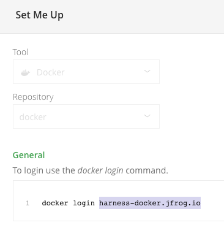

This topic provides settings and permissions for the Artifactory Artifact Servers and Sources.

### Artifactory Permissions

Make sure the following permissions are granted to the user:

* Privileged User is required to access API, whether Anonymous or a specific username (username and passwords are not mandatory).
* Read permission to all Repositories.

If used as a Docker Repo, user needs:

* List images and tags
* Pull images

See  [Managing Permissions: JFrog Artifactory User Guide](https://www.jfrog.com/confluence/display/RTF/Managing+Permissions)

### Artifact Type Support

Legend:

* **M** - Metadata. This includes Docker image and registry information. For AMI, this means AMI ID-only.
* **Blank** - Not supported.


|  |  |  |  |  |  |  |  |  |  |  |  |
| --- | --- | --- | --- | --- | --- | --- | --- | --- | --- | --- | --- |
| **Sources** | **Docker Image**(Kubernetes/Helm/TAS) | **AWS** **AMI** | **AWS CodeDeploy** | **AWS Lambda** | **JAR** | **RPM** | **TAR** | **WAR** | **ZIP** | **PCF** | **IIS** |
| Artifactory | M |  | M | M | M | M | M | M | M | M | M |

:::note 
If you are new to using Artifactory as a Docker repo, see [Getting Started with Artifactory as a Docker Registry](https://www.jfrog.com/confluence/display/RTF6X/Getting+Started+with+Artifactory+as+a+Docker+Registry) from JFrog.
:::

### Artifactory Artifact Collection and Sync

Harness artifact collection runs approximately every 2 mins.

Harness artifact deletion/sync runs approximately every 2 hours.

### Artifactory Artifact Server

The Harness Artifactory Artifact server connects your Harness account to your Artifactory artifact resources. It has the following settings.

#### Display Name

Enter a name for the Artifactory Server. This is the name you will use to identify this connection when adding an Artifact Source to a Harness Service.

#### Artifactory URL

In the **Artifactory URL** field, ensure that you enter in your base URL followed by your module name.

For most artifacts, use **https://mycompany.jfrog.io/*****module\_name***.

In some cases, you can use **https://*****server\_name*****/artifactory/*****module\_name***.

The URL really depends on how you have set up Artifactory, and whether it is local, virtual, remote, or behind a proxy.

To ensure you use the correct URL, copy it from your Artifactory settings.

See  [Repository Management](https://www.jfrog.com/confluence/display/JFROG/Repository+Management) from JFrog.

#### Credentials and Usage Scope

Enter the credentials.

For secrets and other sensitive settings, select or create a new  [Harness Encrypted Text secret](../../../security/secrets-management/use-encrypted-text-secrets.md).

Usage Scope is determined by the secret you selected.

Click **Submit**.

### Artifactory Artifact Source

The Artifactory Artifact Source has the following fields.

#### Name

You can enter a name or have Harness generate one for you automatically.

#### Use Docker Format

:::note
This option is in [TAS (PCF) Services](../../../../continuous-delivery/pcf-deployments/pcf-tutorial-overview.md) only.
:::

Select this option if your artifact is a Docker image. Selecting this option changes the remaining settings.

See the [Add Container Images for PCF Deployments](../../../../continuous-delivery/pcf-deployments/add-container-images-for-pcf-deployments.md).

#### Source Server

Select the name of the artifact source server you added in [Add Artifact Servers](../../../account/manage-connectors/configuring-artifact-server.md). The format for the cloud-based Artifactory URL is https://*company\_name*.jfrog.io/*context*. For more information, see [Pushing and Pulling Images](https://www.jfrog.com/confluence/display/RTF/Docker+Registry#DockerRegistry-PushingandPullingImages) from JFrog.

#### Repository

Select the repository where the artifact source is located. If you don't see it, the API might have timed out. Enter its name and Harness will query for it.

#### Docker Image Name

Click in **Docker Image Name** and select or enter the name of the artifact you want to deploy. By default, Harness automatically populates the field with the artifacts available from the Artifactory source server. If you don't see it, the API might have timed out. Enter its name and Harness will query for it.

#### Docker Repository Server

Enter the name of the server from the `docker login` command. For example:



If you don't see it, the API might have timed out. Enter its name and Harness will query for it.

See [Configuring Docker Repositories](https://www.jfrog.com/confluence/display/RTF/Docker+Registry#DockerRegistry-ConfiguringDockerRepositories) from JFrog for more information. It describes the URLs for local, remote, and virtual repositories.

#### Artifact Path/File Filter

For non-Docker artifacts, you specify the file path to the artifact on Artifactory. In many cases, the file name is sufficient. Ensure the file is available using either Anonymous access or the username and password you entered in the Harness Artifactory Artifact Server.

Enter the artifact path in the repository. You can use wildcards (not regex) such as `todolist/*/*.rpm`.

**Note:** The Artifactory user account you use in the Harness Artifact connector requires [Basic Authentication](https://www.jfrog.com/confluence/display/JFROG/Access+Tokens#AccessTokens-BasicAuthentication) to fetch the Artifact Path.

##### Deploying the Artifact

When you deploy your Harness Workflow, you will select the artifact version to use. Harness will display the latest 25 artifact versions.

### Expression Support for Docker Labels in Artifactory

When you use a Docker image on Artifactory as an Artifact Source for the Service, you can use the Harness expression `${artifact.label.get("<label-key>")}` to list the value of a Docker image artifact's label.

The label is identified using the label key. For example, if the Docker image has the following label:


```
"Labels": {  
    "maintainer": "NGINX Docker Maintainers"  
},
```
You can reference the label in a Workflow Shell Script step using `${artifact.label.get("maintainer")}`.

Notes:

* Both labels and values can contain dots.

