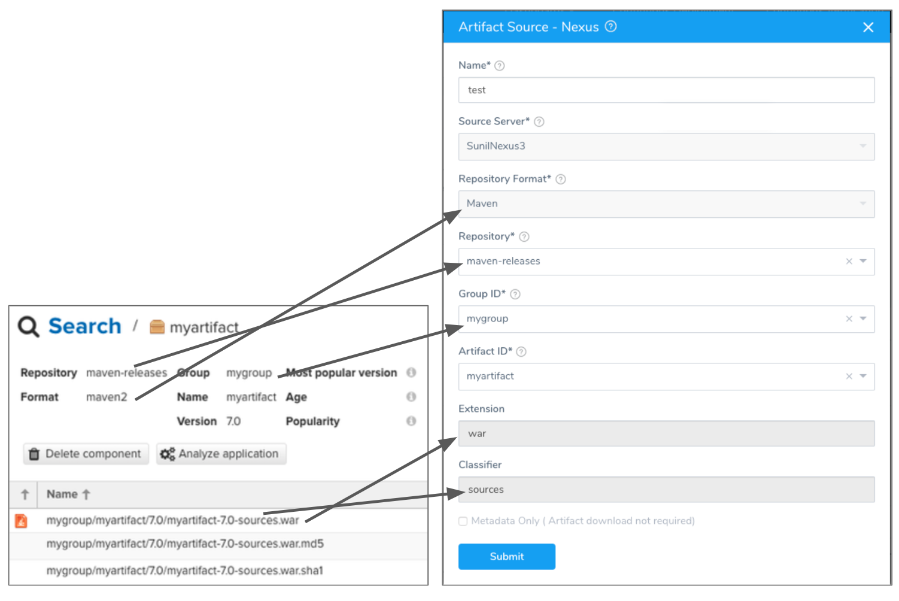
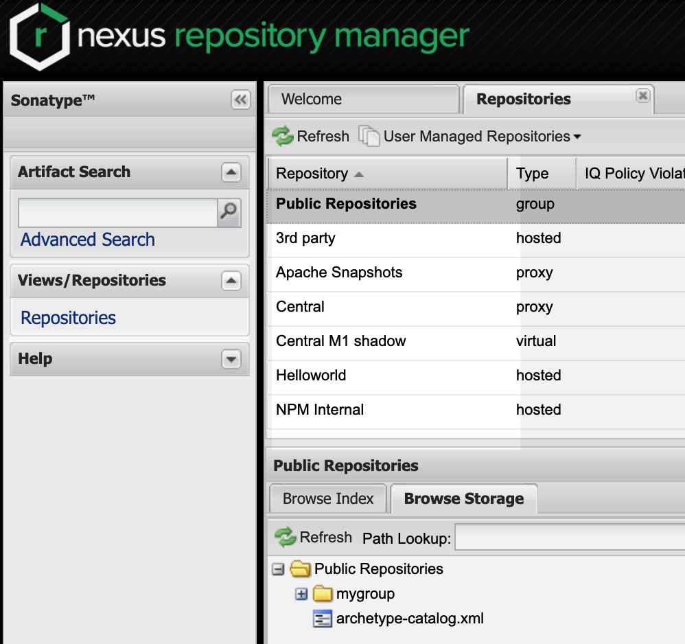
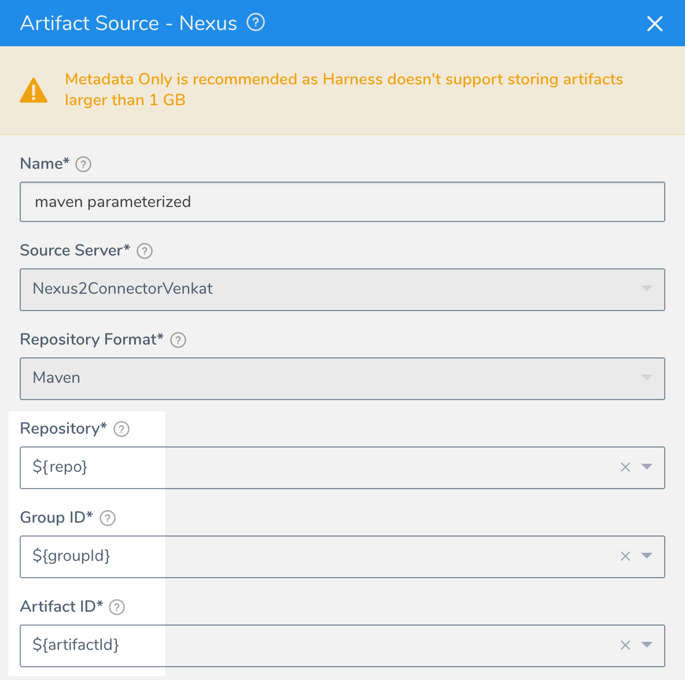
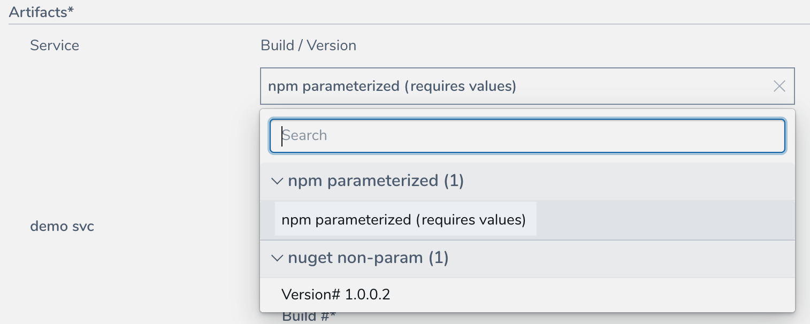
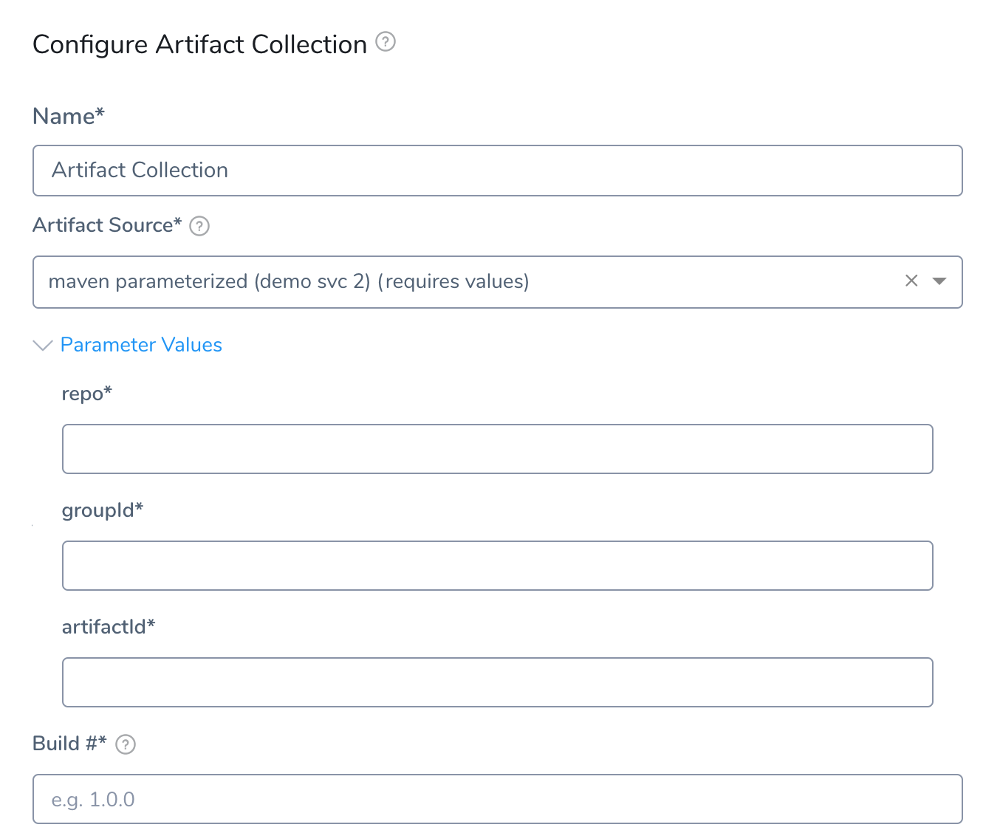

This topic provides settings and permissions for the Nexus Artifact Servers and Sources.

## Nexus Permissions

Make sure the connected user account has the following permissions in the Nexus Server.

* Repo: All repositories (Read)
* Nexus UI: Repository Browser


If used as a Docker Repo, the user needs:

* List images and tags
* Pull images

See [Nexus Managing Security](https://help.sonatype.com/display/NXRM2/Managing+Security).

## Artifact Type Support

Legend:

* **M** - Metadata. This includes Docker image and registry information. For AMI, this means AMI ID-only.
* **Blank** - Not supported.


|  |  |  |  |  |  |  |  |  |  |  |
| --- | --- | --- | --- | --- | --- | --- | --- | --- | --- | --- |
| **Docker Image**(Kubernetes/Helm) | **AWS** **AMI** | **AWS CodeDeploy** | **AWS Lambda** | **JAR** | **RPM** | **TAR** | **WAR** | **ZIP** | **PCF** | **IIS** |
| M |  | M |  | M | M | M | M | M | M | M |

:::note 
For any other types, you can use [Custom Artifact Sources](../../../../continuous-delivery/model-cd-pipeline/setup-services/custom-artifact-source.md).
:::

## Docker Support

Nexus 3 Artifact Servers only.

## Nexus Artifact Server

The Harness Nexus Artifact server connects your Harness account to your Nexus artifact resources. It has the following settings.

### Nexus URL

The URL of the Nexus server. For example, `https://nexus2.dev.mycompany.io`.

### Version

The **Version** field in the dialog lists the supported Nexus versions, 2.x and 3.x.

For Nexus 2.x, Harness supports repository formats Maven, npm, and NuGet. See Sonatype's website at [Supported Formats](https://help.sonatype.com/repomanager3/supported-formats).

For Nexus 3.x, Harness supports repository formats Docker 3.0 and greater, Maven, npm, Raw, and NuGet.

### Credentials

Enter the username and select and encrypted password.

For secrets and other sensitive settings, select or create a new [Harness Encrypted Text secret](../../../security/secrets-management/use-encrypted-text-secrets.md).

Usage Scope is determined by the secret you selected.

## Nexus Artifact Source

The settings displayed depend on the Harness Service Deployment type. For example, a Kubernetes type displays Docker settings, and can only use Nexus 3.

If you click **Artifact History** in a Harness Service**,** you will see the build history that Harness pulled from the source server.

Here is an example of the Nexus repo settings and how they are used in the Nexus Artifact Source:




### Source Server

Select the name of the artifact source server you added in [Add Artifact Servers](../../../account/manage-connectors/configuring-artifact-server.md#nexus).

### Repository Format

Select the Nexus format for your repo, such as Maven.

### Repository

Select the name of the repository where the artifact is located. If you don't see it, the API might have timed out. Enter its name and Harness will query for it.


For **Nexus 2**, you can enter a variable expression to parameterize this setting.

### Group ID

Select the repo group for your artifact. If you don't see it, the API might have timed out. Enter its name and Harness will query for it.

For **Nexus 2**, you can enter a variable expression to parameterize this setting.

:::note
If the Feature Flag `USE_NEXUS3_PRIVATE_APIS` is enabled, this field is a text field and not a drop-down. If you have a very large repo in can take a long time to load Ids. You might want to enable this Feature Flag and manually enter the Id.
:::

### Artifact ID

Select the artifact in the repository. If you don't see it, the API might have timed out. Enter its name and Harness will query for it.

For **Nexus 2**, you can enter a variable expression to parameterize this setting.

:::note
If the Feature Flag `USE_NEXUS3_PRIVATE_APIS` is enabled, this field is a text field and not a drop-down. If you have a very large repo in can take a long time to load Ids. You might want to enable this Feature Flag and manually enter the Id.
:::

### Extension

Filter the artifacts by extension, such as `war`.

### Classifier

Filter the artifact by classifier, such as `sources`.

### Docker Image Name

Click in **Docker Image Name** and select or enter the name of the artifact you want to deploy. By default, Harness automatically populates the field with the artifacts available from the source server.

### Docker Registry URL

Enter the URL for the Nexus Docker registry, known as the Docker Repository Connector in Nexus. This is the same as the domain name and port you use for `docker login hostname:port`. As a best practice, include the scheme and port, for example `https://your-repo:443`. If you cannot locate the scheme, you may omit it, for example `your-repo:18080`.

For more information, see [Docker Repository Configuration and Client Connection](https://support.sonatype.com/hc/en-us/articles/115013153887-Docker-Repository-Configuration-and-Client-Connection) and [Using Nexus 3 as Your Repository – Part 3: Docker Images](https://blog.sonatype.com/using-nexus-3-as-your-repository-part-3-docker-images) from Sonatype.

## Parameterized Nexus Settings

For **Nexus 2**, you can enter a variable expression to parameterize the following settings:

* Repository
* Group ID
* Artifact ID


When you deploy a Workflow (or Pipeline containing the Workflow) using a Service with a parameterized Nexus artifact source, you are notified that the Artifact Source requires values:


This is also true for the Artifact Collection step in a [Build Workflow](../../../../continuous-delivery/concepts-cd/deployment-types/ci-cd-with-the-build-workflow.md).


For Build Workflows, you are not prompted for artifact variables at deployment runtime because you must provide them in the Artifact Collection step.

### Switching Between Parameterized and Non-Parameterized

In some cases, you might have a non-parameterized Nexus Artifact Source and then later create a Build Workflow that uses the artifact source (via its Service).

Later, if you change the non-parameterized artifact source to parameterized, Harness does not mark the Build Workflow as incomplete.

However, when you open the **Artifact Collection** step in the Workflow, you will see the incomplete settings and will not be allowed to submit the step without providing values for them.

### Trigger cURL Command

When you create a Trigger to run a Workflow that uses a parameterized Service, the parameters are included in the Trigger cURL command. Below, two Service Nexus Artifact Source settings (`repo`, `packageName`) are parameterized in `artifactVariables`:


```
{"application":"aL_kSmMJSQSHz_-6P8ZbcQ","artifacts":[{"service":"demo svc","buildNumber":"demo svc_BUILD_NUMBER_PLACE_HOLDER","artifactVariables":{"repo":"REPO_PLACE_HOLDER","packageName":"PACKAGENAME_PLACE_HOLDER"}}]}
```
When you run the cURL command, you simply provide values for the parameterized settings.

### Harness API

You can provide values for parameterized settings when querying and executing using the Harness API.

#### Service Query


```
query{  
  service(serviceId:"ZWZ1TqvqQJKVE7Fw7beyfg") {  
    id  
    name  
    artifactSources{  
      id  
      name  
      ... on NexusArtifactSource{  
        parameters  
      }  
    }  
  }  
}
```
#### Artifact Query


```
query{  
  artifact(artifactId:"sDOTN0uhS-qFIKL1vQpKZg") {  
    id  
  	artifactSource{  
    	id  
      name  
      ... on NexusArtifactSource{  
        parameters  
      }  
    }  
    buildNo  
    collectedAt  
  }  
}
```
#### Workflow Execution Inputs

Get required inputs to start an execution of a Workflow or Pipeline.


```
query {  
  executionInputs(entityId: "JNiccn7wT3mI8xD9VAmENw"  
    applicationId: "KRCKVPsVRO-US4WT3lBIvQ"  
    executionType: WORKFLOW  
){  
  serviceInputs{  
    id  
    name  
    artifactType  
    artifactSources{  
     id  
     name  
      ... on NexusArtifactSource {   
      	parameters  
      }  
    }  
  }    
  }  
}
```
#### Workflow Execution

Here, `parameterizedArtifactSource` is used to provide values for the Artifact Source.


```
mutation {  
  startExecution (input: {  
    entityId: "JNiccn7wT3mI8xD9VAmENw"  
    applicationId: "KRCKVPsVRO-US4WT3lBIvQ"  
    executionType: WORKFLOW  
    notes: "Test deployment from graohql API"  
    clientMutationId: "123"  
    serviceInputs: [  
      {  
        name: "nexus 2 maven"  
        artifactValueInput: {  
          valueType: PARAMETERIZED_ARTIFACT_SOURCE  
          parameterizedArtifactSource: {  
            buildNumber: "1.0.0"  
            artifactSourceName: "npm params"  
            parameterValueInputs: [{  
              name:"repo"  
              value: "npm-internal"  
            },  
            {  
              name: "package"  
              value: "npm-app1"  
            }]  
          }  
        }  
      }  
    ]  
  }) {  
    clientMutationId  
    execution {  
      id  
      status  
      startedAt  
      cause {  
        __typename  
      }  
      ... on WorkflowExecution {  
        artifacts {  
          id  
        }  
      }  
    }  
  }  
}
```
#### Pipeline Execution

Here, `parameterizedArtifactSource` is used to provide values for the Artifact Source.


```
mutation {  
  startExecution (input: {  
    entityId: "xBuJSk3JQzyLfIrXMw2Z_A"  
    applicationId: "KRCKVPsVRO-US4WT3lBIvQ"  
    executionType: PIPELINE  
    notes: "Test deployment from graohql API"  
    clientMutationId: "123"  
    serviceInputs: [  
      {  
        name: "nexus 2 maven"  
        artifactValueInput: {  
          valueType: PARAMETERIZED_ARTIFACT_SOURCE  
          parameterizedArtifactSource: {  
            buildNumber: "1.0.0"  
            artifactSourceName: "npm params"  
            parameterValueInputs: [{  
              name:"repo"  
              value: "npm-internal"  
            },  
            {  
              name: "package"  
              value: "npm-app1"  
            }]  
          }  
        }  
      }  
    ]  
  }) {  
    clientMutationId  
    execution {  
      id  
      status  
      startedAt  
      cause {  
        __typename  
      }  
      ... on PipelineExecution {  
        Status  
      }  
    }  
  }  
}
```
### Rollback

If a Workflow deploying a parameterized Service fails and performs rollback, the last successfully deployed artifact is deployed.

## Notes

If you use the same parameterized Service in multiple Workflows in a Pipeline, when you deploy the Pipeline you are only prompted to provide values for the Service once.

Consequently, you cannot provide different values for the same parameter because you used the same parameterized Service twice.

