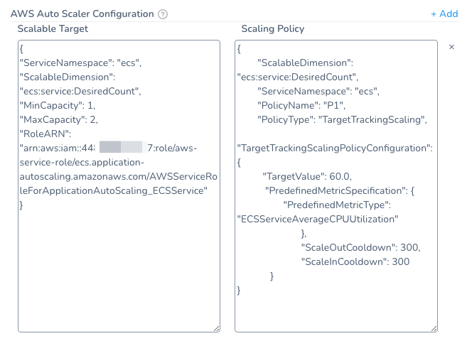

In Harness, you configure [ECS Service Auto Scaling](https://docs.aws.amazon.com/AmazonECS/latest/developerguide/service-auto-scaling.html) in the **ECS Service Setup** step of a Workflow.

1. In a Workflow with the **ECS Service Setup** step, open the **ECS Service Setup** step.
2. In **Auto Scaler Configurations**, the Auto Scaling property fields appear.

When Harness deploys your ECS service, it will register the service with ECS Service Auto Scaling to apply the scaling policy, scaling out (and in) using CloudWatch target tracking.

### Auto Scaling is added after the Last Upgrade Containers Step

By default, when you create an ECS Workflow of any supported type (Basic, Blue/Green, Canary), Harness automatically adds ECS Auto Scaling after the last **Upgrade Containers** step in the last Phase in a Workflow.

For example, in an ECS Canary Workflow, ECS Auto Scaling is added after the **Upgrade Containers** step in Phase 2.

### Upgrade Containers and Rollback Containers Steps are Dependent

In order for rollback to add ECS Auto Scaling to the previous, successful service, you must have both the **Upgrade Containers** and **Rollback Containers** steps in the same Phase.

Since ECS Auto Scaling is added by the **Upgrade Containers** step, if you delete **Upgrade Containers**, then **Rollback Containers** has no ECS Auto Scaling to roll back to.

:::note
If you want to remove ECS Auto Scaling from a Phase, delete both the **Upgrade Containers** and **Rollback Containers** steps. The Phase will no longer perform ECS Auto Scaling during deployment or rollback.
:::

### Deleting Upgrade Containers Step

If you delete the **Upgrade Containers** step from Phase 2, ECS Auto Scaling is not added because Phase 2 is missing the **Upgrade Containers** step.

To ensure that ECS Auto Scaling is applied, you can add the **Upgrade Containers** step in **Deploy Containers** to Phase 1.

:::note
* If you add the **Upgrade Containers** step to Phase 1, you must also add the **Rollback Containers** step in **Rollback Steps** of Phase 1. This ensures that ECS Auto Scaling is added to the last successful service in the case of rollback.
* Deleting **Upgrade Containers** from the last Phase of a Canary Workflow is not a good use of the Canary strategy. Instead, use a Basic Workflow strategy. See [Deployment Concepts and Strategies](../../../../continuous-delivery/concepts-cd/deployment-types/deployment-concepts-and-strategies.md).
:::

### Rollback when Auto Scaling is Enabled

See [ECS Rollbacks](ecs-rollback.md).

### See Also

* [AWS ECS Quickstart](../../../../first-gen-quickstarts/aws-ecs-deployments.md)
* [ECS Deployments Overview](../../../../continuous-delivery/aws-deployments/ecs-deployment/ecs-deployments-overview.md)
* [ECS Workflows](../../../../continuous-delivery/aws-deployments/ecs-deployment/ecs-workflows.md)
* [ECS Blue/Green Workflows](../../../../continuous-delivery/aws-deployments/ecs-deployment/ecs-blue-green-workflows.md)

