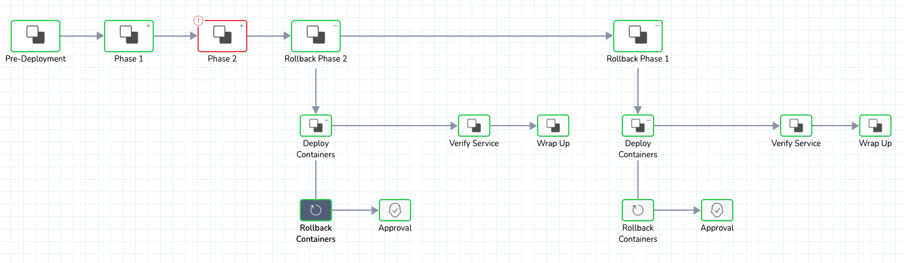
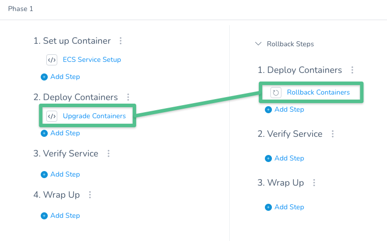
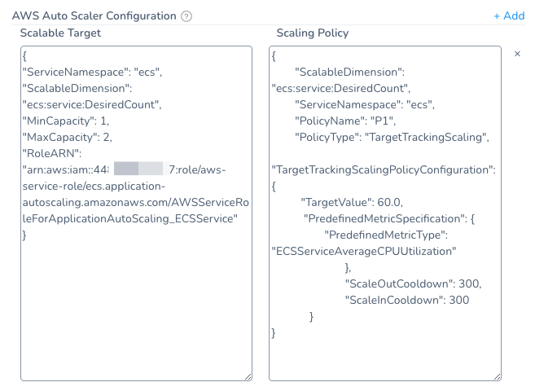

This topic describes how Harness ECS deployments perform rollback in the case of deployment failures.

For information ECS deployments, see [AWS ECS Quickstart](../../../../first-gen-quickstarts/aws-ecs-deployments.md) and [AWS ECS Deployments Overview](../../../../continuous-delivery/concepts-cd/deployment-types/aws-ecs-deployments-overview.md).

## Rollback Summary

When an ECS deployment fails, the service tasks it was deploying are scaled down to 0.

The old, working service is upscaled to its pre-setup number of tasks.

If [ECS Service Auto Scaling](https://docs.aws.amazon.com/AmazonECS/latest/developerguide/service-auto-scaling.html) is configured, it is attached to the last production service at the end of the rollback. 

ECS Auto Scaling deployment is performed by the last **Upgrade Containers** step in the Workflow. If you delete **Upgrade Containers**, no Auto Scaling is applied. Also, the **Upgrade Containers** step is dependent on the **Rollback Containers** step in the same Phase to ensure Auto Scaling is applied to the last, successful service in the case of rollback. See [Upgrade Containers and Rollback Containers Steps are Dependent](#upgrade_containers_and_rollback_containers_steps_are_dependent).For multi-phase deployments (Canary), not all Workflow Phases are rolled back at once.

Phases are rolled back in the standard, reverse order. For example, in a 2 Phase deployment with 2 Rollback Phases, the order is P1 → P2 → R2 → R1.

Phases are rolled back in this order regardless of whether ECS Service Auto Scaling is used.

### Rollback All Phases at Once

By default, not all Workflow Phases are rolled back at once.

You must select the **Rollback All Phases at Once** option in the **Rollback Containers** step to enable this method.

## Auto Scaling

Harness identifies the ECS services it deployed using the service's name when it was deployed.

Harness upscales and downsizes in two states, setup and deploy.

* **Setup** — The setup state is when your new service is created.
* **Deploy** — The deploy phase(s) is when your new service is attached to the new tasks (often called instances) and upscaled to the number of new tasks you requested. This is either a fixed setting (Min, Max, Desired) or the same number as the previous service version.

During setup state:

* The previous service is kept with non-zero task count. It is identified by its name and the highest revision number prefix, such as **\_7**. Any older services are downsized to 0.
* New service is created with 0 count.
* For old services that have 0 instances, Harness keeps the 3 last old services and deletes the rest.

During deploy phases:

* New service is upscaled to the number of new tasks you requested.
* Previous service is gradually downsized. In the case of a Canary deployment, the old service is downsized in the inverse proportion to the new service's upscale. If the new service is upscaled 25% in phase 1, the previous service is downsized 25%.

At the end of deployment:

* New service has the number of new tasks you requested. In Canary, this is always 100%.
* Previous service is downsized to 0.

### Multi-Phase Task Upscale is Incremental

When you set up a multi-phase Workflow you specify the count or percentage of tasks for each phase.

The count/percentage must be incremental. If you make a mistake and specify a lower number in a subsequent task, Harness ignores it.

For example, if you specify 25% in Phase 1 and 10% in Phase 2, Harness will deploy 25%.

### Rollback

If rollback occurs, the previous service is upscaled to its pre-setup number of instances using new instances.

See the following rollback scenarios below:

* [Post-Production Rollback](ecs-rollback.md#undefined)
* [Rollback Order in Multi-Phase Workflow](ecs-rollback.md#rollback-order-in-multi-phase-workflow)
* [Rollback when Auto Scaling is Enabled](ecs-rollback.md#rollback-when-auto-scaling-is-enabled)

### Don't Want a Previous ASG Downsized?

As stated earlier, Harness identifies the services it deploys using the Harness Infrastructure Definition used to deploy it. During deployments, Harness tags the new services with an Infrastructure Definition ID.

It uses that ID to identify the previous services version(s), and downsize them as described above.

If you do not want a previously deployed service to be downsized, then you must use a new Infrastructure Definition for future service deployments. A new service name is not enough.

## Post-Production Rollback

Harness also supports post-production rollback for cases where you want to recover from a deployment that succeeded on technical criteria, but that you want to undo for other reasons.

See [Rollback Production Deployments](../../../../continuous-delivery/model-cd-pipeline/workflows/post-deployment-rollback.md).

## Rollback Order in Multi-Phase Workflow

If you have a Workflow with two Phases, Phase 1 and Phase 1, rollback is performed in reverse order:

1. Phase 2 is rollback first.
2. Phase 1 is rolled back second.

This is the standard rollback order for all Harness multi-phase deployments.

## Upgrade Containers and Rollback Containers Steps are Dependent

In order for rollback to add ECS Auto Scaling to the previous, successful service, you must have both the **Upgrade Containers** and **Rollback Containers** steps in the same Phase.

Since ECS Auto Scaling is added by the **Upgrade Containers** step, if you delete **Upgrade Containers**, then **Rollback Containers** has no ECS Auto Scaling to roll back to.

If you want to remove ECS Auto Scaling from a Phase, delete both the **Upgrade Containers** and **Rollback Containers** steps. The Phase will no longer perform ECS Auto Scaling during deployment or rollback.

## Rollback when Auto Scaling is Enabled

In Harness, you configure [ECS Service Auto Scaling](https://docs.aws.amazon.com/AmazonECS/latest/developerguide/service-auto-scaling.html) in the **ECS Service Setup** step of a Workflow, and it is applied in the last **Upgrade Containers** step in the Workflow.

Here is the **ECS Service Setup** step where to define ECS Auto Scaling:

1. In a Workflow with the **ECS Service Setup** step, open the **ECS Service Setup** step.
2. In **Auto Scaler Configurations**, the Auto Scaling property fields appear.

When Harness deploys your ECS service, it will register the service with ECS Service Auto Scaling to apply the scaling policy, scaling out (and in) using CloudWatch target tracking.

In the event of deployment failure, ECS Auto Scaling is applied to the last successful service. This is performed by the Phase with both **Upgrade Containers** and **Rollback Containers** steps. Both steps must be present in the same Phase.In the event of deployment failure, Harness performs the following:

* By default, not all Workflow Phases are rolled back at once. You must select the **Rollback All Phases at Once** option in the **Rollback Containers** step to enable this.  
Phases are rolled back in the standard, reverse order. For example, in a 2 Phase deployment with 2 Rollback Phases, the order is P1 → P2 → R2 → R1.
* Auto scaling is attached to the old, working ECS service at the end of rollback. For example, in a 2 Phase deployment with 2 Rollback Phases (P1 → P2 → R2 → R1), auto scaling is attached to the old service after the last Rollback Phase, R1.
* The desired count of the old, working ECS service is always used regardless of the current, failed service count set in the failed deployment.

