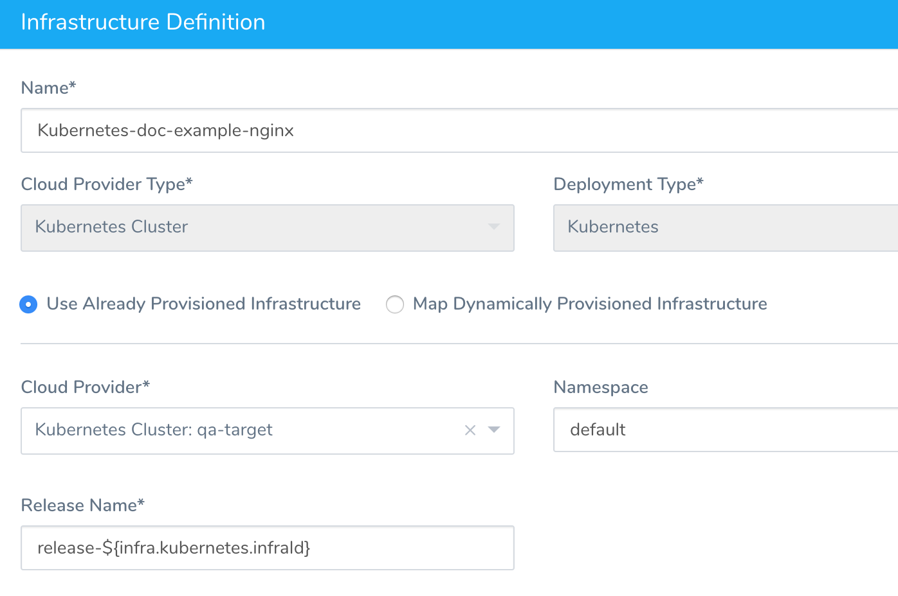
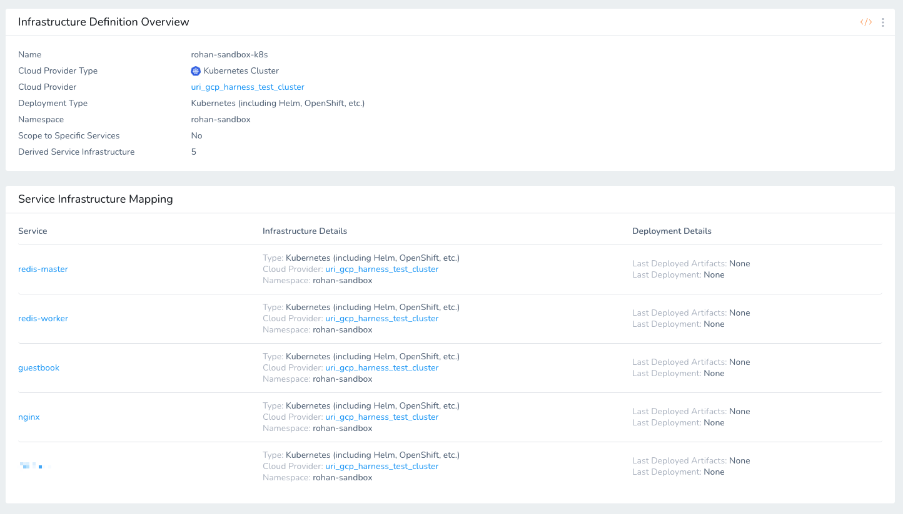

This topic covers how Harness tracks Kubernetes deployment releases, and the labels Harness applies during deployments:

* [Releases and Versioning](#releases_and_versioning)
* [Harness Annotations and Labels](#harness_annotations_and_labels)

For a list of Harness built-in expressions, see [Built-in Variables List](../../variables/built-in-variables-list.md).

## Releases and Versioning

Every Harness deployment creates a new release with an incrementally increasing number. Release history is stored in the Kubernetes cluster in a ConfigMap. This ConfigMap is essential for release tracking, versioning and rollback.

By default, all the ConfigMap and [Secrets](https://kubernetes.io/docs/concepts/configuration/secret/) resources are versioned by Harness. Corresponding references in PodSpec are also updated with versions.

You can see the use of release numbers and versioning in the **Deployments** page details:


```
INFO   2019-02-15 10:53:33    Kind                Name                                    Versioned   
INFO   2019-02-15 10:53:33    Namespace           default                                 false       
INFO   2019-02-15 10:53:33    Secret              image-pull-secret                       false       
INFO   2019-02-15 10:53:33    Secret              sample                                  true        
INFO   2019-02-15 10:53:33    Deployment          nginx-deployment                        false       
INFO   2019-02-15 10:53:33      
INFO   2019-02-15 10:53:33      
INFO   2019-02-15 10:53:33    Current release number is: 5  
INFO   2019-02-15 10:53:33      
INFO   2019-02-15 10:53:33    Previous Successful Release is 4
```

:::note
Versioning does not change how you use Secrets. You do not need to reference versions when using Secrets.
:::

For cases where versioning is not required, the manifest entered in the Harness Service Manifests section should be annotated with `harness.io/skip-versioning: "true"`.

For example. you might want to skip versioning is for an ImagePullSecret because it never changes, or for TLS certs if they are referred to in [Kubernetes container command args](https://kubernetes.io/docs/tasks/inject-data-application/define-command-argument-container/).

Harness also uses a release name for tracking releases. You can supply a release name in an Environment's [Infrastructure Definition](../../../../continuous-delivery/model-cd-pipeline/environments/infrastructure-definitions.md) **Release Name** field. By default, the value Harness uses is `release-${infra.kubernetes.infraId}`.


The `${infra.kubernetes.infraId}` expression is a unique identifier that identifies the combination of Service and Infrastructure Definition.

In the Infrastructure Definition **Service Infrastructure Mapping** below each listing has a unique identifier that can be referenced using `${infra.kubernetes.infraId}`:


For a list of Harness built-in expressions, see [Built-in Variables List](../../variables/built-in-variables-list.md). See the [Infrastructure](../../variables/built-in-variables-list.md#infrastructure) and [Kubernetes](../../variables/built-in-variables-list.md#kubernetes) sections.

### Release Name is Reserved for Internal Harness ConfigMap

The release name you enter in **Release Name** is reserved for the internal Harness ConfigMap used for tracking the deployment.

Do not create a ConfigMap that uses the same name as the release name. Your ConfigMap will override the Harness internal ConfigMap and cause a NullPointerException.

### Skipping Versioning and Rollback

Skipping versioning (using `harness.io/skip-versioning: "true"`) effects rollback.

For example, if your Kubernetes Deployment object referred to **v1** of the configMap and then you deploy the Deployment along with config changes in the configMap resulting in a **v2** configMap, and the deployment then fails:

* **With versioning:** the rollback of the deployment goes back to a version that refers to **v1**, effectively reverting your config changes.
* **Without versioning:** rollback of deployment goes to its previous revision (reverting buildNo, or other deployment information), but the reference to configMap is to a non-versioned one. The configMap was overwritten, so it now refers to the new config. If the configMap change caused the failure then rollback will also fail.

## Harness Annotations and Labels

Harness applies labels during Kubernetes deployment that you can use to select objects you defined in your Harness Service **Manifests** section. Annotations are a way to pass additional metadata for resources to Harness. For a description of Annotations, see [Annotations](https://kubernetes.io/docs/concepts/overview/working-with-objects/annotations/) from Kubernetes.

### Quotes

In both annotations and labels, **boolean strings require quotes**. For example:

`harness.io/skip-versioning: "true"`

Regular strings do not requires quotes.

### Annotations

The following Annotations can be put on resource specifications in the Harness Service **Manifests** section.

Annotation values must use quotes.

|  |  |  |
| --- | --- | --- |
| **Annotation** | **Value** | **Usage** |
| `harness.io/skip-versioning` | `"true"|"false"` | To exclude versioning of a resource (ConfigMap or Secret). |
| `harness.io/skip-file-for-deploy` | n/a | You might have manifest files for resources that you do not want to deploy as part of the main deployment.Instead, you tell Harness to ignore these files and then apply them separately using the Harness Apply step.Or you can simply ignore them until you wish to deploy them as part of the main deployment.Use `harness.io/skip-file-for-deploy` at the top of the manifest file to ignore its objects.See [Ignore a Manifest File During Deployment](../../../../continuous-delivery/kubernetes-deployments/ignore-a-manifest-file-during-deployment.md). |
| `harness.io/direct-apply` | `"true"|"false"` | If more than one workload is present in the Service **Manifests** files, use this annotation to apply an unmanaged workload.Apply an unmanaged workload by setting the annotation to `"true"`.See [Ignore a Manifest File During Deployment](../../../../continuous-delivery/kubernetes-deployments/ignore-a-manifest-file-during-deployment.md) and [Deploy Manifests Separately using Apply Step](../../../../continuous-delivery/kubernetes-deployments/deploy-manifests-separately-using-apply-step.md).Multiple workloads are supported in [Rolling Update](../../../../continuous-delivery/kubernetes-deployments/create-a-kubernetes-rolling-deployment.md) deployment strategies. Multiple workloads are not supported in [Canary](../../../../continuous-delivery/kubernetes-deployments/create-a-kubernetes-canary-deployment.md) and [Blue/Green](../../../../continuous-delivery/kubernetes-deployments/create-a-kubernetes-blue-green-deployment.md). |
| `harness.io/primary-service` | `"true"|"false"` | Identifies the primary Kubernetes service in a Blue/Green deployment. |
| `harness.io/stage-service` | `"true"|"false"` | Identifies the Kubernetes stage service in a Blue/Green deployment. |
| `harness.io/managed` | `"true"|"false"` | **Required** for Harness to identify that a DestinationRule or VirtualService is managed.This annotation is used to identify which DestinationRule or VirtualService Harness should update during traffic splitting when there are more than one.Harness requires that the managed VirtualService have only one route in the `http` list in order to know which one to update.If the DestinationRule/VirtualService uses `harness.io/managed: false`, that is the same as if `harness.io/managed` were omitted. In this case, Harness will not perform any traffic shifting.See [Set Up Kubernetes Traffic Splitting](../../../../continuous-delivery/kubernetes-deployments/set-up-kubernetes-traffic-splitting.md). |

#### Note on direct-apply

See [What Can I Deploy in Kubernetes?](what-can-i-deploy-in-kubernetes.md).

### Labels

The following labels are applied by Harness during deployment.

|  |  |  |
| --- | --- | --- |
| **Label** | **Value** | **Usage** |
| `harness.io/release-name` | `release name` | Applied on pods. Harness uses a release name for tracking releases, rollback, etc. You can supply a release name in an Environment's [Infrastructure Definition](../../../../continuous-delivery/model-cd-pipeline/environments/environment-configuration.md#add-an-infrastructure-definition) **Release Name** field.<br />By default, the value Harness uses is `release-${infra.kubernetes.infraId}`.<br /><br />Use `release-${infra.kubernetes.infraId}` for the **Release Name** instead of just `${infra.kubernetes.infraId}`. Kubernetes service and pod names follow DNS-1035 and must consist of lowercase alphanumeric characters or '-', start with an alphabetic character, and end with an alphanumeric character. Using `release-` as a prefix will prevent any issues. |
| `harness.io/track` | `canary|stable` | Applied on pods in a Canary deployment. |
| `harness.io/color` | `blue|green` | Applied on pods in a Blue/Green deployment. |

## Next Steps

* [Create a Kubernetes Blue/Green Deployment](../../../../continuous-delivery/kubernetes-deployments/create-a-kubernetes-blue-green-deployment.md)
* [Ignore a Manifest File During Deployment](../../../../continuous-delivery/kubernetes-deployments/ignore-a-manifest-file-during-deployment.md)
* [Deploy Manifests Separately using Apply Step](../../../../continuous-delivery/kubernetes-deployments/deploy-manifests-separately-using-apply-step.md)
* [Set up Kubernetes Ingress Rules](../../../../continuous-delivery/kubernetes-deployments/set-up-kubernetes-ingress-rules.md)

