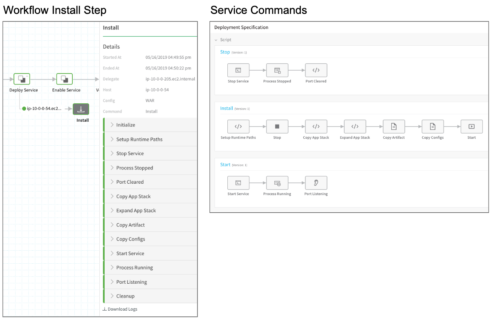
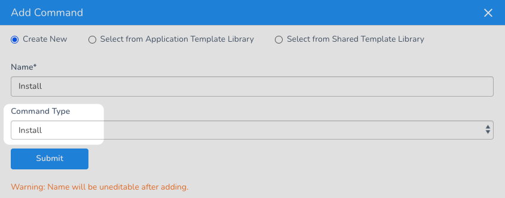
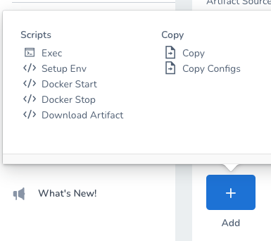

The Install step runs the command scripts in your Harness SSH and IIS Services on the target host.

### Summary

The Install step is added in the Basic Workflow as part of its **Deploy Service** section.

The Install step is used after the [Select Nodes step](select-nodes-workflow-step.md), which select the target nodes on which to run the Install step.

The following image shows the Install step in the deployed Workflow and its corresponding Service commands and scripts.

### Not Seeing the Install Step in a Workflow?

Install commands are added in a Harness SSH Service, and then used in a Harness Workflow that uses the Service.

When you create the SSH Service, you select an **Artifact Type**. For all of the non-Docker artifact types (ZIP, TAR, etc), the **Install** command is added to the Service automatically.

When that Service is used by a Workflow, the **Install** Workflow step is added automatically.

#### SSH Service with Docker Image Artifact Type

For SSH Services using the **Docker Image** artifact type, the Install command is not added. Consequently, there will be no Install step available in the Workflow using that Service.

To overcome this limitation, in the SSH Service using the Docker Image artifact type, click **Add Command**, and then select **Install** in **Command Type**.

Next, in the **Install** command you just added to the Service, click **Add**, and select a Docker script.

Now, when you use this Service to a Workflow, the **Install** step is added to the Workflow.

### Name

The default name is Install.

### Command

This setting cannot be edited.

### Timeout

You can use:

* `**w**`  for weeks
* `**d**`  for days
* `**h**`  for hours
* `**m**`  for minutes
* `**s**`  for seconds
* `**ms**` for milliseconds

### Related Reference Material

* [Select Nodes Workflow Step](select-nodes-workflow-step.md)

