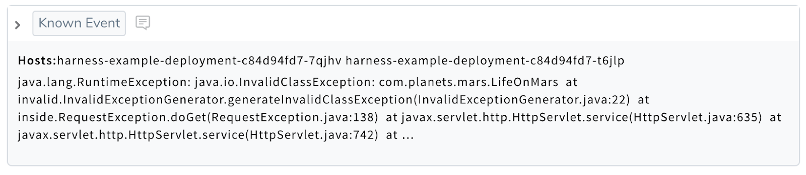
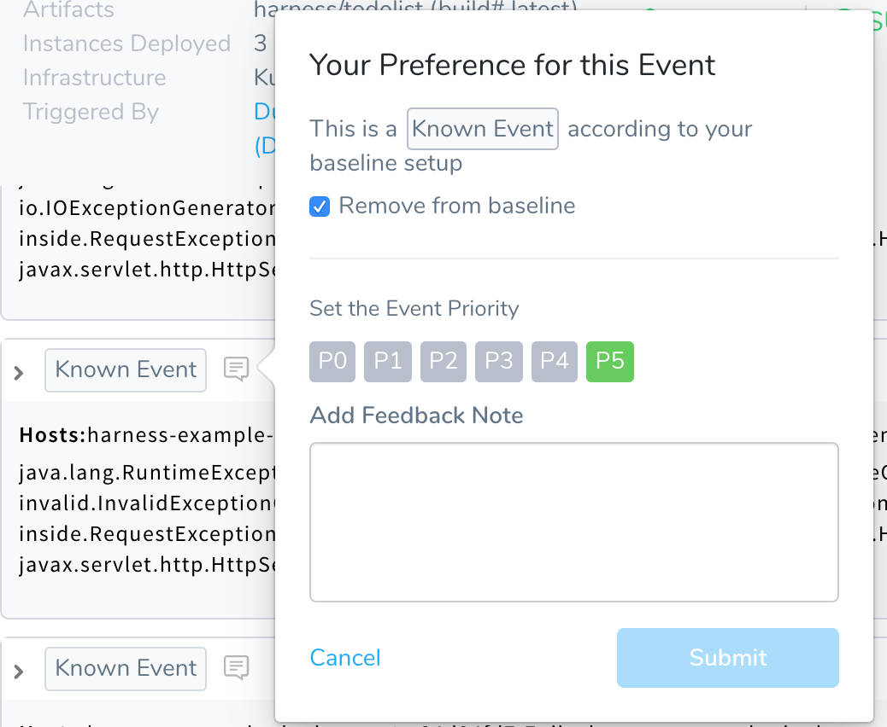
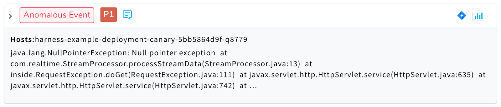
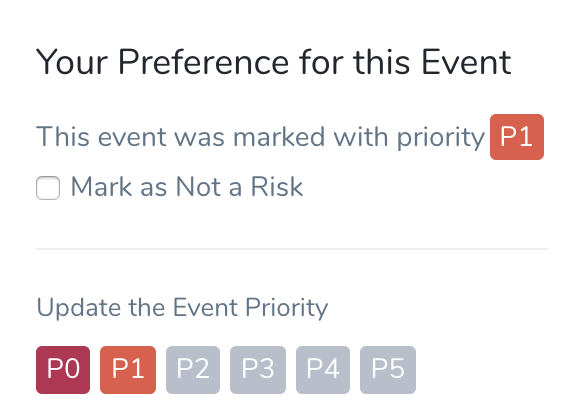
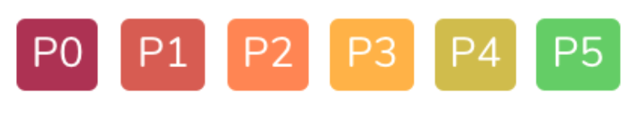
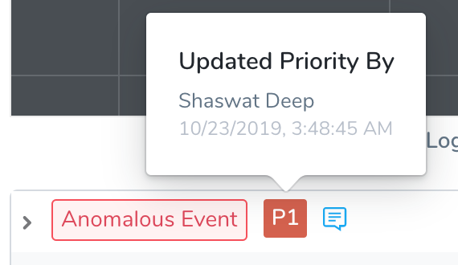

This topic covers the following classifications of verification events, and related options:

* [Known Event](verification-event-classifications.md#known-event)
* [Not a Risk](verification-event-classifications.md#not-a-risk)
* [Anomalous Events](verification-event-classifications.md#anomalous-events)
* [Priority Events](verification-event-classifications.md#priority-events)
* [Auditing Event Prioritization](verification-event-classifications.md#auditing-event-prioritization)

For an overview of verification feedback, and steps on applying and changing an event's classification, see:

* [Harness Verification Feedback Overview](../../../continuous-delivery/continuous-verification/continuous-verification-overview/concepts-cv/harness-verification-feedback-overview.md)
* [Refine 24/7 Service Guard Verification Analysis](https://harness.helpdocs.io/article/4r2a5nc6q0-refine-24-7-service-guard-verification-analysis)
* [Refine Deployment Verification Analysis](https://harness.helpdocs.io/article/gd9skrjb4g-refine-deployment-verification-analysis)
* [File Jira Tickets on Verification Events](../../../continuous-delivery/continuous-verification/tuning-tracking-verification/jira-cv-ticket.md)

## Known Event

A Known Event is a non-anomalous event from your baseline execution, as opposed to a **Not a Risk** event, which is from the current execution.

If you decide that a Known Event should fail deployments, you can remove the **Known Event** from the baseline and assign it a priority.

## Not a Risk

**Not a Risk** events are events from the current execution that are expected or that have been marked as **Not a Risk** so that they do not fail the deployment. 

**Not a Risk** means the event is in the baseline moving forward. A **Not a Risk** event from the current execution becomes a **Known Event** in subsequent executions.

In many cases, an event is labeled **Not a Risk** because a Jira ticket for the event has been created and it is being resolved.

For anticipated events that do not need a P# assignment, assign the **Not a Risk** priority to the event. The events are added to the baseline of the analysis.

You can also change a **Not a Risk** event to a P# to pull it out of the baseline for subsequent executions.

## Anomalous Events

Anomalous Events fail a deployment. Anomalous Events are events Harness has never seen before and are likely not good. You should assign a priority to the event.

## Priority Events

Priority Events fail a deployment. They range in priority from P0 to P5. 

Each priority number has a separate color associated with it:

You can change priority levels to specify the priority of the event. When you mark an even with a priority, Harness will identify the event with that priority in future analysis and fail the deployment if the event occurs.

You can assign a Jira issue for any event that has a priority assigned to it. For more information, see [File Jira Tickets on Verification Events](../../../continuous-delivery/continuous-verification/tuning-tracking-verification/jira-cv-ticket.md).If other matching events are discovered in future deployments, they will be assigned the same P#. The matching is performed by text matching with the event log data.

#### Priority Events in 24/7 Service Guard

While adding priority to events after a deployment is very useful (as described in [Refine Deployment Verification Analysis](https://harness.helpdocs.io/article/gd9skrjb4g-refine-deployment-verification-analysis)), priority events are especially useful in 24/7 Service Guard.

24/7 Service Guard monitors your live, production application or service. You can mark events that show up in the live monitoring as P0-P5 and assign Jira issues for them, thereby fixing issues as soon as they show up. This prevents issues from surfacing during your next deployment.

See:

* [Refine 24/7 Service Guard Verification Analysis](https://harness.helpdocs.io/article/4r2a5nc6q0-refine-24-7-service-guard-verification-analysis)
* [File Jira Tickets on Verification Events](../../../continuous-delivery/continuous-verification/tuning-tracking-verification/jira-cv-ticket.md)

## Auditing Event Prioritization

Event prioritization is not currently recorded in the Harness [Audit Trail](../../security/auditing-howtos/audit-trail.md), but when a Harness User changes the priority for an event, their name and the timestamp are recorded, and can be viewed by hovering over the priority.

