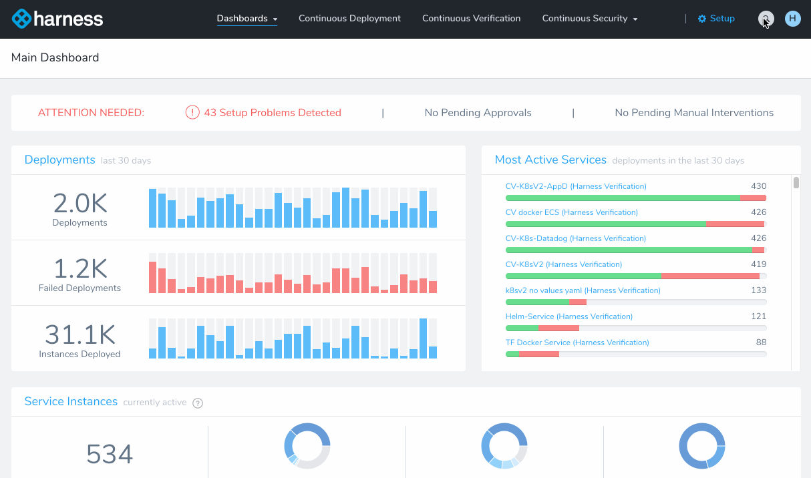
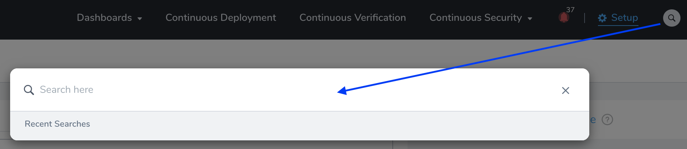
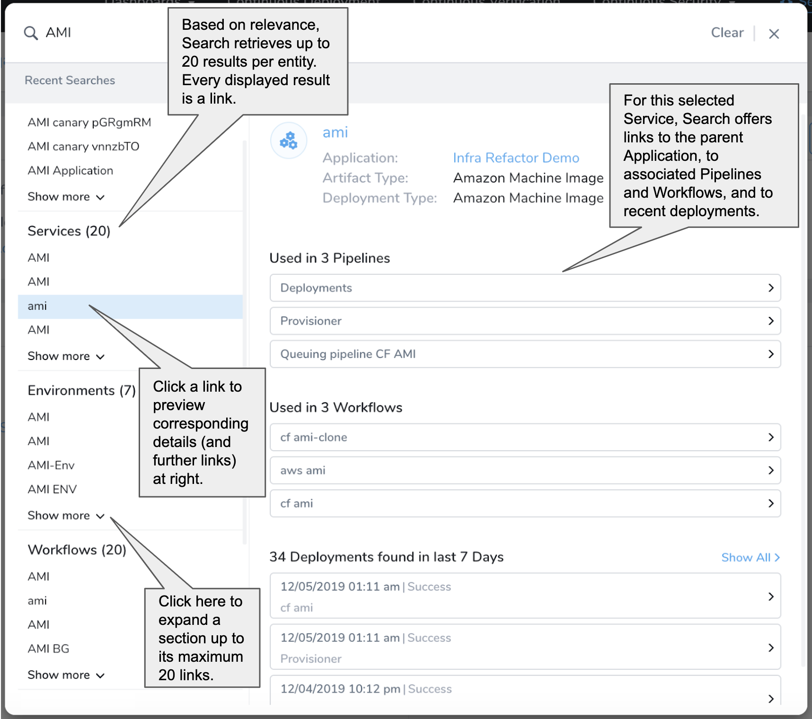
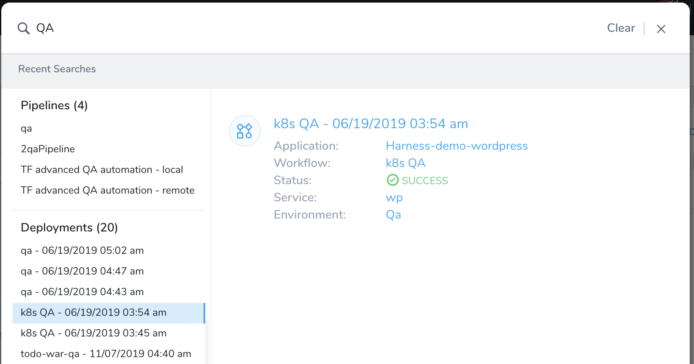
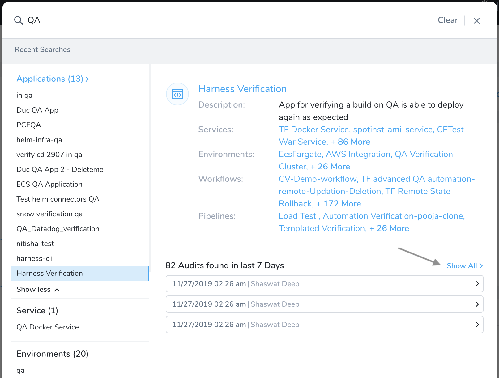
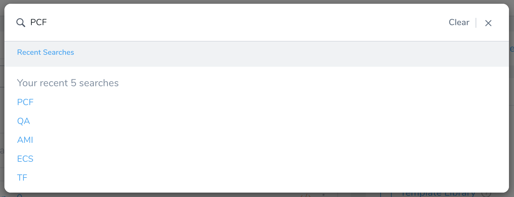

Use Harness Manager's global search to rapidly access Harness Applications, Application components, deployment history, and Audit Trails.

To begin, click the Search button (or type `/`).

Your access to search results is filtered by your User Group memberships, and by those groups' [roles and permissions](../../security/access-management-howtos/users-and-permissions.md).

### How Search Works

The search terms you enter are matched against these Harness entities:

* Applications
* Services
* Environments
* Workflows
* Pipelines
* Deployments

The Search modal's left pane displays a section for each matching entity (**Applications**, **Services**, etc.):

Within the **Deployments** section at left, each link previews a particular deployment event at right. Click the right-hand links to access the deployment's details page, or its Harness entities (**Application**, **Workflow**, etc.):

Selecting **Applications** or **Pipelines** at left can preview links to multiple related entities and [Audit Trail](../../security/auditing-howtos/audit-trail.md) events. Click **Show All** at right to access even large numbers of linked results—in this example, 82 Audits:

Audit Trail links can appear for recent setup changes to all static Harness entities. They do not appear for **Deployments**.

### Search Logic

The search terms you enter are matched against Harness entities' Name and Description fields. You can improve entities' searchability by naming them carefully, and by adding relevant keywords to their Description fields.

Harness search supports substring matching: Typing in a portion of a longer Name or Description will retrieve a matching entity.

Harness does *not* support fuzzy search logic. It will not display results or suggestions for search terms that are misspelled, or that do not exactly match strings or substrings within Name and Description fields.

To search on multiple terms, separate them with spaces. Each term that you add makes your search more restrictive: For a match, all terms must be present in the Name or Description field of the same entity.  

### Search History

Harness retains your search history during a single logged-in Harness session, as follows:

* Closing and reopening the search modal restores your previous search terms. (Click **Clear** to override this.)

* Click **Recent Searches** to open a stack of (up to) your five most recent searches. Harness maintains this stack only per session. Once you sign out and sign back in, your search history is cleared.

  

