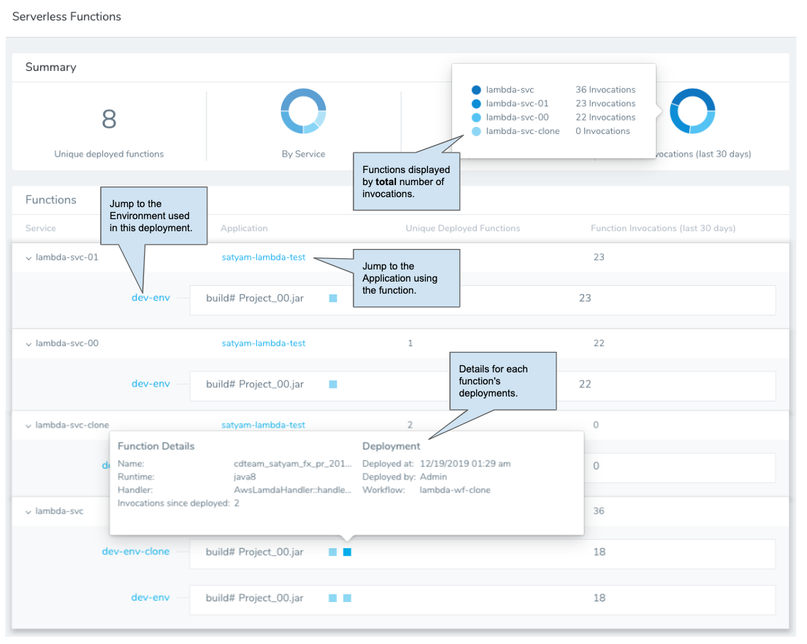
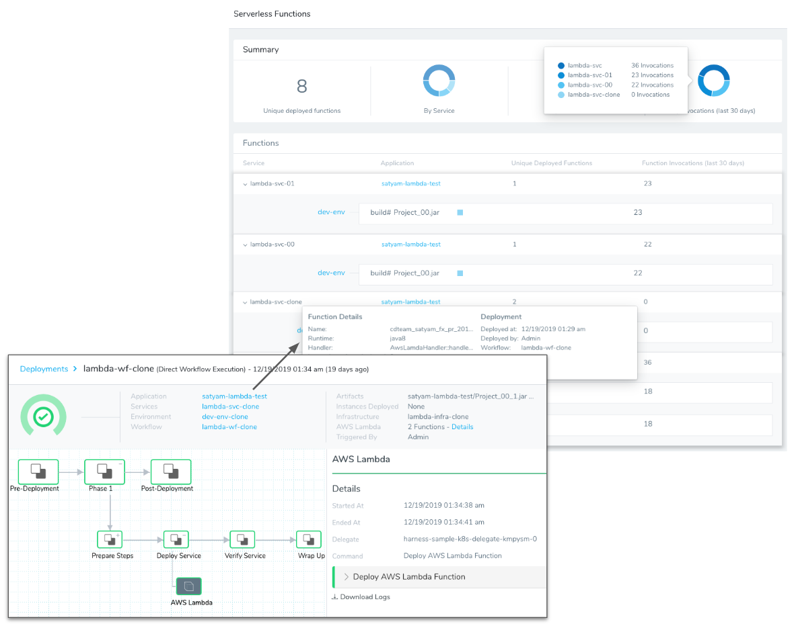

Harness Manager's Serverless Functions Dashboard offers views of your Lambda deployment data.

The dashboard provides details for each deployment, giving you a way to view accumulated deployment details quickly.

Here is an individual [Lambda deployment](../../../continuous-delivery/aws-deployments/lambda-deployments/lambda-deployment-overview.md) and how it is displayed on the Serverless Functions dashboard:

### Lambda Execution Role Policy Requirements

To see your Lambda invocations on the Serverless Dashboard, the [Execution Role](https://docs.aws.amazon.com/lambda/latest/dg/lambda-intro-execution-role.html) for the Lambda function must have the following policies:

* AmazonEC2FullAccess
* AWSLambda\_FullAccess (previously AWSLambdaFullAccess)
* AWSLambdaVPCAccessExecutionRole
* AWSLambdaRole
* CloudWatchReadOnlyAccess

The Function Invocations are updated every 10 minutes.

See [Lambda Deployment Overview](../../../continuous-delivery/aws-deployments/lambda-deployments/lambda-deployment-overview.md).

