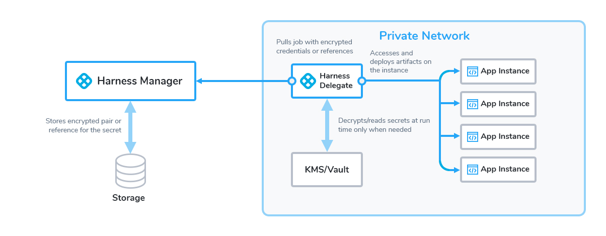

:::note 
This content is for Harness [FirstGen](../../../../get-started/harness-first-gen-vs-harness-next-gen.md). Switch to [NextGen](https://docs.harness.io).
:::

Harness sanitizes deployment logs and any script outputs to mask text secret values.

First, let's review secrets in Harness, and then look at how Harness sanitizes logs and outputs to prevent secrets from being exposed.

## Review: Secrets in Harness

:::note 
The following information is also covered in [What is Secrets Management?](../../security/secrets-management/secret-management.md).
:::

You can create secrets in Harness as described in

* [Use Encrypted Text Secrets](../../security/secrets-management/use-encrypted-text-secrets.md)
* [Use Encrypted File Secrets](../../security/secrets-management/use-encrypted-file-secrets.md)
* [Add SSH Keys](../../security/secrets-management/add-ssh-keys.md)
* [Add WinRM Connection Credentials](../../security/secrets-management/add-win-rm-connection-credentials.md)

For text and file secrets, the secrets are stored in the Secrets Manager you select for the secret, as described in [Add a Secrets Manager](../../security/secrets-management/add-a-secrets-manager.md).

Once a secret is added, you can then reference a secret in Harness Connectors and other Harness settings, such as Service specifications and commands, and scripts in a Workflow.

:::note 
You can also create text and file secrets in a Service **Configuration** section.
:::

You reference a text secret in a script using the expression `${secrets.getValue("secret_name")}`.

You can reference a file secret using the expression `${configFile.getAsBase64("secret_name")}` or `${configFile. getAsString("secret_name")}`.

At deployment runtime, the Harness Delegate uses the Secrets Manager to decrypt and read the secret only when it is needed.


Harness sends only encrypted data to the Secrets Manager, as follows: 

1. Your browser sends data over HTTPS to Harness Manager.
2. Harness Manager relays encrypted data to the Harness Delegate, also over HTTPS.
3. The Delegate exchanges a key pair with the secrets manager, over an encrypted connection.
4. The Harness Delegate uses the encrypted key and the encrypted secret, and then discards them. The keys never leave the Delegate.

:::note 
Any secrets manager requires a running Harness Delegate to encrypt and decrypt secrets. Any Delegate that references a secret requires direct access to the secrets manager.
:::

You can manage your secrets in Harness using either a Key Management Service or third party Secrets Managers.

## Sanitization

When a text secret is displayed in a deployment log, Harness substitutes the text secret value with asterisks (\*) so that the secret value is never displayed.

For example, if you have a Harness text secret named **doc-secret** containing `foo`.

You can reference it in a Workflow [Shell Script](../../../continuous-delivery/model-cd-pipeline/workflows/capture-shell-script-step-output.md) step like this:


```
echo "text secret is: " ${secrets.getValue("doc-secret")}
```
When you deploy the Workflow, the log is sanitized and the output is:


```
Executing command ...  
text secret is:  **************  
Command completed with ExitCode (0)
```
You can also reference the encrypted text used in a Service's **Config Variables** in the Workflow using the Service with the variable `${serviceVariable.var_name}`.

:::note 
File secrets are not masked in Harness logs. As noted above they can be encoded in different formats, but they are not masked from users.
:::

### Quotes and Secrets in a Script

By default, secret expressions use quotes for the secret name: `${secrets.getValue("secret_name")}`.

If the secret value itself includes quotes, either single or double, and anywhere in the secret value, you must use the opposite quote when you use the expression in a script (echo, etc).

:::danger 
If you do not use the opposite quote you will expose the secret value.
:::

Single quote example:

Here, the secret value is `'mysecret'` and the name is `secret_name`. To echo, use double quotes:

`echo "${secrets.getValue('secret_name')}"`

`echo "${secrets.getValue("secret_name")}"`

Double quote example:

Here, the secret value is `"mysecret"` and the name is `secret_name` .

`echo '${secrets.getValue('secret_name')}'`

:::danger 
Avoid using `$` in your secret value. If your secret value includes `$`, you must use single quotes when you use the expression in a script.  
For example, if your secret value is `'my$secret'` , and the name is `secret_name`, to echo, use single quotes:  
 `echo '${secrets.getValue("secret_name")}'`
:::

### Kubernetes Secret Objects

When you deploy a [Kubernetes Secret object](https://kubernetes.io/docs/concepts/configuration/secret/) using Harness, Harness substitutes the secret values with asterisks (\*).

Here is a Secret example from the manifest in the Harness Service (using Go templating):


```
{{- if .Values.dockercfg}}  
apiVersion: v1  
kind: Secret  
metadata:  
  name: {{.Values.name}}-dockercfg  
  annotations:  
    harness.io/skip-versioning: true  
data:  
  .dockercfg: {{.Values.dockercfg}}  
type: kubernetes.io/dockercfg  
---  
{{- end}}
```
Here is the deployed Secret in the log:


```
apiVersion: v1  
kind: Secret  
metadata:  
  name: harness-example  
stringData:  
  key2: '***'
```
## Changing Secrets in Scripts and RBAC

Harness log sanitizing only detects exact matches of a secret or any line of it if it is multi-line.

If an operation within a script changes the value of the secret and Harness cannot match it to the expression, the newly modified string is displayed in the output exposing the secret value.

If the modification is minor, the secret value can be easily deciphered which is a security concern.

To avoid this issue, use Harness RBAC to control which users can access a secret.

See [Restrict Secrets Usage](../../security/secrets-management/restrict-secrets-usage.md).

## Log Sanitizer Detects Exact Matches Only

The log sanitizer detects only exact matches of the secret or any line of the secret if the secret is multiline.

## Secrets 3 Character Minimum

The log sanitizer only works on secrets that are three characters or longer.

If the secret value is `ab`, then the log will show:


```
Executing command ...  
text secret is:  ab  
Command completed with ExitCode (0)
```
