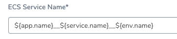
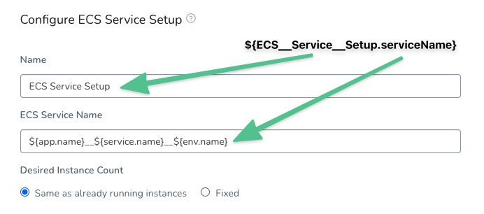
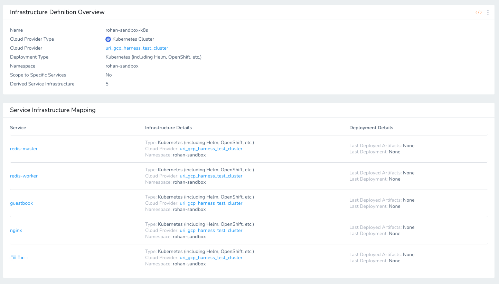

The following lists describes the default (built-in) Harness expressions, as well as the prefixes used to identify user-created variables. This list will be periodically updated when new expressions are added to Harness.

For information on how Harness uses built-in variable expressions, see [What is a Harness Variable Expression?](variables.md).

### Application

`${app.name}`

* Harness Application name.

`${app.description}`

* Harness Application description.

`${app.accountId}`

* The Application account ID. See `${env.accountId}` below.

### Service

For deployment information, see [Deployments](#deployments).`${service.name}`

* Harness Service name.

`${service.description}`

* Harness Service description.

`${artifact.serviceIds}`

* The ID of the artifact source set up in the Harness Service. For example, `[J9xRo2udQ0KktSzghvhQ5w]`.
* You can remove the brackets from the value like this  
`export serviceId=`echo ${artifact.serviceIds} | awk ‘{ gsub(/\[/,“”); gsub(/]/, “”); print $1 }’``

### Service Config Variables

`${serviceVariable.your_var_name}`

* Replace `your_var_name` to reference any variable created in a Service in the current Application.
* For example, you could add a Shell Script command to a Workflow that references the variable `${serviceVariable.productName}`, created in a Service used by the Workflow.
* For most Service types, Harness uses Service Config Variables to create environment variables on the target hosts at deployment runtime.

See [Add Service Config Variables](../../../continuous-delivery/model-cd-pipeline/setup-services/add-service-level-config-variables.md).

### Environment

:::note 
For deployment information, see [Deployments](#deployments).`${env.name}`
:::

* Harness Environment name.

`${env.description}`

* Harness Environment description.

`${env.environmentType}`

* Harness Environment type. Evaluates to `PROD` or `NON_PROD`.

`${serviceVariable.override_var_name}`

* References Service configuration overrides at the Environment level.
	+ See [Override a Service Configuration in an Environment](../../../continuous-delivery/model-cd-pipeline/environments/override-service-files-and-variables-in-environments.md).
* You can also create a Harness Environment-level variable that is not set in a Service, but is available in any Workflow using the Environment.
	+ See [Create Environment-level Variables and Files for All Services](../../../continuous-delivery/model-cd-pipeline/environments/environment-level-variables-for-all-services.md).

`${environmentVariable.variable_name}`

* References a Service Override Variable set in an Environment when **All Services** is selected.  
To reference the Service Override Variable for a specific Service, use `${serviceVariable.override_var_name}`.
	+ See [Create Environment-level Variables and Files for All Services](../../../continuous-delivery/model-cd-pipeline/environments/environment-level-variables-for-all-services.md).

`${env.accountId}`

* The Harness account ID where the Environment is set up.

`${env.keywords}`

* Lists Environment name followed by type, all listed in lowercase.

### Infrastructure

For deployment information, see [Deployments](#deployments).`${infra.name}`

* The name of the Harness Infrastructure Definition used by the Workflow or Workflow Phase.

`${infra.kubernetes.namespace}`

* The namespace for the Kubernetes cluster where the microservice/app is deployed.

`${infra.route}`

* A route where the app is deployed. In a Blue/Green deployment, this is the Green, or production, address.

`${infra.tempRoute}`

* A temporary route where the app is deployed. In a Blue/Green deployment, this is the Blue, or old, address.

`${infra.cloudProvider.name}`

* Name of the Harness Cloud Provider selected in the Infrastructure Definition used by the Workflow.

### Workflow

See [Set Workflow Variables](../../../continuous-delivery/model-cd-pipeline/workflows/add-workflow-variables-new-template.md).

:::note 
For deployment information, see [Deployments](#deployments).`${env.name}`
:::

* Harness Workflow name and the timestamp when the Workflow is deploying.
* For example, if the Workflow is named **SSH**, the `${workflow.displayName}` would display something like this: `SSH - 02/27/2020 10:07 PM`.

`${workflow.description}`

* Workflow description.

`${workflow.releaseNo}`

* The count of deployments for this Workflow.

`${workflow.lastGoodReleaseNo}`

* The count of the last successful deployment of this Workflow.

`${workflow.lastGoodDeploymentDisplayName}`

* The display name of the last successful deployment of this Workflow.

`${workflow.pipelineDeploymentUuid}`

* The unique ID for the execution of the Pipeline deploying this Workflow.
* This variable expression is used in a Workflow and displays the unique ID of the Pipeline that deploys the Workflow. When the Workflow is run by itself, and not in a Pipeline deployment, this variable expression will output null.

`${workflow.pipelineResumeUuid}`

* Original execution ID of a resumed Pipeline execution. See [Resume Pipeline Deployments](../../../continuous-delivery/concepts-cd/deployments-overview/resume-a-pipeline-deployment.md).
* This variable expression is used in a Workflow and displays the unique ID of the Pipeline that deploys the Workflow. When the Workflow is run by itself, and not in a Pipeline deployment, this variable expression will output null.

`${workflow.startTs}`

* Date and time when the Workflow execution started in Unix epoch time.

`${workflow.variables.var_name}`

* References to variables created in a Workflow's **Workflow Variables** section.
* See [Set Workflow Variables](../../../continuous-delivery/model-cd-pipeline/workflows/add-workflow-variables-new-template.md) and [Passing Variables into Workflows and Pipelines from Triggers](../../../continuous-delivery/model-cd-pipeline/expressions/passing-variable-into-workflows.md).

### Shell Script Workflow Step

`${context.published_name.var_name}`

* The published output variable name created by a Workflow Shell Script step. For more information, see [Using the Shell Script Step](../../../continuous-delivery/model-cd-pipeline/workflows/capture-shell-script-step-output.md).

### Pipelines

:::note 
For deployment information, see [Deployments](#deployments).`${env.name}`
:::

* See `${workflow.pipelineDeploymentUuid}` above.
* See `${workflow.pipelineResumeUuid}` above.

`${pipeline.name}`

* Name of the pipeline.

### Deployments

`${deploymentUrl}`

* The URL of the deployment in the Harness Deployments page.

### Steps

`${currentStep.name}`

* Name of the current step name in the Harness Deployments.

`${currentStep.type}`

* Type of the current step in the Harness Deployments.

### Trigger

`${deploymentTriggeredBy}`

* Name of the Harness user that triggered the execution of the Workflow or Pipeline deployment.

### Artifact

:::danger
If an artifact expression is used in a Workflow step, you will be prompted to select an artifact. This is true even if the Workflow does not deploy an artifact (such as a Build Workflow or a Workflow performing a [kustomize deployment](../../../continuous-delivery/kubernetes-deployments/use-kustomize-for-kubernetes-deployments.md)). If you want to reference an artifact that isn't the primary deployment artifact without being prompted, you can use an expression with quotes, like `docker pull ${artifact${".metadata.image"}}`.
:::

:::note 
You cannot access artifact metadata in a Build Workflow because Build Workflows do not use a Harness Service. See [CI/CD with the Build Workflow](../../../continuous-delivery/concepts-cd/deployment-types/ci-cd-with-the-build-workflow.md).`${artifact.displayName}`
:::

* Display name of an artifact used by a Service.

`${artifact.description}`

* Description of artifact.

`${artifact.buildNo}`

* Build number of the artifact. It is Job Number for Jenkins, Tag Name for Docker, Artifact File name for Artifactory, and Version number for Nexus.
* For AWS AMI, it is the name of the build.
* You can extract the build number from the `artifact.fileName` variable using a JEXL expression like this:


```
echo "buildNo = ${regex.extract("v[0-9]+.[0-9]+", artifact.fileName)}"
```
`${artifact.fileName}`

* The full file name of the artifact used in the deployment.
* You can extract the build number from the `artifact.fileName` variable using a JEXL expression like this:


```
echo "buildNo = ${regex.extract("v[0-9]+.[0-9]+", artifact.fileName)}"
```
`${artifact.label.get("<label-key>")}`

* Lists the value of a Docker image artifact's label. The label is identified using the label key. For example, if the Docker image has the following label:


```
"Labels": {  
    "maintainer": "NGINX Docker Maintainers"  
},
```
You can reference the label in a Workflow Shell Script step using `${artifact.label.get("maintainer")}`.

Notes:

* The key value format example `${artifact.label.get("<label-key>")}` has the placeholder character `<`. Bash will throw an unexpected token error if you use the `<`. Ensure that label values do not have unexpected tokens.
* Both labels and values can contain dots.

`${artifact.revision}`

* Artifact revision is available only if the artifact source is set up with build servers like Jenkins, Bamboo, etc. Artifact sources like Nexus or Artifactory would not have the revision details.
* For AWS AMI, it is the AMI ID, for example: `ami-0ff62736444c74a47`.

`ARTIFACT_FILE_NAME`

* The file name of the artifact attached to a Service.

`${artifact.metadata.image}`

:::note 
You cannot access artifact metadata in a Build Workflow because Build Workflows do not use a Harness Service. See [CI/CD with the Build Workflow](../../../continuous-delivery/concepts-cd/deployment-types/ci-cd-with-the-build-workflow.md).
:::

* Available for Docker images' Artifact Sources in Services. For example, if you used a publicly available Docker Hub NGINX image as the Artifact Source for a Service, then when the Service is deployed, the expression output would be `registry.hub.docker.com/library/nginx:stable-perl` at runtime.

`${artifact.metadata.tag}`

:::note
You cannot access artifact metadata in a Build Workflow because Build Workflows do not use a Harness Service. See [CI/CD with the Build Workflow](../../../continuous-delivery/concepts-cd/deployment-types/ci-cd-with-the-build-workflow.md).
:::


* Access tags associated with an artifact, such as AMI tags. For example, if an AMI used the tag `harness`, you would use: `${artifact.metadata.harness}`.

`${artifact.metadata.artifactId}`

* The ID of the artifact. What this contains depends on the repository platform.

`${artifact.metadata.repositoryName}`

* The name of the repository where this artifact is pulled from.

`${artifact.metadata.groupId}`

* The ID of the group (such as a Nexus group ID). What this contains depends on the repository platform.

`${artifact.source.dockerconfig}`

* Base64 representation of your Docker credentials. See [Inspecting the Secret regcred](https://kubernetes.io/docs/tasks/configure-pod-container/pull-image-private-registry/#inspecting-the-secret-regcred) from Kubernetes.

`${artifact.bucketName}`

* Name of the bucket on the artifact server where the artifact is located. For example, an S3 bucket.

`${artifact.key}`

* The unique key that is used to identify the artifact in the artifact source, such as in AWS S3.

`${artifact.url}`

* The URL to download the artifact from the artifact server.

`${artifact.buildFullDisplayName}`

* The full name of the artifact file.

`${artifact.artifactPath}`

* The path to the location of the artifact on the artifact server.

`${artifact.source.username}`

* The artifact source user-name key.

`${artifact.source.registryUrl}`

* The artifact source registry URL key.

`${artifact.source.repositoryName}`

* The artifact source repository name key.

`${artifact.metadata.getSHA()}`

* The SHA for Docker images.

### Artifact Rollback Variables

The following expressions will output information on the artifact used for the deployment rollback.

For example, if you added a Shell Script step and included both `${artifact.displayName}` and `${rollbackArtifact.description}`, you would get the name of the artifact being deployed and the artifact that will be used in case of rollback:

* If `${artifact.displayName}` gave you: `harness/todolist-sample_11_0702794`
* Then `${rollbackArtifact.description}` would give you the previous release, that will be used in case of rollback: `harness/todolist-sample_10_0702581`

Harness pulls rollback artifact information from last successful deployment. If there's no previous, successful deployment, then the rollback artifact will return null.

Review the artifact variables above for definitions of each variable.

* `${rollbackArtifact.bucketName}`
* `${rollbackArtifact.buildNo}`
* `${rollbackArtifact.buildFullDisplayName}`
* `${rollbackArtifact.ArtifactPath}`
* `${rollbackArtifact.description}`
* `${rollbackArtifact.displayName}`
* `${rollbackArtifact.fileName}`
* `${rollbackArtifact.key}`
* `${rollbackArtifact.metadata.image}`
* `${rollbackArtifact.metadata.tag}`
* `${rollbackArtifact.source.registryUrl}`
* `${rollbackArtifact.url}`

### Instance

A few things to remember when using instance variable expressions:

* Only use instance variable expressions at points in the Workflow where instances are identifiable.  
For example, in a pre-deployment phase, the target instances are not known. In cases where Harness is creating instances, such as an AWS AMI/ASG deployment, the instances are not known until after they created.
* If you use an instance variable expression in a script, the script is forked and executed once for each instance.
* If you select the **Execute on Delegate** option in a Workflow step, such as the [Shell Script](../../../continuous-delivery/model-cd-pipeline/workflows/capture-shell-script-step-output.md) step, `${instance.<name>}` variables do not work. The Delegate is not a target instance.

#### How is Instance Determined in Different Platforms?

Instance expressions evaluate to different information depending on the target platform.

##### Kubernetes and Helm

Harness queries the release name label to identify the replicas. The release name (or expression that generates the release name) must be unique for each deployment.

For example, if you deploy two Workflows using the exact same Infrastructure Definition simultaneously, the release name will not be considered unique. Instead, use an expression that will produce a unique release name for each deployment. Ensure that the expression evaluates to a name that follows Kubernetes name restrictions.

##### AWS AMI/ASG

Harness gets instances belonging to the ASG.

##### SSH Hosts

Instances are defined in the Node Select Workflow step by using the filters in the Infrastructure Definition.

#### Instance Variables

`${instance.name}`

* The name of the instance on which the service is deployed.
* If you use this variable in a Workflow, such as in a [Shell Script](../../../continuous-delivery/model-cd-pipeline/workflows/capture-shell-script-step-output.md) step, Harness will apply the script to all target instances. You do not have to loop through instances in your script.

`${instance.hostName}`

* The host/container/pod name where the microservice/application is deployed.
* If you use this variable in a Workflow, such as in a [Shell Script](../../../continuous-delivery/model-cd-pipeline/workflows/capture-shell-script-step-output.md) step, Harness will apply the script to all target instances. You do not have to loop through instances in your script.

`${instance.host.hostName}`

* The same as `${instance.hostName}`. For Docker containers, it displays the Docker ID.
* For example: `d40161ece682`.
* See `${instance.EcsContainerDetails.dockerId}` in AWS ECS below also.

`${instance.host.ip}`

* The IP address of the target deployment host(s).

`${instance.dockerId}`

* The container ID where the Service is deployed. Also see AWS ECS below.

`${instance.host.publicDns}`

* The public DNS domain name of the host where the service is deployed. In environments like AWS, the public DNS name can be different from the host name.
* If you use this variable in a Workflow, such as in a Shell Script command, Harness will apply the script to all target instances. You do not have to loop through instances in your script.

### Host (Deprecated)

Host variables are deprecated, but existing usage is supported. All host properties are available using **Instance**.

`${host.hostName}` — (Deprecated)

* The name of the host/container/pod where the service is deployed. The host/container/pod might be located by `${host.name}` or `${host.hostName}`, depending on the JSON label that identifies the host.

`${host.ip}` — (Deprecated)

* The public IP address used to locate the host in the deployment environment.

`${host.publicDns}` — (Deprecated)

* In environments like AWS, the public DNS name can be different from the host name.

`${host.ec2Instance.instanceId}` — (Deprecated)

* The AWS EC2 instance ID.

`${host.ec2Instance.instanceType}` — (Deprecated)

* The AWS EC2 instance type.

`${host.ec2Instance.imageId}` — (Deprecated)

* The AWS EC2 instance image ID.

`${host.ec2Instance.architecture}` — (Deprecated)

* The AWS EC2 instance architecture (for example, AMD64).

`${host.ec2Instance.kernelId}` — (Deprecated)

* The AWS EC2 instance kernel ID (for example, aki-004ec330).

`${host.ec2Instance.keyName}` — (Deprecated)

* The AWS EC2 instance key-pair name.

`${host.ec2Instance.privateDnsName}` — (Deprecated)

* The AWS EC2 instance private DNS FQDN.

`${host.ec2Instance.privateIpAddress}` — (Deprecated)

* The AWS EC2 instance private IP address.

`${host.ec2Instance.publicDnsName}` — (Deprecated)

* The AWS EC2 instance public DNS FQDN.

`${host.ec2Instance.publicIpAddress}` — (Deprecated)

* The AWS EC2 instance public IP address.

`${host.ec2Instance.subnetId}` — (Deprecated)

* The AWS EC2 instance subnet ID (for example, subnet-1122aabb).

`${host.ec2Instance.vpcId}` — (Deprecated)

* The AWS EC2 instance VPC ID (for example, vpc-1a2b3c4d).

### HTTP

The HTTP expressions are typically used in the Workflow [HTTP step](../../../continuous-delivery/model-cd-pipeline/workflows/using-the-http-command.md).

`${httpResponseMethod}`

* HTTP response method (for example, GET, POST, PUT).

`${httpResponseCode}`

* HTTP response code returned by the server (for example, 200, 404).

`${httpResponseBody}`

* HTTP message excluding headers. An example use might be `${httpResponseBody}.contains("hello")`.
* You can also use JSON and XML functors that httpResponseBody.
* For example, `json.select("status", ${httpResponseBody}) == "success"`. See [JSON and XML Functors](json-and-xml-functors.md).

### Approval

Approval variables can be defined only within Workflow Approval steps that use the Harness UI. See [Harness UI Approvals](../../../continuous-delivery/model-cd-pipeline/approvals/approvals.md).

`${approvedBy.name}` — (Deprecated)

* The name of the Harness user that approved a Workflow approval step.

`${approvedBy.email}` — (Deprecated)

* The email address of the Harness user that approved a Workflow approval step.

`${published_name.approvedBy.name}`

* The name of the Harness user that approved a Workflow approval step.
* As of December, 2019, this—and the other Approval variables below—must be preceded by a published output variable name (`published_name`). For details about this convention, see [Using Variables in Workflow Approvals](../../../continuous-delivery/model-cd-pipeline/approvals/use-variables-for-workflow-approval.md).

`${published_name.approvedBy.email}`

* The email address of the Harness user that approved a Workflow approval step.
* See [Using Variables in Workflow Approvals](../../../continuous-delivery/model-cd-pipeline/approvals/use-variables-for-workflow-approval.md).

`${published_name.approvedOn}`

* The epoch time at which a Workflow approval step was approved.
* See [Using Variables in Workflow Approvals](../../../continuous-delivery/model-cd-pipeline/approvals/use-variables-for-workflow-approval.md).

`${published_name.comments}`

* Free-text comments that a user entered when approving (or rejecting) a Workflow approval step.
* See [Using Variables in Workflow Approvals](../../../continuous-delivery/model-cd-pipeline/approvals/use-variables-for-workflow-approval.md).

`${published_name.timeoutMillis}`

* Timeout (in milliseconds) set for this approval step.
* See [Using Variables in Workflow Approvals](../../../continuous-delivery/model-cd-pipeline/approvals/use-variables-for-workflow-approval.md).

`${published_name.approvalStateType}`

* The ticketing system used for this approval: USER\_GROUP, JIRA, SERVICENOW, and SHELL\_SCRIPT.
* See [Using Variables in Workflow Approvals](../../../continuous-delivery/model-cd-pipeline/approvals/use-variables-for-workflow-approval.md).

`${published_name.approvalStatus}`

* The approval's outcome. Can take the values SUCCESS or REJECTED.
* See [Using Variables in Workflow Approvals](../../../continuous-delivery/model-cd-pipeline/approvals/use-variables-for-workflow-approval.md).

`${published_name.userGroups[<index>].name}`

* An array of User Groups that were added in a Workflow's approval step.
* For example, if two User Groups were added, you can access those groups' names as `${published_name.userGroups[0].name}` and `${published_name.userGroups[1].name}`.
* See [Using Variables in Workflow Approvals](../../../continuous-delivery/model-cd-pipeline/approvals/use-variables-for-workflow-approval.md).

`${published_name.variables.var_name}`

* Use the `.variables.` prefix when referring to an Additional Input Variable that was defined in a Workflow Approval step.
* See [Using Variables in Workflow Approvals](../../../continuous-delivery/model-cd-pipeline/approvals/use-variables-for-workflow-approval.md).

### Email

`${toAddress}`

* The destination email address for an Email step in a Workflow.

`${ccAddress}`

* The email address to CC, as part of an Email step in a Workflow.

`${subject}`

* The email subject, as part of an Email step in a Workflow.

`${body}`

* The email address body, as part of an Email step in a Workflow.

### AWS AMI/ASG

`${ami.newAsgName}`

* Use this expression to obtain the name of the new Auto Scaling Group created by Harness during deployment.
* For example, you could add a Shell Script step to your Workflow that contains the command echo `${ami.newAsgName}`.
* For more information, see [AMI Deployments Overview](../../../continuous-delivery/aws-deployments/ami-deployments/ami-deployments-overview.md).

`${ami.oldAsgName}`

* Use this expression to obtain the name of the Auto Scaling Group created by the last successful deployment.

### AWS ECS

`${instance.EcsContainerDetails.dockerId}`

* Short form Docker ID for the Docker container hosting the deployed image. For example: `d40161ece682`.

`${instance.EcsContainerDetails.completeDockerId}`

* Full form Docker ID for the Docker container hosting the deployed image. For example:  
`d40161ece682a74922b9c540be199cd9fbead4760cd9826b637a58d930c0f526`

`${instance.ecsContainerDetails.taskId}`

* AWS Task ID for ECS container.

`${instance.ecsContainerDetails.taskArn}`

* AWS Task ARN for ECS container.

#### ECS Service Name

The ECS service Harness deploys is named using whatever is set in the **ECS Service Setup** Workflow step's **ECS Service Name** setting:


By default, the ECS service is named using a concatenation of Harness Application, Service, and Environment names: `${app.name}__${service.name}__${env.name}`.

You can use a [Workflow variable](../../../continuous-delivery/model-cd-pipeline/workflows/add-workflow-variables-new-template.md) or built-in Harness expression in the **ECS Service Name** setting. You can then use that variable elsewhere to refer to the deployed service name.

#### ECS Service Names Create by Harness

When Harness creates your new ECS service, it names it according to the **ECS Service Setup** Workflow step's **Name** setting, and adds a version number as a suffix.

For example:


```
ECS__Example__Default_Replica__stage__ecs__4
```
You can reference this name in your Workflow after the ECS Service Setup step using the following expression:

`${[step__name].serviceName}`

You replace `[step__name]` with the value in the **Name** setting.

The `serviceName` references the **ECS Service Name** setting.

So, in this example, the reference is `${ECS__Service__Setup.serviceName}`.


You must use double underscores in between any letters or numbers in the step name reference. For example, any spaces must be replaced double underscores.

For example, you can use a [Shell Script](../../../continuous-delivery/model-cd-pipeline/workflows/capture-shell-script-step-output.md) step after the **ECS Service Setup** step to output the newly created ECS service name, including the version number suffix Harness adds each deployment:


```
echo "${ECS__Service__Setup.serviceName}"
```
You can then output that value from the Shell Script step for use elsewhere in your Workflow.

You can reference the target ECS cluster using the following expression:


```
${ECS__Service__Setup.clusterName}
```
### Terraform

`${terraform.<output_name>}`

* When you map a Terraform script output to a Harness field, as part of a Service Mapping, the variable for the output can be used anywhere in the Workflow that uses that Terraform Provisioner. For example, `${terraform.clusterName}`.
* For more information, see [Terraform How-tos](../../../continuous-delivery/terraform-category/terrform-provisioner.md).

#### Terraform Plan Output

`${terraformApply.tfplan}`

* Displays the Terraform plan that was executed as a dry run in the Terraform Apply or Terraform Provision step.
* When you use the Terraform Apply or Terraform Provision step in a Workflow, you can select the **Set as Terraform Plan** option to run the step as a dry run. See [Perform a Terraform Dry Run](../../../continuous-delivery/terraform-category/terraform-dry-run.md).

:::note 
The `${terraformApply.tfplan}` expression does not support plan files larger than 15MB.`${terraformDestroy.tfplan}`
:::

* Displays the Terraform plan that was executed as a dry run in the Terraform Destroy step.
* When you use the Terraform Destroy step in a Workflow, you can select the **Set as Terraform Destroy Plan and Export** option to run the step as a dry run. See [Remove Provisioned Infra with Terraform Destroy](../../../continuous-delivery/terraform-category/terraform-destroy.md).

#### Terraform Plan Output Files

:::note 
Currently, this feature is behind the Feature Flag `OPTIMIZED_TF_PLAN`. Contact [Harness Support](mailto:support@harness.io) to enable the feature.
:::

If you select the **Set as Terraform Plan** option, you can display the path to the output of the plan using the variable expression `${terraformPlan.jsonFilePath()}`.

For example, you can display the plan output in a [Shell Script](../../../continuous-delivery/model-cd-pipeline/workflows/capture-shell-script-step-output.md) step:


```
# Terraform Apply  
#### Using OPA   
opa exec --decision terraform/analysis/authz --bundle policy/ ${terraformPlan.jsonFilePath()}  
  
#### Using OPA daemon  
curl localhost:8181/v0/data/terraform/analysis/authz -d @${terraformPlan.jsonFilePath()}
```
If you use the Terraform Destroy step, you can use the expression `${terraformPlan.destroy.jsonFilePath()}` to output the path to the plan used by that step.

#### Terraform Plan and Terraform Destroy Changes

Currently, this feature is behind the feature flag `ANALYSE_TF_PLAN_SUMMARY`. Contact [Harness Support](mailto:support@harness.io) to enable the feature.You can use the following expressions **after** a [Terraform plan step](../../../continuous-delivery/terraform-category/terraform-dry-run.md) (Terraform Apply step with **Set as Terraform Plan** enabled). The expressions will list the number of resources added, changed, or destroyed:

* `${terraformApply.add}`
* `${terraformApply.change}`
* `${terraformApply.destroy}`

For example, if you use these expressions in a Shell Script step following the Terraform plan step, the output will look something like this:


```
INFO   2022-08-04 01:20:13    Executing command ...  
INFO   2022-08-04 01:20:13    add 1  
INFO   2022-08-04 01:20:13    change 0  
INFO   2022-08-04 01:20:13    destroy 0  
INFO   2022-08-04 01:20:13    null  
INFO   2022-08-04 01:20:13    Command completed with ExitCode (0)
```
You can use the following expressions **after** a Terraform Destroy step. The expressions will list the number of resources added, changed, or destroyed:

* `${terraformDestroy.add}`
* `${terraformDestroy.change}`
* `${terraformDestroy.destroy}`

:::note 
If Harness detects that a Terraform plan produces no changes then the actual generated Terraform plan file is not be uploaded to the Secret Manager regardless of whether the Terraform Apply step has **Export Terraform Plan to Apply Step** enabled.
:::

#### Terraform Plan Human Readable

Harness provides expressions to view the plan in a more human readable format:

* `${terraformApply.tfplanHumanReadable}`
* `${terraformDestroy.tfplanHumanReadable}`

### CloudFormation

`${cloudformation.<output_name>}`

* When you map a CloudFormation template output to a Harness field, as part of an Infrastructure Definition, the variable for the output can be used anywhere in the Workflow that uses that CloudFormation Provisioner.
* For example, `${cloudformation.region}`.
* For more information, see [CloudFormation Provisioner](../../../continuous-delivery/aws-deployments/cloudformation-category/cloud-formation-provisioner.md).

### Kubernetes

Kubernetes Workflows use various expressions to represent Kubernetes services, Blue/Green and Canary deployment values, and Istio traffic splitting.

For more information, see [Kubernetes How-tos](/docs/continuous-delivery/deploy-srv-diff-platforms/kubernetes/kubernetes-deployments-overview) and [Kubernetes Workflow Variable Expressions](../../../continuous-delivery/kubernetes-deployments/workflow-variables-expressions.md).

:::note 
These variables access infrastructure settings and so they cannot be used in the **Pre-Deployment** Workflow section since Harness does not access the target infrastructure in pre-deployment.`${HARNESS_KUBE_CONFIG_PATH}`
:::

* The path to a Harness-generated kubeconfig file containing the credentials you provided. The credentials can be used by kubectl commands by exporting its value to the KUBECONFIG environment variable.
* You can use this variable in a Workflow [Shell Script](../../../continuous-delivery/model-cd-pipeline/workflows/capture-shell-script-step-output.md) to set the environment variable at the beginning of your kubectl script:  
`export KUBECONFIG=${HARNESS_KUBE_CONFIG_PATH}`

`${infra.kubernetes.infraId}`

* The `${infra.kubernetes.infraId}` expression is a unique identifier that identifies the combination of Service and Infrastructure Definition. In the Infrastructure Definition **Service Infrastructure Mapping** below each listing has a unique identifier that can be referenced using `${infra.kubernetes.infraId}`:


`release-${infra.kubernetes.infraId}` is typically used in the **Release Name** setting for a Harness Kubernetes Infrastructure Definition. Release names must be unique. Harness uses the release name for tracking releases.

Use `release-${infra.kubernetes.infraId}` for the **Release Name** instead of just `${infra.kubernetes.infraId}`.

Kubernetes service and pod names follow DNS-1035 and must consist of lowercase alphanumeric characters or '-', start with an alphabetic character, and end with an alphanumeric character.

Using `release-` as a prefix will prevent any issues.

See [Define Your Kubernetes Target Infrastructure](../../../continuous-delivery/kubernetes-deployments/define-your-kubernetes-target-infrastructure.md).

### Tanzu Application Service (formerly Pivotal)

See [Tanzu Built-in Variables](../../../continuous-delivery/pcf-deployments/pcf-built-in-variables.md).

### Helm

`${infra.helm.releaseName}`

* Helm release name. The variable is populated after the Helm Deploy workflow step is done. Data for the variable is available during Helm deployment only.

`${infra.helm.shortId}`

* Helm requires the Helm release name to be unique across the cluster, set in a Workflow Deploy Helm step.
* `${infra.helm.shortId}` is a Harness-generated unique identifier, used as a prefix/suffix to the release name. It contains the first 7 characters of the Infrastructure mapping ID used during the Helm deployment.
* Recommended release name:  
`${service.name}-${env.name}-${infra.helm.shortId}`

#### Helm Artifact Variable Expressions

Harness includes several built-in variable expressions that you can use to output Helm chart deployment information:

* `${helmChart.description}` - The `description` in the Helm chart.
* `${helmChart.displayName}` - The display `name` of the chart.
* `${helmChart.metadata.basePath}` - The base path used for Helm charts stored in AWS S3 and Google GCS.
* `${helmChart.metadata.bucketName}` - The S3 or GCS bucket name, if used.
* `${helmChart.metadata.repositoryName}` - The name setting for the repo.
* `${helmChart.metadata.url}` - The URL from where the chart was pulled.
* `${helmChart.name}` - The `name` in the chart.
* `${helmChart.version}` - The version of the chart that was deployed.

See [Deploy Helm Charts](../../../continuous-delivery/kubernetes-deployments/deploy-a-helm-chart-as-an-artifact.md).

### Constants

The following constants define the paths used at runtime, backup, and staging of deployments.


|  |  |  |
| --- | --- | --- |
| **Constant** | **Expression** | **Description** |
| RUNTIME\_PATH | ${app.defaults.RUNTIME\_PATH} | The runtime path for a Harness application:`$HOME/${app.name}/${service.name}/${env.name}/runtime` |
| BACKUP\_PATH | ${app.defaults.BACKUP\_PATH} | The backup path for a Harness application:`$HOME/${app.name}/${service.name}/${env.name}/backup/${timestampId}` |
| STAGING\_PATH | ${app.defaults.STAGING\_PATH} | The staging path for a Harness application:`$HOME/${app.name}/${service.name}/${env.name}/staging/${timestampId}` |
| WINDOWS\_RUNTIME\_PATH | ${app.defaults.WINDOWS\_RUNTIME\_PATH} | The runtime path for a Harness application on Windows. |

Here is example output of the constants on a Linux server:


```
Executing command ...  
RUNTIME_PATH:  /Users/johndoe/ExampleApp/Secrets/Secrets/runtime  
BACKUP_PATH:  /Users/johndoe/ExampleApp/Secrets/Secrets/backup/1607386248419-457  
STAGING_PATH:  /Users/johndoe/ExampleApp/Secrets/Secrets/staging/1607386248419-457  
timestampId:  1607386248419-457  
Command completed with ExitCode (0)
```
The `${timestampId}` is the time when the constant is set on the target host. It is in milliseconds with a random number appended (`-457`).

