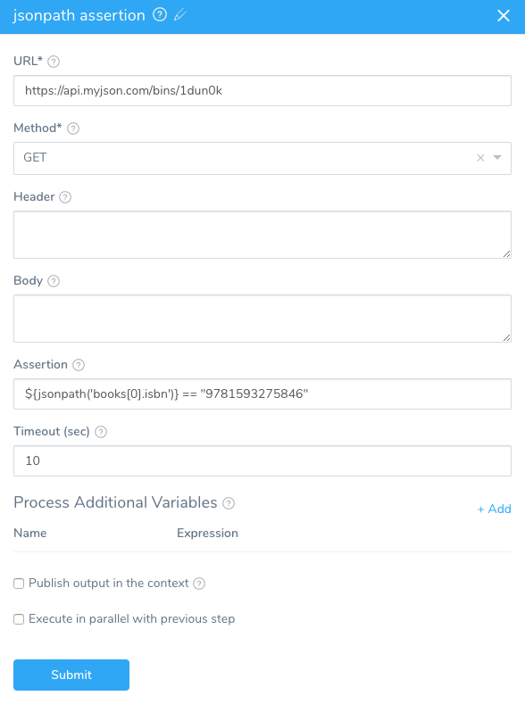
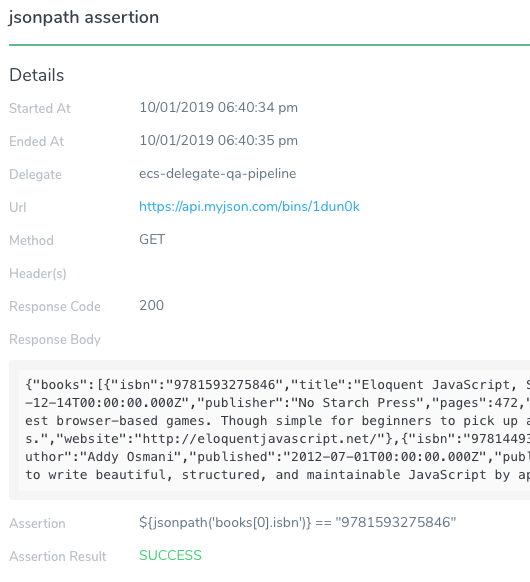
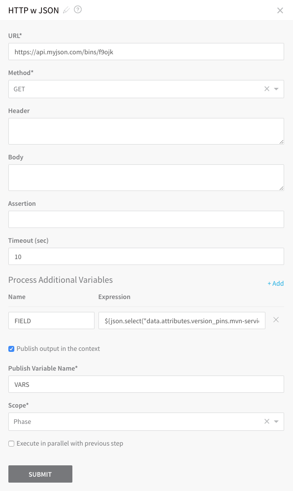
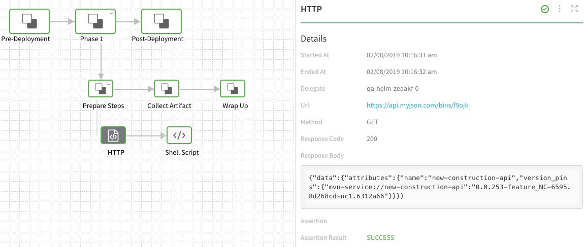
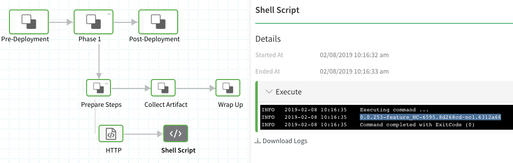
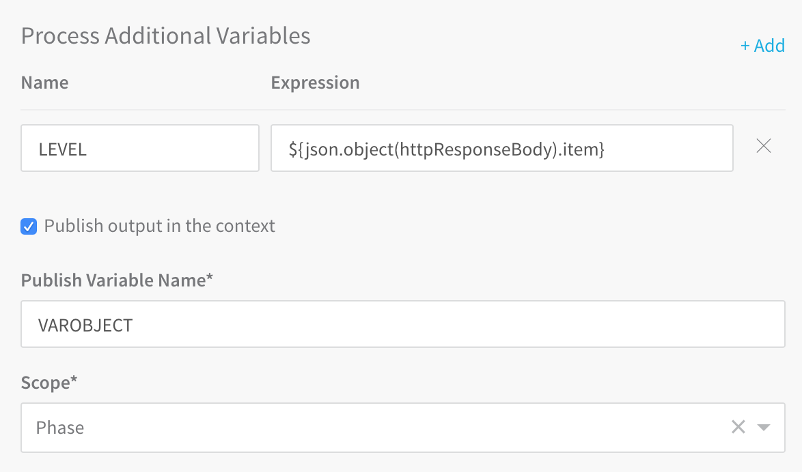
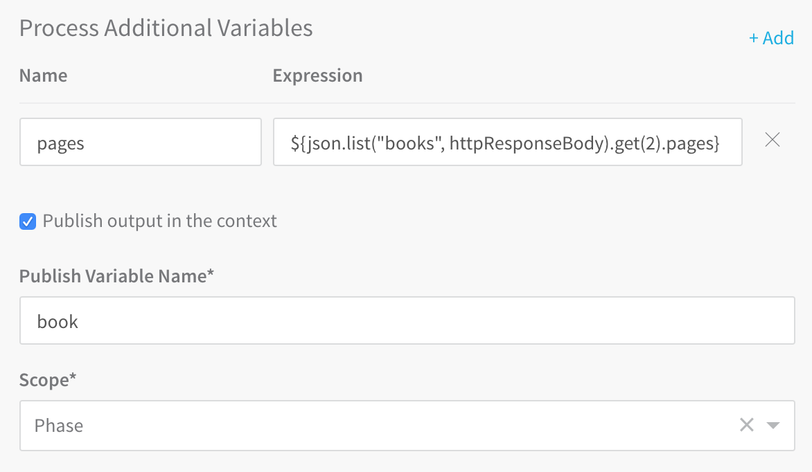
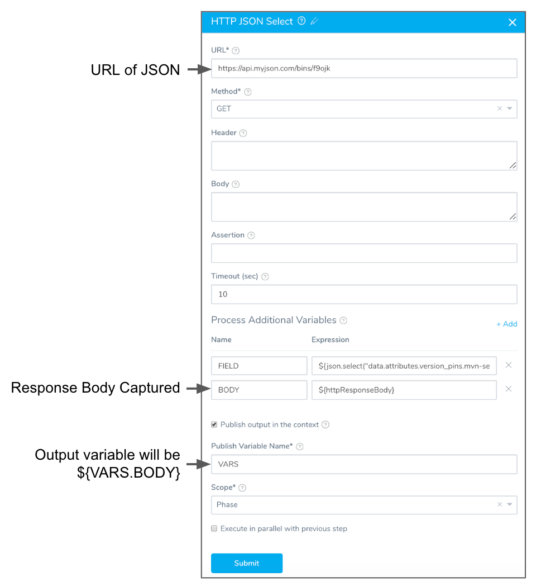
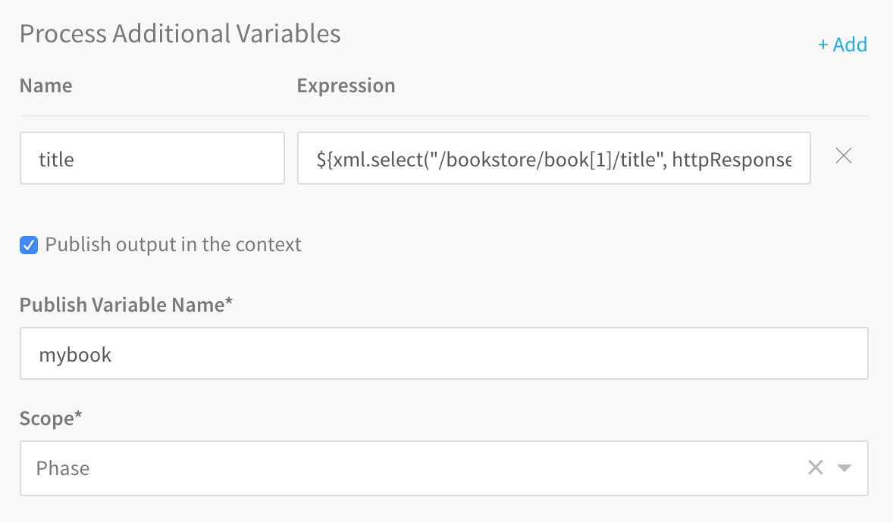
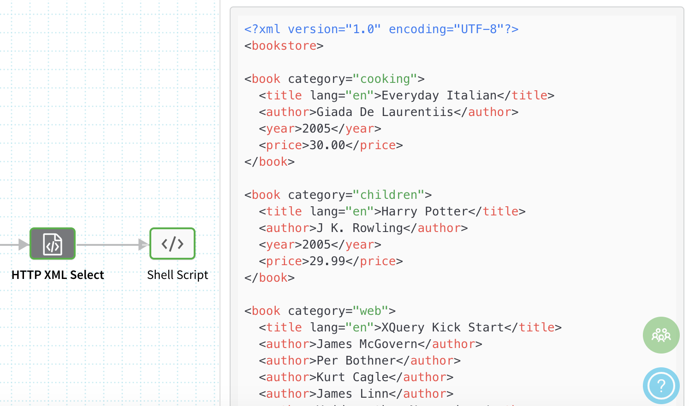

Harness includes JSON and XML functors you can use to select contents from JSON and XML sources. These functors reduce the amount of shell scripting needed to pull JSON and XML information into your Harness Workflow steps.

##  JSON Functor

The JSON functor uses the JSON library [JsonPath](https://github.com/json-path/JsonPath). The JSON functor methods are described below.

###  jsonpath()

* **Syntax:** `${jsonpath('string.string')}`
* **Description:** Select attribute values in a path.
* **Parameters:** literal string, string. For example, `${jsonpath('health.status')}`.

**Example:**

Here is the JSON we will query:

```
{  
  "books": [{  
      "isbn": "9781593275846",  
      "title": "Eloquent JavaScript, Second Edition",  
      "subtitle": "A Modern Introduction to Programming",  
      "author": "Marijn Haverbeke",  
      "published": "2014-12-14T00:00:00.000Z",  
      "publisher": "No Starch Press",  
      "pages": "472",  
      "description": "JavaScript lies at the heart of almost every modern web application, from social apps to the newest browser-based games. Though simple for beginners to pick up and play with, JavaScript is a flexible, complex language that you can use to build full-scale applications."  
    },  
...  
}
```
We'll use the the expression `${jsonpath('books[0].isbn')} == "9781593275846"` to compare the `jsonpath('books[0].isbn')` value with `9781593275846`.

Here is the HTTP step configured to compare in the **Assertion** setting:



Here is the Harness deployment result with the successful comparison:




###  select()

* **Syntax:** `select(string, string)`
* **Description:** Select attribute values using a path.
* **Parameters:** literal string, string (typically, the second string is `httpResponseBody`). This is a path to identify the desired JSON attribute value from a JSON response.

**Example:**

Here is the JSON array that we want to select a value from:


```
{  
  "data": {  
    "attributes": {  
      "name": "new-construction-api",  
      "version_pins": {  
        "mvn-service://new-construction-api": "0.0.253-feature_NC-6595.8d268cd~nc1.6312a66"  
      }  
    }  
  }  
}
```
To select the value `0.0.253-feature_NC-6595.8d268cd~nc1.6312a66`, you would use `select()` to specify the path to the value, like this:

```
${json.select("data.attributes.version_pins.mvn-service://new-construction-api", httpResponseBody)}
```

The `httpResponseBody` argument is used to indicate that we want to select the path *within* the HTTP response body. `httpResponseBody` is propagated from the HTTP request.

A common use of `select()` is in an HTTP command in a Workflow. For example, the following HTTP command uses a variable named **FIELD** in **Name** and the `select()` method in **Expression** to obtain the value `0.0.253-feature_NC-6595.8d268cd~nc1.6312a66` from the HTTP response payload at the URL specified in **URL**.



The value returned by the expression is stored in the variable **FIELD**.

In **Publish Variable Name**, the variable **VARS** is used to store the value of **FIELD** (the value obtained by the expression). The value for **FIELD** can now be referenced elsewhere in the Workflow using `${VARS.FIELD}`.

When this HTTP command is deployed, **Deployments** will display the HTTP response:



If you echo the `${VARS.FIELD}` output variable in a successive Shell Script command, you will get the output of the `select()` expression stored in `FIELD`:




####  Conditional Expressions with Select

Using JSON PATH syntax, you can perform conditional expressions such as:

```
${json.select("fileList[?(@.fileData.minorType == 'MANUAL')].fileData.downloadLink",httpResponseBody)}  
  
${json.select("fileList[?(@.fileData.minorType == 'ZIP')].fileData.downloadLink",httpResponseBody)}
```
There are some useful path examples in [JsonPath](https://github.com/json-path/JsonPath#path-examples) in GitHub.

###  object()

* **Syntax:** `object(string)`
* **Description:** Selects objects from a JSON collection.
* **Parameters:** string. This is a JSON key used to identify the desired JSON attribute value from a JSON response. Typically, `httpResponseBody`.

**Example:**

Here is the JSON we will query:

```
{"item":"value1","level1":{"level2":"value2"}}
```
Here is the query using the `object()` method to select `value1`:

```
${json.object(httpResponseBody).item}
```
We can add the `object()` method to an HTTP step and output it using **Publish Variable Name**:



Next, we reference the output variable in a Shell Script step:

```
echo "JSON object: " ${VAROBJECT.LEVEL}
```
When the Workflow is deployed, the result is:

```
JSON object:  value1
```

###  list()

* **Syntax:** `list(string, string)`
* **Description:** Returns list object.
* **Parameters:** literal string, string (typically, `httpResponseBody`). Using the `list().get()` method returns items from the list.

**Example:**

Here is the JSON we will query:

```
{  
  "books": [{  
      "isbn": "9781593275846",  
      "title": "Eloquent JavaScript, Second Edition",  
      "subtitle": "A Modern Introduction to Programming",  
      "author": "Marijn Haverbeke",  
      "published": "2014-12-14T00:00:00.000Z",  
      "publisher": "No Starch Press",  
      "pages": "472",  
      "description": "JavaScript lies at the heart of almost every modern web application, from social apps to the newest browser-based games. Though simple for beginners to pick up and play with, JavaScript is a flexible, complex language that you can use to build full-scale applications."  
    },  
    {  
      "isbn": "9781449331818",  
      "title": "Learning JavaScript Design Patterns",  
      "subtitle": "A JavaScript and jQuery Developer's Guide",  
      "author": "Addy Osmani",  
      "published": "2012-07-01T00:00:00.000Z",  
      "publisher": "O'Reilly Media",  
      "pages": "254",  
      "description": "With Learning JavaScript Design Patterns, you'll learn how to write beautiful, structured, and maintainable JavaScript by applying classical and modern design patterns to the language. If you want to keep your code efficient, more manageable, and up-to-date with the latest best practices, this book is for you."  
    },  
    {  
      "isbn": "9781449365035",  
      "title": "Speaking JavaScript",  
      "subtitle": "An In-Depth Guide for Programmers",  
      "author": "Axel Rauschmayer",  
      "published": "2014-02-01T00:00:00.000Z",  
      "publisher": "O'Reilly Media",  
      "pages": "460",  
      "description": "Like it or not, JavaScript is everywhere these days-from browser to server to mobile-and now you, too, need to learn the language or dive deeper than you have. This concise book guides you into and through JavaScript, written by a veteran programmer who once found himself in the same position."  
    },  
    {  
      "isbn": "9781491950296",  
      "title": "Programming JavaScript Applications",  
      "subtitle": "Robust Web Architecture with Node, HTML5, and Modern JS Libraries",  
      "author": "Eric Elliott",  
      "published": "2014-07-01T00:00:00.000Z",  
      "publisher": "O'Reilly Media",  
      "pages": "254",  
      "description": "Take advantage of JavaScript's power to build robust web-scale or enterprise applications that are easy to extend and maintain. By applying the design patterns outlined in this practical book, experienced JavaScript developers will learn how to write flexible and resilient code that's easier-yes, easier-to work with as your code base grows."  
    }  
  ]  
}
```

Here is the query using the `list()` method to select `pages` from the 3rd book:

```
${json.list("books", httpResponseBody).get(2).pages}
```
We can add the `list()` method to an HTTP step and output it using **Publish Variable Name**:


Next, we reference the output variable in a Shell Script step:


```
echo "JSON list pages: " ${book.pages}
```
When the Workflow is deployed, the result is:


```
JSON list:  460
```
###  format()

* **Syntax:** `format(object)`
* **Description:** Format the array passed as the string value in JSON format.
* **Parameters:** object. Typically, this is the response from the HTTP response body (`httpResponseBody`). The `httpResponseBody` argument is used to indicate that we want to select the path within the HTTP response body. `httpResponseBody` is propagated from the HTTP request.

**Example:**

We add a variable to the HTTP step that contains the `${httpResponseBody}` variable and then pass the response in the output variable named `BODY`.


If we simply render the `${VARS.BODY}` expression variable we get:


```
{data:{attributes:name:new-construction-api}} {data:{attributes:version_pins:{mvn-service://new-construction-api:0.0.253-feature_NC-6595.8d268cd~nc1.6312a66}}}
```
If we render the variable using the method `${json.format(VARS.BODY)}` we get a JSON formatted string:


```
{"data":{"attributes":{"name":"new-construction-api","version_pins":{"mvn-service://new-construction-api":"0.0.253-feature_NC-6595.8d268cd~nc1.6312a66"}}}}
```
If you formatted this with common JSON indentation it would look like this:


```
{  
  "data": {  
    "attributes": {  
      "name": "new-construction-api",  
      "version_pins": {  
        "mvn-service://new-construction-api": "0.0.253-feature_NC-6595.8d268cd~nc1.6312a66"  
      }  
    }  
  }  
}
```
If you echo using `json.format()` and `double quotes` ensure that any double quotes in the JSON are escaped. Another option is to use echo with single quotes. This is standard Bash functionality.##  XML Functor

The [XPath](https://developer.mozilla.org/en-US/docs/Web/XPath) functor has one method: `xml.select()`.

###  select()

* **Syntax:** `xml.select(string, string)`
* **Description:** Returns XML file.
* **Parameters:** String using an XPath expression and XML file, and a string for `httpResponseBody`.

**Example:**

Here is the contents of the XML file we will query:


```
<?xml version="1.0"?>  
<bookstore>  
  <book category="cooking">  
    <title lang="en">Everyday Italian</title>  
    <author>Giada De Laurentiis</author>  
    <year>2005</year>  
    <price>30.00</price>  
  </book>  
  <book category="children">  
    <title lang="en">Harry Potter</title>  
    <author>J K. Rowling</author>  
    <year>2005</year>  
    <price>29.99</price>  
  </book>  
  <book category="web">  
    <title lang="en">XQuery Kick Start</title>  
    <author>James McGovern</author>  
    <author>Per Bothner</author>  
    <author>Kurt Cagle</author>  
    <author>James Linn</author>  
    <author>Vaidyanathan Nagarajan</author>  
    <year>2003</year>  
    <price>49.99</price>  
  </book>  
  <book category="web" cover="paperback">  
    <title lang="en">Learning XML</title>  
    <author>Erik T. Ray</author>  
    <year>2003</year>  
    <price>39.95</price>  
  </book>  
</bookstore>
```
Here is the query using the `xml.select()` method to select the title from the first book:


```
${xml.select("/bookstore/book[1]/title", httpResponseBody)}
```
We can add the `xml.select()` method to an HTTP step and output it using **Publish Variable Name**:


Next, we reference the output variable in a Shell Script step:


```
echo "XML select: " ${mybook.title}
```
When the Workflow is deployed, the result is:


```
XML select:  Everyday Italian
```
You can also see the entire XML file in the deployment **Details** section:


