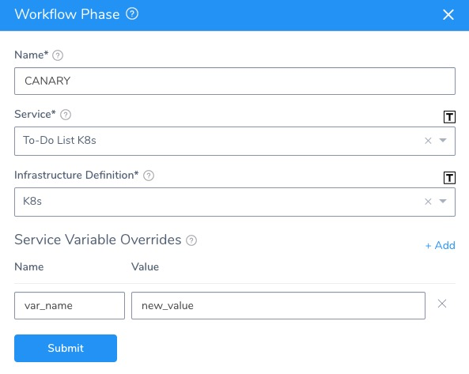
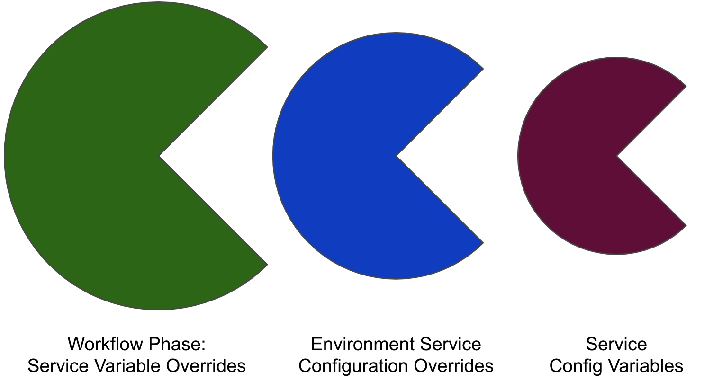

Harness provides builtin and custom variables, as described in [What is a Harness Variable Expression?](variables.md).

You can override a lot of variable values in order to templatize and customize deployment settings.

These overrides have priority. For example, you can override a Service variable in an Environment and a Workflow.

In this topic, we explain how Harness prioritizes variable overrides. Hopefully, this will help you manage your variables more effectively.

### Before You Begin

* [What is a Harness Variable Expression?](variables.md)
* [Availability and Scope of Harness Variables](harness-variable-availability.md)

### Where are Variables Overridden?

Service variables can be overridden in Environments and Workflows.

When you override a Service variable in an Environment, the Service variable can be still be overridden in a Workflow.

#### Environment Service Configuration Overrides

Service Config variables can be are overridden in an Environment's **Service Configuration Overrides** section.

Service Configuration Overrides can override all Service Config variables, or the Service Config variables in specific Services.

#### Overriding Service Variables in Workflows

There two ways to override Service variables in a Workflow:

##### Use Workflow Variables in the Service Settings

The most effective method for overriding Service settings in a Workflow, is to create a Workflow variable and then use its expression in the Service setting.

When you deploy the Workflow, you are prompted to supply a value for the Workflow variable. The value you provide is then used in the Service setting at deployment runtime.

You can use Workflow variable expressions in a Harness Service, but Harness does not autocomplete Workflow variables in a Service like it does in a Workflow. You will need to manually enter the Workflow variable expression in the Service: `${workflow.variables.name}`.

##### Use Service Variable Overrides in a Workflow Phase

Each Phase of a multi-phase Workflow, such as a Canary Workflow, allows you to override the Service variables for the Service the Workflow Phase deploys:

### Overrides Are at the Key:Value Level Not the File Level

Overrides are at the `key:value` level not the file level. You must override each `key:value` pair. 

For example, if you are using a Helm Chart and it has a values.yaml in it and you use **Service Configuration Overrides**, you must override each `key:value` pair from the chart values.yaml that you do not want. 

Harness will merge both the chart values.yaml and the **Service Configuration Overrides** values `key:value` pairs. This is still true even if your override is an entire file.

### In What Order are Variables Overridden?

Here is how Harness prioritizes variables, from highest to least priority:

1. Highest: Workflow variable or Workflow Phase Service Variable Overrides. See [Set Workflow Variables](../../../continuous-delivery/model-cd-pipeline/workflows/add-workflow-variables-new-template.md).  
**Pipelines**—If the Workflow is executed by a Pipeline, the value provided for the Workflow variable in the Pipeline has the highest priority.
2. Next: Environment Service Configuration Overrides.  
See [Override a Service Configuration in an Environment](../../../continuous-delivery/model-cd-pipeline/environments/override-service-files-and-variables-in-environments.md).  
This can be either of the following:
	1. An override of a single Service Config Variable.
	2. An override of all Service Config Variables.
3. Last: Service Config Variables. See [Add Service Config Variables](../../../continuous-delivery/model-cd-pipeline/setup-services/add-service-level-config-variables.md).

Put simply:

:::note 
At the Environment-level, you can override a variable for **All Services** or a specific Service. If you override for All Services but then also override for a specific Service, the override for the specific Service is used for that Service+Environment combination.
:::

### Overriding and Merging Values YAML, Manifests, Charts etc in Environments

In addition to overriding Service text and file variables, you can override or merge new values for the Values YAML, manifest files, Helm charts, and OpenShift Params in a Harness Service (Kubernetes, Helm, Tanzu).

:::note 
Overrides are at the `key:value` level not the file level. You must override each `key:value` pair. For example, if you are using a Helm Chart and it has a values.yaml in it and you use **Service Configuration Overrides**, you must override each `key:value` pair from the chart values.yaml that you do not want. Harness will merge both the chart values.yaml and the **Service Configuration Overrides** values `key:value` pairs. This is still true even if your override is an entire file.
:::

You can override or merge new values at the Environment level in **Service Configuration Overrides**.

To override, you simply replace all of the values in the Values YAML, manifest files, Helm charts, and OpenShift Params in the Harness Service.

To merge, you simply add a subset of the values or additional values. Harness will merge these values with the values in the Values YAML, manifest files, Helm charts, and OpenShift Params.

See:

* [Override Harness Kubernetes Service Settings](../../../continuous-delivery/kubernetes-deployments/override-harness-kubernetes-service-settings.md) (for Kubernetes, Helm, OpenShift)
* [Override Tanzu Manifests and Config Variables and Files](../../../continuous-delivery/pcf-deployments/override-pcf-manifests-and-config-variables-and-files.md)
* [Helm Environments](../../../continuous-delivery/helm-deployment/3-helm-environments.md) (Native Helm)

### Other Service Configuration Types

Some Service types support other Configuration types, such as

* ConfigMap YAML — See [Override Harness Kubernetes Service Settings](../../../continuous-delivery/kubernetes-deployments/override-harness-kubernetes-service-settings.md).
* Values YAML — See [Override Values YAML Files](../../../continuous-delivery/kubernetes-deployments/override-values-yaml-files.md) and [Override Variables at the Infrastructure Definition Level](../../../continuous-delivery/kubernetes-deployments/override-variables-per-infrastructure-definition.md).
* Service Configuration Files — See [Override a Service Configuration in an Environment](../../../continuous-delivery/model-cd-pipeline/environments/override-service-files-and-variables-in-environments.md).

### See Also

* [Pass Variables between Workflows](../../../continuous-delivery/model-cd-pipeline/expressions/how-to-pass-variables-between-workflows.md)
* [Using Variables in Workflow Approvals](../../../continuous-delivery/model-cd-pipeline/approvals/use-variables-for-workflow-approval.md)

