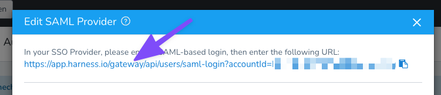
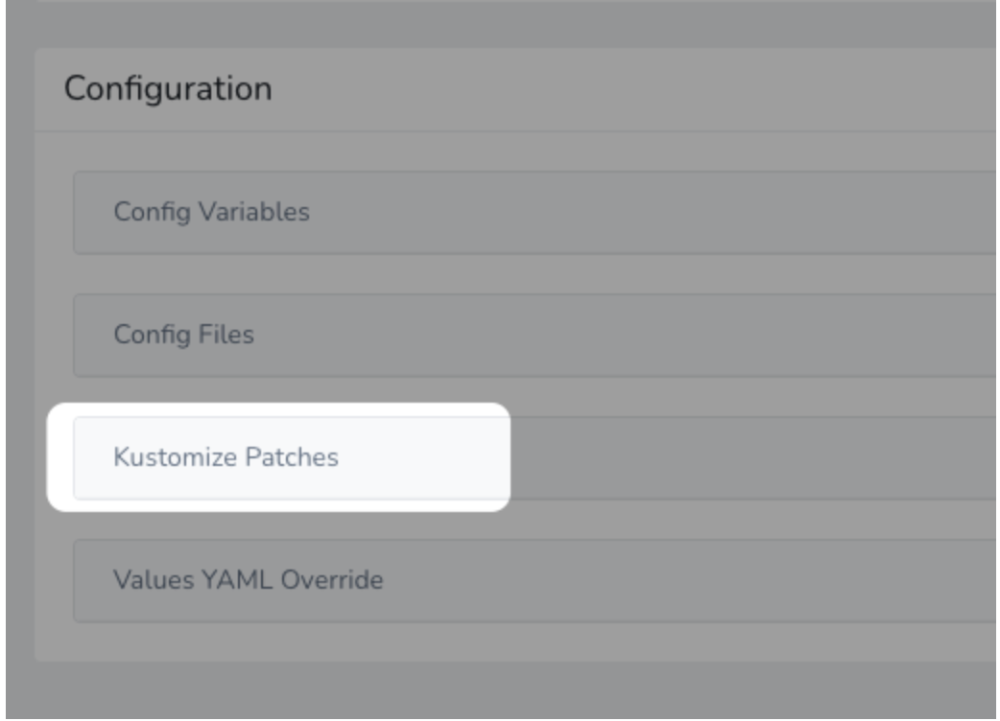
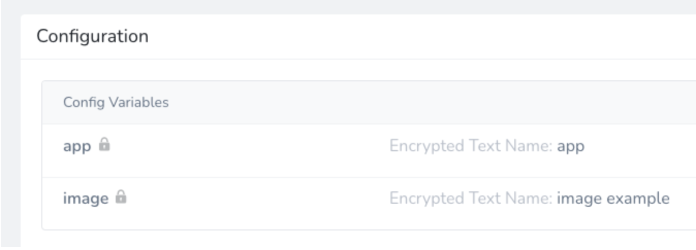
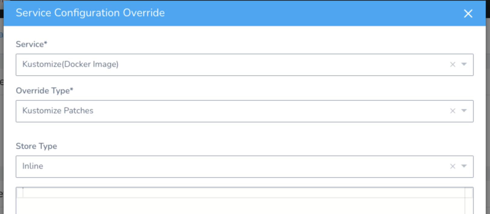

This document contains release notes for Harness Self-Managed Enterprise Edition.

Harness publishes security advisories for every release. Go to the [Harness Trust Center](https://trust.harness.io/?itemUid=c41ff7d5-98e7-4d79-9594-fd8ef93a2838&source=documents_card) to request access to the security advisories.

For Harness SaaS release notes, go to [Harness SaaS Release Notes](https://developer.harness.io/docs/first-gen/firstgen-release-notes/harness-saa-s-release-notes). 

Release notes are displayed with the most recent release first.

## July 31, 2023, patch release for version 79819

This release includes the following module and component versions.

| **Name** | **Version** |
| :-- | :-- |
| Manager | 79819 |
| Watcher | 78424 |
| Verification Service | 79819 |
| UI | 79800 |
| Learning Engine | 67903 | 
| Gateway | 11201 |

### What's new

- Upgraded the delegate JRE to 11.0.19_7. (PL-37994)

- Free, Community, and Paid accounts can now have a maximum of 100, 100, and 50000 users, respectively. (PL-39235)

- Enhanced the application handling mechanism when the `HARNESS_STATUS_IDENTIFIER` environment variable is not set to `ACTIVE`. (CDS-68821)

- You can now skip steady state checks for native Helm deployments. This helps avoid Harness running unnecessary checks for resources where this is not required. This option is available in Helm Deployment and Helm Rollback steps. This feature requires delegate version 1.0.797xx or higher. (CDS-70124)

### Early access

This release does not include any early access features.

### Fixed issues

- Helm delegate installation failed in Self-Managed Enterprise Edition. (PL-39028)

- Improved error handling mechanism when Helm manifests are not fetched from the Artifactory repository. (CDS-68251, ZD-37458)

- Service instances were not showing correctly for Tanzu deployments. (CDS-68737, ZD-42950)

   Some instances were not showing up on the **Services** dashboard. This fix ensures the **Services** dashboard shows the correct Tanzu instances.

- Helm execution failed with `KubernetesClientException` error. (CDS-70386, ZD-45051)

   The Kubernetes GET APIs returned a 400 bad request during steady state check. This was occurring when Harness used a fabric8 client with Kubernetes cluster version < 1.16, or when the feature flag, `HELM_STEADY_STATE_CHECK` is turned off.

   This issue is fixed.

- Fixed an issue where the Google Cloud Build (GCB) triggers were throwing an invalid credentials error intermittently. (CDS-70560, ZD-40187)

   This item requires Harness Delegate version 79707. For information about features that require a specific delegate version, go to [Delegate release notes](/release-notes/delegate).

- Kubernetes deployments timed out and failed when listing pods. (CDS-71328, ZD-45584)

  This issue is fixed by modifying the delegate's Kubernetes API client timeout. 

  Harness Delegate uses Kubernetes Java client to make programmatic API calls to the Kubernetes server. The API client uses an OkHttp client whose default [read timeout](https://square.github.io/okhttp/4.x/okhttp/okhttp3/-ok-http-client/-builder/read-timeout/) and [connect timeout](https://square.github.io/okhttp/4.x/okhttp/okhttp3/-ok-http-client/-builder/connect-timeout/) values are set to 120 and 60 seconds respectively. These values can be configured by using environment variables, modifying the delegate's container environment. The values must be specified in seconds. 

  The environment variables for these timeouts are:

  - Read timeout: `K8S_API_CLIENT_READ_TIMEOUT`
  - Connect timeout: `K8S_API_CLIENT_CONNECT_TIMEOUT`

- The delegate connectivity capability check for Azure Web App deployments failed. (CDS-71432, ZD-44862)

   This issue is fixed by using task category mapping to assign the Azure App Services task type deployments to specific delegates.

### July 12, 2023, patch release for version 79421

Patch releases for Harness Self-Managed Enterprise Edition include minor new features, bug fixes, and updates to address potential security vulnerabilities.

This release includes the following Harness module and component versions.

| **Name** | **Version** |
| :-- | :--: |
| Helm Chart | [0.7.2](https://github.com/harness/helm-charts/releases/tag/harness-0.7.2) |
| Air Gap Bundle | [0.7.2](https://console.cloud.google.com/storage/browser/smp-airgap-bundles/harness-0.7.2) |
| NG Manager | 79422 |
| CI Manager | 3907 |
| Pipeline Service | 1.33.8 |
| Platform Service | 79202 |
| Access Control Service | 79004 |
| Change Data Capture | 79422 |
| Test Intelligence Service | release-177 |
| NG UI | 0.349.16 |
| LE NG | 67902 |

#### What's new

This release does not include new features.

#### Early access

This release does not include any early access features.

#### Fixed issues

- For installations with custom dashboards enabled, the Harness Helm chart version 0.7.1 included entries that caused installation issues during upgrade. Custom dashboards were not available with the 0.7.1 upgrade of Self-Managed Enterprise Edition. (CDB-981) (CDS-74271)

   This issue is fixed. The Harness Helm chart entries are corrected, and Helm installations succeed as expected. If your installation includes custom dashboards, you can now view CD data, including:

   - Total amount of deployed applications
   - Total number of deployments
   - Total number of production versus non-production deployments and the percentage of each
   - Percentage of the applications deployed by deployment type (rolling, canary, blue/green, and basic)
   - Change failure rate/reason for failed deployments
  
  To enable custom dashboards, you must:
  
  1. Run the commands below to update your Harness database.
  2. Add settings to your `override.yaml` file.
  
     Update your Harness database with the following commands.

      ```
      db.elasticsearchPendingBulkMigrations.remove({})
      db.searchEntitiesIndexState.insertMany([{
         "_id" : "software.wings.search.entities.workflow.WorkflowSearchEntity",
         "indexName" : "workflows_0.2_1688472585962",
         "recreateIndex" : false,
         "syncVersion" : "0.2"
     },
     {
         "_id" : "software.wings.search.entities.pipeline.PipelineSearchEntity",
         "indexName" : "pipelines_0.2_1688472585989",
         "recreateIndex" : false,
         "syncVersion" : "0.2"
     },
     {
         "_id" : "software.wings.search.entities.environment.EnvironmentSearchEntity",
         "indexName" : "environments_0.2_1688472585980",
         "recreateIndex" : false,
         "syncVersion" : "0.2"
     },
     {
         "_id" : "software.wings.search.entities.service.ServiceSearchEntity",
         "indexName" : "services_0.2_1688472585992",
         "recreateIndex" : false,
         "syncVersion" : "0.2"
     },
     {
         "_id" : "software.wings.search.entities.application.ApplicationSearchEntity",
         "indexName" : "applications_0.2_1688472585986",
         "recreateIndex" : false,
         "syncVersion" : "0.2"
     },
     {
         "_id" : "software.wings.search.entities.deployment.DeploymentSearchEntity",
         "indexName" : "deployments_0.1_1688472585984",
         "recreateIndex" : false,
         "syncVersion" : "0.1"
     }])
     ```
   
      Add the following entries to your `override.yaml` file.
   
      ```yaml
       platform:
         harness-manager:
            additionalConfigs:
              SEARCH_ENABLED: 'true'
            featureFlags:
              ADDITIONAL: "CUSTOM_DASHBOARD_V2,TIME_SCALE_CG_SYNC" #add additional feature flags comma-separated.
     ```

### July 7, 2023, patch release for version 79421

Patch releases for Harness Self-Managed Enterprise Edition include minor new features, bug fixes, and updates to address potential security vulnerabilities.

This release includes the following Harness module and component versions.

| **Name** | **Version** |
| :-- | :--: |
| Helm Chart | [0.7.1](https://github.com/harness/helm-charts/releases/tag/harness-0.7.1) |
| Air Gap Bundle | [0.7.1](https://console.cloud.google.com/storage/browser/smp-airgap-bundles/harness-0.7.1) |
| NG Manager | 79422 |
| CI Manager | 3907 |
| Pipeline Service | 1.33.8 |
| Platform Service | 79202 |
| Access Control Service | 79004 |
| Change Data Capture | 79422 |
| Test Intelligence Service | release-177 |
| NG UI | 0.349.16 |
| LE NG | 67902 |

#### What's new

- Custom dashboard support is added for Continuous Delivery & GitOps and Service Reliability Management data models. (SMP-1585) 

#### Early access

This release does not include any early access features.

#### Fixed issues

This release does not include any fixed issues.

### June 30, 2023, version 79421

This release includes the following module and component versions.

| **Name** | **Version** |
| :-- | :-- |
| Manager | 79421 |
| Watcher | 78424 |
| Verification Service | 79421 |
| UI | 79401 |
| Learning Engine | 67903 | 
| Gateway | 11002 |

#### What's new

#### Harness Delegate

- The org.json:json is upgraded from version 20160810 to 20230227 to address vulnerabilities. (PL-37905)

#### Early access

This release does not include early access features.

#### Fixed issues

#### Continuous Delivery & GitOps

- The feature flag, `CG_GIT_POLLING` was creating too many queries in yamlGitConfig. (CDS-45085)
  
  This issue is fixed. Git polling for Git sync now works via a different internal method where Harness polls for a feature flag change once every 30 minutes, and then continues polling on accounts for which feature flags are enabled.

- Fixed an issue where perpetual tasks corresponding to a non-existing service was still running. (CDS-58137)

- The ASG Rollback auto-scaling step failed with an exception. (CDS-68533, ZD-43354)
  
  Fixed this issue by adding a back-off strategy support for ASG deployments.

#### Harness Delegate

- Secret decryption failures were not included in logs. (PL-31517)

   A code enhancement to return runtime errors from secret managers during decryption fixed this issue.

#### Harness Platform

-  No members appear in user group list even after the user has been added via SCIM. This issue is fixed. (PL-32482)

- Users cannot use Harness secret as LDAP password in FirstGen. (PL-32597, ZD-42655)
  A code enhancement fixed the issue.

  The user group list now displays the number of users in the group. Select this number to see the user details. This is behind the feature flag `PL_CG_SHOW_MEMBER_ID_COUNT`.

- The `DMS_MONGO_URI` was missing from the ConfigMap of cg-manager for Self-Managed Enterprise Edition Helm installations. (PL-38850)

   This issue is fixed. The `DMS_MONGO_URI` is included in the ConfigMap.
   
   This item is available with Harness Platform version 79411 and does not require a new delegate version. For information about Harness Delegate features that require a specific delegate version, go to the [Delegate release notes](/docs/first-gen/firstgen-release-notes/fg-delegate).

### June 14, 2023, version 79230

Delegate: 78924

This release includes the following module and component versions.

| **Name** | **Version** |
| :-- | :-- |
| Manager | 79230 |
| Delegate | 78924 |
| Watcher | 78424 |
| Verification Service | 79230 |
| UI | 79202 |
| Learning Engine | 67708 | 
| Gateway | 10701 |

#### What's new

#### Harness Delegate

- Removed the `DELEGATE_IMAGE_TAG` version override when delegates with the immutable image type are enabled. (PL-37852, DEL-6202)

- Updated legacy delegate images `kubectl` version to 1.25.8. (PL-38281, DEL-6087)

#### Early access
#### Continuous Delivery & GitOps

- Pipelines in different projects are now independent. (CDS-55830, ZD-41377)

	This change is behind the feature flag `PROJECT_SCOPED_RESOURCE_CONSTRAINT_QUEUE`.
	
	Pipelines were waiting on resource constraints although no other deployment was running with the same service and infrastructure definition combination. 
	
	Resource Constraints were scoped too broadly, so users' pipelines went into a wait state.
	
	This was because of other pipelines in other projects with the same infrastructure configuration. 
	
	This has now been changed by scoping resource constraints to the project.

#### Fixed issues

#### Continuous Delivery & GitOps

- When an app was removed it was still returning inside the GraphQL query result for a short period of time. (CDS-54879, ZD-40375)
  
	We added new functionality to verify each appId before returning the user group GraphQL. If the appId does not exist it's removed from the response.
	
	This change is behind the feature flag `SPG_GRAPHQL_VERIFY_APPLICATION_FROM_USER_GROUP`.

- Canary Delete step during rollback deleting the primary deployment. (CDS-58661, ZD-42392)
  
	This occurred when the user skipped the dry run in the Canary Deployment step, and Harness was unable to process the manifest.yaml file during error handling. This resulted in the storage of the primary resource name as the canary workload name.
	
	The issue has been resolved, and Harness now relies on release history instead of populating the canary workload if there is an error in the deployment manifest and the dry run is skipped.

- Resolved a null pointer exception when the Canary Deployment step is initialized with the Helm manifest type. (CDS-59214)

#### Harness Delegate

- Shell delegates did not upgrade automatically. Delegate URLs were not included in installation scripts. (PL-38304, DEL-6276)

   This issue is fixed with a code enhancement.

- Updated the error message for failed task execution to include the delegate host name or ID. (PL-38329, DEL-6187)

### April 26, 2023, version 78926

Delegate: 78904

This release includes the following module and component versions.

| **Name** | **Version** |
| :-- | :-- |
| Manager | 78926 |
| Delegate | 78904 |
| Watcher | 78424 |
| Verification Service | 78926 |
| UI | 78901 |
| Learning Engine | 67708 | 
| Gateway | 2000185 |

#### What's new
#### Harness Platform
- Upgrades have been made to the following libraries:

  - The Spring Data MongoDB package has been upgraded to version 3.4.7.
  - Spring Data Commons has been upgraded to version 2.77.
  - The MongoDB Java Driver has been upgraded to version 4.6.1. (PL-30730)
- The API keys will now be encrypted with Harness Global Secrets Manager. (PL-30970)
#### Delegate
- Harness Delegate task collections were migrated to a new database. (DEL-5831) 

  This migration is controlled through a configuration flag. For a period of time after the migration, any newly created tasks will have an ID with a **- DEL** suffix.
- Users can override the delegate image for their account using an endpoint. (DEL-6024)

  Use the following endpoint: 

  - /version-override/delegate-tag

  Pass the arguments in query param:

  - 1- accountIdentifier : String

  - 2- delegate image tag : String

  Optional arguments:

  - 1- validTillNextRelease : Boolean

  - 2- validForDays : int

  Use an api-key with account edit permission in the API header.
#### Fixed issues
#### Continuous Delivery & GitOps
- When manually triggering the workflow, there is an issue preventing the selection and retrieval of GCS artifacts. (CDS-53074)

  A code enhancement has fixed this issue.
#### Harness Platform
- When a secret is used to create a Prometheus connector, the setup usage is not displayed. (PL-30755)
  
  A code enhancement has fixed this issue.
- On the secret page, you can also see how many times the secret has been decrypted. A high number of details increases the loading time, which affects performance. (PL-31129)

  The introduction of the feature flag `SPG_DISABLE_SECRET_DETAILS` has fixed this issue. Enable this feature flag to hide additional details from the secret page and enhance performance.
#### Delegate
- Upgraded org.codehaus.groovy:groovy to 3.0.15 to fix a vulnerability. (DEL-6015)
- API output includes a new field called **Disconnected**, which determines if a delegate is connected. (DEL-5995)

  The **Disconnected** field is set to **true** if no heartbeat communications occur between the delegate and the Harness Manager for five minutes. 

### March 14, 2023, version 78426

Delegate: 78310

This release includes the following module and component versions.

| **Name** | **Version** |
| :-- | :-- |
| Manager | 78426 |
| Delegate | 78310 |
| Watcher | 77431 |
| Verification Service | 78426 |
| UI | 78400 |
| Learning Engine | 66700 | 
| Gateway | 2000149 |

#### What's new

- The **kotsadmin minor version** is upgraded from 1.88.0 to 1.95.0. (SMP-835)

   To upgrade kots to 1.95.0, run:  

       curl https://kots.io/install/1.95.0 | bash

    If you get a `/usr/local/bin is not writable` error, run:

       sudo chown -R `whoami`:admin /usr/local/bin

    then proceed with the installation.

    To update the kots admin console, run:

       kubectl kots admin-console upgrade -n NAMESPACE --wait-duration 10m

    To check the version, run:  
       
       kubectl kots version

- The **mongoDB minor version** is upgraded from 4.2 to 4.4. (SMP-837)

  To upgrade to 4.4, do the following.

  1. Get the current featureCompatibiltyVersion. It should be 4.2 if it is using mongo 4.2:

          db.adminCommand( { getParameter: 1, featureCompatibilityVersion: 1 } )

  2. If the current version isn't 4.2, execute into Primary and run:

          db.adminCommand( { setFeatureCompatibilityVersion: "4.2" } )

  3. Determine if the pods are in sync. Make sure they're in sync before you upgrade (the maximum time lag is ~2sec). 

          rs.printsecondaryreplicationinfo()

   4. Proceed to upgrade mongo to 4.4. 

      After the update, continue to monitor the pods to ensure that they're in sync.

   5. Once you're upgraded, update the Feature Compatibility version so that it's used for future upgrades.

           db.adminCommand( { setFeatureCompatibilityVersion: "4.4" } )

  For more information, go to [Upgrade a Replica Set to 4.4](https://www.mongodb.com/docs/manual/release-notes/4.4-upgrade-replica-set/) in the MongoDB docs.


- The **TimescaleDb minor version** is upgraded from pg13-ts2.6 to pg13-ts2.9. There is no change in postgres version and no major changes for TimescaleDB. (SMP-838)

    1. Before the minor version upgrade, check the timescaledb extension version by executing into the pod and running:

         \dx timescaledb

     The version should be 2.6.1.

    2. Proceed to upgrade timescaleDB using the installation methods (KOTS/Helm).

    3. After the timescale pods are in steady state, run:

            ALTER EXTENSION timescaledb UPDATE;

    4. Validate the change by running:

          \dx timescaledb

    The version now should be 2.9.3.

  For more information, go to [Upgrading the TimescaleDB extension](https://docs.timescale.com/timescaledb/latest/how-to-guides/upgrades/minor-upgrade/#upgrading-the-timescaledb-extension) in the Timescale docs.


- To fix a vulnerability associated with current [elastic search client version 7.7.0](https://mvnrepository.com/artifact/org.elasticsearch/elasticsearch/7.7.0), we are upgrading it to [version 7.17.0](https://mvnrepository.com/artifact/org.elasticsearch/elasticsearch/7.17.7). (PL-30666)
  	
- The delegate was refactored to remove the `HelmChart` entity from the delegate JAR file. The `HelmChart` entity was replaced with a data transfer object (DTO) that does not include an annotation for MongoDB. The delegate dependency on MongoDB was eliminated. (DEL-5732)
  
Removed the following libraries from the delegate to fix a high-severity vulnerability. (DEL-5721)
   - org_mongodb_mongodb_driver_sync
   - org_mongodb_mongodb_driver_legacy
  
- Added support for auto-generating and updating build files with test-only java_library targets to support package-level test build files with build cleaner. (PL-5713)

- You can now leverage a new method to selectively escape given characters. (CDS-54875)  

  The syntax is as follows:

  `shell.escapeChars(<input string>, <string of characters to be escaped>)`

  For example, `shell.escapeChars("hello", "ho")` returns `\hell\o`

#### Fixed issues

- Fixed an issue that resulted in exceptions due to missing kryo exception classes. (PL-31162)
- On the secret page, you can also see how many times the secret has been decrypted. A high number of details increases the loading time, which affects performance. (PL-31129)
  
  The introduction of the feature flag `SPG_DISABLE_SECRET_DETAILS` has fixed this issue. Enable this feature flag to hide additional details from the secret page and enhance performance.

- When background job scheduling is skipped during startup, background jobs, like the deletion of old records, do not work. A code enhancement has fixed this issue. (PL-31009)

- Selecting a specific audit filter for an API key causes the UI to become unresponsive. An added check ensures that only essential data is sent for display. This has fixed the issue. (PL-30715, ZD-38400)
 
- SAML users removed from the LDAP group are displayed in the linked user group in Harness. A code enhancement has fixed this issue. (PL-30291, ZD-37758)
  
- Selecting **Forgot password** after disabling SSO authentication redirects users to the Harness FirstGen authentication UI. This is now fixed and users are redirected to the NextGen authentication UI. (PL-24649)

- Changed delegate behavior to ensure that the tasks assigned to a delegate fail if the delegate does not send heartbeats for a period of three minutes. (DEL-5821)
- Added validation to ensure that delegates using the YAML of the Legacy Delegate fail on start with the correct error message. (DEL-5715)
- Added functionality to explicitly release a lock on the profile (`profile.lock` file). This resolves a rare case in which there is no running profile but a `profile.lock` file or profile in a locked state exists. (DEL-5659, ZD-38469)


### February 9, 2023, version 78109

Delegate: 78106

This release includes the following module and component versions.

| **Name** | **Version** |
| :-- | :-- |
| Manager | 78109 |
| Delegate | 78106 |
| Watcher | 77431 |
| Verification Service | 78109 |
| UI | 78100 |
| Learning Engine | 66700 | 
| Gateway | 2000137 |

#### What's new

This release introduces the following features and enhancements.

- Decreasing the overall **all perpetual task** count. (CDS-46240)

  Now we create a perpetual task on the basis of the cloud provider. This decreases the **all perpetual task** counts overall. Harness Manager was not changed and no user action is required.
  
- Added internal metrics to track the pattern of automatic delegate upgrades. (DEL-5383)
 
- Added a check to the container start process to ensure the user has the file permissions required to run the delegate. If user permissions are inadequate, the delegate fails fast and displays an error message. (DEL-5440)

- The following libraries of the Apache CXF open-source services framework (`org.apache.cxf`) were upgraded to version 3.5.5 to fix vulnerabilities. The delegate base image was updated from `redhat/ubi8-minimal:8.4` to `redhat/ubi8-minimal:8.7` to reflect these changes. (DEL-5591)

- The following libraries of the `io.netty:netty*` client/server framework were updated to version 4.1.86.Final to fix vulnerabilities. (DEL-5632)

  The `io.netty:netty*` libraries were upgraded to mitigate the risk of denial-of-service (DoS) attack. Netty versions 4.1.0 to 4.1.67 are vulnerable, for example, to the exploits described in [CVE02021-37136](https://cve.mitre.org/cgi-bin/cvename.cgi?name=CVE-2021-37136) and [CVE-2021-37137](https://cve.mitre.org/cgi-bin/cvename.cgi?name=CVE-2021-37137). 
  
  | Library name and version | 
  | :-- | 
  | `io.netty:netty-all:4.1.77.Final` | 
  | `io.netty:netty-buffer:4.1.77.Final` |
  | `io.netty:netty-handler-proxy:4.1.77.Final` |
  | `io.netty:netty-common:4.1.77.Final` |
  | `io.netty:netty-handler:4.1.77.Final` |
  | `io.netty:netty-resolver-dns:4.1.77.Final` |
  | `io.netty:netty-resolver:4.1.77.Final` | 
  | `io.netty:netty-transport-native-epoll:linux-x86_64:4.1.77.Final` | 
  | `io.netty:netty-transport-native-kqueue:4.1.77.Final` | 
  | `io.netty:netty-transport-native-unix-common:4.1.77.Final` | 
  | `io.netty:netty-transport:4.1.77.Final` |

#### Fixed issues

This release includes the following fixes.

- **Rollback Deployment** button incorrectly showing Not Authorized (CDS-17420)  
  When the `FREEZE_DURING_MIGRATION` feature flag was enabled in an account, the **Rollback Deployment** button was marked User Not Authorized.   
  Now, when the `FREEZE_DURING_MIGRATION` feature flag is enabled in an account, the **Rollback Deployment** button is available if the user has the correct permissions).

- Slow running Looker queries in Deployments (FirstGen) dashboard (CDS-45074)  
  When the customer uses fields for Deployments Tags, the queries became extremely slow.  
  Removed a few unused indexes and added a few indexes to improve the speed of queries.

- Rollback artifact number (`${rollbackArtifact.buildNo}`) is coming as null (CDS-47328, ZD-37309)  
  Fixed a problem where incorrect metadata was being populated into executions after updating the environment's infra definitions.  
  For more information, go to [Artifact Rollback Variables](../firstgen-platform/techref-category/variables/built-in-variables-list.md#artifact-rollback-variables).

- Log improvement when only the ConfigMap is deployed. (CDS-47901)

  Harness only performs versioning when a Deployment, StatefulSet, DaemonSet and DeploymentConfig is performed. These are called managed workloads.
  
  In deployments of ConfigMaps without managed workloads, no versioning is performed. 
  
  The logs have been improved to indicate that no managed workloads were found
  
  **Note:** If the `harness.io/skip-versioning: "true"` annotation is in a manifest, Harness does not track release versions.  

- `DelegateGroup` is not removed from the database or the UI after the associated delegate is deleted. (DEL-3913)
   The code was changed to ensure that an inactive delegate is deleted from the UI after seven days.

- Avoid calling `closeChannel` more than one time during watcher shutdown. Invoking the method two times can cause the `logsAvoid` method to unnecessarily wait during executor shutdown. (DEL-4924)
 
- Fixed a shell delegate issue that occurred on restart. The delegate name was not visible. (DEL-5443)

- Functionality was added to send an alert within 30 minutes of delegate shutdown. If delegate groups are in use, the alert is sent only when all the delegate members shut down. To use this functionality, enable the `INSTANT_DELEGATE_DOWN_ALERT` feature flag. (PL-30005, ZD-34766)

- Hide NextGen option was enabled by default for the **Account Admin** user group in new trial accounts. (PL-30070)  
  The **Harness NextGen** option is no longer enabled by default for **Account Admin** user groups.

- Users are not added to the user groups through SCIM when the authentication mechanism is username and password. (PL-30124)  
  A notification email is sent to the users instead of an email invite and the system throws an exception.  


### December 21, 2022, version 77622

Delegate: 77621

:::note

**Important information about KOTS Admin Console**

This release of Harness Self-Managed Enterprise Edition requires KOTS Admin Console (`kotsadm`) 1.88.0. You must upgrade KOTS before you deploy this Harness release. Use the following commands:

```
curl https://kots.io/install/1.88.0 | bash
kubectl kots admin-console upgrade -n <namespace>
```
:::

#### What's new

This release introduces the following features and enhancements.

| **Feature or enhancement** | **Description** |
| --- | --- |
| CDS-40179 | Added reconciliation for `looker` entities to ensure data synchronization between mongoDB and timescaleDB. |
| CDS-45694 | Deployment recon task failing. Longer retention for deployment in custom dashboards was failing due to a missing null check which has been added. (CDS-45694) |
| CDS-47016 | Changed how search functionality on the deployments page works. Instead of using regex, search operations now use mongo stemming algorithms. |
| DEL-4888 | Adopted the use of an immutable image for the delegate that is installed by default in newly created accounts. For more information on new delegate features including auto-update, see [Delegate Overview](https://developer.harness.io/docs/platform/delegates/delegate-concepts/delegate-overview/). |
| DEL-5073 | Updated the Core Protocol Buffers library `protobuf-java/protobuf-javalite` to version 3.21.7. This update fixes CVE-2022-3171, a vulnerability that affects some earlier versions. The vulnerability was linked with denial-of-service (DoS) attacks. |
| DEL-5153 | Upgraded `org.apache.commons:commons-text` to version 1.10.0 to fix a critical vulnerability in the delegate. |
| DEL-5308 | Removed the delegate dependency on Java driver component `mongo-java-driver`. This eliminates the CVE-2021-20328 vulnerability that affects client-side field-level encryption (CSFLE). |
| DEL-5386 | Changed the base image that the non-legacy delegate uses to `redhat/ubi8-minimal:latest`. This ensures that each release includes all OS-level security updates. |
| PL-26799 | Removed feature flag `LDAP_GROUP_SYNC_JOB_ITERATOR`. This makes it possible for all accounts for which LDAP is configured to set up a periodic group sync schedule by using a `cron` expression. |
|          | Additionally, LDAP user group sync will not use a quartz job. Instead, the `cron`-based scheduler will use the user-configured `cron` expression. The default value remains set to a 15-minute interval. |
| PL-29603 | Upgraded `org.mongodb:mongo-java-driver` to version 3.12.11 to fix vulnerabilities. |

#### Fixed issues

This release includes the following fixes.

| **Feature or enhancement** | **Description** |
| --- | --- |
| CDS-36784 | **NPE when trying to click a version of a linked Shell Script step from Template Library** |
|           | Fixed a bug where the linked template in the pre-deployment step in the canary workflow did not show the correct version |
| CDS-39248, ZD-36559 | Fixed a problem with comment-only scripts were not parsed as empty. This issue prevented the proper function of some custom artifacts. |
| CDS-40336, ZD-32237, ZD-34859 | Terraform apply steps fail intermittently with an I/O exception.
|          | Multiple parallel workflows were running the Terraform task. For example, one of the workflows cloned a git repository, but before it could copy it to a working directory on the delegate, another workflow reset it and cloned another repository. This caused a `File Not Found` exception for the first workflow. |
|          | This was happening because Harness cloned the git repository and copied it to a working directory in two different steps asynchronously. The two steps are now performed synchronously, which allows multiple workflows to run in parallel using the same Terraform provisioner. |
| CDS-43346, ZD-28902, ZD-34686 | Deployments Page Filters Problems |
|          | Filter should work properly when user tries to switch from filter 2 to filter 1. |
| CDS-43410, ZD-34705 | Users cannot set up start time and end time in a Jira step. |
|          | This issue has been resolved. |
| CDS-43477, ZD-34546 | **Service Dashboard showing the wrong Artifact info from what was deployed**. Fixed a bug where the Services dashboard statistics did not show the correct version of the artifact when a workflow rollback failed. |
| CDS-44014 | **Dashboards Data Issue: Missing Service Names for Deployments with Running Status** |
|           | Updated the Workflow Execution before publishing event and updating the timescale database, which allows time scale database to be populated with deployed service Ids while workflow or pipeline is running. |
| CDS-44299, ZD-35185 | **Harness Manager and GraphQL missing Git Connector information**. The property sent to the backend was wrong and it was removed. Now we can fetch the correct connector list. |
| CDS-44396 | **Fields overlap on the Deployment Freeze Window screen**. This issue has been resolved. |
| CDS-44408 | When an active deployment freeze is on and no entries exist for app exclusions, the workflow deployment fails with an `appID may not be null` error. This issue occurs when the `SPG_NEW_DEPLOYMENT_FREEZE_EXCLUSIONS` feature flag is enabled. |
|           | Validation has been added to prevent empty Application, Environment, and Service IDs in the **Deployment Freeze Window** screen. |
| CDS-44485 | **A bad query on instance collection scans all the records, causing a high level of disk utilization**. This issue has been resolved. |
| CDS-45647, ZD-36114, ZD-36510 | **Application is not showing in dropdown**. If user searched any query, then the ID provided to the child component restricted pagination. Now the ID is updated to the parent level so that if elements are more than 10/15, infinite scroll is enabled and all the matching results are fetched. |
| CDS-46099 | **Perpetual task interval correction for instance sync**. Perpetual task interval for instance sync is 10 minutes. |
| CDS-46163 | Kubernetes deployments were failing if a Shell Script step was placed after deployment steps. |
| DEL-5100, ZD-35558 | Fixed a regression issue that allowed delegate tasks to continue to run when delegates were not able to reach external resources. |
| PL-25845 | **When trying to delete a user provisioned through SCIM, the tooltip displays "User is not authorized"**. The tooltip text displays the correct message now to indicate that the user is externally managed and cannot be deleted from Harness. |
| PL-28400, ZD-34766, ZD-35873, ZD-35878 | **When a delegate is down, there is a delay in sending notifications.** This has now been fixed by increasing the number of threads in the thread pool to enable the background jobs to pick corresponding alerts and send the notifications. |
| PL-28828, ZD-35485 | When adding a new user to a user group through GraphQL APIs while the feature flag `AUTO_ACCEPT_SAML_ACCOUNT_INVITES` is enabled, the audit logs show incorrect details. |
| PL-29027, ZD-35778 | **The list of service variables were not getting populated in the Environment details section.** This has now been fixed to enable selection of config variables for selected service. |
| PL-29186, ZD-35968 | **The API to fetch list of secrets is taking longer than expected**. This has now been fixed by maintaining the secret logs for 90 days. |
| PL-29495 | **New User is added in a pending state**. Now, when auth method is SAML and two-factor authentication is `ON`, user is added into verified state and a notify email with 2FA QR code is sent. When auth method is SAML and two-factor auth is `OFF`, user is added into verified state and no email is sent. |


### October 31, 2022, version 77117

Delegate: 77021

#### What's new

This release introduces the following features and enhancements.

| **Feature or enhancement** | **Description** |
| --- | --- |
| CDS-40206 | The option to use Kerberos-based authentication in the creation of Git connectors is no longer gated by feature flag. |
| CDS-41527 | Exclusion filters can be applied to the applications, environments, and services that you specify in a deployment freeze configuration. This allows you to exclude applications from a deployment freeze despite the specification that **ALL** be included. |
| CDS-43469 | The workflow execution page was optimized by adding SEARCH\_TEXT as a query parameter. This replaces the use of a CONTAINS parameter in the method call for the deployment page that was behind a feature flag. |
| CDS-43911 | The user interface was changed to display the user email for approvals submitted using an API key. The information is shown in the **Approved via API by** field, in the **Details** section. |
| DEL-4433 | Upgraded Bouncy Castle Crypto API component `org.bouncycastle:bcprov-exte-jdk15on` to version 1.70. |

#### Fixed issues

This release includes the following fixes.

| **Issue** | **Description** |
| --- | --- |
| CDS-42400ZD-33890 | Resolved an issue in ProcessStopper that caused an intermittent issue. PowerShell sessions were not being terminated on workflow time out. |
| CDS-43767ZD-34771 | Earlier we added support to allow customers to find artifacts from the last deployed workflow or pipeline with the same service as the triggered workflow by enabling the added feature flag `SERVICE_ID_FILTER_FOR_TRIGGERS.` A new index has been added for the new query. |
| CDS-43945 | Handled an edge case to ensure that the default value is one of the allowed values of the pipeline variable. |
| CDS-44187 | Changed code to eliminate overlapping text on the **Cloud Providers** page. The **Create Encrypted** fields and **Encrypted** text' settings were affected. The problem was fixed by removing an unnecessary `classname`. |
| CDS-44225 | Fixed a problem that resulted in UI windows freezing. The scope of a globally applied CSS was narrowed to a specific component. |
| DEL-4667 | Changed code to reduce the volume of API calls made to retrieve the delegate configuration. This resolves a problem with API calls made to determine the configuration of a deactivated delegate.  |
| DEL-5060 | Added validation to ensure the download of the correct delegate version. This fixed a problem that occurred when the `os_arch` value indicated a platform type of `amd64` instead of `x86_64.` |
| DEL-5065 | Fixed a problem with the `runAsRoot` boolean value that caused it to be incorrectly interpreted as a string. This prevented the commented-out specification of the `securityContext` required for a root user.  |
| PL-26372 | Corrected the error message that is displayed when invalid parameters are entered in the creation of a Custom Secret Manager. The issue was fixed by including the references to the secret and the template from the Custom Secret Manager to provide the necessary information. |

### October 7, 2022, version 76918

Delegate: 76818

#### What's new

This release introduces the following features and enhancements.

| **Feature or enhancement** | **Description** |
| --- | --- |
| CDS-42783 | Created upsert statement for looker entities. |
| DEL-4589 | [UI] CG Immutable delegate should not use profile script If FF is on. |
| DEL-4617ZD-33464 | Delegate logic was enhanced to ensure that `redis` connection errors do not interfere with task acquisition. |
| DEL-4807 | Published a new delegate that is immutable. |
| DEL-4889 | The specification of the `delegateGroup` version was changed for the Immutable delegate. The value was changed to the minimum version of the delegate. Formerly the `delegateGroup` variable contained a list of version numbers. |

#### Fixed issues

This release includes the following fixes.

| **Issue** | **Description** |
| --- | --- |
| CDS-41129ZD-32913 | For this FF `OPTIMIZED_TF_PLAN` shell script step will not fail if for `${terraformPlan.jsonFilePath()}` expression instead the value of this expression will be null. |
| CDS-41232 | Introduced new fields `parent_pipeline_id` and `created_by_type` in timescaledb. |
| CDS-41357ZD-32975 | Throw exception if the nexus artifact URL is empty. |
| CDS-41544ZD-33364 | Workflow variables that uses secret variables and are referenced in pipelines are encrypted |
| CDS-41832ZD-33449, ZD-34771 | Added support so that customer can find the artifacts from last deployed workflow or pipeline with the same service as the triggered workflow by enabling the added feature flag. |
| CDS-41868 | Due to delegate side library upgrade, SFTP connector test was failing and its fixed. |
| CDS-41896ZD-33547 | Triggered pipeline was unable to fetch artifacts from parent pipeline earlier when FF RTIFACT\_COLLECTION\_CONFIGURABLE was enabled . Now it is able to. |
| CDS-41913 | Resolved a condition that led to the generation of an exception when an artifact URL value was empty.. |
| CDS-41999ZD-33514 | Resolved a problem that prevented the population of the API access type used to connect to gitlab. |
| CDS-42064ZD-33758 | Fixed a problem that prevented new lines from being escaped. The problem led to the Slack API rejecting payloads. |
| CDS-42581 | Fixed bug with manifest collection with Helm V2 failing. |
| DEL-4606ZD-33004 | Changed the information that error messages provide in cases where no delegate is available to perform a task. Message descriptions now list only the capabilities that cannot be handled. |
| DEL-4668 | Introduced caching to allow the current watcher version to be stored and returned in subsequent API calls. |
| DEL-4672 | Modified Delegate code to download the start.sh script on each attempt to start the watcher. |
| DEL-4732 | Changed code to offload the `Chronicle` event trailer task and separate the threadpool. The change resolved an issue that interfered with the creation of a new watcher process. |
| DEL-4745 | Made changes to insert `DelegateGroupId` earlier to ensure that the `GroupId` is present when the heartbeat is sent from Delegate to Manager and, in certain scenarios involving ECS Delegates, before `DelegateGroupId` is inserted into the Delegate collection. |
| PL-14239 | Made a change to indicate that version information is required in **Add Encrypted Text** for GCP Secret Manager. An asterisk was appended to the **Version** field label. |
| PL-19543 | A code change was made to add validation for the `SecretName` prefix in the **Add Encrypted Text** dialog. |
| PL-26472 | Added a feature flag, for Delegate versions equal to or higher than 76420, to stop token renewal and instead fetch the token on the fly before any CRUD operation is performed. The feature flag name is `DO_NOT_RENEW_APPROLE_TOKEN`. |
| PL-27092ZD-28969, ZD-30193, ZD-30587, ZD-33183, ZD-33347, ZD-33487, ZD-33506, ZD-34543 | Resolved an API key caching issue that caused GraphQL user requests to be rejected as not authorized. |
| PL-27323ZD-32116 | Made a change to optimize the memory for git sync operations. |

### September 15, 2022, version 76620

Delegate: 76614

#### What's new

This release introduces the following features and enhancements:

| **Feature or Enhancement** | **Description** |
| :-- | :-- |
| CDS-40796 | The Azure Identity (`azure-identity`) artifact was upgraded from version 1.1.2 to version 1.4.4. The upgrade was made to remove vulnerabilities. |
| CDS-41347 | The `go-template` binary was replaced with an updated version 0.4.1. The new binary updates Golang from version 1.17.9 to 1.16.4. The `go-template` binary supplies a Delegate-required internal library. |
| DEL-3171 | A change was made to prevent the CG Immutable Delegate from running the profile script. |
| DEL-4379 | A change was made to the UI to support the receipt of upgrade information. The UI will receive information about when the upgrader was last updated and whether the autoUpgrade option is OFF or ON. |
| DEL-4655 | The `spring_data_mongodb` component has been removed from the Delegate JAR file and is no longer a dependency. |
| PL-25423 | The CyberArk utility has been removed from the Delegate JAR file. This utility was formerly imported as `org.bouncycastle.util.io.pem.PemObject` and `org.bouncycastle.util,io.pem.PemReader`. |
| PL-26819 | Functionality that was formerly gated by the `CG_RBAC_EXCLUSION` feature flag is now globally available. The feature flag has been removed. |

#### Fixed issues

| **Issue** | **Description** |
| :-- | :-- |
| CDS-41149ZD-32913 | Changed the behavior associated with the `OPTIMIZED_TF_PLAN` feature flag. An expression of `${terraformPlan.jsonFilePath()}` will no longer cause the shell script step to fail; instead, the value of the expression will be set to `null`. |
| CDS-41232 | The `parent_pipeline_id` and `created_by_type` fields were introduced in `timescaledb`. |
| CDS-41357ZD-32975 | A change was made to cause an exception to be generated if the field for the nexus artifact URL is empty. |
| CDS-41544ZD-33364 | Changed the handling of workflow variables that use secret variables and are referenced in pipelines. These variables are now encrypted. |
| CDS-41832ZD-33449 | Support was added to allow artifacts from the last deployed workflow or pipeline that use the same service as the triggered workflow to be found. This capability can be enabled with the addition of the `SERVICE_ID_FILTER_FOR_TRIGGERS` feature flag. |
| CDS-41868 | Fixed an incompatibility issue that caused the SFTP connector test to fail. The issue resulted from the upgrade of a Delegate library. |
| CDS-41913 | Resolved a condition that led to the generation of an exception when an artifact URL value was empty. |
| CDS-41999ZD-33514 | Resolved a problem that prevented the population of the API access type used to connect to gitlab. |
| CDS-42064ZD-33758 | Fixed a problem that prevented new lines from being escaped. The problem led to the Slack API rejecting payloads. |
| CDS-42581 | Fixed a problem that caused manifest collection in Helm V2 to fail. |
| DEL-4020 | Made a change to allow an empty string to be used in the custom selector. |
| DEL-4606ZD-33004 | Changed the information that error messages provide in cases where no delegate is available to perform a task. Message descriptions now list only the capabilities that cannot be handled. |
| DEL-4668 | Introduced caching to allow the current watcher version to be stored and returned in subsequent API calls. |
| DEL-4672 | Modified Delegate code to download the start.sh script on each attempt to start the watcher. |
| DEL-4732 | Changed code to offload the `Chronicle` event trailer task and separate the threadpool. The change resolved an issue that interfered with the creation of a new watcher process. |
| DEL-4745 | Made changes to insert `DelegateGroupId` earlier to ensure that the `GroupId` is present when the heartbeat is sent from Delegate to Manager and, in certain scenarios involving ECS Delegates, before `DelegateGroupId` is inserted into the Delegate collection. |
| PL-14239 | Made a change to indicate that version information is required in **Add Encrypted Text** for GCP Secret Manager. An asterisk was appended to the **Version** field label. |
| PL-19543 | A code change was made to add validation for the `SecretName` prefix in the **Add Encrypted Text** dialog. |
| PL-26472 | Added a feature flag, for Delegate versions equal to or higher than 76420, to stop token renewal and instead fetch the token on the fly before any CRUD operation is performed. The feature flag name is `DO_NOT_RENEW_APPROLE_TOKEN`. |
| PL-27092ZD-28969, ZD-30193, ZD-30587, ZD-33183, ZD-33347, ZD-33487, ZD-33506, ZD-34543 | Resolved an API key caching issue that caused GraphQL user requests to be rejected as not authorized. |
| PL-27323, ZD-32116 | Made a change to optimize the memory for git sync operations. |

### August 31, 2022, minor release 76324

Delegate: 76324

**Important information about upgrading KOTS admin console**

**Minor release 76324 requires KOTS admin console version 1.78.0.** You must update KOTS before you deploy this release of Harness Self-Managed Enterprise Edition.  
  
To update KOTS admin console:  
```
curl https://kots.io/install/1.78.0 | bash  
kubectl kots admin-console upgrade -n <namespace>
```
#### What's new

This release introduces the following features and enhancements.

##### Platform and Delegate

* The org.apache.cxf:cxf-core component version was upgraded to 3.4.7. The upgrade addressed vulnerabilities in the earlier version. (DEL-4575)
* The TAR archive utility is bundled with UBI-based Delegate images. This utility is widely used in customer scripts and shell tasks but is not included in UBI Minimal images by default. (DEL-4518)
* The Bouncy Castle Crypto component org.bouncycastle:bcprov-ext-jdk15on was upgraded to version 1.70. (DEL-4433)
* Delegates can detect if a client tool is available at the `$PATH` location and use the client tool for task execution. (DEL-4344)  

The discovery process checks the following locations in the order given; the first located tool is used:
+ Custom paths configured through legacy environment variables like `KUBECTL_PATH`
+ `$PATH` environment variable
+ Default tool location (under `./client-tools/`)
+ Download the tool to the default tool location (if download is enabled)The discovery process for immutable Delegates is limited to checking the following locations in the order given:
+ `$PATH` environment variable
+ Default tool location (under `./client-tools/`)

#### Continuous Deployment

N/A

#### Fixed issues

* Clarified the process used to obtain the correct artifact for rollback. The process was changed to distinguish between the artifacts used when multiple workflows are deployed in succession by the same service on the same infrastructure. This corrects a problem with rolling back to the same artifact that was already deployed. (CDS-35655, ZD-29101, ZD-32440)
* Modified code to display an error in the UI when an application resize step error occurs. (CDS-39556)
* Modified code to generate an exception when the user attempts to submit WinRM Command Parameters with empty parameters and values. The error now triggers the message "WinRM Command Parameters cannot be empty. Please remove the empty WinRM Command Parameters pairs." Existing parameter pairs are ignored to avoid `InvalidArgument` errors. (CDS-39586, ZD-32289)
* Changed the `AccountResourceType.GOVERNANCE` value to `AccountResourceType.DEPLOYMENT_FREEZE`. This corrected a problem with the return of the DEPLOYMENT\_FREEZE value from an API method. (CDS-39752)
* Added the `REMOVE_USERGROUP_CHECK` Feature Flag to allow the correction of YAML-based configuration files in the YAML editor. This resolved an issue some customers experienced when a User Group ID was found to be invalid in YAML files belonging to a pipeline. (CDS-39770, ZD 32247, CD-32379)
* The process used to collect Helm chart manifests was changed to omit database updates during deployment. Eliminating the database update allows the collection step to succeed. (CDS-40054, ZD-32179)
* The Feature Flag `EXTRA_LARGE_PAGE_SIZE` was introduced to increase the maximum page count from 1200 to 3000. The size restriction caused problems with the population of values in an infrastructure definition. (CDS-40271, ZD-31625)
* The handling of Terraform Plan (TP) files has been changed. Enabling the `ANALYZE_TF_PLAN_SUMMARY` Feature Flag makes the following expressions available after the Terraform Plan step: `${terraformApply.add}`, `${terraformApply.change}`, and `${terraformApply.destroy}`. The following expressions are available after the Terraform Destroy Plan step: `${terraformDestroy.add}`, `${terraformDestroy.change}`, and `${terraformDestroy.destroy}`. If there are no changes, the plan is not uploaded to the configured Secret Manager, regardless of the checked export option in the Terraform Plan step. (CDS-40341, ZD-31827, ZD-32632)
* Modified JavaScript to eliminate an empty enumeration error that occurred during attempts to add AMI artifact sources. The error interfered with tag creation. The proper workflow has been restored. (CDS-40416)
* Changed how environment and service variables are resolved to ensure that expressions that resolve to null before the pipeline workflow stage are not discarded. Retaining the expression allows for the correct resolution of environment and service variables in the environment and service. (CDS-40493)
* Changed the handling of custom webhook triggers to allow users to see the disabled artifacts in a push event. (CDS-40884)
* Changed the process used to roll back the Azure Webapp basic deployment to ensure the use of the artifact used for the last successful deployment. Before this change was made, the artifact preceding that used for the last successful deployment was being used. (CDS-40886)
* Changed the type of the generation of harness.io/skip-versioning from a boolean value to a default type of String. This change provides support for the new `kubectl` binary. To ensure backward compatibility, the change was made globally and without the use of Feature Flags. (CDS-40892)
* Fixed an issue in the UI that prevented the population of the values for service and environment into a dropdown menu. This prevented the creation of triggers when infrastructure definitions were made as expressions in a pipeline. (CDS-40901)
* Fixed an issue with tags that were not resolved after the approval step. The issue interfered with the population of tags onto the Deployment page. (CDS0-41001, ZD-32937)
* Changes were made to the handling of the no-tools Delegate image (`delegate:ubi-no-tools`) to ignore the failed retrieval of paths to missing tools. The problem was resolved by falling back to the binary name as the default value. (CDS-41026, CDS-40449, ZD-32497)
* Queries for artifact labels were changed to return null when the artifact does not have a label. (CDS-41209)
* Changed error handling to send an alert when GitSync operations fail due to an invalid entity name. Entity names specified to contain a forward slash ('/') character were causing GitSync to fail without triggering an alert. (CDS-41464, ZD-33310)
* Changed the Delegate to remove and replace the config-delegate.yaml file when a new Delegate process starts. This fixed a problem that stopped memory throttling from being enabled when the Delegate was enabled. (DEL-4444)
* Resolved a conflict that resulted in the overwrite of the `config-delegate.yml` file and interfered with configuration settings in the `start.sh` script. The `delegate.sh` script was changed to rewrite the correct value for the environment variable. (DEL-4571)
* Resolved an issue that stopped Watcher Stackdriver logging from running. Some missing dependencies were supplied. (DEL-4597)
* Changed the `**VariableOverrides**` UI component to more quickly load encrypted text (secrets). The modified component adds support for paginated and searchable query for faster retrieval and overwriting operations. The feature is currently behind Feature Flag `USE_PAGINATED_ENCRYPT_FOR_VARIABLE_OVERRIDES`. (PL-26345)

### July 31, 2022, minor release 76025


:::note
**Important information about upgrading Timescale DB**

Before you upgrade to this release, you must run the following **timescaledb\_upgrade.sh** script against your Harness namespace to update Timescale DB.  
:::

**timescaledb\_upgrade.sh**

```
#!/bin/bash  
  
[[ -z $1 ]] && echo "No Namespace specified, please run $0 <namespace>, or $0 <namespace> restore_dump -- to restore the dump.out generated by the script from current directory." && exit 1 || ns="$1"  
  
###  
  
MONGO_URI=$(echo `kubectl -n $ns get secret harness-manager-config -o yaml |grep MONGO_URI |cut -d : -f2 | head -1 |base64 -d -i`)  
log="update_tsdb.log"  
schema_ver=`kubectl exec -it mongodb-replicaset-chart-0 -n $ns -- mongo "$MONGO_URI" --quiet --eval "db.schema.find({})" |cut -d : -f5 |cut -d , -f1 |cut -c2-`  
  
###  
  
function checkret() {  
        if [ $? -ne 0 ]; then  
          echo "[FAIL]" ; exit 1  
        else  
          echo "[OK]"  
        fi  
}  
  
        if [ "$2" = "restore_dump" ] ; then  
                echo -n "restore_dump detected, copying dump.out from current directory to tsdb..."  
                if [ -f ./dump.out ] ; then  
                        kubectl cp dump.out $ns/timescaledb-single-chart-0:/home/postgres/dump.out &>>$log  
                                checkret  
                echo -n "Restoring dump.out to tsdb(postgres)..."  
                        kubectl exec -it timescaledb-single-chart-0 -n $ns -- bash -c "psql < dump.out" &>>$log  
                                checkret  
                        echo "Restoration complete, exiting..." ; exit 0  
                else  
                echo "[FAIL - dump.out not detected in `pwd`, exiting]" ; exit 1  
                fi  
        else  
                echo "timescaledb upgrade preparations, if you encounter any issues please provide $log to support@harness.io, proceeding..."  
        fi  
  
  
  
##########  
  
echo "Schema version = $schema_ver"  
echo -n "Updating schema version $schema_ver to 0 for tsdb..."  
  
kubectl exec -it mongodb-replicaset-chart-0 -n $ns -- mongo "$MONGO_URI" --quiet --eval "db.schema.update({"version": $schema_ver}, { \$set : {"timescaleDbVersion" : 0, "timescaleDBDataVersion" :0}})" &>>$log  
        checkret  
  
echo -n "Taking dump of postgres..."  
        kubectl exec -it timescaledb-single-chart-0 -n $ns -- bash -c "pg_dumpall > dump.out" &>>$log  
        checkret  
  
echo -n "Copying postgres db dump to local direcotry: `pwd`/dump.out..."  
        kubectl cp $ns/timescaledb-single-chart-0:/home/postgres/dump.out dump.out &>>$log  
        checkret  
  
echo "Backup complete, confirm dump.out is valid, and press ENTER to continue, CTRL+C to abort..."  
        read wait;  
  
echo -e "  
  
Removing statefulsets and pvcs:"  
  
echo -n "Removing statefulset for TSDB..."  
kubectl delete sts timescaledb-single-chart -n $ns &>>$log  
        checkret  
  
echo -n "Removing TSDB service..."  
kubectl delete svc timescaledb-single-chart timescaledb-single-chart-config timescaledb-single-chart-replica -n $ns &>>$log  
        checkret  
  
echo -n "Removing TSDB PVCs(storage-volume-timescaledb-single-chart-0)..."  
kubectl delete pvc storage-volume-timescaledb-single-chart-0 -n $ns &>>$log  
                checkret  
  
echo -n "Removing TSDB PVCs(storage-volume-timescaledb-single-chart-1)..."  
        kubectl get pvc storage-volume-timescaledb-single-chart-1 -n $ns &>>$log  
        if [ $? -ne 0 ] ; then  
        echo "not found, skipping."  
        else  
        kubectl delete pvc storage-volume-timescaledb-single-chart-1 -n $ns &>>$log  
        echo "[OK]"  
        fi  
  
        for ep in `kubectl get ep |grep timescale | cut -d ' ' -f1` ; do  
  
echo -n "Removing TSDB endpoint($ep)..."  
        kubectl delete ep $ep -n $ns &>>$log  
                checkret  
        done  
  
  
echo -e "TSDB backup/dump completed, please proceed with upgrade to 756xx release.  
*****************************************************************************  
NOTE: All data should be rebuilt within TSDB, optionally however, if you are  
seeing inconsistent data, run the following to restore your dump to tsdb:  
  
$0 <namespace> restore_dump  
  
this will restore the dump taken to postgres within tsdb.  
  
Any issues, please contact support@harness.io" ; exit 0  

```
 We're pleased to present Harness Self-Managed Enterprise Edition Minor Release 76025.

#### What's new

##### Platform and Delegate

* Added a time-to-live (TTL) value to Delegate task assignment data. This ensures the expiration and discard of old records (DEL-4409)
* Implemented Immutable Delegate Operations Suite (formerly Stackdriver) logging. Immutable Delegates now transmit logs to Harness Manager (DEL-4285)
* Updated immutable Delegates to use JRE version 11.0.14 (DEL-4281)
* Fixed a problem with the current performance log in the Delegate (DEL-4233)
* Introduced the `validTillNextRelease` boolean value to indicate that the current Delegate version is the latest version and considered valid (DEL-4198)
* Changed the `LdapSettingsDTO` class to support the use of the new manager with older Delegates (DEL-4099)
* Added API support to list the required Delegates during automated installation and use (DEL-3520).

#### Continuous Deployment

* Separated the endpoints used for monitoring from those used by agents for instance sync. This improves monitoring and problem identification (CDS-38387)
* Changed custom deployments to eliminate polling and permit an empty artifact source script. If no script is specified, the deployment uses the provided artifact version and version information is available in the artifact variable`${artifact.*}` (CDS-34235)
* You can now update/create Jira issues with fields of type `user`. (CDS-28853, ZD-237529)

#### Fixed issues

* Resolved a schema problem that caused GraphQL API to fail with "TypeError: Type SecretManagerConfig must define one or more fields." The failure occurred when schema validation was enabled (PL-26534, ZD-32450, ZD-32477, ZD-32501)
* Application Permissions under User Groups does not load (PL-26111, ZD-32018)
* Missing Kryo register for class io.harness.exception.InterruptedRuntimeException.class. Registered the class in kryo.  
 (PL-26018)
* Resolved a problem that made API keys visible an available for GraphQL mutation (PL-25976)
* Resolved a side effect of a logic change that triggered "Files Unavailable" messages to appear in the UI under "Git Sync Activity" when Delegates were not available (PL-25873, ZD-30962)
* Improved the user experience in Secrets Manager for function and usability (PL-25859)
* Improved the user experience in Cloud Secrets loader for function and style (PL-25756)
* Fixed a problem that prevented editing the usage scope of Secret Managers appearing on pages 2 and higher in a paginated list of Secret Managers that belong to an account (PL-25702, ZD-31154, ZD-31424)
* Improved the error messaging that is generated when a secret that is not scoped to an application is used in a regular expression. The original error message said that the secret did not exist (PL-25601, ZD-31263)
* Removed the Slack channel name UI element and updated snapshots (PL-25559)
* Fixed a problem that intermittently prevented the deletion of old entity names in git. The issue occurred when an entity was renamed in Harness application and affected customers who used rename operation with git sync in CG (PL-25117, ZD-30527)
* Improved the specificity of a generic error message to aid in understanding the problem (PL\_24963, ZD-30093)
* Eliminated the option to delete userGroup references in a pipeline using GraphQL unless the pipelines are deleted (PL-24821, ZD-30056, DZ-30935)
* With the new Secrets component which loads secret with typeahead and renders them in paginated fashion in a dropdown.Feature flag USE\_PAGINATED\_ENCRYPT\_SERVICE should be enabled for the new component to load (PL-24586, ZD-20770, ZD-29889, ZD-30552, ZD-30978, ZD-31525)
* Enhanced the current component and added search-ability and paginated responses using infinite scroll (PL-25448, ZD-31159)
* Changed the confi-as-code `upsert-entity` API to return HTTP 400 on failure (PL-23938)
* Improved the behavior of the UI when a user group is created with a long name (PL-11098)
* Rolled back Java SDK to version 1.0.5.1 (FFM-3643)
* Fix backward incompatible enum change with latest versions of manager (DEL-4479, ZD-32463)
* Resolved a problem that caused immutable delegates to download client tools even when download was explicitly disabled (DEL-4478)
* Fixed an issue that caused no-tools images to download tools on-the-fly (DEL-4475)
* Fixed a problem that caused Slack messages sent by Delegates to fail (DEL-4431, ZD-32250)
* Changed behavior to disallow Harness support users from downloading Delegates on customer accounts (DEL-4425)
* Corrected a regression issue that prevented Delegates from sending email to customers over SMTP (DEL-4403, ZD-  
31746, ZD-31898, ZD-31917, ZD-31986, ZD-31990)
* Increased time out for network calls from delegate as task acquire call is timing out before completion when there are more than 100 secrets to decrypt (DEL-4399, ZD-32084)
* Fixed API to accept ringName in cases where Delegate ring is enabled (DEL-4295)
* Resolved an issue where, under high load conditions, Harness Manager sometimes sent a Delegate the incorrect version of Java. The issue resulted in termination without recovery for Delegate processes (DEL-4291, ZD-31673)
* Logging dependency was removed during cleanup of delegate dependencies, most likely because they were not showing up in dependency graph as they are not directly referenced from code, causing delegate to stop logging to stack driver (DEL-4278)
* Resolved an issue that prevented some older ECS executions from loading in the UI (DEL-4277, ZD-31501, ZD-31622)
* Changed an issue in the Delegate websockets connection to Harness Manager to allow for quicker reconnects when network problems occur (DEL-4269, ZD-31018, ZD-31589, ZD-31849)
* Adding more details in delegate logs in case the calls from delegate to manager are failing (DEL-4236, ZD-31346)
* Added filtering by delegate status (DEL-4231, ZD-31001)
* There was an issue in copying the config files in case the manager and delegates are on different version. This fixes the backward incompatibility (DEL-4209, ZD-31145)
* New warning in delegate logs to show if heartbeat is delayed more than 3 minutes (DEL-4167, ZD-30491)
* In the Delegate input selectors, it can backspace all the characters, not only up to the first character of text only. Also, by pressing the backspace button twice it can remove the previous tags (DEL-3331)
* Added null check for environment so that if no environments present it should not crash the deployment filters (CDS-39936)
* While adding infra definition as template in a pipeline stage and choosing the option to 'always skip' the stage, the deployment was throwing an error message saying infra is invalid.We were still validating infra even when stage is marked as 'always skipped' in which case infra can be empty. Skipped validation of infra in that case to fix the bug. Now we will successfully be able to select 'skip always' option for infra templatized stages too (CDS-39825)
* For customers who had feature flag PIPELINE\_PER\_ENV\_DEPLOYMENT\_PERMISSION enabled can now work with trigger creation with templatized pipeline (CDS-39740, ZD-32239)
* Improved the Error Message for Rancher Cloud Provider Test connection Failure (CDS-39235)
* Fixed "workflow execution not found" exception on service dashboard page (CDS-39230, ZD-32027, ZD-32029)
* The issue was because Currently, we limit to 500 artifacts and then apply pattern filter.  
Fix: We now first apply the pattern filter to all artifacts and then limit it to 500.
* There were some missing attributes like processes, metadata, and so on, in PCF manifest due to which it wasn't being parsed. Have added the supported CF attributes
* Fixed shell script step authentication on GKE 1.19+. While the response from, for instance, kubectl command invoked in a shell script step was previously "Unauthorized", now the platform will authenticate correctly if the cloud provider credentials are valid (CDS-38837, ZD-31452)
* Fix: Service dashboard fails to load if the pods for any deployment is manually scaled up from 0 (CDS-38830, ZD-31642)
* Text will be truncated if its length is more than the length of box (CDS-38828)
* Fixed a bug where big artifacts list was not being trimmed down at slack messages- Fixed a bug where large messages were being restricted by Slack API (CDS-38677, ZD-31302, ZD-32268)
* If PCF Setup task fails after creation of the app, the app name revert was failing as the newly created app conflicted with the renames, now it will delete the newly created app if the setup is not successful and then it will start renaming the old apps. Also have added the error message to the UI (CDS-38672, ZD-31471)
* Added more details when Helm deploy task fails because of connectivity issues with K8s cluster (CDS-38663)
* Customer will be able to use Terragrunt Destroy Step even with underlying terraform version > 15.0.0 (CDS-38662, ZD-31506)
* Fixed an issue when application defaults are configured using code (CDS-38624 ZD-31467)
* Manifest collection directory is changed from /manifest-collection-{app-manifest-id}/ to /manifest-collection/{app-manifest-id} to reduce clutter in home folder (CDS-38543, ZD-30994)
* While picking previous approvals to reject with auto reject previous approvals feature, only workflows waiting on same approval step is considered (CDS-38525)
* With this FF on, a static timeout of 3min is added in git fetch operation in K8s and Native helm swimlanes in CG (CDS-38492, ZD-31294)
* User group could have been deleted if they were part of deployment freeze which led to dangling references in freeze windows. Going forward user group can't be deleted if they are part of deployment freeze (CDS-038177)
* Fixed retry logic to start chart museum server in case the port is already in use (CDS-38135, ZD-31129)
* The deployment status was showing wrong artifact in custom deployment type when a rollback happened. Have fixed this to show the correct artifact (CDS-37806, ZD-30352)
* Added the execution capability of SM to verify the eligibility of delegate to access the SM (CDS-37797, ZD-30884)
* Made timeout a required field (CDS-37524, ZD 30412)
* YAML won't have service name and environment name in case it is templatized (CDS-37480, ZD-28531)
* New change will make call in group of 15 items every time you scroll, and also if you type it will search for those 15 items with the written text . The changes are behind a feature flag, so that testing scope is not increased and we can quickly move the changes (CDS-37471, ZD-30667)
* Displayed the service artifact version and enhanced the design on hovering over the details (CDS-37635)
* We added a monitor to detect when a workflow has an active status, is stuck in a not execution step, and for more than 45 minutes. The REPEAT, FORK, PHASE\_STEP, PHASE, and SUB\_WORKFLOW are considered not execution steps.This feature is behind FF named WORKFLOW\_EXECUTION\_ZOMBIE\_MONITOR.Two info level log messages are added to help in future troubleshooting.# Evaluating if workflow execution {} is a zombie execution [workflowId={}] – Printed when monitor found a stuck/zombie candidate.# Trigger force abort of workflow execution {} due remains in a zombie state [currentStateType={}] – Printed when is detected the zombie conditions, running for more than 10 minutes in a not execution step (CDS-36559, ZD-18501, ZD-29096)

### May 31, 2022, minor release 75281

:::note
**Important information regarding certificates and Delegate upgrade to OpenJDK 11:**  
  
As part of our migration to OpenJDK 11, Delegates will download OpenJDK 11 and get started with it instead of the previous OpenJDK 8 that was used. This means that Delegates will have Java installed on a different path. Any user actions which modify or use older Java versions would be affected. Some of the most common scenarios include adding certificates to the default Java keystore and running additional Java applications using Delegates installed Java (e.g. from a profile or init script).  
  
See [Information regarding certificates and Delegate upgrade to OpenJDK 11](https://community.harness.io/t/information-regarding-certificates-and-delegate-upgrade-to-openjdk-11/12074).
:::

We're pleased to present Harness On-Premise Minor Release 75281.

#### General What's New and Early Access

* [New features added to Harness](https://changelog.harness.io/?categories=fix,improvement,new).
* [Features behind Feature Flags](https://changelog.harness.io/?categories=early-access) (Early Access).

#### What's new

The following new features were added to the Harness platform components:

##### Platform

* Support skipValidation for secret created using Custom Secret Manager (PL-23731)

##### CD

* For CloudFormation steps, we are going away from AWS CloudFormation update() API and moving to AWS CloudFormation Change sets to update stacks. (CDS-37148)
	+ This will help customers properly validate CF Templates if there are no changes done. This is behind FF and impacts only stack updates. The creation of the stack will work as it is working right now.
* Apply deployment tags (Pipelines and Workflows) during the execution. (CDS-29002)
	+ With this change, Pipeline tags are resolved after every stage is finished. Previously they were being resolved only twice: before Pipeline execution started and after Pipeline execution finished.

##### Delegate

* Remove iterator logging and build first class support with OpenCensus.
	+ As part of streamlining our monitoring and reducing the cost of logging, all the background jobs metrics are moved from log based metrics to OpenCensus metrics providing us better visibility into our critical paths. (DEL-3835)

#### Fixed issues

* cURL query for createFreeze window returns error message on using API key (PL-24899, ZD-29519, ZD-30296)
* Delayed Sync with Harness UI and Github Config as Code Repository. We had some slowness in case a file was renamed in Harness -→ git. We have improved it going forward. (PL-24662, ZD-28316)
* UI is not preserving the error message format which BE is sending. Although backend was sending newline characters, frontend wasn't honouring them. It is fixed now using a CSS rule. (PL-23726)
* Delegate watcher throwing null pointer exception on DELEGATE\_SHUTDOWN\_TIMEOUT. Handle null value scenario while reading delegate data. Watcher was into a loop of reading Delegate data. Couldn't make progress because of this NPE. Fixed the code path by making correct assumptions. (DEL-4039)
* Manifest collection task assignment is failing (DEL-3999)
* delegateScopeList API call not working. Fixed the bug of listing Delegate scopes when the environment is not provided (DEL-3991, ZD-30462)
* Added support for special characters in proxy password for delegate proxying. (DEL-3348, ZD-26493)
* Triggers fail when optional input of type allowed values is not passed in the payload. Issue scenario: If you had an optional workflow variable with some allowed values, and the value was not provided for that workflow variable in trigger payload, and trigger executions starting failing with error: Trigger rejected because a passed workflow variable was not present in allowed values. Fix: Changed the validation to only occur when variable value is provided in trigger. (CDS-37510, ZD-30760, ZD-30769, ZD-30773, ZD-30777, ZD-30782, ZD-30797, ZD-30798, ZD-30810, ZD-30812)
* Bamboo step is failing and Delegate is throwing Class is not registered: software.wings.delegatetasks.BambooTask$BambooExecutionResponse exception (CDS-37264, ZD-30567)
* SSH Step -> Download Artifact: NPE with DownloadArtifactCommandUnit.java. Gives UNKNOWN\_ERROR on the UI (CDS-37193, ZD-30299, ZD-30498, ZD-30499)
* ArtifactMetadataEvaluator Class is not registered in QA (CDS-37055)
* Artifactory Docker autosuggestion shows wrong value for Artifactory on-prem/server for "Docker Repository Server" (CDS-36996, ZD-30023, ZD-30402, ZD-30568, ZD-30623, ZD-30628)
* Clicking Task Definition in newly created ECS service: "Something went wrong...". Added null check (CDS-36995, ZD-30422)
* Canary failed: [Canary failed - Invalid request: Infra Definition is not associated with Environment error. When the environment change, we clear the infrastructure definitions to force the user to review every phase and manually fix it. That behavior is a feature and not a bug. For a reason, after the clone operation, the workflow is not set as incomplete and that is what we fixed here. (CDS-36932, ZD-30269)
* [Rancher] NPE on Rancher Rollout Deployment - 400-rest/src/main/java/software/wings/delegatetasks/rancher/RancherTaskHelper.java:105. Bug resolved by adding null checks (CDS-36740, ZD-30133)
* Kyro exception seen in the QA manager logs for Jenkins server while fetching builds information (CDS-36729)
* Cannot Select all User Groups in Freeze Window (CDS-36681)
* When using REST or GraphQL the workflow execution status return a value different of the UI. To get the current status value is required to transpose the execution tree and this take sometime. This refresh status operation is behind a FF named WORKFLOW\_EXECUTION\_REFRESH\_STATUS. (CDS-36623, ZD-29921)
* Error when editing a Cron-based Trigger where the existing cron value is now in the past. Trigger editing problem with cronjob, where frontend was sending an unused field with a value that was exceeding the Long max value from java. The field was marked to be ignored by the backend. (CDS-36570, ZD-29822, ZD-30469)
* Workflow won't abort: showing up as paused. Change TTL of WaitInstance to 90 days, and add a log when a WaitInstance is not found to help us in future troubleshooting. (CDS-36568, ZD-29994)
* Cannot Select all User Groups in Freeze Window. We were not supporting selecting all the user group and user had to click one by one to select all user group if he wants to notify all. Going forward we can select "ALL" option to notify all at once. (CDS-36556, ZD-29926)
* Custom Approval Step - Shell Script - Secret exposed (CDS-36154, ZD-29588)
* Artifactory incorrectly regenerates/reads the artifact path - AWS Lambda (CDS-36045)
* YAML Validation is missing for service and environment selection while creating the Deployment Freeze Windows (CDS-35705)
* JENKINS\_GET\_JOB task not listing all jenkins job. Fixed an issue where manager could not connect to delegates with scopes related to application. (CDS-35628, ZD-29044, ZD-29114)
* Unclear Error message on Fetch Instance MARK\_EXPIRED. Added a proper message when aborting fetch instance step. (CDS-35519, ZD-29062)
* Concurrent Execution of Create AMI Stack fails upon Select Nodes. We fixed certain workflows which use AWS Infrastructure with Tags that were getting in a race condition if tags are provided as an expression. This also resolved the incorrect instance counts for such services. (CDS-35152, ZD-29973)
* Usergroup is getting deleted even if it is used in notification strategy in workflow. Restricted the deletion of any usergroup when it is used in any notification strategy in any workflow (CDS-34159)
* Powershell script is not terminated when the shell script step timeouts. When the workflow is aborted or expired, the running shell script step and all its child processes now terminate immediately. (CDS-24447, ZD-20817, ZD-29183)
* Services Dashboard - Build# does not match reality (CDS-2992, ZD-18477, ZD-18483, ZD-29101)
* CE Weekly Report was being sent out every 30 minutes. (CCM-7595, ZD-30545)
* User group creation now automatically adds `VIEW\_CE` account permission which breaks everyone using Terraform. Fixed the issue with CE\_VIEWER permission not getting disabled for user groups. (CCM-7324)

#### Delegate Version

* 75275

### May 11, 2022, minor release 74969

We're pleased to present Harness Self-Managed Enterprise Edition Minor Release 74969.

#### What's new

The following new features and enhancements were added to Harness Self-Managed Enterprise Edition:

* Custom selector API for Delegate NG Token management is available now. (DEL-3558, ZD-21717, ZD-27515)
	+ See [Secure Delegates with Tokens](../../platform/2_Delegates/secure-delegates/secure-delegates-with-tokens.md).
* Harness can now send key Workflow and Pipeline deployment events to a URL endpoint as a JSON payload. This helps in analyzing how Workflows and Pipelines are performing, using other tools that consume and build dashboards for the events. This feature is now public and not behind the Feature Flag`FF APP_TELEMETRY`. (CDS-35193)
	+ See [Publish Workflow Events](../continuous-delivery/concepts-cd/deployments-overview/publish-workflow-events-to-an-http-endpoint.md).
	+ See [Publish Pipeline Events](../continuous-delivery/concepts-cd/deployments-overview/publish-pipeline-events-to-an-http-endpoint.md).
* You can now filter out the desired application on the **Deployments** page using the search option in the **Application** dropdown. (CDS-34070)
	+ See [Filtering Deployments](../continuous-delivery/concepts-cd/deployments-overview/filtering-deployments.md).
* We are reducing the heap size of Current Gen Delegate processes from 4gb to 1.5gb. We are also reducing the k8 memory requirement from 8gb to 4gb. This is behind a feature flag and will be rolled out with various accounts. (DEL-3365)
* We now have the new application filter component that supports API-driven BE search as well as infinite scrolling. So we won't fetch all the applications at once, but instead fetch them in a batch size of 15 and relevant to the search text typed. (CDS-36365)

#### Fixed issues

* We have removed the Walkme integration from Harness. (PLG-988, ZD-30008)
* When pasting the YAML definition in a Workflow, the Update failed. Reason: NullPointerException error message was thrown without any reason for the failure. (PL-24456, ZD-29097)
* API Explorer wasn't using the API\_URLenvironment variable. A special code was removing the “gateway” prefix from the API calls. (PL-24415, ZD-27919, ZD-29434)
* Fixed issue: If cluster lacked IPv6 support, delegate-proxy and harness-ui crashloop due to being unable to bind to any IPv6 interfaces on port 8080 [::}:8080 (PL-24002, ZD-28675)
* Fixed issue: GraphQL Deployment Stats missing (PL-22091, ZD-21917)
* Fixed issue: Config-As-Code stopped syncing from On-Premise to Git. (PL-18485, ZD-17190, ZD-17744, ZD-18077, ZD-18312, ZD-20225)
* The setup as code API for performing CRUD with YAMLs had a bug in which the YAML processing status wasn't correctly returned. This issue is being addressed in order to return the correct YAML processing status. (PL-17678, ZD-16868)
* Config-As-Code YAML upsert API used to return 200 even if the zip was incorrect. In such cases, it will now return HTTP response code 400. (PL-17676, ZD-16868, ZD-16873)
* AddDelegateScope output payload wasn't displayed correctly. (DEL-3757)
* Unused column from datagrid has been removed and tooltip user experience has been improved​. (DEL-3742)
* Fixed issue: Older Delegates were missing Name and selector after automatic restart. (DEL-3714, ZD-29353)
* When querying the GraphQL API for Delegates, the lastHeartBeat field was a string instead of an integer. (DEL-3712)
* Fixed issue: Delayed notifications for Delegate Down alert. (DEL-3696, ZE-28359)
* Error message wasn't displaying the reason why a Delegate task failed. A Delegate task can fail to be assigned to a Delegate for various reasons, like incorrect Selectors, or Scope setup. (DEL-3686, ZD-28494, ZD-29304)
* The Watcher program communicates with the Delegate using a local file-based channel. A NullPointerException was thrown while reading messages from this channel. (DEL-3623)
* Ratio API for Delegate wasn't working as expected. (DEL-3603)
* Fixed issue: Delegate Page wasn't loading​. (DEL-3571, ZD-28886, 28935)
* The ECS Delegate alerts are not unless all Delegates associated with an ECS group become unavailable. (DEL-3565)
* For on prem and oss installations, delegate and watcher jars are downloaded from the backend and hence CDN URLs don't need to be present in the YAML. (DEL-3126)​
* GraphQL API had no method to list Delegate Scopes for an account. (DEL-2963)
* Docker Delegate installation was failing whenever there was a space in the hostname. (DEL-2597)
* Displayed the service artifact version and enhanced the design on hovering over the details. (CDS-36735)
* Fixed issue: Unable fetch children Jenkins jobs in the Jenkins step of the workflow. (CDS-36701)
* We have now added infinite scroll and search capability for the Triggers page in CD, similar to cloud providers (CDS-36625, ZD-30004)
* The CloudWatch verification stage was failing because the instance IDs of the hosts were not properly rendered. (CDS-36609, ZD-30035)
* The expressions `$ami.newAsgName` and `$ami.oldAsgName` for AMI Blue Green incrementally shift traffic workflows weren't set correctly. (CDS-36563, ZD-29905)
* For Deployment Freeze, an empty description was getting saved in the database. (CDS-36562, ZD-29969)
* Incorrect Delegate selection logs were getting displayed when a Step failed or was skipped. (CDS-36480, ZD-29628)
* Approval step with slack had an issue in very corner case which was fixed​. (CDS-36429)
* The users were not getting redirected to the Pipeline execution / Workflow execution page based on the Pipeline / Workflow. (CDS-36352, ZD-29800)
* Error Message "Duplicate State" was not displaying "Duplicate Step Name" and was displaying an incomplete notification. (CDS-36298, ZD-29769)
* Jira's issue metadata was not being fetched correctly. (CDS-36158, ZD-29622, ZD-29628, ZD-29775)
* Pipeline Approval Step was throwing an error UNKNOWN\_ERROR. (CDS-36152, ZD-29557)
* Fixed UI issue in Deployment screen. (CDS-35976)
* Audit Trail was not showing deleted Applications. (CDS-35910, ZD-29197)
* An invalid parentheses character within the step name prior to the expression evaluation/resolution wasn't normalized. (CDS-35795, ZD-29253)
* Jira Approval was failing with an unclear error message. (CDS-35786, ZD-29259))
* Helm version 3.5 and above was not working with Native Helm Services as the URL name was changing and `force-updateflag` wasn't working. (CDS-35667, ZD-29165, ZD-29194)
* An incorrect error message `Invalid argument(s): Task has expired` was being displayed when adding a Jenkins Provider. (CDS-35524, ZD-29044)
* Some Workflows were not rendering dynamic Infrastructure Definition expressions for Terraform. This failure happens for Pipelines with multiple Terraform Workflows that use the same Service and Infrastructure Definition expressions. (CDS-35486, ZD-28977, ZD-28997, ZD-29166)
* Concurrency issues were occurring when multiple processes execute `helm repo add, helm repo update, and helm repo pull` in parallel. (CDS-35483, ZD-27796)
* Fixed issue: UI logs and trace blank for failed workflow (CDS-35343, ZD-28913)
* Fixed issue: Can't find workflow when creating new filter (CDS-35342, ZD-28902)
* The default failure and notification strategies are not added when a Workflow is created via Git Sync. Git Sync to Harness was adding notification rules into Workflows. (CDS-35112, ZD-28644)
* Fixed issue: Failure Strategy in Rollback section wasn't working in Post Deployment Rollback (CDS-35099, ZD-28331)
* Error message for “Delegate task timed out” in Workflow executions is enhanced. (CDS-34845, ZD-28496)
* When a User Group is used in a Workflow Approval Step or a templatized User Group variable in a Pipeline stage, deletion of User Groups is blocked. (CDS-34698, ZD-28460)
* When configuring Kubernetes Cloud Provider, `skipValidation` now works correctly with Custom Secret Managers. (CDS-34599, ZD-28345)
* Fixed issue: User fails to adopt Shell Parameter Expansion (not JEXL) on Harness Shell Scrip Step. (CDS-34548, ZD-28271)
* Fixed an issue with WinRM script execution ignoring timeout. (CDS-34168)
* PCF perpetual tasks that has been failing for more than 7 days for any reason will now be deleted and we will not be executed any further. (CDS-33630)
* Added pagination to the Cloud Providers page:
	+ We will now load only 50 CPs on opening the page
	+ There will be search box that the user can use to look for the CP they want (search by name)
	+ Added index on the BE to further improve the API search request. (CDS-25818, ZD-16352, ZD-18775, ZD-27387)
* Fixed the inconsistency in service name in services page. (CDS-25445, ZD-18756)
* FIxed a bug when Kubernetes rollback wasn't skipped if execution failed before Kubernetes deployment step. (CDS-4025, ZD-15002)
* Now the error HelmClientException is caught at an earlier stage. This avoids unnecessary execution and saves time for user. (CDS-2022)

### March 30, 2022, minor release 74410

We're pleased to present Harness Self-Managed Enterprise Edition Minor Release 74410.

#### Important

:::note
Harness accounts that use [Single Sign-On (SSO) with SAML](../firstgen-platform/security/access-management-howtos/single-sign-on-sso-with-saml.md) need to update the redirect URL in the SAML provider to include `/gateway` because `gateway` is added in this release.
:::



#### What's new

The following new features were added to the Harness platform components:

##### Platform

* New Authorization UI is now available in On-Prem platforms. (PL-24016)

##### Delegate

* We are reducing the heap size of delegate process of CG delegates from 4gb to 1.5gb. We are also reducing the Kubernetes memory requirement from 8gb to 4gb. This is behind a Feature Flag and we will roll this out slowly with various accounts. (DEL-3365)

##### CDS

* When you edit a Helm Connector (except the credentials and name), previously collected Helm charts will get deleted and updated. We now show a Confirm | Cancel dialog box so you have the option to cancel the operation. (CDS-29032)
* The Deployments page has new options for configuring rollbacks after provisioning from a manual intervention, action after retries, and normal rollback vs. rollback after provisioning. (CDS-28963)

#### Fixed issues

* Anonymous users sometimes report Refiner surveys in CG. (PLG-782)
* Infinite scroll has been added to the User Groups list page. You can also search for your user groups in this page. A search fetches all user groups across the application. (PL-20963. ZD-18775, ZD-20187, ZD-21829, ZD-26436, ZD-28694)
* With Nexus3, the `artifact.url` variable was picking up a random URL from a list of files present in the version. It didn't honor the classifier and extension configured for the artifact source. Now, if both classifier and extension are configured, Harness will pick the matching URL. If they aren't configured, Harness picks a random URL, which is the current behavior. (CDS-25641, ZD-20723)
* When doing a collection for Nuget, Harness first fetches a list of all versions and then the corresponding data for every version. The latter isn't needed for versions that are already collected. If a version is already collected, Harness doesn't call the API to fetch its corresponding metadata. (CDS-25580, ZD-20739)
* There was a race condition issue between starting the step execution and the execution going to final status.  
For example: if the step expired before the step execution is started, Harness marks the execution expired. Then, when the step execution kicks in, Harness considers the step failed and starts checking for failure strategies.  
Honoring failure strategies here isn't correct because the execution is already in final status. This could cause a few issues. For example, if the failure strategy set was manual intervention, the workflow is already expired, but it'll show we are waiting on manual intervention.  
As a fix for this, in such race conditions, once the step has gone into final status, and then step execution kicks in, Harness considers the step in final status and won't check for any failure strategies or go into the rollback phase. (CDS-24530, ZD-20175)
* In Code-as-Config for Azure VMSS BG workflow, the field `downsizeOldVMSSS` in YAML had a typo ( an extra `S`). We fixed it by updating the field name, which is directly reflected in YAML files.  
If you have Git Sync enabled, please replace `downsizeOldVMSSS` with `downsizeOldVMSS` in yaml files related to VMSS workflows. (CDS-2173)

#### Delegate Version

74410

### February 23, 2022, minor release 73807

We're pleased to present Harness On-Premise Minor Release 73807.

#### General What's New and Early Access

* [New features added to Harness](https://changelog.harness.io/?categories=fix,improvement,new).
* [Features behind Feature Flags](https://changelog.harness.io/?categories=early-access) (Early Access).

#### New Features and Enhancements

The following new features were added to the Harness platform components:

##### Platform

* N/A

##### CD

* You can now customize your Kubernetes deployments using Kustomize patches. Kustomizations let you create specific Kubernetes deployments while leaving the original manifests untouched. Currently, this feature is behind the Feature Flag `KUSTOMIZE_PATCHES_CG`. Contact [Harness Support](mailto:support@harness.io) to enable the feature. When you enable this Feature Flag, you will be able to use Kustomize version 4.0.0. (CDP-19430)
	+ You can add patch file(s) to **Kustomize Patches**. In Harness Service, click **Kustomize Patches** in **Configuration** and then click **Add Patches**. You can add multiple files by using **Add Patches** multiple times.
	+ Kustomize doesn't natively support variable substitution but Harness supports variable substitution using [Harness variable expressions](../firstgen-platform/techref-category/variables/variables.md) in Kustomize patches.
	+ You can also use [Harness secrets](../firstgen-platform/security/secrets-management/use-encrypted-text-secrets.md) in patches.
	+ You can override the Service settings for **Kustomize Patches** in a Harness Environment using **Service Configuration Overrides**.
	+ See [Kustomize for Kubernetes Deployments](../continuous-delivery/kubernetes-deployments/use-kustomize-for-kubernetes-deployments.md).

You cannot use Harness variables in the base manifest or kustomization.yaml. You can only use Harness variables in kustomize patches you add in **Kustomize Patches**.* In SSH and WinRM deployments, you can now add nodes to an Infrastructure Definition and Select Nodes Workflow step for a Rolling Workflow in addition to the nodes Harness pulls from the target infrastructure automatically. You can also use Workflow variable expressions for node names that will be resolved at runtime. Currently, this feature is behind the Feature Flag `DEPLOY_TO_INLINE_HOSTS`. Contact [Harness Support](mailto:support@harness.io) to enable the feature. (CDS-8075)

See [Select Nodes Workflow Step](../firstgen-platform/techref-category/cd-ref/workflow-steps-and-settings/select-nodes-workflow-step.md#option-select-host-not-in-infrastructure-definition), [Select Nodes in a Rolling Deployment Workflow](../continuous-delivery/model-cd-pipeline/workflows/select-nodes-in-a-rolling-deployment-workflow.md#option-select-host-not-in-infrastructure-definition), [Target Specific Hosts During Deployment](../continuous-delivery/model-cd-pipeline/workflows/specific-hosts.md#option-select-host-not-in-infrastructure).

##### CCM

* N/A

##### CV

* N/A

#### Fixed issues

* N/A

#### Component Versions

The following table lists the component versions in this release.

| **Name** | **Version** |
| --- | --- |
| Manager  | 73807 |
| Delegate | 73807 |
| Watcher | 73807 |
| Verification Service | 73807 |
| UI | 73100 |
| Learning Engine | 66100 |

### February 1, 2022, minor release 73610

We're pleased to present Harness On-Premise Minor Release 73610.

#### General What's New and Early Access

* [New features added to Harness](https://changelog.harness.io/?categories=fix,improvement,new).
* [Features behind Feature Flags](https://changelog.harness.io/?categories=early-access) (Early Access).

#### What's new

The following new features were added to the Harness platform components:

##### Platform

* Add Azure Active Directory users that belong to more than the 150 group limit (PL-21670) via SAML.
	+ When Azure AD users have large numbers of group memberships, the number of groups listed in the token can grow the token size. Azure Active Directory limits the number of groups it will emit in a token to 150 for SAML assertions.
	+ To add users that belong to more than 150 groups, you simply add the Client ID and secret for your registered app to Harness.
	+ This feature is behind the feature flag `AZURE_SAML_150_GROUPS_SUPPORT`.
	+ See [SAML SSO with Azure Active Directory](../firstgen-platform/security/access-management-howtos/single-sign-on-sso-with-saml.md#saml-sso-with-azure-active-directory).

##### CD

* You can now add non-containerized artifacts for Harness Azure Web App deployment. For example, WAR, NuGet, and Zip. (CDP-19058, CDP-16747)
	+ Currently, this feature is behind the Feature Flag `AZURE_WEBAPP_NON_CONTAINER`. Contact [Harness Support](mailto:support@harness.io) to enable the feature.
	+ See [Azure Web Deployment](../continuous-delivery/azure-deployments/azure-webapp-category/add-a-non-containerized-artifacts-for-azure-web-app-deployment.md).
* You can now pull Helm Charts of a specific version when needed from the manifest history by selecting **Manually pull artifact** in the Harness Service. This version can then be used in future deployments and is useful when Helm Chart collection is disabled. (CDC-16422)
	+ [Deploy Helm Charts](../continuous-delivery/kubernetes-deployments/deploy-a-helm-chart-as-an-artifact.md).

#### Fixed issues

* N/A

#### Component Versions

The following table lists the component versions in this release.

| **Name** | **Version** |
| --- | --- |
| **Manager**  | 73610 |
| **Delegate** | 73610 |
| **Watcher** | 73610 |
| **Verification Service** | 73610 |
| **UI** | 72901 |
| **Learning Engine** | 66100 |

### January 18, 2022, minor release 73406

We're pleased to present Harness On-Premise Minor Release 73406.

#### General What's New and Early Access

* [New features added to Harness](https://changelog.harness.io/?categories=fix,improvement,new).
* [Features behind Feature Flags](https://changelog.harness.io/?categories=early-access) (Early Access).

#### What's new

* N/A

#### Fixed issues

* VMSS: `downsizeOldVMSS` appears as `downsizeOldVMSSS` (with extra s) in YAML (CDP-19407)
	+ In Config-as-Code for Azure VMSS BG Workflow, the `downsizeOldVMSSS` field in YAML had a typo: extra s. Fixed by updating the State field name which is directly reflected in YAML files.
	+ **Action:** If you have Git Sync enabled, please replace `downsizeOldVMSSS` with `downsizeOldVMSS` in YAML files related to VMSS workflows.
* When using NuGet repository type on Nexus with a lot of artifacts, a task might take too long to complete and expire (CDC-16359, ZD-20739)
	+ When doing a collection for NuGet we first fetch a list of all versions and then for every version we fetch corresponding metadata. The later is not needed for versions that are already collected. If a version is already collected we do not make API calls to fetch its corresponding metadata.
* Nexus artifact collection picking up a random URL (CDC-16156, ZD-20723)
	+ With Nexus 3 the `artifact.url` variable was picking up a random URL from a list of files present in the version. It was not honoring the classifier and extension configured for the artifact source.
	+ Going forward if both classifier and extension are configured then we will pick the matching URL. If they are not configured we will be going with the current behavior of picking a random URL.
* Customer is unable to abort running Pipeline in paused state (CDC-15969, ZD-20175)
	+ There was a race condition issue between starting the step execution and the execution going to final status.
	+ For example, say, the step expired before step execution is started, we will mark the execution expired and then when the step execution kicks in, we will consider step failed and start checking for failure strategies.
	+ Honoring Failure Strategy here is not correct since the execution is already in final status. This could cause few issues. For example, if Failure Strategy set was Manual Intervention, the Workflow is already expired but it will show we are waiting on manual intervention.
	+ As a fix for this, in such race conditions, once the step has gone into final status, and say then step execution kicks in, we will consider the step in final status and won't check for any failure strategies or go in rollback phase.

#### Component Versions

The following table lists the component versions in this release.

| **Name** | **Version** |
| --- | --- |
| **Manager**  | 73406 |
| **Delegate** | 73406 |
| **Watcher** | 73406 |
| **Verification Service** | 73406 |
| **UI** | 72700 |
| **Learning Engine** | 66100 |

### January 6, 2022, minor release 73225

We're pleased to present Harness On-Premise Minor Release 73225.

#### General What's New and Early Access

* [New features added to Harness](https://changelog.harness.io/?categories=fix,improvement,new).
* [Features behind Feature Flags](https://changelog.harness.io/?categories=early-access) (Early Access).

#### What's new

The following new features were added to the Harness platform components:

##### Platform

* N/A

##### CD

* Use IAM AssumeRole with Terraform Provisioner (CDP-19707)
	+ This feature is behind the feature flag `TERRAFORM_AWS_CP_AUTHENTICATION`.
	+ If you want to use a specific AWS role for Terraform Provision, Apply, and Destroy steps' provisioning, you can select the AWS Cloud Provider, Region, and Role ARN.
	+ See [Option: AWS Cloud Provider, Region, Role ARN](../continuous-delivery/terraform-category/terraform-provisioner-step.md#option-aws-cloud-provider-region-role-arn).
* Users Groups with just the **Execute Pipeline** permission are now allowed to perform actions (abort/pause/manual intervention) on Workflows in Pipelines. (CDC-14155)
	+ Workflows which are not part of any Pipelines will continue to be governed by the **Execute Workflow** permission.
	+ See [Managing Users and Groups (RBAC)](../firstgen-platform/security/access-management-howtos/users-and-permissions.md).

##### CCM

* N/A

##### CV

* N/A

#### Fixed issues

* Pipeline failed with Workflow grayed out (CDC-15677, CDC-16042, ZD-20466)
	+ When pipeline had many stages in parallel, pipeline execution used to intermittently fail with workflow being grayed out. We suspected the root cause of this to be a race condition between threads. We did fix it and added log lines to confirm the fix.
* Workflow incomplete on adding Custom Shell Script Approval with Delegate Selector step (CDC-15205, ZD-20011, ZD-20527, ZD-21104)
	+ Intermittent issues with corrupt Workflows and Pipelines when using Delegate Selectors with Custom Shell Script Approval. This change fixes the issue.

#### Component Versions

The following table lists the component versions in this release.

| **Name** | **Version** |
| --- | --- |
| **Manager**  | 73225 |
| **Delegate** | 73225 |
| **Watcher** | 73225 |
| **Verification Service** | 73225 |
| **UI** | 72400 |
| **Learning Engine** | 66100 |

