Harness progressively deploys updates to different Harness cluster hosting accounts. The features and fixes that the release notes describe may not be immediately available in your cluster.

Harness is updated regularly. This document describes recent changes.

For Harness on-prem releases, go to [Harness Self-Managed Enterprise Edition Release Notes](harness-on-prem-release-notes.md). Release notes are displayed with the most recent release first.

If you don't see a new feature or enhancement in your Harness account, it might be behind a Feature Flag. Contact [Harness Support](mailto:support@harness.io) to enable the feature.

### July 27, 2023, version 80017

#### What's new

This release does not include new features. 

#### Early access

This release does not include early access features.

#### Fixed issues

- Fixed an issue where Nexus 2 artifact details would appear as `null` (for example, `null:870`) in the Harness UI. (CDS-74053)

### July 18, 2023, version 79915

#### What's new

- The Universal Base Image Minimal used for the Harness Delegate has been upgraded to ubi8-minimal:8.8. This upgrade was necessitated by version 8.7 (ubi8-minimal:8.7) reaching end of life. (PL-39720)
- The Universal Base Image Minimal used for various Harness services has been upgraded to ubi8-minimal:8.8. This upgrade was necessitated by version 8.7 (ubi8-minimal:8.7) reaching end of life. (PL-39276)


#### Early access

This release does not include early access features.

#### Fixed issues

- Fixed an issue where Nexus 2 artifact details would appear as `null` (for example, `null:870`) in the Harness UI. (CDS-74053)

### July 06, 2023, version 79807

#### What's new

- The Universal Base Image Minimal used for various Harness services has been upgraded to ubi8-minimal:8.8. This upgrade was necessitated by version 8.7 (ubi8-minimal:8.7) reaching end of life. (PL-39276)

#### Early access

- Introduced a more consistent pipeline execution status. (CDS-70387, ZD-44892)
  
  Harness has introduced an enhancement for displaying the negative status of parallel pipelines. For a pipeline with concurrently running stages, the ABORTED, REJECTED, and EXPIRED statuses now have higher priority over the FAILED status. 

  This functionality is behind the feature flag, `SPG_CG_REJECT_PRIORITY_WHEN_FORK_STATE`.

#### Fixed issues

- Improved error handling mechanism when Helm manifests are not fetched from the Artifactory repository. (CDS-68251, ZD-37458)

### June 28, 2023, version 79714

#### What's new

This release does not include new features.

#### Early access

This release does not include early access features.

#### Fixed issues

- The delegate connectivity capability check for Azure Web App deployments failed. (CDS-71432, ZD-44862)
  
  This issue is fixed by using task category mapping to assign the Azure App Services task type deployments to specific delegates.

import Fixedissues from '/docs/first-gen/firstgen-release-notes/shared/cd-79700-fixed-issues.md'

<Fixedissues />

### June 19, 2023, version 79606

#### What's new

- Service instances were not showing correctly for Tanzu deployments. (CDS-68737, ZD-42950)
  
	Some instances were not showing up on the **Services** dashboard. This fix ensures the **Services** dashboard shows the correct Tanzu instances.

- Free, Community, and Paid accounts can now have a maximum of 100, 100, and 50000 users, respectively. (PL-39235)

#### Early access

This release does not include early access features.

#### Fixed issues

This release does not include fixed issues.

### June 09, 2023, version 79516

#### What's new

- Enhanced the application handling mechanism when the `HARNESS__STATUS__IDENTIFIER` environment variable is not set to `ACTIVE`. (CDS-68821)
  
  When the `HARNESS__STATUS__IDENTIFIER` environment variable is not set to `ACTIVE` for any of the releases of an application, Harness starts looking for the application that has the same name as the release name. This ensures that the correct active application is always picked in case the `HARNESS__STATUS__IDENTIFIER` is removed.

#### Early access

This release does not include early access features.

#### Fixed issues

#### Harness Manager delegate fixed issues

The fixed issue below is available with version 79503 and does not require a new delegate version. For Harness Delegate version-specific fixed issues, go to [Delegate release notes](/docs/first-gen/firstgen-release-notes/fg-delegate).

- Helm execution failed with `KubernetesClientException` error. (CDS-70386, ZD-45051)
  
  The Kubernetes GET APIs returned a 400 bad request during steady state check. This was occurring when Harness used a fabric8 client with Kubernetes cluster version < 1.16, or when the feature flag, `HELM_STEADY_STATE_CHECK` is turned off. 
  
  This issue is fixed.

### June 01, 2023, version 79411

#### What's new

This release does not include new features.

#### Early access

This release does not include early access features.

#### Fixed issues

#### Harness Manager delegate fixed issues

The fixed issue below is available with version 79411 and does not require a new delegate version. For Harness Delegate version-specific fixed issues, go to [Delegate release notes](/docs/first-gen/firstgen-release-notes/fg-delegate).

- The `DMS_MONGO_URI` was missing from the ConfigMap of cg-manager for Self-Managed Enterprise Edition Helm installations. (PL-38850)

   This issue is fixed. The `DMS_MONGO_URI` is included in the ConfigMap.

#### All other Platform fixed issues

- CD license utilization data was not reported for some accounts. (CDS-69101)
  
  [License usage](https://developer.harness.io/docs/continuous-delivery/get-started/service-licensing-for-cd/) was not retrieving the required information because the query to retrieve the license usage exceeded the connection timeout.

- HTML characters in the `userName` caused issues during deployments. The following characters are no longer allowed in the `userName`: `:` , `/` , `<` , `>` , `=` , `(` , `)`. (PL-24129)

### May 23, 2023, version 79306

#### What's new

- The following libraries have been upgraded. (PL-31421, ZD-40165,42531)
	- org.springframework:spring-aop from 5.3.26 to 5.3.27
	- org.springframework:spring-beans from 5.3.26 to 5.3.27
	- org.springframework:spring-context from 5.3.26 to 5.3.27
	- org.springframework:spring-core from 5.3.26 to 5.3.27
	- org.springframework:spring-expression from 5.3.26 to 5.3.27
	- org.springframework:spring-jcl from 5.3.26 to 5.3.27
	- org.springframework:spring-messaging from 5.3.26 to 5.3.27
	- org.springframework:spring-test from 5.3.26 to 5.3.27
	- org.springframework:spring-tx from 5.3.26 to 5.3.27
	- org.springframework:spring-web from 5.3.26 to 5.3.27

#### Early access

This release does not include early access features. 

#### Fixed issues

- The ASG Rollback auto-scaling step failed with an exception. (CDS-68533, ZD-43354)
  
  Fixed this issue by adding a back-off strategy support for ASG deployments.
- Fixed an issue where perpetual tasks corresponding to a non-existing service was still running. (CDS-58137)
- The feature flag, `CG_GIT_POLLING` was creating too many queries in yamlGitConfig. (CDS-45085)
  
  This issue is fixed. Git polling for Git sync now works via a different internal method where Harness polls for a feature flag change once every 30 minutes, and then continue polling on accounts for which feature flags are enabled.

- Executions were failing with `Canary failed: [Canary Deployment failed - NoSuchMethodError: org.yaml.snakeyaml.constructor.SafeConstructor: method 'void <init>()' not found ]` error message. (CDS-68293, ZD-43753, ZD-43769)
  
  The Fabric8 library used by Harness is upgraded from version 5.x to 6.x. Harness was explicitly using snake.yaml version 2.x due to vulnerabilities present in the 1.x version.
  
  Harness' usages of Fabric8 library were throwing the above mentioned because Fabric8 library version 5.12.1 uses the old snake.yaml library version 1.x.

  Customers who were using the following were affected:
    - FirstGen Kubernetes deployments that contain Istio's VirtualService/DestinationRule objects.
    - FirstGen Traffic Split step.
    - FirstGen Native Helm deployments with Kubernetes cluster version 1.16 or earlier.
    - NextGen Kubernetes deployments that contain Istio's VirtualService/DestinationRule objects.
    - NextGen Native Helm deployments with Kubernetes cluster version 1.16 or earlier.

  This issue is fixed in the Harness Delegate version 79307. This change does not create any behavioral changes. 
- Null pointer exception occurs when generating audit events for user groups with null values. (PL-32144)
- No members appear in user group list even after the user has been added via SCIM. (PL-32482)

### May 04, 2023, version 79214

#### What's new

This release does not include new features. 

#### Early access

This release does not include early access features. 

#### Fixed issues

- Resolved a null pointer exception when the Canary Deployment step is initialized with the Helm manifest type. (CDS-59214)
- Users cannot use Harness secret as LDAP password in FirstGen. (PL-32597, ZD-42655)
  A code enhancement fixed the issue.

  The user group list now displays the number of users in the group. Select this number to see the user details. This is behind the feature flag `PL_CG_SHOW_MEMBER_ID_COUNT`.

### April 22, 2023, version 79111

#### What's new

- Switching accounts now loads accounts on scroll. This increases the modal load time when there are more accounts to load. (PL-30467)

#### Early access

This release does not include early access features. 

#### Fixed issues

- Canary Delete step during rollback deleting the primary deployment. (CDS-58661, ZD-42392)
  
	This occurred when the user skipped the dry run in the Canary Deployment step, and Harness was unable to process the manifest.yaml file during error handling. This resulted in the storage of the primary resource name as the canary workload name.
	
	The issue has been resolved, and Harness now relies on release history instead of populating the canary workload if there is an error in the deployment manifest and the dry run is skipped.
- When an app was removed it was still returning inside the GraphQL query result for a short period of time. (CDS-54879, ZD-40375)
  
	We added new functionality to verify each appId before returning the user group GraphQL. If the appId does not exist it's removed from the response. 
	
	This change is behind the feature flag `SPG_GRAPHQL_VERIFY_APPLICATION_FROM_USER_GROUP`.

### April 10, 2023, version 79015

#### What's new

- Harness recommends that you use the `kubelogin` auth plugin to authenticate the Google Kubernetes Engine (GKE) cluster with Kubernetes version 1.22 or later. (CDS-52514)
  
  The open source community requires that all provider-specific codes that currently exist in the OSS codebase must be removed starting from version 1.26. You can now use client-go credential plugins to authenticate Kubernetes cluster logins. Auth Provider is deprecated for Kubernetes version 1.22 or later, and completely unsupported for versions 1.26 or later. For Harness Azure cloud providers connecting to AKS with Kubernetes version 1.22 or later, we recommend using the `kubelogin` auth plugin for authentication.

  The Harness Google Cloud cloud provider (connecting to GKE) supports two authentication types. For each authentication type, the following dependencies must be installed on your Harness delegate. It they are missing, Harness will follow the old auth provider format.

  * `SERVICE_PRINCIPAL_SECRET`: Add `kubelogin` binary.
  * `SERVICE_PRINCIPAL_CERT`: Requires additional dependency on Azure CLI. Therefore, we use the old auth provider to authenticate AKS cloud provider. 
- Users can view only their services in the **Overview** page and deployments in the **Deployments** page (CDS-50514)
	In the main dashboard's **Overview**, Harness now automatically filters the **Service Instances** panel to show only those services that the currently logged in user is authorized to view.
	
	In the main dashboard's **Deployments**, Harness now automatically filters the deployments to show only those deployments that the currently logged in user is authorized to view.
	
	This makes it easier for you to find your services.

#### Early access

- Pipelines in different projects are now independent. (CDS-55830, ZD-41377)

	This change is behind the feature flag `PROJECT_SCOPED_RESOURCE_CONSTRAINT_QUEUE`.
	
	Pipelines were waiting on resource constraints although no other deployment was running with the same service and infrastructure definition combination. 
	
	Resource Constraints were scoped too broadly, so users' pipelines went into a wait state.
	
	This was because of other pipelines in other projects with the same infrastructure configuration. 
	
	This has now been changed by scoping resource constraints to the project.

#### Fixed issues

This release does not include any fixed issues.

### March 31, 2023, version 78914

#### Early access

Permissions-based filtering of service instances on the Main Dashboard (CDS-50514)

The Service Instances panel on the Overview screen and the Instances panel on the Services screen show only those service instances for which the user has `Read` permissions. This feature is behind the feature flag `SPG_SERVICES_OVERVIEW_RBAC`. To enable the feature flag, contact Harness Support.

#### What's new

- Harness recommendeds that you use the `kubelogin` auth plugin to authenticate the Azure Kubernetes Service (AKS) cluster with Kubernetes version 1.22 or later. (CDS-52513)
  
  The open source community requires that all provider-specific codes that currently exist in the OSS codebase must be removed starting from version 1.26. You can now use client-go credential plugins to authenticate a Kubernetes cluster login. Auth Provider is deprecated for Kubernetes version 1.22 or later, and completely unsupported for versions 1.26 or later. For the Harness Azure cloud provider connecting to Kubernetes version 1.22 or later, we recommend using the `kubelogin` auth plugin for authentication.

  The Harness Azure cloud provider supports four authentication types when used with AKS. For each authentication type, the following dependencies must be installed on your Harness delegate. If they are not installed, Harness will follow the old auth provider format.

  * `SERVICE_PRINCIPAL_SECRET`: Add `kubelogin` binary.
  * `SERVICE_PRINCIPAL_CERT`: Requires additional dependency on Azure CLI. Therefore, we use the old auth provider to authenticate AKS cloud provider. 
  * `MANAGED_IDENTITY_SYSTEM_ASSIGNED`: No need to add any dependency.
  * `MANAGED_IDENTITY_USER_ASSIGNED`: No need to add any dependency.
- The Harness Continuous Delivery (CD) UI now displays only your services in the **Main Dashboard** page. (CDS-50514)
  
  The main dashboard view automatically filters your services when you log into CD.

  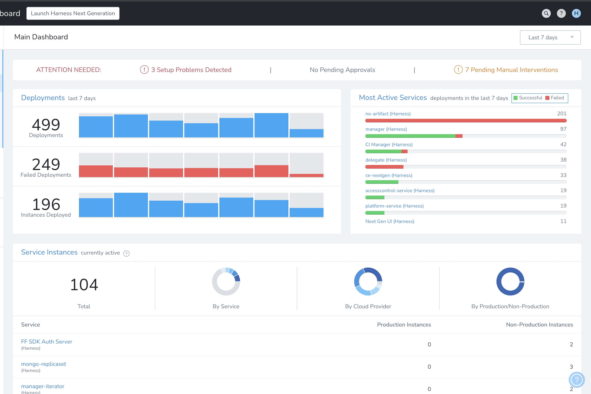

#### Fixed issues

This release does not include fixed issues.

### March 24, 2023, version 78817

#### Early access

This release does not include early access features.

#### What's new

This release does not include new features.

#### Fixed issues

- The `/usageRestrictions/apps` API was being called multiple times with the same parameters. (CDS-54646)

  This issue is fixed. The API is now called only once. 

### March 15, 2023, version 78712

#### Early access

- Large repositories are now supported for [Azure Repo](https://developer.harness.io/docs/platform/Connectors/Code-Repositories/connect-to-a-azure-repo). This functionality is behind a feature flag, `OTIMIZED_GET_FETCH_FILES`.

	Harness performs a `git clone` to fetch files. When fetching very large repositories, the network connection may time out. Enable the feature flag, `OPTIMIZED_GIT_FETCH_FILES` to fetch very large repositories from Azure Repo. When this feature flag is enabled, Harness will use provider-specific APIs to improve performance.

#### What's new

- The API keys will now be encrypted with Harness Global Secrets Manager. (PL-30970)

#### Fixed issues

- When a secret is used to create a Prometheus connector, the setup usage is not displayed. (PL-30755)
  
  A code enhancement has fixed this issue.

### March 8, 2023, version 78619

#### Early access

This release does not include any early access features.

#### What's new

- You can now access your account immediately after resetting your password. (PL-30878)

#### Fixed issues

- Kubernetes API calls were ignoring the proxy username and password. (CDS-48646)
  
  You can access Kubernetes in proxy mode by providing the location and credentials directly to the HTTP client.
  
  Harness was not handling the proxy use case.
  
  Now Harness handles the use case by adding the username and password to the HTTP client.
- Unable to fetch the correct Google Cloud Storage (GCS) artifacts when manually triggering the pipeline though the correct artifacts were being listed in the **Manually Select An Artifact** dialog's **Artifact** field list. (CDS-53074, ZD-39446)
  
  This issue is fixed.

### February 23, 2023, version 78507

#### What's new

- Upgrades have been made to the following libraries:

  - The Spring Data MongoDB package has been upgraded to version 3.4.7.
  - Spring Data Commons has been upgraded to version 2.77.
  - The MongoDB Java Driver has been upgraded to version 4.6.1. (PL-30730)

#### Early access

This release does not include any early access feature.

#### Fixed issues

This release does not include any fixed issue.


### February 15, 2023, version 78421

#### What's new

- LDAP throws a null pointer exception if more than one user is returned for a given base DN and search query. (PL-31106)

  A code enhancement has fixed this and an appropriate error message is displayed.

#### Early access

No early access features are available in this release.

#### Fixed issues

- On the secret page, you can also see how many times the secret has been decrypted. A high number of details increases the loading time, which affects performance. (PL-31129)

  The introduction of the feature flag `SPG_DISABLE_SECRET_DETAILS` has fixed this issue. Enable this feature flag to hide additional details from the secret page and enhance performance.

### February 6, 2023, version 78321

#### What's new

- The elastic search client version is upgraded to `7.17.7`. (PL-30666)

#### Early access

- The feature flag `NOTIFY_GIT_SYNC_ERRORS_PER_APP` lets you receive git sync error alerts. (PL-29306)
  
  The alert contains the name of the application where the git sync error occurred.

- You can delete a user provisioned in Harness through SCIM in FirstGen and retain the user in NextGen by enabling the feature flag `PL_USER_DELETION_V2`. (PL-23577)


#### Fixed issues

- When the scheduling of background jobs is skipped during startup, background jobs like the deletion of old records do not work.  (PL-31009)
   
  A code enhancement has fixed this issue.

- Selecting a specific audit filter for an API key causes the UI to become unresponsive. (PL-30715, ZD-38400)
  
  An added check ensures that only essential data is sent for display. This has fixed the issue.

- SAML users removed from the LDAP group are displayed in the linked user group in Harness. (PL-30291, ZD-37758)

  A code enhancement has fixed this issue.


### January 17, 2023, version 78105

Delegate version: 78101

#### What's new

- Convert imperative Kubernetes rollback to declarative rollback. (CDS-2993)

  This functionality is behind a feature flag: `CDP_USE_K8S_DECLARATIVE_ROLLBACK_NG`.

  Harness applies Kubernetes manifest  using `kubectl apply`, which is a declarative way of creating Kubernetes objects. But when rolling back, we perform `kubectl rollout undo workloadType/workloadName --to-revision=<REVISION_NUMBER>`, which is an imperative way of rolling back. Using imperative and declarative commands together is not recommended and can cause issues.

 In some instances, the workload spec was not updated properly when `rollout undo` was performed. Subsequent deployments then refered to an invalid spec of the workload and caused Kubernetes issues like [kubectl rollout undo should warn about undefined behaviour with kubectl apply](https://github.com/kubernetes/kubernetes/issues/94698).

  **What is the fix?**
  We had to redesign our release history to store all rendered manifests in secrets, just like Helm does. While rolling back, we are now reapplying the last successful release's manifests. This solves this issue.

  **What is the impact on customers?**
    - Enabling declarative rollback disables versioning (even if the **Skip Versioning** checkbox is left unchecked), since versioning was introduced with the imperative rollback design. However, versioning is not needed anymore with declarative rollback.
    - The delegate's service account needs the permission to create, update, and read secrets in the defined infrastructure namespace. Typically, customers' delegates already have these permissions, but if cluster roles are strictly scoped, this could cause failures. 
	
#### Early access

- Support for AWS S3 as a Terraform script file source for the Terraform Provision and Apply steps. (CDS-2970)
  
  This functionality is behind a feature flag: `CDS_TERRAFORM_S3_SUPPORT`.
  
  You can now use AWS S3 as a file source in the Terraform [Provision](https://developer.harness.io/docs/first-gen/continuous-delivery/terraform-category/terraform-provisioner-step) and [Apply](https://developer.harness.io/docs/first-gen/continuous-delivery/terraform-category/using-the-terraform-apply-command) steps.

#### Fixed issues

- Clicking on the **Forgot password** button after disabling SSO authentication is redirecting to the Harness FirstGen authentication UI. (PL-24649)
  
  This is now fixed and users are redirected to the NextGen authentication UI.

### January 5, 2023, version 78105

Delegate version: 78100

#### What's new
  
- Add the status of the collection in the artifactsource response in GraphQL API. (CDS-44426)
  
  You can retrieve the value of the collectionEnabled field for an Artifact Source using GraphQL APIs, like in the example below:
  ```
    {
      services(limit: 5) {
        nodes {
          name
          artifactSources {
            name
            collectionEnabled
          }
        }
      }
    }	
  ```
  
- Delegate tasks are now limited based on account. (DEL-5371)

  Limits are being introduced on the maximum number of tasks that can be created based on the account. Enforcement of task limits will be implemented at a later date and based on the product license.
  
- The following libraries of the Apache CXF open-source services framework (`org.apache.cxf`) were upgraded to version 3.5.5 to fix vulnerabilities. The delegate base image was updated from `redhat/ubi8-minimal:8.4` to `redhat/ubi8-minimal:8.7` to reflect these changes. (DEL-5591)

  The Apache CXF libraries were found to be vulnerable to exploits including reflected Cross-Site Scripting (XSS) and code exfiltration. For a list of Common Vulnerabilities and Exposures (CVEs), see [CVE Details](https://www.cvedetails.com/vulnerability-list/vendor_id-45/product_id-19906/Apache-CXF.html). 
  
  | Library name and version | 
  | :-- |
  | `org.apache.cxf:cxf-core:3.5.4` | 
  | `org.apache.cxf:cxf-rt-bindings-soap:3.5.4` | 
  | `org.apache.cxf:cxf-rt-bindings-xml:3.5.4` | 
  | `org.apache.cxf:cxf-rt-databinding-jaxb:3.5.4` | 
  | `org.apache.cxf:cxf-rt-frontend-jaxws:3.5.4` | 
  | `org.apache.cxf:cxf-rt-frontend-simple:3.5.4` | 
  | `org.apache.cxf:cxf-rt-transports-http-hc:3.5.4` | 
  | `org.apache.cxf:cxf-rt-transports-http:3.5.4` | 
  | `org.apache.cxf:cxf-rt-ws-addr:3.5.4` | 
  | `org.apache.cxf:cxf-rt-ws-policy:3.5.4` | 
  | `org.apache.cxf:cxf-rt-wsdl:3.5.4` | 
 
- The following libraries of the `io.netty:netty*` client/server framework were updated to version 4.1.86.Final to fix vulnerabilities. (DEL-5632)

  The `io.netty:netty*` libraries were upgraded to mitigate the risk of denial-of-service (DoS) attack. Netty versions 4.1.0 to 4.1.67 are vulnerable, for example, to the exploits described in [CVE02021-37136](https://cve.mitre.org/cgi-bin/cvename.cgi?name=CVE-2021-37136) and [CVE-2021-37137](https://cve.mitre.org/cgi-bin/cvename.cgi?name=CVE-2021-37137). 
  
  | Library name and version | 
  | :-- | 
  | `io.netty:netty-all:4.1.77.Final` | 
  | `io.netty:netty-buffer:4.1.77.Final` |
  | `io.netty:netty-handler-proxy:4.1.77.Final` |
  | `io.netty:netty-common:4.1.77.Final` |
  | `io.netty:netty-handler:4.1.77.Final` |
  | `io.netty:netty-resolver-dns:4.1.77.Final` |
  | `io.netty:netty-resolver:4.1.77.Final` | 
  | `io.netty:netty-transport-native-epoll:linux-x86_64:4.1.77.Final` | 
  | `io.netty:netty-transport-native-kqueue:4.1.77.Final` | 
  | `io.netty:netty-transport-native-unix-common:4.1.77.Final` | 
  | `io.netty:netty-transport:4.1.77.Final` |

#### Fixed issues
  
- `DelegateGroup` is not removed from the database or the UI after the associated delegate is deleted (DEL-3913)
  - Changed code to ensure that an inactive delegate is deleted from the UI after seven days.
  


### December 22, 2022, version 77908

Delegate version: 77802

#### What's new

- No new features are available for this release.

#### Early access

- No early access features are available for this release.

#### Enhancements

- Decreasing the overall **all perpetual task** count. (CDS-46240)

  Now we create a perpetual task on the basis of the cloud provider. This decreases the **all perpetual task** counts overall.The Harness Manager is not changed and no user action is required.
  
- Log improvement when only the ConfigMap is deployed. (CDS-47901)

  Harness only performs versioning when a Deployment, StatefulSet, DaemonSet and DeploymentConfig is performed. These are called managed workloads.
  
  In deployments of ConfigMaps without managed workloads, no versioning is performed. 
  
  The logs have been improved to indicate that no managed workloads were found
  
  **Note:** If the `harness.io/skip-versioning: "true"` annotation is in a manifest, Harness does not track release versions.
  
- For information about compatibility between Harness Manager and delegate versions, query the new `supportedDelegate` endpoint. Include your account ID (`accountId`) in the request URL as shown in the following example. Specify your API key in the `x-api-key` field of the request header. (DEL-5019)

  ```
  curl -X GET 'https://app.harness.io/api/version/supportedDelegate?accountId=<> \
  -H 'x-api-key: <api-key>'
  ```

- Added internal metrics to track the pattern of automatic delegate upgrades. (DEL-5383)
 
- Added a check to the container start process to ensure the user has the file permissions required to run the delegate. If user permissions are inadequate, the delegate fails fast and displays an error message. (DEL-5440)

#### Fixed issues

* Avoid calling `closeChannel` more than one time during watcher shutdown. Invoking the method two times can cause the `logsAvoid` method to unnecessarily wait during executor shutdown. (DEL-4924)
 
* Fixed a shell delegate issue that occurred on restart. The delegate name was not visible. (DEL-5443)

### December 13, 2022, version 77808

#### Fixed issues

* Users are not added to the user groups through SCIM when the authentication mechanism is username and password. (PL-30124)  
A notification email is sent to the users instead of an email invite and the system throws an exception.  
Sending an email invite has fixed this issue and the users are now added to the user groups.
* Rollback artifact number (`${rollbackArtifact.buildNo}`) is coming as null (CDS-47328, ZD-37309)  
Fixed a problem where incorrect metadata was being populated into executions after updating the environment's infra definitions.  
For more information, go to [Artifact Rollback Variables](../firstgen-platform/techref-category/variables/built-in-variables-list.md#artifact-rollback-variables).
* **Rollback Deployment** button incorrectly showing Not Authorized (CDS-17420)  
When the `FREEZE_DURING_MIGRATION` feature flag was enabled in an account, the **Rollback Deployment** button was marked User Not Authorized.   
Now, when the `FREEZE_DURING_MIGRATION` feature flag is enabled in an account, the **Rollback Deployment** button is available if the user has the correct permissions).

### December 7, 2022, version 77716

Delegate: 77800

#### New features and enhancements

* Harness masks all the JSON Web Tokens (JWTs) in the pipelines and delegate logs. (PL-29019)  
This prevents data leakage risks for the applications running in Harness.
* For Terraform provisioning, when a **Backend Configuration (Remote State)** is specified, the content of the configuration will be shown before executing `terraform init` (secrets will be hidden). (CDS-3906)  
For more information, see [Backend Configuration (Remote state)](../continuous-delivery/terraform-category/terraform-provisioner-step.md#option-backend-configuration-remote-state).

#### Fixed issues

* Slow running Looker queries in Deployments (FirstGen) dashboard (CDS-45074)  
When the customer uses fields for Deployments Tags, the queries became extremely slow.  
Removed a few unused indexes and added a few indexes to improve the speed of queries.
* Hide NextGen option is enabled by default for the **Account Admin** user group in all the new trial accounts. (PL-30070)  
Disabling the **Harness NextGen** option by default for the **Account Admin** user groups has fixed this issue.

### November 29, 2022, version 77608

Delegate: 77609

#### New features and enhancements

* You can now control the user group access to NextGen by enabling or disabling the `Hide NextGen Button` permissions in **Account Permissions**. (PL-28235)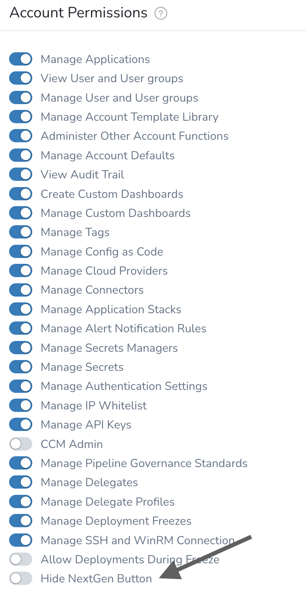When you enable this permission, Harness will not provide an option to launch Harness NextGen to the group members.

#### Fixed issues

* Adopted the use of an immutable image for the delegate that is installed by default in newly created accounts. For more information on new delegate features including auto-update, see [Delegate Overview](/docs/platform/2_Delegates/delegate-concepts/delegate-overview.md). (DEL-4888)
* Removed the delegate dependency on Java driver component `mongo-java-driver` . This eliminates vulnerability [CVE-2021-20328](https://nvd.nist.gov/vuln/detail/CVE-2021-20328) affecting client-side field level encryption (CSFLE). (DEL-5308)
* Changed the base image that the non-legacy delegate uses to `redhat/ubi8-minimal:latest`. This ensures that each release includes all OS-level security updates. (DEL-5386)
* Disabling the feature flag `LDAP_SECRET_AUTH` restricts referencing secrets for LDAP connection. (PL-29668)  
This feature flag is now removed to enable referencing secrets for LDAP connection.
* When adding a new user to a user group through GraphQL APIs while the feaure flag `AUTO_ACCEPT_SAML_ACCOUNT_INVITES` is enabled, the Audit logs show incorrect details. (PL-28828, ZD-35485)
* When a delegate is down, there is a delay in sending notifications. (PL-28400, ZD-34766,35873,35878)  
This has now been fixed by increasing the number of threads in the thread pool to enable the background jobs to pick corresponding alerts and send the notifications.
* When trying to delete a user provisioned through SCIM, the tooltip displays "User is not authorized". (PL-25845)  
The tooltip text displays the correct message now to indicate that the user is externally managed and cannot be deleted from Harness.
* Kubernetes deployments were failing if a Shell Script step was placed after deployment steps (CDS-46163)
* Perpetual task interval correction for instance sync (CDS-46099) Perpetual task interval for instance sync is 10 min
* Coverage for Stage and Step level deployment details task (CDS-45839)  
Added unit tests.
* Application is not showing in dropdown (CDS-45647, ZD-36114, ZD-36510)  
If user searched any query, then the Id provided to the child component restricted pagination. Now the Id is updated to the parent level so that if elements are more than 10/15, infinite scroll is enabled and all the matching results are fetched.
* New Artifact Trigger will not run until at least a second artifact is found (CDS-45417, ZD-35671, ZD-35738)  
Earlier On New Artifact Triggers didn't trigger any execution until successful artifact collection on the server. Because of this, if customer had an artifact server that had artifact trigger setup but the artifact server was not available at the time and when server was made available with an artifact in it, trigger did not fire any execution. 

  To address this we changed the behavior as follows:
	
  1. If the artifact server is reachable and has few artifacts: We will create the trigger, and not trigger any execution unless a new artifact is pushed in the artifact server (same behavior as today).
	
	2. Artifact server is not valid: We will create trigger and trigger an execution as soon as artifact server is reachable and has some artifact.
	
	3. Artifact server is not reachable and has few artifacts: We will create trigger, once the artifact server is reachable, we will trigger an execution on last artifact even if it existed before creating trigger. (This is because we cannot separate out #2 and this scenario.).
	
	4. Artifact server is reachable and doesn’t have any artifact: We will create trigger, and execution will be fired as soon as something is pushed in server.
	
* Harness Manager and GraphQL missing Git Connector information (CDS-44299, ZD-35185)  
The property sent to the backend was wrong and it was removed. Now we can fetch the correct connector list.
* API Enhancement: Create Git Connector API enhanced with update of provider type (CDS-44001)  
It is now possible to change and fetch Git provider type from Connectors GraphQL
* NPE when trying to click a version of a linked Shell Script step from Template Library (CDS-36784)  
Fixed a bug where the linked template in the pre-deployment step in the canary workflow did not show the correct version

### November 11, 2022, version 77433

Delegate: 77431

#### Fixed issues

* New User is added in a pending state. (PL-29495)  
Now, when auth method is SAML and Two-Factor Auth is ON: user is added into verified state and a notify email with 2FA QR code is sent. When auth method is SAML and Two-Factor Auth is OFF: user is added into verified state and no email is sent.
* The API to fetch list of secrets is taking longer than expected. (PL-29186, ZD-35968)  
This has now been fixed by maintaining the secret logs for 90 days.
* Deployment recon task failing (CDS-45694)  
Longer retention for deployment in custom dashboards was failing due to a missing null check which has been added.
* Service Dashboard showing the wrong Artifact info from what was deployed (CDS-43477, ZD-34546)  
Fixed a bug where the Services dashboard statistics did not show the correct version of the artifact when a workflow rollback failed.
* Git configuration files on Delegate overriding jgit (CDS-42833, ZD-33226)  
We created a new option for Git Connectors. This option, called **Ignore User’s .gitconfig**, when enabled makes Git commands running in Delegate ignore the **$HOME/.gitconfig** file present in the Delegate's filesystem.

  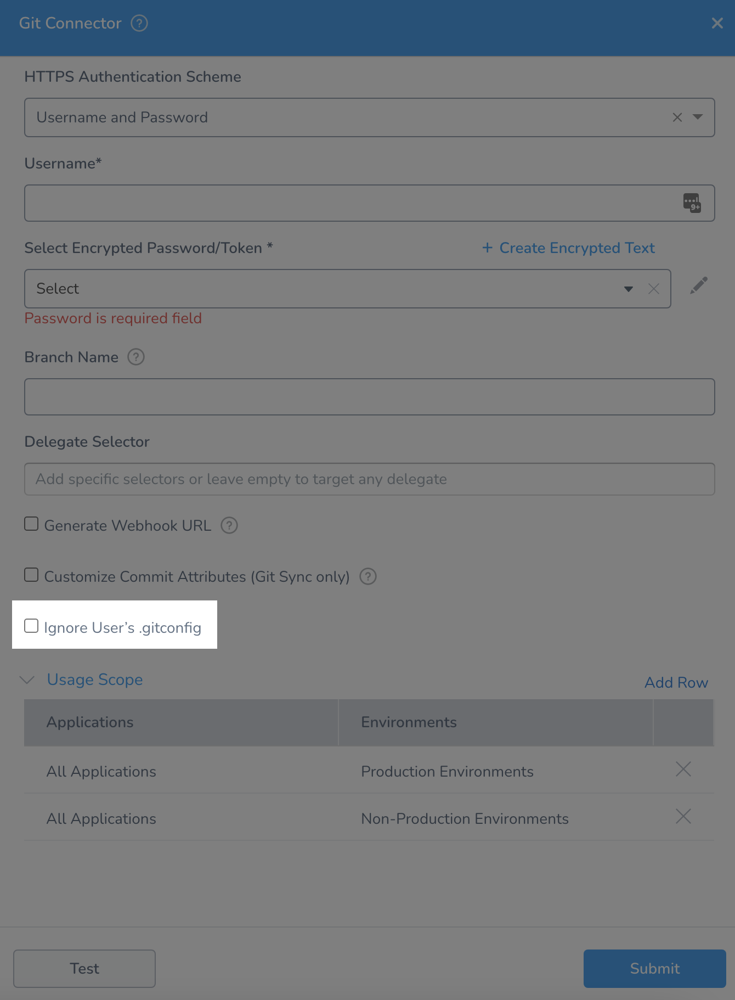
	
* The `HELM_STEADY_STATE_CHECK_1_16` is released to general audience (CDS-40269)  
To enable steady state check with Helm deployments, you no longer need to enable the `HELM_STEADY_STATE_CHECK_1_16` feature flag while using Kubernetes version >= 1.16.

### November 6, 2022, version 77317

#### Fixed issues

* Dashboards Data Issue: Missing Service Names for Deployments with Running Status (CDS-44014)  
Updated the Workflow Execution before publishing event and updating the timescale database, which allows time scale database to be populated with deployed service Ids while workflow or pipeline is running.
* Deployments Page Filters Problems (CDS-43346, ZD-28902, ZD-34686)  
Filter should work properly when user tries to switch from filter 2 to filter 1.
* The list of service variables were not getting populated in the Environment details section. (PL-29027)  
This has now been fixed to enable selection of config variables for selected service.
* The Kubernetes workload recommendation slow query issue.  
The absence of an index was causing slow query. Now, the index has been created. (CCM-9609)

### October 21, 2022, version 77221

Delegate: 77221

#### New features and enhancements

This release does not include new features.

#### Fixed issues

* Fixed a regression issue that allowed delegate tasks to continue to run when delegates were not able to research external resources. (DEL-5100)
* A bad query on instance collection scans all the records, causing a high level of disk utilization. (CDS-44485)  
This issue has been resolved.
* When an active deployment freeze is on and no entries exist for app exclusions, the workflow deployment fails with an `appID may not be null` error. This issue occurs when the `SPG_NEW_DEPLOYMENT_FREEZE_EXCLUSIONS` feature flag is enabled. (CDS-44408)  
Validation has been added to prevent empty Application, Environment, and Service IDs in the **Deployment Freeze Window** screen.
* Fields overlap on the **Deployment Freeze Window** screen. (CDS-44396)  
This issue has been resolved.
* Users cannot set up start time and end time in a Jira step. (CDS-43410) (ZD-34705)  
This issue has been resolved.
* Terraform apply steps fail intermittently with an I/O exception. (CDS-40336) (ZD-32237) (ZD-34859)  
Multiple parallel workflows were running the Terraform task. For example, one of the workflows cloned a git repository, but before it could copy it to a working directory on the delegate, another workflow reset it and cloned another repository. This caused a File Not Found exception for the first workflow.  
This was happening because Harness cloned the git repository and copied it to a working directory in two different steps asynchronously. The two steps are now performed synchronously, which allows multiple workflows to run in parallel using the same Terraform provisioner.

### October 18, 2022, version 77116

Delegate: 77021

#### New features and enhancements

* Upgraded Bouncy Castle Crypto API component `org.bouncycastle:bcprov-exte-jdk15on` to version 1.70 (DEL-4433)
* Git Connector Kerberos support (CDS-40206)  
  The option to use Kerberos authentication while creating a Git Connector was behind a Feature Flag.

 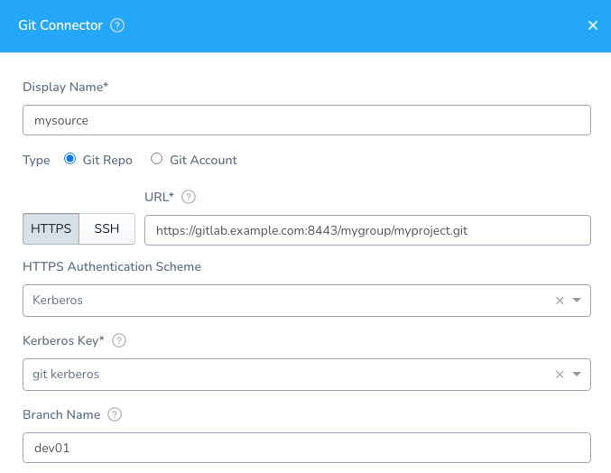

#### Fixed issues

* Fixed the root user type to correct an error in its interpretation. The error prevented a change to the `securityContext` field in the delegate YAML. (DEL-5056)
* Added validation to ensure the download of the correct delegate version. This fixed a problem that occurred when the `os_arch` value indicated a platform type of `amd64` instead of `x86_64`. (DEL-5060)
* UI breaking and freezing windows (CDS-44225)  
Fixed by removing a global level CSS and applying it to particular component.
* Cloud Providers page 'Create Encrypted fields and Encrypted text' settings are overlapped (CDS-44187)  
Fixed overlapping text by removing unnecessary classname.
* When creating a Custom Secret Manager, the error message displayed incase of invalid parameters was not correct. (PL-26372)  
This is now fixed by including the references to the secret and the template from the Custom Secret Manager to provide the necessary information to the error message.

### October 7, 2022, version 77025

Delegate: 77021

#### New features and enhancements

* Show user email for Approvals done via API key (CDS-43911)  
When an Approval step is approved via API, the email address of the approver is now displayed in the deployment: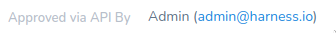
* The GraphQL mutation for approve or reject approvals now has a new input field for user email address. (PL-24488, ZD-28025)  
If this field is provided when approving or rejecting, it appears in the approval details.  
Additionally, the feature flag SPG\_ENABLE\_EMAIL\_VALIDATION is now present. When this feature flag is enabled, the user email address in the GraphQL mutation must map to a user who belongs to the allowed user groups selected for the approval step.

#### Fixed issues

* Changed code to reduce the volume of API calls made to retrieve the delegate configuration. This resolves a problem with API calls made to determine the configuration of a deactivated delegate. (DEL-4667)
* Overriding of default value in Pipeline variable allowed without checking allowed value list (CDS-43945)  
Now we check that the default value of the pipeline variable is among allowed values of the pipeline variable.
* Performance issues for fix mentioned in (CDS-41832, CDS-43767, ZD-34771)
* Facing issue with Date and Time format in Jira Create step (CDS-43410, ZD-34705)  
Fixed the issue for invalid datetime value that customer was facing.
* Harness doesn't kill PowerShell session upon Workflow execution time out (CDS-42400, ZD-33890)  
Resolved a bug in ProcessStopper.

### September 29, 2022, version 76921

Delegate: 76810

#### New features and enhancements

* The specification of the delegateGroup version was changed for the Immutable Delegate. The value was changed to the minimum version of the Delegate. Formerly the delegateGroup variable contained a list of version numbers. (DEL-4889)

#### Fixed issues

* Changed code to fix an issue that caused watcher calls to Harness Manager to fail when the manager was not available. The code was changed to ensure that a boolean value indicating that watching is enabled is reset when the workflow exits. (DEL-4892)
* Clarified an error message that explains the reason a task was not performed. because delegates could not access the resource. (DEL-4903, ZED-33908)
* Deployed a separate field for the Immutable Delegate version on ring. (DEL-4911)
* The secret dropdown component which has a separate link alongside **Create new secret** was not working at a few places (LDAP, Connector). This issue is fixed now. Clicking the button opens the create a new secret modal.​ (PL-27901)
* Update Jira step failing (CDS-43409)  
Fixed a bug where time tracking fields were not working when the ALLOW\_USER\_TYPE\_FIELDS feature flag was enabled.
* ECS Service Definition is not getting copied while cloning an ECS Service (CDS-43205, ZD-34533)  
Now when cloning an ECS Service, we clone the Service Definition as well.
* Artifactory Helm Failure (CDS-43084, ZD-34437)  
Added new logs for Helm charts using Artifactory. The fields added were the name of the chart and bucket name.
* Variable does not come up as required in Pipeline for Workflow variables (CDS-41949, ZD-33503)  
If the same variable was used twice in the Pipeline, it was not being resolved correctly. This has been fixed and now the variables will always honor the latest value.
* Enum for connection string type should be MySQL instead of MySql (CDS-40420)  
Users can now successfully deploy Azure WebApp services with MySQL connection strings.

### September 22, 2022, version 76817

**Delegate: 76810**

#### New features and enhancements

API key authentication was introduced for the following endpoints:

* /delegate-scopes/
* /setup/delegates/
* /setup/delegates/v3/downloadUrl/
* /setup/delegates/status2/

(DEL-4602)

#### Fixed issues

* Looping variable expansions were not consistent in Pipelines. (PIE-4769)  
This is fixed now by adding a new expression to get the total alterations:  
`<+strategy.totalIterations>​`
* Sorting by Date not working in Service Dashboard (CDS-42122, ZD-33767)  
Sorting in the Services dashboard was not working for a specific Service. This issue has been fixed. Sorting works as expected for all columns in the Services dashboard.
* Terraform apply fails intermittently with IO Failure (CDS-40336, ZD-32237)  
When multiple parallel workflows run in a Terraform task with one workflow cloning a Git repository, a second workflow reset and cloned another repository before the first workflow could copy the repository to a Delegate’s working directory. This issue occurred because the Git repository was being cloned and copied to a working directory in two different steps that were not synchronous. This issue has been fixed.
* Harness Manager UI was modified to ensure that Delegate version and associated information clarifies the difference between older immutable and legacy Delegates. (DEL-4826)
* The logic supporting the Delegate auto-update feature was modified to handle a case in GCP where the feature remained enabled when it should have been suspended. (DEL-4828)
* Expiration was added to method calls to verify Delegate heartbeat. (DEL-4851)  
This corrects an issue that caused long-running Delegates that had not been restarted to appear as `Expired` in instance status information.

### September 14, 2022, version 76708

#### Enhancements

* Delegate logic was enhanced to ensure that redis connection errors do not interfere with task acquisition. (DEL-4617, ZD-33464)
* You can now make GET calls to the following endpoints using API-KEY​: (PL-27119)
	+ /app-manifests/​
	+ /artifactstreams/​
	+ /environments/​
	+ /infrastructure-definitions/​
	+ /pipelines/
	+ /resource-constraints/
	+ /services/​
	+ /service-variables/ ​
	+ /settings/ ​
	+ /tags/links/​
	+ /triggers/ ​
	+ /userGroups/​

#### Early Access

* When using a Build Workflow followed by multiple Workflows in a Pipeline, you can now pass the same artifact from the first Build Workflow to rest of the Workflows in the Pipeline that deploy the same Harness Service (CDS-38955, ZD-31776)  
Execution of each Workflow will use the artifact collected by the last run Build Workflow in the Pipeline that has collected the artifact from the same Service.  
In the first Build Workflow's **Artifact Collection** step's **Build/Tag** setting, you specify the artifact to collect. For subsequent **Artifact Collection** steps in the same and subsequent Workflows in the Pipeline deploying the same Service, you can leave the **Artifact Collection** step's **Build/Tag** setting empty and Harness will use the artifact collected by the last Build Workflow in the Pipeline.  
This functionality requires the Feature Flag `SORT_ARTIFACTS_IN_UPDATED_ORDER`.

#### Fixed issues

* Error message improvement: When retrieving Secret file encrypted using corrupted KMS token (CDS-43080)
* UI showing the wrong Rollback Artifact details (CDS-42327, ZD-29101, ZD-32440, ZD-33792) Fixed a bug where the Rollback was showing the wrong artifact build in the ui only.
* Tags are not getting populated on the Deployment Page correctly (CDS-41001, ZD-32937) Tags that were getting unresolved after the Approval step remained unresolved. Tags were also getting unresolved after resuming an expired Workflow. They now get resolved after the stage that they resumed from completes while enabling the Feature Flag `MERGE_RUNTIME_VARIABLES_IN_RESUME`.
* Logging was added to record the reason for disconnection between Harness Manager and Delegates. (DEL-4800, ZD-343287)

### September 7, 2022, version 76619

#### Enhancements for CD

* Nexus RAW Repository type support (CDS-38260, ZD-20638, ZD-30449, ZD-33630). You can now add artifacts from Nexus3 raw repository formats in Harness CG. Enable the feature flag `NEXUS3_RAW_REPOSITORY`for this feature, and the raw repository format will be available as an artifact source.

#### Fixed Issues for CD

* Manifest chart collection is failing in PRE-QA for V2 services (CDS-42581). This issue has been fixed.
* Trigger on last deployed artifact is failing to find the artifact - Harness doesn't account for different service if workflow is templatized (CDS-41832, ZD-33449). You can now find the artifacts from the last deployed workflow or pipeline with the same service as triggered workflow when the feature flag `SERVICE_ID_FILTER_FOR_TRIGGERS` is enabled.
* Terraform plan should be encrypted and not be visible in the UI (CDS-41149, ZD-32913). When the feature flag `OPTIMIZED_TF_PLAN` is enabled, the shell script step will not fail for $(terrformPlan.jsonFilePath()) expression and the value of this expression will be null.
* Fixed the display of an error message in the UI. The error message was not properly displayed when a pipeline selector was added using invalid characters. (DEL-4755)

#### Enhancements for Harness Platform

* You can exclude applications when assigning permissions to User Groups in Harness. (PL-26819)  
See [Exclude Applications](../firstgen-platform/security/access-management-howtos/users-and-permissions.md).
* The support for CyberArk secret manager is now deprecated. (PL-25423)

### August 31, 2022, version 76518

#### New features and enhancements

This release does not include new features.

#### Fixed Issues for CD

* Hide "Mark as Success" and "Mark as Failures" in UI for CG (CDS-41031).  
The "Mark as Success" and "Mark as Failures" have been removed from Jenkins running stage.
* Approval Step, Reject Approval will execute a Rollback (CDS-40853) (Zendesk Ticket ID 19570).  
The Approval Step has two buttons: **Reject and Rollback** and **Reject**. When you clicked on either button, the Rollback was executed. The **Reject** button has been renamed as **Reject and Follow Failure Strategy**. When a rejection occurs, it was being processed as an application error and the rollback was occuring for the failure strategy. This issue has been fixed.
* Approval using Slack is not working in Prod 1 (CDS-42064) (Zendesk Ticket ID 33758).  
Slack approval was not working in the workflow execution steps for Prod 1 accounts. This issue has been fixed.
* Manager taking too much time to assign a task (CDS-41999) (Zendesk Ticket ID 33514)  
API access type for GitLab connector was not being populated. This issue has been fixed.
* Trigger on Last Deployed Artifact is Failing to Find Artifact (CDS-41896) (Zendesk Ticket ID 33547)    
Triggered pipeline was unable to fetch artifacts from parent pipeline earlier when FF RTIFACT\_COLLECTION\_CONFIGURABLE was enabled . This issue has been fixed.
* Trigger on Last Deployed Artifact is Failing to Find Artifact - Harness doesn't account for different service if workflow is templatized (CDS-41832) (Zendesk Ticket ID 33449)  
This issue has been fixed. You can now find the artifacts from last deployed workflow or pipeline with the same service as the triggered workflow by enabling the added feature flag.
* Jira approval step was still waiting although Jira status was changed to Approve criteria (CDS-41567) (Zendesk Ticket ID 33416).  
 This issue has been fixed.

#### Fixed issues for Harness Platform

* Token renewal for AppRole-based login in the vault happened using a background iterator.  
It was not recommended to store a token if its TTL is less than the iterator interval. (PL-26472)  
This has been fixed by removing the AppRole token renewal. Now the token is fetched on the fly before any CRUD operation by doing AppRole login with `secretId` and `AppRoleId`.  
This fix is behind the feature flag `DO_NOT_RENEW_APPROLE_TOKEN`.

### August 25, 2022, version 76425

* Delegate Version: 76420

#### Enhancements

* Change Harness Users per account default limit to 50k users for paid accounts (PL-27300)
* For Immutable Delegates, the Harness Manager will receive information about when the upgrader was last updated and if autoUpgrade is off/on (DEL-4379)
* Upgrade GO in go-template 0.4 to 1.17.9 from 1.16.4 (CDS-41347)  
The Harness Delegate includes a new binary of go-template (version 0.4.1) For the default Harness Delegates, this version works out of the box. For a no-tools Delegate, you need to manually download the binary. It's be available on: https://app.harness.io/public/shared/tools/go-template/release/v0.4.1/bin/linux/amd64/go-template
* Removed library nanohttpd. Outdated. Upgraded the azure-identity version from 1.1.2 to 1.4.4 to remove vulnerabilities (CDS-40796)

#### Fixed issues

* Not able to select encrypted text in environment variable override (PL-27444, ZD-33520)  
In Variable Overrides, it was not allowed to select of "Type" ('Text' or 'Encrypted Text') for single individual services. "Type" Dropdown was always disabled for specific services. It only allowed it for 'All Services' (PL-26345). This happened as a part of implementation of a new, faster component. This issue has been resolved. Now users will be able to set VariableOverrides even for single individuals services.
* GraphQL User Not Authorized (PL-27092, ZD-28969, ZD-30587, ZD-33183, ZD-33347, ZD-33487, ZD-33506)
* Add validation for SecretName Prefix (PL-19543)
* Add Encrypted Text for GCP Secret Manager: mandatory Version setting needs an asterisk (PL-14239)
* Failure Strategy Retry is taking null from 2nd retry for execution input (PIE-4874)  
On retry we create a new nodeExecution, so the execution input instance was not present for the new nodeExecutionId. Fix: While cloning the nodeExecution for retry, we are now cloning the execution input instance as well.
* Providing User Group at execution time failing (PIE-4810)  
It was happening because we were not handling arrayNode while converting the merged template yaml to map. Added support for the list.
* "Failed to start watcher" error fixed in Delegate (DEL-4672)  
Modified the Delegate code to download start.sh script every attempt to start watcher.
* Automation Test Failure: ECS Copy Download URL contains /v3 but no other Delegate has it (DEL-4654)
* CloudFormation Rollback Failure (CDS-41919, ZD-33635)
* Tanzu (PCF) tests are failing with the error invalid request: artifact URL is required (CDS-41913)  
Empty artifact URL an exception was being thrown. Removed that exception.
* Remote Terraform Backend Config rename labels to Inline and Git Repository (CDS-41890)
* SFTP connector creation failing (CDS-41868)  
Due to Delegate-side library upgrade, SFTP connector test was failing and is now fixed.
* PostgreSQL query throwing hundreds of errors on Timescale (single quotes not handled properly) (CDS-41793)
* StateMachine Transformation Error (CDS-41652, ZD-33485, ZD-33716)
* 500 Error on HTTP Request (CDS-41642, ZD-33272, ZD-33898)
* Secret value expression resolved in Workflow variable is displayed in plaintext in Pipeline logs (CDS-41544, ZD-33364)  
Workflow variables that uses secret variables and are referenced in Pipelines are now encrypted.
* NPE/MalFormedUrlException when artifact URL incorrect for Tanzu (PCF) deployment (CDS-41357, ZD-32975)  
Throw exception if the Nexus artifact URL is empty
* Fix migration in CDS-37079 (CDS-41232)  
New fields parent\_pipeline\_id and created\_by\_type fields in timescaledb.
* Terraform Destroy step is not changing after any change in UI (unchecking "Inherit from last successful Terraform Apply") (CDS-40195, ZD-32538)

### August 18, 2022, version 76303

#### What's new

* N/A

#### Early Access

* N/A

#### Enhancements

* Added native support to Amazon Managed Service for Prometheus (SRM-4207)
* Upgrade org.apache.cxf\_cxf\_core to version 3.4.7 (DEL-4575). This issue has been fixed.
* Upgrade org.bouncycastle:bcprov-exte-jdk15on to version 1.70 (DEL-4433)
* Users wants to be able to set the Task Count to 0 (CDS-39790).
	+ You can fill 0 value in ECS deployments' fixed instances count. This is implemented with a feature flag `FIXED_INSTANCE_ZERO_ALLOW`.
* Abort/Rollback is disabled during a freeze (CDS-38996)
	+ Enabled rollback and abort in deployment freeze window for pipelines that were running before deployment freeze window is activated.

#### Fixed Issues

* Delegates are not picking up tasks because of redis connection errors (DEL-4617). This issue has been fixed.
* Unable to deploy 401 Forbidden/ 403 for accessing Harness ConfigMap - delegate start script. Examine the environment variables and automatically add the master IP if that env var exists (DEL-3251)
	+ Proxy configured for a delegate will not work on kubernetes master ip. The delegate cannot access KUBERNETES\_SERVICE\_HOST without proxy even if proxy has been configured for delegate.
* UI slowness when editing a hidden variable override (PL-26345)
	+ The VariableOverrides component was slow to load EncryptedText (secrets) due to fetching a large number of them from backend. This issue has been resolved. You should be able to edit variables without any noticeable delay and save the overriden variables. This feature has the feature flag `USE_PAGINATED_ENCRYPT_FOR_VARIABLE_OVERRIDES`.
* Watcher Stackdriver logging not coming up in QA and Prod1 (DEL-4597)
	+ Missing dependencies were added to the watcher.
* Even after setting yaml as POLL\_FOR\_TASKS = true, delegate is coming up with pollForTasks=false (DEL-4571)
	+ The config-delegate.yml in delegate.sh was being overwritten due to the setting in start. sh not being preserved. This issue has has been fixed.
* Delegate Download URl is incorrect and not working (DEL-4545)
	+ This issue has been fixed.
* Invalid Provisioner Name blocks GitSync (CDS-41464)
	+ If the entity name contained gitsync from harness to git, gitsync failed without an alert. This issue has been fixed.
* We shouldn't print docker label itself as the value if the docker label is missing.
	+ The artifact label returns null if it is not present in the artifact. This issue has been fixed.
* Using "delegate: ubi-no-tools" does not work for k8s deployments (CDS-41026)
	+ If you installed only the required tools, Harness attempted to obtain the paths for all tools (helm, go-template, kubectl, oc kustomize and this resulted in a failure prior to deployment. This issue has been fixed. A default value will be used to prevent any failure before starting deployment.
* Tags are not getting populated on the Deployment Page correctly (CDS-40828)
	+ Tags that were unresolved after the Approval step do not get unresolved again.
* Non-prod deployments getting blocked when Freeze window for PROD env is enabled (CDS-40192, CDS-40046, CDS-35655, CDS-32525)
* Supplied missing dependences that prevented Watcher Stackdriver logging from running. (DEL-4597)
* Resolved a conflict that resulted in the overwrite of the `config-delegate.yml` file and interfered with configuration settings in the `start.sh` script. The `delegate.sh` script was changed to rewrite the correct value for the environment variable. (DEL-4571)

### August 8, 2022, version 76128

* Delegate version: 76128

#### What's new

* Approval Step now has **Reject** and **Reject and Rollback** buttons (CDS-40853, ZD-19570)
	+ **Reject** initiates the Failure Strategy for the Workflow. By default, any Workflow you create has rollback as the default Failure Strategy. But in many cases you will have a different Failure Strategy.
	+ **Reject and Rollback** rolls back the Workflow regardless of the Workflow Failure Strategy.
	
	  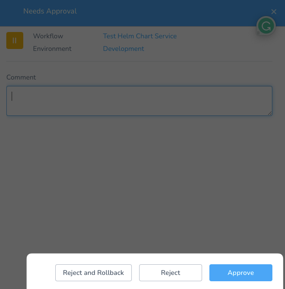
		
* Azure WebApp deployments now support the Basic deployment type (CDS-39316)
	+ You can now deploy to Azure Web services using Basic workflows. This will allow you to deploy to a single slot at a time.

#### Early access

* Harness will pull images with over 10k tags (CDS-25769, ZD-20358, ZD-21781)
	+ Before, if you used a large number of tags for images in your repo, Harness had a limitation of fetching only 10,000.
	+ With this change, you can select one of the available tags from 10k or more or provide a custom tag. During Workflow execution, Harness will fetch the image with the tag and proceed with the deployment. This change is behind a feature flag `SAVE_ARTIFACT_TO_DB`.

#### Enhancements

* The TAR archive utility is bundled with UBI-based Delegate images (DEL-4518)
	+ The utility is widely used in customer scripts and shell tasks but is not available by default on UBI Minimal images.

* Delegates can detect if a client tool is available at the `$PATH` location and use the client tool for task execution (DEL-4344)
	
The discovery process checks the following locations in the order given; the first located tool is used:

- Custom paths configured through legacy environment variables like `KUBECTL_PATH`

- `$PATH` environment variable

- Default tool location (under `./client-tools/`)

- Download the tool to the default tool location (if download is enabled)

The discovery process for immutable Delegates is limited to checking the following locations in the order given:

- `$PATH` environment variable

- Default tool location (under `./client-tools/`)

#### Fixed issues

* Unable to use AWS CloudWatch disk metrics in verification step (SRM-11230, ZD-32816)
* Unable to add Stackdriver log verify step as its throwing "The caller does not have permission". Scopes not being honored for Stackdriver's "get-sample-record" in setup (SRM-11087, ZD-32354)
* Git Sync request for One File is bringing in Additional Files (PL-27006, ZD-31453)
* Audit Trail Returning Invalid Information (PL-26598, ZD-31159)
* Config As Code File Explorer displays loading when using search field (PL-26491, ZD-32330)
	+ Only the apps/files which match the query typed in search bar will be displayed and loading is removed if no file present under matching app is there.
* Removal of certain feature flags from manager configuration results in some still being enabled (PL-26379, ZD-31723)
* UI slowness when editing a hidden variable override (PL-26345, ZD-32285)
	+ The VariableOverrides component was slow to load EncryptedText (i.e. secrets) due to fetching a large number of them from backend. This issue has been resolved. We replaced the old component with a new one and added support for paginated and searchable query for choosing EncryptedText field. Now users should be able to edit variables without much delay in the UI and save those overridden variables.
* Optional Fields on Run Pipeline Faces Backend Error (PIE-3687)
	+ The timeout field did not fill with a default value when it is left empty when a fixed value is not set during design time.
* Not able to create Trigger for Pipelines with infra definition as expression (CDS-40901)
	+ Was not able to create triggers when infra definition was made as an expression in a pipeline. The dropdown for service and environment weren't populating. Have fixed the same bug.
* Kubernetes throwing error from Go struct field ObjectMeta.metadata.annotations (CDS-40892)
	+ harness.io/skip-versioning was by default being generated as a boolean, however we now generate it as type String. This change is to ensure support the new kubectl binary. As this is backward compatible, we decided to make this change globally.
* Fix Azure WebbApp basic rollback (CDS-40886)
	+ For Azure WebApp basic deployments rollback, in case of package artifact type it was picking up pre-last successful deployment's artifact however it should pick-up the last one. This issue has been fixed.
* Custom webhook triggers must show the collection disabled manifest/artifact sources when ‘From push event payload' is selected in actions page (CDS-40884)
	+ You should be able to see disabled artifacts in push event in custom webhook triggers.
* Environment Variable resolving to Null value when deployed via pipeline (CDS-40493, ZD-32709, ZD-32731, ZD-32737)
	+ When Workflow variable value was entered as Environment variable expression in deployment modal, it was resolving to null. We added variable resolutions before starting the Workflow stage in pipeline. Environment and Service variables were not getting resolved correctly in those cases. Added fix to keep the expression as it is if it resolves to null during initial resolution. Now the environment/service variable gets resolved to the correct value provided in environment/service.
* Taking a long time to abort an execution (CDS-40452, ZD-32666)
* Using "delegate:ubi-no-tools" does not work for Kubernetes deployments (CDS-40449, ZD-32497)
	+ Some changes were made to fail if tool is not installed and when used with no-tools delegate and user tried to install only required tools it resulted in failure since current logic is to try to get all tools paths (helm, go-template, kubectl, oc, kustomize) before starting deployment. Solution is to ignore failure and fall back to default value that will be binary name.
* Minor issues in Delegate selector field in Jenkins step (CDS-40438)
* Javascript Error Trying to add AMI Artifact Source (CDS-40416)
	+ The feature was facing a empty enum error that was happening in certain artifact forms. We have added the empty check for the enum and now the tag creation should work fine following the normal flow.
* tfPlan files are saved/uploaded and not deleted from KMS (CDS-40341, ZD-31827, ZD-32632)
	+ If new FF is enabled ANALYSE\_TF\_PLAN\_SUMMARY then there are expressions available after Terrafrom Plan step:
		- ${terraformApply.add}
		- ${terraformApply.change}
		- ${terraformApply.destroy}
	+ or there are expressions available after Terrafrom Destroy Plan step:
		- ${terraformDestroy.add}
		- ${terraformDestroy.change}
		- ${terraformDestroy.destroy}
	+ And if there are not changes then the Plan will not get uploaded to the configured Secret Manager (regardless of the checked export option in the Plan step).
* AWS Cloud Provider is not being populated in InfraDef (CDS-40271, ZD-31625)
	+ The change is released under the new FF: EXTRA\_LARGE\_PAGE\_SIZE, which will basically increase the max count from 1200 to 3000.
* User seeing UI issue when loading long deployment filter list (CDS-40182, ZD-32587)
* Terraform Apply job is completing successfully but returning an unknown error (CDS-40083, ZD-31714)
	+ Added warning message in case restricted output names are used for Terraform Publish variable names.
* Chart manifest collection is failing (CDS-40054, ZD-32179)
	+ Chart manifest collection step was failing during deployment since we were trying to update app version and it was null for the customer's helm chart. Have made a fix to skip updating the database in that case. Now manifest collection step succeeds even in that case.
* Config-As-Code YAML will not generate upon invalid User Group ID (CDS-39770, ZD-32247, ZD-32379)
	+ For customers facing issues with usergroup in pipeline yamls we have created feature flag REMOVE\_USERGROUP\_CHECK to help them correct yamls from yaml editor.
* The Deployment Freeze windows are not getting filtered in the audit trails (CDS-39752)
	+ Changed value from AccountResourceType.GOVERNANCE to AccountResourceType.DEPLOYMENT\_FREEZE as we were receiving DEPLOYMENT\_FREEZE in API call
* Check Common Parameters for blank inputs and better error logging (WinRM) (CDS-39586, ZD-32289)
	+ Added fix to throw exception "WinRM Command Parameters cannot be empty. Please remove the empty WinRM Command Parameters pairs" when the user tries to submit WinRM Command Parameters with both parameter and value as empty. Also to handle those empty parameter pairs which are already present now - we will skip them while traversing command parameters and thus the code will not throw InvalidArgument error.
* NPE thrown in Tanzu (PCF) app resize step when app Failed to reach steady state (CDS-39556)
	+ Showing the failure exception on UI on App Resize step failure.
* UI is displaying Step as Success but the Progress bar is at 50% (CDS-39373, ZD-32113)
* Missing data on CCM dashboard (CCM-8233, ZD-32412, ZD-32864)
	+ 1. Added error and info logs in delegate to observe the behaviour in case of any exception.
	+ 2. Added watcher creation retry logic to handle the network failure.
* Changed the Delegate to delete and replace the `config-delegate.yml` file each time the `delegate.sh` script runs (DEL-4571)
	+ This corrected a problem with Harness Manager that affected the behavior of Feature Flags.

### August 1, 2022, version 76003

* Delegate version: 76028

#### What's new

* N/A

#### Early access

* N/A

#### Enhancements

* Add APIs for Delegates (DEL-3520, ZD-31340)
	+ New APIs for listing out Delegates needed for automating delegate installation and usage.
* Support JIRA user assignment fields when using JIRA integration (CDS-28853)
	+ You can now update/create Jira issues with fields of type "user".
	+ For details, go to [Jira Integration](../continuous-delivery/model-cd-pipeline/workflows/jira-integration.md).

#### Fixed issues

* Not able to re-login after logging out (PL-26444, ZD-32400, ZD-32402, ZD-32404)
	+ As a part of security fixes some SAML library were upgraded which caused SAML to break. We reverted back to original version and then added exclusion for velocity jar to fix the issue.
* Long running Harness Manager task lost during Harness upgrade (DEL-4479, ZD-32463)
	+ Fixed backward incompatible enum change with latest versions of Harness Manager.
* Immutable Delegate image is installing client tools even for minimal image (DEL-4478)
	+ Immutable Delegates were still downloading client tools even though disabled explicitly.
* Issue with no-tools Delegate: trying to download missing binaries on launch (DEL-4475)
	+ The no-tools images were downloading the tools on the fly. This change stops the tools binaries to be downloaded.
* Read user is able to download Delegate yaml file on customer account (DEL-4425)
	+ Harness support user will not be able to download a Delegate on customers account.
* Getting "Something went wrong" when clicking on filter in deployment screen (CDS-39936)
	+ Added null check for environment so that if no environments present it should not crash the deployment filters
* Pipeline gives error that infra is required when a particular stage is marked as skipped and we save the stage with empty value for infra variable (CDS-39825)
	+ While adding Infrastructure Definition as template in a pipeline stage and choosing the option to 'always skip' the stage, the deployment was throwing an error message saying infra is invalid. We were still validating infra even when stage is marked as 'always skipped' in which case infra can be empty. Skipped validation of infra in that case to fix the bug. Now we will successfully be able to select 'skip always' option for infra templatized stages too.
* Steady State Check Step Failure (CDS-39623, ZD-31962)
	+ The Steady State Check step is based on old Kubernetes implementation (V1) and is not supported. Going forward we can display an error message to customers saying this step is no longer supported.
* Update artifact details from deployment summary while saving instance in database (CDS-39369)
* Execution Context tab in Kubernetes deployment not showing expressions (CDS-39150)
	+ This was caused because we were not tracking context resolution after Delegate task response. Going further we will track it.
* CF Push does not support 'process' attributes (CDS-38921, ZD-31747)
	+ There were some missing attributes like processes and metadata in Tanzu (PCF) manifest because it wasn't being parsed. Have added the supported CF attributes.
* UI changes for CDS-2992 (CDS-36735)
	+ Displayed the service artifact version and enhanced the design on hovering over the details.
* Workflow Step level failure strategy not being honoured when Workflow level strategy is Ignore (CDS-32524)
	+ Implemented rollback Workflow on step failure strategy behind a Feature Flag ENABLE\_EXPERIMENTAL\_STEP\_FAILURE\_STRATEGIES.
* Create tags are not displayed in the Audit Trail for Workflow and Infra that have been created via cloning (CDS-24569)
	+ Added create tags for Workflows that were created via cloning.

### July 18, 2022, version 75902

#### What's new

* Support JAR files for Azure Web App deployments (CDS-39244)
	+ Harness now supports deploying JAR artifacts to Azure Web apps. Harness zips the JAR and deploys it.
	+ See [Add Non-Containerized Artifacts for Azure Web App Deployment](../continuous-delivery/azure-deployments/azure-webapp-category/add-a-non-containerized-artifacts-for-azure-web-app-deployment.md).

#### Early access

* N/A

#### Enhancements

* N/A

#### Fixed issues

* GraphQL executions using API key fail with user not authorized error, but are working when the same user is logged in (PL-26261)
* Invalid SSO suddenly when enabling the FF AZURE\_SAML\_150\_GROUPS\_SUPPORT + inputting client-id + secret (PL-26215, ZD-31704)
	+ Added logs for SamlAuthBasedHandler.
* NullPointerException while creating service using CAC API (PL-24964, ZD-29601, ZD-29900)
* Pipeline service restart during deployment (PIE-4092)
* Bug in notifications sent from Delegates for Approval (DEL-4431, ZD-32250)
	+ Fixed a bug where Slack messages sent by Delegates were failing.
* Delegate WebSocket connection does not reconnect (DEL-4269, ZD-31018, ZD-31589, ZD-31849)
	+ Delegate makes a WebSocket connection to manager for communication regarding Delegate tasks. If the WebSocket is closed violently then there existed a race where the Delegate wasn't retrying to make the connection again. This led the Delegate restarting after a few minutes. This fixes that race so that Delegate reconnects faster in case of network glitch.
* User is getting "Unauthorized" when trying to create a Trigger (CDS-39740, ZD-32239)
	+ Customers who had feature flag PIPELINE\_PER\_ENV\_DEPLOYMENT\_PERMISSION enabled can now work with Trigger creation with templated Pipeline.
* Hotfix for artifactory issue (CDS-39432)
* Environments dropdown is not loading in Compare Environments modal in services and serverless dashboards (CDS-39429)
* Update artifact details from deployment summary while saving instance in database (CDS-39369)
* AWS Lambda deployment fails when installing multiple functions (CDS-39363, ZD-32155)
* AMI using ALB: NPE in Workflow Execution Error (CDS-39349)
	+ Fix for general exception with message "Did not find any valid target group tuple" when ALB details passed to rollbackSwitchAmiRoutesTrafficShift api are Null. Earlier that resulted in NPE.
* Deployment fails due to ConcurrentModificationException (CDS-38969, ZD-31833, ZD-32369, ZD-32394)
* Deployment rate limit reached message coming in the middle of deployment modal (CDS-35913)
	+ Error message will be displayed at bottom of deployment modal.
* Secret value in HTTP step was cached for few mins (CDS-33716)

### Minor Release 75805

Release Date: July 9th, 2022

We're pleased to present Harness SaaS Release 75805.

### General What's New and Early Access

* [New features added to Harness](https://changelog.harness.io/?categories=fix,improvement,new).
* [Features behind Feature Flags](https://changelog.harness.io/?categories=early-access) (Early Access).

#### New Features and Enhancements

The following new features are added to the Harness SaaS components:

* User Groups page matches any part of group name. Now searching for User Groups can be done by entering any part of the User Group name (PL-26074, ZD-30786)
* Added a TTL to Delegate task assignment data. Harness stores information on the the tasks assigned and executed by Delegates over a period of time. This data was not being expired after a while and was accumulating. This change adds an expiry and deletes old records (DEL-4409)
* Implement Immutable Delegate Operations Suite (formerly Stackdriver) logging. Immutable Delegates now transmit logs to Harness Manager (DEL-4285)
* Improved the Deployment Limit Reached error message so customers can easily identify which limit have they reached (CDS-38674, ZD-31500)
* Artifactory connection timing out. Modified Harness Artifactory UI to accept custom input value (CDS-37077, ZD-30437, ZD-30632)
* GraphQL Mutation startExecution can now get the full URL for the Pipeline execution as output. You can now fetch "executionUrl" on startExecution GraphQL mutations (CDS-36020, ZD-29170)
* Jira user assignment fields supported. You can now update/create Jira issues with fields of type "user" (CDS-28853)
* Exposing params for the Amazon Default Backoff strategy on the Harness Account level. Now you can tune backoff params based on their API request rate per AWS account and region already set. Earlier, this was only implemented for CloudFormation API Calls. Now, it is implemented for ECS API calls also. It is publicly documented here (CDS-23425, ZD-11137)  
See [Set Amazon SDK Default Backoff Strategy Params for CloudFormation and ECS](../continuous-delivery/aws-deployments/aws-general/set-amazon-sdk-backoff-strategy-params-for-cloud-formation.md).
* WinRM PowerShell command failure error message improved. There was a mistake in the error message. Changed it from "SSH socket connection error" to "WinRM Command execution timed out" (CDS-17405, ZD-15253)

#### Issues Fixed

* Application Permissions under User Groups does not load (PL-26111, ZD-32018)
* Missing Kryo register for class io.harness.exception.InterruptedRuntimeException.class (PL-26018)  
Registered the class in kryo.
* Kryo exception in Delegate logs with ScmGitFileTaskParams (PL-25981)
* Secrets Management UX gaps (PL-25859)
* Remove Slack Channel Name from User Group Notification Settings (PL-25559)  
Removed the Slack channel name UI element and updated snapshots.
* Sync issue on the Git end during Environment rename (PL-25117, ZD-30527)  
When renaming an entity in Harness, it was intermittently not getting Deleted from Git. This affects only those customers who used rename operation with Git sync in the FirstGen.
* Improve error message for invalid GraphQL queries instead of "Contact Harness Support" (PL-24963, ZD-30093)
* Audit Trail resource lookup capped at 1000 (PL-24548, ZD-31159)  
Added search and paginated responses using infinite scroll.
* Config-as-Code upsert is succeeding but intermittently failing to create objects (PL-23938)  
Now upsert-entity api will return 400 in case of failure.
* Need to add mailTemplates in Delegate JAR (DEL-4403, ZD-31746, ZD-31898, ZD-31917, ZD-31986, ZD-31990)  
SMTP services sending emails using Delegates were not going due to a regression. This change fixes it.
* K8S\_COMMAND\_TASK does not execute on the Delegate because Delegate has 2 min limit to decrypt remote secrets and there are more than 100 secrets to decrypt (DEL-4399, ZD-32084)  
Increased timeout for network calls from Delegate as task acquire call is timing out before completion when there are more than 100 secrets to decrypt.
* Delegate warning, Delegate received unhandled message (DEL-4393)
* Delegate token name is not being saved in Delegate collection (DEL-4384)
* Connected-ratio-with-primary not working with Delegate rings (DEL-4295)  
Fixed the API to accept ringName in case Delegate ring is enabled.
* Shell Script Delegate attempting to start on JDK8 (DEL-4291, ZD-31673)  
We recently moved to JDK 11 from JDK 8 for Delegates. There is a check between Harness Manager and Delegate to see if the Delegates are running with the right Java version. Under high load the manager sometimes sent the wrong version of Java for Delegates to start on which led to Delegate process being killed and not able to recover. This fixes the bug.
* Rollout Deployment failed due to Delegate disconnected while executing the task (DEL-4167, ZD-30491)  
New warning in Delegate logs to show if heartbeat is delayed more than 3 minutes.
* Optimize Harness Manager to Delegate heartbeat handling to reduce the network calls and database updates (DEL-4028)
* Unable to add Rancher as a Cloud connector (CDS-39235)  
Improved the Error Message for Rancher Cloud Provider Test connection failure.
* Service Dashboard not loading details for a specific Service. Getting invalid request error (CDS-39230, ZD-32027, ZD-32029, ZD-32115)  
Fixed "workflow execution not found" exception on service dashboard page
* Only listing the last 15 artifacts found on the repo (CDS-39149, ZD-31573)  
The issue was caused by limit of 500 artifacts and pattern filter. Harness now first applies the pattern filter to all artifacts and then limits it to 500.
* Clone canary workflow issue (user not authorized, service not found) (CDS-38928, ZD-31616)  
Service Id and Infra Definition Id are cleared in Workflow phases when Workflow is cloned across Application.
* Cannot Fetch Secrets from Harness Secret Manager (CDS-38837, ZD-31452)  
Fixed Shell Script step authentication on GKE 1.19+. While the response from, for instance, kubectl command invoked in a Shell Script step was previously "Unauthorized", now Harness will authenticate correctly if the Cloud Provider credentials are valid.
* Artifact text is getting overlapped in UI and impacting delete functionality (CDS-38828)  
Text will be truncated if its length is more than the length of box.
* AWS Cloud Provider is not being populated in InfraDef (CDS-38825, ZD-31625)
* Approval Step does not send message "Request for Authorization" (CDS-38677, ZD-31302, ZD-32268)  
Fixed a bug where big artifacts list was not being trimmed down at Slack messages.
* Deleted user group reference present in the Pipeline's user input "userGroupName" setting (CDS-38672, ZD-31471)  
User Group could have been deleted even when they were part of Runtime Input in an execution stage of a Pipeline. Going forward the user cannot be deleted if they are present as runtime input in a Pipeline stage.
* Terragrunt Destroy Version issue (CDS-38662, ZD-31506)  
Now you can use Terragrunt Destroy Step even with underlying Terraform version > 15.0.0. Internally, -force and -auto-approve flag will be used based on underlying Terraform version as -force flag is not supported in Terraform version > 15.0.0.
* /opt/harness-delegate has many manifest-collection-\* folders with empty directories that are created constantly (CDS-38543, ZD-30994)  
Manifest collection directory is changed from /manifest-collection-{app-manifest-id}/ to /manifest-collection/{app-manifest-id} to reduce clutter in home folder.
* Auto-rejection popup displayed when Workflow should reject automatically (CDS-38525)  
While picking previous approvals to reject with auto-reject previous approvals feature, only Workflows waiting on same Approval step were considered.
* Unable to Select "Fixed" Workflow variables when rerunning a Workflow directly (CDS-38270, ZD-31200)  
Added condition to populate Workflow variables with old values.
* HelmChart AppVersion intermittently returns null using Harness variables (CDS-38071, ZD-30735)
* If Terraform init fails Terraform Plan task is still trying to read Terraform Plan (CDS-37894)  
Error handling during Terraform initialization has been improved.
* Failed build number in deployment history dashboard when custom Artifactory source is used (CDS-37806, ZD-30352)  
The deployment status was showing wrong artifact in custom deployment type when a rollback happened. Have fixed this to show the correct artifact.
* Harness Template issue broke Workflows (CDS-37480, ZD-28531)  
YAML won't have Service name and Environment name when templatized.
* Validate the costs reported by CCM (CCM-7987, ZD-31791)

### Minor Release 75601

Release Date: Jun 23, 2022

We're pleased to present Harness SaaS Release 75601.

### General What's New and Early Access

* [New features added to Harness](https://changelog.harness.io/?categories=fix,improvement,new).
* [Features behind Feature Flags](https://changelog.harness.io/?categories=early-access) (Early Access).

#### New Features and Enhancements

The following new features are added to the Harness SaaS components:

* ECS Workflow Ignores Delegate Selector. (CDS-2978, ZD-18972)
	+ You can now prevent the Infrastructure/Cloud Provider Delegate Tag Selector from being used along with the Shell Script Delegate Selectors. This will help you:
		- Target a specific Delegate for the Shell Script step without worrying about extra Delegate Tags/Selectors being added.
		- Keep your Cloud Provider Delegate and Shell Script step Delegate separate with specific permissions.
		- See [Include Infrastructure Selectors](../continuous-delivery/model-cd-pipeline/workflows/capture-shell-script-step-output.md#include-infrastructure-selectors) in the Shell Script step.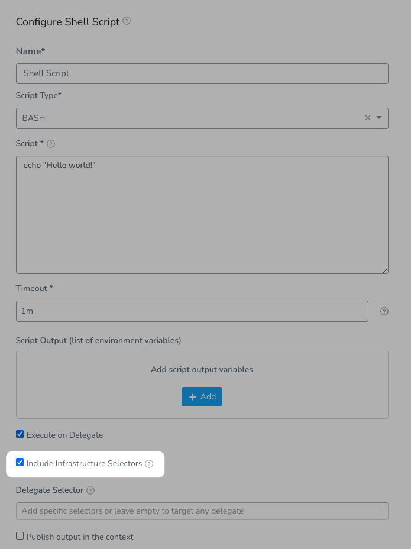

#### Issues Fixed

* Cannot Edit Application/Environment for Hashicorp Vault (PL-25702, ZD-31154, ZD-31424)
	+ Earlier if there were more Secret Managers in your account,The usage scope was not editable for the Secret Managers listed from 2nd page. We have fixed this bug as part of this ticket.
* Unstable UI when creating a User group with long name (PL-11098)
* Repo Identifier check needs to be removed for new Git Sync (PIE-4101)
* Delegate returns a RC of 403 in logs, but we need more details (DEL-4236, ZD-31346)
	+ Adding more details in delegate logs in case the calls from delegate to manager are failing.
* Manifest history widgets does not display after adding the required Helm manifest (CDS-38855)
* Service Dashboard not loading details for a specific Service, getting invalid request error (CDS-38830, ZD-31642)
	+ Fix: Service dashboard fails to load if the pods for any deployment is manually scaled up from 0.
* CG UI: Alignment issue (CDS-38818)
* Helm Deployment Task Times out be Task was Allocated (CDS-38663)
	+ Added more details when Helm deploy task fails because of connectivity issues with K8s cluster
* Account Level Config As Code - Application Defaults Error with Null Pointer Exception (CDS-38624, ZD-31467)
	+ Fixed an issue when application defaults are configured using code.
* Deployment Governance Fails when referencing a Deleted User Group (CDS-38177)
	+ User group could have been deleted if they were part of deployment freeze which led to dangling references in freeze windows. Going forward user group can't be deleted if they are part of deployment freeze.
* Docker registry connector is not working (CDS-37915, ZD-30577)
	+ Added skip validation support Docker Connector. You can now skip validation of Docker connectors on save from both UI and YAML(`skipValidation`) field.
* Not using Helm version 3.8 when doing test connection for Helm connector (CDS-37554)
* [Built-in Variables] Looks similar to CDS-24583 - rollbackArtifact variables equal to 'null' (CDS-36700, ZD-30120)
* Issues with deployments when a Harness Manager is restarted (CDS-36559, ZD-18501, ZD-29096)
	+ We added a monitor to detect when a workflow has an active status, is stuck in a not execution step, and for more than 45 minutes. The REPEAT, FORK, PHASE\_STEP, PHASE, and SUB\_WORKFLOW are considered not execution steps. This feature is behind FF named WORKFLOW\_EXECUTION\_ZOMBIE\_MONITOR.
	+ Two info level log messages are added to help in future troubleshooting:
		- Evaluating if workflow execution {} is a zombie execution [workflowId={}] – Printed when monitor found a stuck/zombie candidate.
		- Trigger force abort of workflow execution {} due remains in a zombie state [currentStateType={}] – Printed when is detected the zombie conditions, running for more than 10 minutes in a not execution step.
* Missing Validation for artifactType type in service creation (CDS-35830)
* CloudFormation Rollback from DEV Canary Workflow goes to STG - AWS - Each Environment is from a Diff Account - Same Org (CDS-34125, ZD-26628)
	+ Issues with CloudFormation Rollback have been fixed. Now, template expressions and multiple cloud providers in a single environment are supported during Rollback.
* ECS Blue Green: Rollback not Downscaling the Newly deployed Service and instances (CDS-4024)

### Minor Release 75304

Release Date: June 15, 2022

We're pleased to present Harness SaaS Release 75304.

#### General What's New and Early Access

* [New features added to Harness](https://changelog.harness.io/?categories=fix,improvement,new).
* [Features behind Feature Flags](https://changelog.harness.io/?categories=early-access) (Early Access).

#### New Features and Enhancements

The following new features are added to the Harness SaaS components:

* Ensure Delegate version is valid till next Delegate release (DEL-4198)
* Support for Custom Artifact with no artifact polling to be enabled for Custom deployment type (CDS-34235, ZD-28100)
	+ Custom artifact source script can be made empty now. If the script is empty, the deployment proceeds with the version customer provides and the same details are available in the artifact variable which can be accessed using `${artifact.*}`.

#### Issues Fixed

* authentication-info during redirect URL is not consistent and not showing the enabled method immediately (PL-25300)
* Pipeline delete throwing exception in old Git sync (PIE-3990)
* Manager pods in Prod-1 restarting on a regular basis. Rollback to version 1.0.5.1 of the Java SDK (FFM-3643)
* Invalid request: ConcurrentModificationException. Fixes a ConcurrentModificationException, increases the bufferSize for SDK metrics and adds configurable bufferSize (FFM-3637, ZD-31477, ZD-31480, ZD-31491, ZD-31502, ZD-31515, ZD-31552)
* StackDriver logging not working for delegate post 753xx. Logging dependency was removed during cleanup of delegate dependencies, most likely because they were not showing up in dependency graph as they are not directly referenced from code, causing delegate to stop logging to stack driver (DEL-4278)
* Deployment Is not Accessible in the UI: Morphia deserialization issue. Some older ECS executions were not loading in UI. This fixes them (DEL-4277, ZD-31501, ZD-31622)
* [GraphQL] delegateList ignores delegateStatus in the filter. Added filtering by delegate status (DEL-4231, ZD-31001)
* GCB triggers are showing an unknown error (CDS-38613)
* UI rendering issue on service page (CDS-38586, ZD-31435)
* Continue execution API fails with an error occurred (CDS-38523)
* ECS BG DNS switch workflows, I try to open “Setup Route 53”, it fails with error related to uid (CDS-38500)
* FETCH\_S3\_FILE\_TASK fails in Manager with UNKNOWN error (CDS-38475, ZD-31300)
* In manual pull window, the auto collection enabled artifact sources were not listed. (CDS-38473)
* Start New Deployment (Workflow) Returns only 1000 workflows (CDS-38466, ZD-31355)
* Even if I increase the width of the column, the text remains stripped (CDS-38436, ZD-31320)
* Jira Update - Invalid issue type (CDS-38432, ZD-30622)
* UI Issue - On adding config file in service and clicking manage version window button not listing any env. Added the fetchOneApp api responsible for it (CDS-38420)
* Need to fix historical data for Service Instance Discrepancy with Auto-Scalar (CDS-36823, ZD-CDS-38398, ZD-30141)
* GQL API failing to fetch all cloud providers when queried (CDS-38368, ZD-31252)
* Rollback failling - No context found for rollback (CDS-38227)
* [UI] Specific Pipeline Execution (Deployment) won't load in the UI - It load some elements but then HTTP 500 (CDS-37152, ZD-30479)
* [Built-in Variables] Looks similar to CDS-24583 - rollbackArtifact variables equal to 'null' (CDS-36700, ZD-30120)

#### Delegate Version

* 75509

### Minor Release 74705

Release Date: June 6th, 2022

We're pleased to present Harness SaaS Release 74705.

#### General What's New and Early Access

* [New features added to Harness](https://changelog.harness.io/?categories=fix,improvement,new).
* [Features behind Feature Flags](https://changelog.harness.io/?categories=early-access) (Early Access).

#### New Features and Enhancements

The following new features are added to the Harness SaaS components:

* Add runtimePlatform to AWS ECS Task Definition. AWS Java SDK Library has been upgraded from 1.12.47 to 1.12.220. You can now specify runtimePlatform option in ECS task definitions. (CDS-35585, ZD-27533, ZD-30721)
* Need the ability to specify JEA Session ConfigurationName w/PowerShell invoke-command over WinRM. (CDS-33772, ZD-26630)
	+ You can now add parameters to PowerShell Invoke-command:
		- Use this to initiate JEA sessions by passing Session parameter
		- Enable debug output by passing Debug flag

#### Issues Fixed

* Fix LdapSettingsDTO Kryo backwards compatibility. Fix LdapSettings' DTO class to ensure Kryo backwards compatibility of new manager with old delegate. (DEL-4099)
* CV step is getting stuck and marked as expired. Show exception to users when save fails for metric data collection. (SRM-10551, ZD-30562)
* NullPointerException while creating service using CAC API (PL-24964, ZD-29601)
* User Cannot Delete Group. After this change, userGroups referencing in a pipeline will not be allowed to delete via graphQl unless those pipelines are deleted. (PL-24821, ZD-30056, ZD-30935)
* Harness internal users are able to delete resources using graphql on customer's accounts. (PL-24764)
* Integrating latest Java SDK into Platform resulted breaking QA - user unable to login. The new version of the Java Server SDK 1.1.5 has been added into the portal. (FFM-3215)
* Custom helm binary path is not supported causing deployment failures for many customers. (DEL-4107, ZD-30792, ZD-30881, ZD-30883)
* JDK8 Watcher keeps restarting with JDK11 delegate (DEL-4041)
* UI Issue - On adding config file in service and clicking manage version window button not listing any env. Added the fetchOneApp api responsible for it (CDS-38420)
* [S3 or GS Based Helm Repo] Multiple Customers reporting - Chartmuseum on the Delegate seems to be on stalled state, so port is always in use. Fixed retry logic to start chart museum server in case the port is already in use. (CDS-38135, ZD-31129)
* Artifact collection with FF 'DISABLE\_ARTIFACT\_COLLECTION' on - Nexus3 artifact collection is failing with Nexus 3.x does not support getVersion for parameterized artifact stream (CDS-38030)
* Erorr Handling for null stateFile in TerragruntProvsionTask (CDS-38028)
* Artifact History option is not shown for already auto collection artifact sources when we enable the FF (CDS-37958)
* For docker artifact streams, changing collection value from yaml doesn't work. (CDS-37956)
* Deployment Permissions for a Specific Pipeline (CDS-37918, ZD-30951)
* K8s Delete task fails with timeout which is greater than configured timeout (CDS-37917, ZD-30898)
* ConfigMaps quota limit marking all previous inProgress releases as Failed. Behind FF CLEANUP\_INCOMPLETE\_CANARY\_DEPLOY\_RELEASE (CDS-37877, ZD-30906)
* AWS Secret Manager not using Delegate Selector for Pulling Secret. Added the execution capability of SM to verify the eligibility of delegate to access the SM. (CDS-37797, ZD-30884)
* Missing Git File error for CloudFormation from GIT does not surface to the Deployment Logs (CDS-37670, ZD-30781)
* Manage gets No delegate task found made timeout as required field (CDS-37524, ZD-30412)
* PCF Deployment Fails with SweepingOutputServiceImpl.save Error (CDS-37500, ZD-30761)
* [UI - Known Issue (API call)] Limitation to render more than 1k elements on `Deployments - >Start new Deployment` Blocks customer use case new change will make call in group of 15 items every time you scroll, and also if you type it will search for those 15 items with the written text . The changes are behind a ff, so that testing scope is not increased and we can quickly move the changes. (CDS-37471, ZD-30667)
* Terraform Fails on NoSuchFileException (CDS-37073, ZD-30357)
* UI Inputs from the Dropdown are trimmed fixed the ux (CDS-37018, ZD-30364)
* Service Instance Discrepancy with Auto-Scalar (CDS-36823, ZD-30141)
* Templatizing User Groups in approval displays workflow variable created instead of pipeline template variable. Fixed the tooltips (CDS-36745, ZD-30033)
* Azure - Artifactory incorrectly regenerates/reads the artifact path (CDS-36596)
* Config-as-Code Cloud Provider created without Usage Scopes (CDS-35638, ZD-29012)
* Data Cleanup for Extra SIs (CDS-35484, ZD-20908, ZD-28627)
* Immutable label error issue (CDS-35447, ZD-29000)
* [CloudFormation] Rollback from DEV Canary Workflow goes to STG - AWS - Each Environment is from a Diff Account - Same Org (CDS-34125, ZD-26628)
* Terraform Logs misleading (CDS-33712)
* Deployment fails with Context Error (CDS-3000, ZD-26633, ZD-30824)
* Incorrect time in the "Last deployed at" field in the Current Deployment Status of a service (CDS-2997, ZD-20562)

### Minor Release 74602

Release Date: May 19, 2022

We're pleased to present Harness SaaS Release 74602.

### General What's New and Early Access

* [New features added to Harness](https://changelog.harness.io/?categories=fix,improvement,new).
* [Features behind Feature Flags](https://changelog.harness.io/?categories=early-access) (Early Access).

#### New Features and Enhancements

The following new features are added to the Harness SaaS components:

* Remove iterator logging and build first class support with opencensus.
	+ As part of streamlining our monitoring and reducing the cost of logging, all the background jobs metrics are moved from log based metrics to opencensus metrics providing us better visibility into our critical paths. (DEL-3835)
* AWS SDK related delegate changes and integration with Task handler (BE-2).
	+ For CloudFormation steps, we are going away from AWS CloudFormation update() API and moving to AWS CloudFormation Change sets to update stacks. This will help customers properly validate CF Templates if there are no changes done. This is behind FF and impacts only stack updates. The creation of the stack will work as it is working right now. (CDS-37148)

#### Issues Fixed

* Vault SSH secret engine E2E tests (PL-25237)
* Test Conn fails for existing Ldap connection but functionality works fine and even test conn works after password update (PL-25186)
* GCB Triggers call is failing with KryoException: java.lang.IllegalArgumentException: Class is not registered (DEL-4050)
* Watcher throwing null pointer exception on DELEGATE\_SHUTDOWN\_TIMEOUT. Handle null value scenario while reading delegate data. Watcher was into a loop of reading delegate data, couldn't make progress because of this NPE. Fixed the code path by making correct assumptions. (DEL-4039)
* delegateScopeList API Call not working. Fixing the bug of listing delegate scopes when the environment is not provided (DEL-3991, ZD-30462)
* Triggers fail when optional input of type allowed values is not passed in the payload. Issue scenario:
	+ If customer had an optional workflow variable with some allowed values, and the value was not provided for that workflow variable in trigger payload, trigger executions starting failing with error: Trigger rejected because a passed workflow variable was not present in allowed values. What happened: Allowed values validation was added in triggers flow where we started checking if variables value is present in allowed value list or not. This check started happening for optional workflow variables as well whose values were not provided and this broke triggers flow. Fix: Changed the validation to only occur when variable value is provided in trigger.
		- (CDS-37510, ZD-30760, ZD-30769, ZD-30773, ZD-30777, ZD-30782, ZD-30797, ZD-30798, ZD-30810, ZD-30812)
* CDP QA Sign-off 75100 Failures (CDS-37310)
* Bamboo step is failing and delegate is throwing Class is not registered: software.wings.delegatetasks.BambooTask$BambooExecutionResponse execption (CDS-37264, ZD-30567)
* [SSH Step - Download Artifact] - NPE - DownloadArtifactCommandUnit.java - gives UNKNOWN\_ERROR on the UI NA (CDS-37193, ZD-30299, ZD-30498, ZD-30499)
* BE - Cannot Select all User Groups in Freeze Window same (CDS-36681)
* Cannot Select all User Groups in Freeze Window. We were not supporting selecting all the user group and user had to click one my one to select all user group if he wants to notify all. Going forward we can select "ALL" option to notify all at once. (CDS-36556, ZD-29926)
* Artifactory incorrectly regenerates/reads the artifact path - AWS Lambda (CDS-36045)
* Powershell script is not terminated when the shell script step timeouts When the workflow is aborted or expired, the running shell script step and all its child processes now terminate immediately (CDS-24447, ZD-20817, ZD-29183)
* Perspective page is not working in CG. Fixed the perspective list page which was not loading on enablement of cost categories (CCM-7609)
* CE Weekly Report was being sent out every 30 minutes. It was happening for only 1 customer (CCM-7595, ZD-30545)

### Minor Release 74503

Release Date: May 12, 2022

We're pleased to present Harness SaaS Release 74503.

### General What's New and Early Access

* [New features added to Harness](https://changelog.harness.io/?categories=fix,improvement,new).
* [Features behind Feature Flags](https://changelog.harness.io/?categories=early-access) (Early Access).

#### New Features and Enhancements

The following new features are added to the Harness SaaS components:

* Support skipValidation for secrets created using [Custom Secret Manager](../firstgen-platform/security/secrets-management/add-and-use-a-custom-secrets-manager.md). (PL-23731)
* Remove iterator logging and built first class support with OpenCensus. (DEL-3835)
* Trying to get repository from Artifactory is timing out. (CDS-37077, ZD-30437)
	+ Modified UI of Artifactory to accept custom input value.
* Apply deployment tags (Pipelines and Workflows) during the execution. (CDS-29002)
	+ With this change, Pipeline tags are resolved after every stage is finished. Previously they were being resolved only twice: before Pipeline execution started and after Pipeline execution finished.

#### Issues Fixed

* curl query for createFreeze window returns error message on using API key. (PL-24899, ZD-29519, ZD-30296)
* Delayed Sync with Harness UI and Github Config as Code Repository: We had some slowness in case a file was renamed in Harness to git. We have improved it going forward. (PL-24662, ZD-28316)
* UI is not preserving the error message format which BE is sending. Although backend was sending newline characters, frontend wasn't honoring them. It is fixed now using a CSS rule. (PL-23726)
* Intermittent API key for graphql: "Invalid request: User not authorized" (PL-22244, ZD-30193, ZD-30196, ZD-30506)
* Manifest collection task assignment is failing. (DEL-3999)
* Delegate start up error in 74808 and later versions for Self-Managed Enterprise Edition (DEL-3982, ZD-18302, ZD-29108)
* CloudFormation failure with java exception from manager side. Fixed unable to process Cloud Formation task reported on 05/02/2022. (DEL-3975, ZD-30371)
* Deployments no longer running. (DEL-3961, ZD-30299, ZD-30432)
* Kryo exception (io.harness.delegate.beans.RemoteMethodReturnValueData). (DEL-3956)
* Added support for special characters in proxy password for Delegate proxying. (DEL-3348, ZD-26493)
* Webhook Trigger failing. Added additional validation on backend to fix the case where build is empty string. (CI-4352)
* ArtifactMetadataEvaluator Class is not registered in QA. (CDS-37055)
* Artifactory Docker autosuggestion is wrong value for Artifactory on-prem/server for "Docker Repository Server" (CDS-36996, ZD-30023, ZD-30402, ZD-30568, ZD-30623, ZD-30628)
* Clicking Task Definition in newly created ECS service: "Something went wrong..." added null check. (CDS-36995, ZD-30422)
* Canary failed: After the clone operation, the workflow is not set as incomplete and that is what we fix here. (CDS-36932, ZD-30269)
* [Rancher] NPE on Rancher Rollout Deployment: 400 rest/src/main/java/software/wings/delegatetasks/rancher/RancherTaskHelper.java:105. Bug resolved by adding null checks. (CDS-36740, ZD-30133)
* Workflows failing due to invalid Delegate Task Mapping [SSH and WinRM]. (CDS-36733)
* Kyro exception seen in the QA manager logs for Jenkins server while fetching builds information. (CDS-36729)
* Workflow variable is not resolving in manifest variable reference: surface that ChartMuseum failed to start and no values.yaml fetch occurred. (CDS-36728, ZD-30077)
* Status of a workflow in WAITING status is returned as RUNNING when using either graphql or rest api. When using REST or GraphQL the workflow execution status return a value different of the UI. To get the current status value is required to transpose the execution tree and this take sometime, this refresh status operation is behind a FF named WORKFLOW\_EXECUTION\_REFRESH\_STATUS. (CDS-36623, ZD-29921)
* SSH connection is failing with SOCKET\_CONNECTION\_TIMEOUT. (CDS-36616, ZD-29683)
* Error when editing a Cron-based Trigger where the existing cron value is now in the past. Trigger editing problem with cronjob, where frontend was sending an unused field with a value that was exceeding the Long max value from java. The field was marked to be ignored by the backend. (CDS-36570, ZD-29822, ZD-30469)
* Workflow won't abort, showing up as paused. Change TTL of WaitInstance to 90 days, and add a log when a WaitInstance is not found to help us in future troubleshooting. (CDS-36568, ZD-29994)
* Azure WebApp deployments are failing due to Timeout in Swap Slot step. Checking the success of Slot swap step during Azure WebApp deployments has been improved. (CDS-36236)
* Custom Approval Step - Shell Script - Secret exposed. (CDS-36154, ZD-29588)
* JENKINS\_GET\_JOB task not listing all Jenkins job. Fixed an issue where manager could not connect to Delegates with scopes related to application. (CDS-35628, ZD-29044, ZD-29114)
* Unclear Error message on Fetch Instance MARK\_EXPIRED. Added a proper message when aborting fetch instance step. (CDS-35519, ZD-29062)
* Concurrent Execution of Create AMI Stack fails upon Select Nodes. We fixed certain workflows which use AWS Infrastructure with Tags that were getting in a race condition if tags are provided as an expression. This also resolved the incorrect instance counts for such services. (CDS-35152, ZD-29973)
* Helm Native deployment fails when delegate scope limited is configured. (CDS-34255, ZD-27722)
* Usergroup is getting deleted even if it is used in notification strategy in workflow Restricted the deletion of any usergroup when it is used in any notification strategy in any workflow. (CDS-34159)
* CloudFormation Rollback from DEV Canary Workflow goes to STG. (CDS-34125, ZD-26628)
* Dashboard: Build# does not match reality. (CDS-2992, ZD-18477, ZD-18483, ZD-29101)
* Fixed the issue with CE\_VIEWER permission not getting disabled for user groups. (CCM-7324)

### Minor Release 74300

Release Date: April 28, 2022

We're pleased to present Harness SaaS Release 74300.

#### General What's New and Early Access

* [New features added to Harness](https://changelog.harness.io/?categories=fix,improvement,new).
* [Features behind Feature Flags](https://changelog.harness.io/?categories=early-access) (Early Access).

#### New Features and Enhancements

The following new features are added to the Harness SaaS components:

* Nothing new in this release.

#### Issues Fixed

* Config-As-Code was not syncing from On-Premise to Git. (PL-18485, ZD-17190, ZD-17744, ZD-18077, ZD-18312, ZD-20225)
* The setup as code API for performing CRUD with YAMLs had a bug in which the YAML processing status was not correctly returned. This issue is being addressed in order to return the correct YAML processing status. (PL-17678, ZD-16868)
* Config-As-Code YAML upsert API used to return 200 even if the zip was incorrect. In such cases, it will now return HTTP response code 400. (PL-17676, ZD-16868, ZD-16873)
* Ratio API for Delegate was not working as expected. (DEL-3603)
* The CloudWatch verification stage was failing because the instance IDs of the hosts were not properly rendered. (CDS-36609, ZD-30035)
* The expressions `$ami.newAsgName` and `$ami.oldAsgName` for AMI Blue Green incrementally shift traffic workflows were not set correctly. (CDS-36563, ZD-29905)
* For Deployment Freeze, an empty description was getting saved in the database. (CDS-36562, ZD-29969)
* Incorrect Delegate selection logs were getting displayed when a Step failed or was skipped. (CDS-36480, ZD-29628)
* The users were not getting redirected to the Pipeline execution / Workflow execution page based on the Pipeline / Workflow. (CDS-36352, ZD-29800)
* Jira's issue metadata was not being fetched correctly. (CDS-36158, ZD-29622, ZD-29628, ZD-29775)
* Audit Trail was not showing deleted Applications. (CDS-35910, ZD-29197)
* An invalid parentheses character within the step name prior to the expression evaluation/resolution was not normalized (CDS-35795, ZD-29253)
* Workflows that use AWS Infrastructure and Tags were causing a race condition if tags were used as an expression. (CDS-35152, ZD-29973)
* Error message for “Delegate task timed out” in Workflow executions is enhanced. (CDS-34845, ZD-28496)

### Minor Release 74200

Release Date: April 21, 2022

We're pleased to present Harness SaaS Release 74200.

#### General What's New and Early Access

* [New features added to Harness](https://changelog.harness.io/?categories=fix,improvement,new).
* [Features behind Feature Flags](https://changelog.harness.io/?categories=early-access) (Early Access).

#### New Features and Enhancements

The following new features are added to the Harness SaaS components:

* Custom selector API for Delegate NG Token management is available now. (DEL-3558, ZD-21717, ZD-27515)

* Harness can now send key Workflow and Pipeline deployment events to a URL endpoint as a JSON payload. This helps in analyzing how Workflows and Pipelines are performing, using other tools that consume and build dashboards for the events. This feature is now public and not behind the Feature Flag`FF APP_TELEMETRY`. (CDS-35193)
	+ See [Publish Workflow Events](../continuous-delivery/concepts-cd/deployments-overview/publish-workflow-events-to-an-http-endpoint.md).
	+ See [Publish Pipeline Events](../continuous-delivery/concepts-cd/deployments-overview/publish-pipeline-events-to-an-http-endpoint.md).
* You can now filter out the desired application on the **Deployments** page using the search option in the **Application** dropdown. (CDS-34070)
	+ See [Filtering Deployments](../continuous-delivery/concepts-cd/deployments-overview/filtering-deployments.md).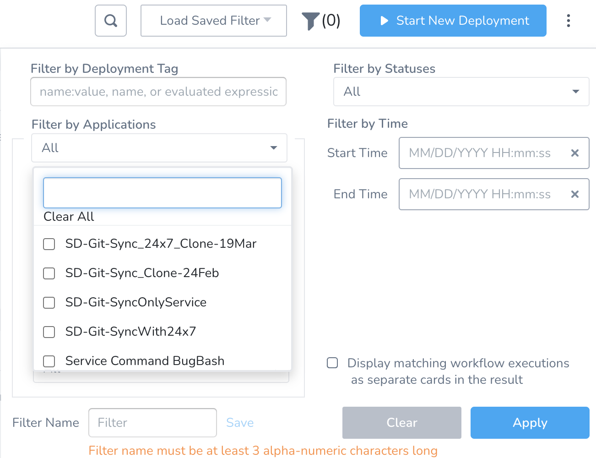

#### Issues Fixed

* When adding query specifications in the **Customize Health Source** settings for Google Cloud Platform (GCP) Health Source, inconsistent records were being fetched. (SRM-9202)
* When pasting the YAML definition in a Workflow, the `Update failed. Reason: NullPointerException` error message was thrown without any reason for the failure. (PL-24456, ZD-29097)
* API Explorer wasn't using the`API_URL`environment variable. A special code was removing the “gateway” prefix from the API calls. (PL-24415, ZD-27919, ZD-29434)
* Telemetry framework was failing, which resulted in data discrepancy between activation rates of the **CD Activation Rate** and the **CD Acquisition Funnel**. (PIE-3353)
* `AddDelegateScope` output payload wasn't displayed correctly. (DEL-3757)
* When querying the GraphQL API for Delegates, the **lastHeartBeat** field was a string instead of an integer. (DEL-3712)
* Error message wasn't displaying the reason why a Delegate task failed. A Delegate task can fail to be assigned to a Delegate for various reasons, like incorrect Selectors, or Scope setup. (DEL-3686, ZD-28494, ZD-29304)
* GraphQL API had no method to list Delegate Scopes for an account. (DEL-2963)
* Error Message "Duplicate State" was not displaying "Duplicate Step Name" and was displaying an incomplete notification. (CDS-36298, ZD-29769)
* Pipeline Approval Step was throwing an error `UNKNOWN_ERROR`. (CDS-36152, ZD-29557)
* Jira Approval was failing with an unclear error message. (CDS-35786, ZD-29259))
* An incorrect error message `Invalid argument(s): Task has expired` was being displayed when adding a Jenkins Provider. (CDS-35524, ZD-29044)

### Minor Release 74002

Release Date: April 6, 2022

We're pleased to present Harness SaaS Release 74002.

#### General What's New and Early Access

* [New features added to Harness](https://changelog.harness.io/?categories=fix,improvement,new).
* [Features behind Feature Flags](https://changelog.harness.io/?categories=early-access) (Early Access).

#### New Features and Enhancements

The following new feature is added to the Harness SaaS components:

* Autoscaler operations now run based on the **Timeout** value specified by the user in **Configure App Setup**. (CDS-35344, ZD-28940)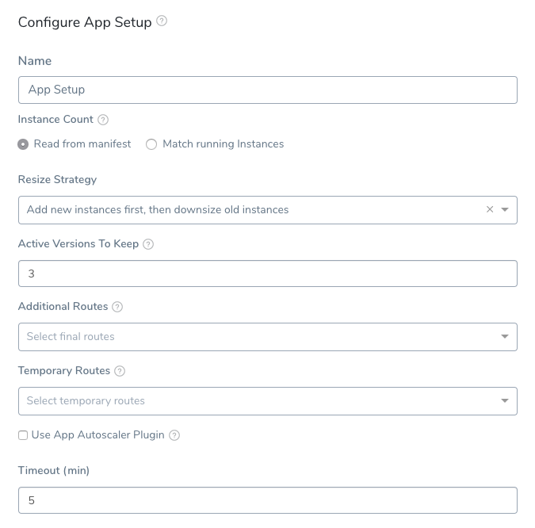
	+ See [Create a Blue/Green Tanzu Deployment](../continuous-delivery/pcf-deployments/create-a-blue-green-pcf-deployment.md#step-3-app-setup).
	+ See [Create a Basic Tanzu Deployment](../continuous-delivery/pcf-deployments/create-a-basic-pcf-deployment.md#step-2-app-setup).

#### Issues Fixed

* User was unable to set multiple Custom Thresholds for a single metric to define rules that override normal verification behavior. (SRM-3680)
* The Watcher program communicates with the Delegate using a local file based channel. A`NullPointerException`was thrown while reading messages from this channel. (DEL-3623)
* Docker Delegate installation was failing whenever there was a space in the hostname. (DEL-2597)
* Helm version 3.5 and above was not working with Native Helm Services as the URL name was changing and`force-update`flag was not working. (CDS-35667, ZD-29165, ZD-29194)
* Some Workflows were not rendering dynamic Infrastructure Definition expressions for Terraform. This failure happens for Pipelines with multiple Terraform Workflows that use the same Service and Infrastructure Definition expressions. (CDS-35486, ZD-28977, ZD-28997, ZD-29166)
* Concurrency issues were occurring when multiple processes execute`helm repo add, helm repo update, and helm repo pull`in parallel. (CDS-35483, ZD-27796)

### Minor Release 73902

Release Date: April 03, 2022

We're pleased to present Harness SaaS Release 73902.

#### General What's New and Early Access

* [New features added to Harness](https://changelog.harness.io/?categories=fix,improvement,new).
* [Features behind Feature Flags](https://changelog.harness.io/?categories=early-access) (Early Access).

#### New Features and Enhancements

The following new feature is added to the Harness SaaS components:

* The heap size of the Delegate process is being reduced from 4GB to 1.5GB. In addition, we are reducing the memory requirement for Kubernetes from 8GB to 4GB. Currently, this feature is behind the Feature Flag. Contact [Harness Support](mailto:support@harness.io) to enable the feature. (DEL-3365)

#### Issues Fixed

* A fallback scenario to handle missing Manager version headers has been added in the Verification Service. (SRM-9808, ZD-28900)
* The ECS Delegate alerts are not unless all Delegates associated with an ECS group become unavailable. (DEL-3565)
* The default failure and notification strategies are not added when a Workflow is created via Git Sync. Git Sync to Harness was adding notification rules into Workflows. (CDS-35112, ZD-28644)
* When a User Group is used in a Workflow Approval Step or a templatized User Group variable in a Pipeline stage, deletion of User Groups is blocked. (CDS-34698, ZD-28460)
* When configuring Kubernetes Cloud Provider, `skipValidation` now works correctly with Custom Secret Managers. (CDS-34599, ZD-28345)
* PCF perpetual tasks that have failed for more than 7 days for any reason will now be deleted, and will no longer be executed. (CDS-33630)
* When you linked a Shell Script Template to a Workflow and provided instance expressions in template variables, it was not getting resolved.  
  
	Now we'll resolve instance expressions in Shell Script Template variables. As a result, if you are deploying to multiple hosts and `$instance.hostName` is provided in template variables, we will have a separate Shell script execution for each host. (CDS-25446, ZD-18302)

	See [Availability and Scope of Harness Variables](../firstgen-platform/techref-category/variables/harness-variable-availability.md).
	
* If execution failed before the Kubernetes deployment step, the rollback was not skipped. (CDS-4025, ZD-15002)

### Minor Release 73700

Release Date: March 23, 2022

We're pleased to present Harness SaaS Release 73700.

#### General What's New and Early Access

* [New features added to Harness](https://changelog.harness.io/?categories=fix,improvement,new).
* [Features behind Feature Flags](https://changelog.harness.io/?categories=early-access) (Early Access).

#### New Features and Enhancements

The following new feature is added to the Harness SaaS components:

* Nothing new in this release.

#### Issues Fixed

* Spotinst BG deployments were not properly rolled back in the event of a failure. This resulted in Prod and Stage traffic being routed to the incorrect target groups. (CDS-34876, ZD-28441)
* If no instances were upsized in a canary phase for ECS deployments, we would fail at the Verify Stage. This is now fixed, and users will be able to create Verify steps without having to worry about upsize counts. (CDS-34382, ZD-15257)
* Multiple entries in the Kubernetes instance dashboard were showing for the same artifact. (CDS-34330)
* If the provided Git folder path contained multiple manifests, after enabling the Feature Flag `SINGLE MANIFEST SUPPORT` for the [File/Folder Path New Functionality](../continuous-delivery/pcf-deployments/upload-local-and-remote-pcf-resource-files.md#file-folder-path-new-functionality), deployment failed. (CDS-4003, ZD-16272)
* When creating `ManualClusterDetails` for the K8s Cloud Provider using GraphQL, the `usageScope` was missing. (CDS-4000, ZD-15666)
* Gitlab branch names had to be encoded when the Feature Flag `OPTIMIZED GIT FETCH FILES` was enabled. You no longer need to encode the branch names. (CDS-2998, ZD-21280)
* When uploading Workflow YAML to the Config-as-Code endpoint, a `NullPointerException` was thrown. (CDS-35463, ZD-28775)
* When configuring Git sync for an application, the Git connector could not be selected from the UI, but the GraphQL API worked as expected. (PL-23599, ZD-28458)
* We polled the most recent data for all running executions to update the status and graph. If you had several Pipelines running at the same time, and each Pipeline had multiple stages, this was causing serious performance issues. The executions API returned a large amount of data.  
  
To address this, we removed the child graph and, as a result, the polling API. This reduces the number of API hits we make on the CD page while also saving a significant amount of memory on the manager side. You can now click on a stage to be redirected to the execution details page to view the overall graph. (OPS-6274)

#### Component Versions

The following table lists the component versions in this release.


| **Component** | **Version** |
| --- | --- |
| UI | 73700 |
| Portal | 1.0.74407-000 |
| Delegate | 1.0.74407-000 |
| Watcher | 74400-000 |
| Verification | 1.0.74407-000 |
| Learning | 66300 |
| Event Service | 69318 |
| Command Library Service | 1.0.74407-000 |

### Minor Release 73604

Release Date: March 18, 2022

We're pleased to present Harness SaaS Release 73604.

#### General What's New and Early Access

* [New features added to Harness](https://changelog.harness.io/?categories=fix,improvement,new).
* [Features behind Feature Flags](https://changelog.harness.io/?categories=early-access) (Early Access).

#### New Features and Enhancements

The following new feature is added to the Harness SaaS components:

* Nothing new in this release.

#### Issues Fixed

* The Commit ID for Git Sync with Azure DevOps was wrong. (PL-23124, ZD-20398)
* Users were not able to change the profile name. (PL-23064, ZD-27743)
* All User Groups were not listed on the User Groups page. (PL-20963, ZD-18775, ZD-20187, ZD-21829, ZD-26436, ZD-28694)

#### Component Versions

The following table lists the component versions in this release.


| **Component** | **Version** |
| --- | --- |
| UI | 73604 |
| Portal | 1.0.74307-000 |
| Delegate | 1.0.74307-000 |
| Watcher | 74200-000 |
| Verification | 1.0.74307-000 |
| Learning | 66300 |
| Event Service | 69318 |
| Command Library Service | 1.0.74307-000 |

### Minor Release 73502

Release Date: March 09, 2022

We're pleased to present Harness SaaS Release 73502.

#### General What's New and Early Access

* [New features added to Harness](https://changelog.harness.io/?categories=fix,improvement,new).
* [Features behind Feature Flags](https://changelog.harness.io/?categories=early-access) (Early Access).

#### New Features and Enhancements

The following new feature is added to the Harness SaaS components:

* Nothing new in this release.

#### Issues Fixed

* Nothing new in this release.

#### Component Versions

The following table lists the component versions in this release.


| **Component** | **Version** |
| --- | --- |
| UI | 73502 |
| Portal | 1.0.74214-000 |
| Delegate | 1.0.74214-000 |
| Watcher | 72702-000 |
| Verification | 1.0.74214-000 |
| Learning | 66300 |
| Event Service | 69318 |
| Command Library Service | 1.0.74214-000 |

### Minor Release 73402

Release Date: March 02, 2022

We're pleased to present Harness SaaS Release 73402.

#### General What's New and Early Access

* [New features added to Harness](https://changelog.harness.io/?categories=fix,improvement,new).
* [Features behind Feature Flags](https://changelog.harness.io/?categories=early-access) (Early Access).

#### New Features and Enhancements

The following new feature is added to the Harness SaaS components:

* When Helm connector details are modified (except credentials and name), a confirmation modal is now displayed stating that the collected Helm charts will be deleted. (CDS-29032)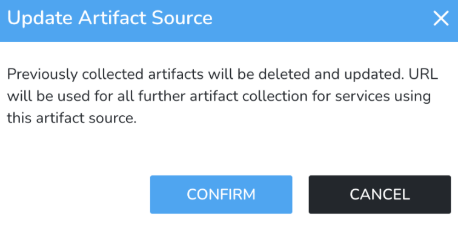

#### Issues Fixed

* Nothing new in this release.

#### Component Versions

The following table lists the component versions in this release.


| **Component** | **Version** |
| --- | --- |
| UI | 73402 |
| Portal | 1.0.74109-000 |
| Delegate | 1.0.74109-000 |
| Watcher | 72702-000 |
| Verification | 1.0.74109-000 |
| Learning | 66300 |
| Event Service | 69318 |
| Command Library Service | 1.0.74109-000 |

### Minor Release 73300

Release Date: February 24, 2022

We're pleased to present Harness SaaS Release 73300.

#### General What's New and Early Access

* [New features added to Harness](https://changelog.harness.io/?categories=fix,improvement,new).
* [Features behind Feature Flags](https://changelog.harness.io/?categories=early-access) (Early Access).

#### New Features and Enhancements

The following new features are added to the Harness SaaS components:

* In the **Workflow Failure Strategy**, you can now select **Rollback Provisioner after Phases** action when a Workflow is paused on manual intervention.
	+ See [Timeout (Manual Intervention)](../continuous-delivery/model-cd-pipeline/workflows/define-workflow-failure-strategy-new-template.md#timeout-manual-intervention). (CDS-28963)
* Tanzu Blue Green Deployments now include the following two new in-built variables:
	+ `${pcf.activeAppName}`
	+ `${pcf.inActiveAppName}`
	+ See [App Name Variables and Blue Green Deployments](../continuous-delivery/pcf-deployments/pcf-built-in-variables.md#app-name-variables-and-blue-green-deployments). (CDS-17419)

#### Issues Fixed

* The Delegates were not updated after changing the Helm repo credentials in Harness, and they continued to poll the Artifacts with the old credentials.  
  
  A Helm repository is used to add Helm Charts as a Manifest Source in a Harness Service. If you add a chart and then change the source, other than changing the credentials, Harness will delete any charts it has already collected and start a new collection. (CDS-32528, ZD-19910)
  
	See [Deploy Helm Charts](../continuous-delivery/kubernetes-deployments/deploy-a-helm-chart-as-an-artifact.md).

* When a Pipeline had multiple stages running in parallel, Pipeline execution would fail intermittently, leaving the Workflow greyed out. To make parallel executions thread-safe, we added locks before reading and writing data in shared resources (StateMachine). (CDS-25539, ZD-26698)

#### Component Versions

The following table lists the component versions in this release.


| **Component** | **Version** |
| --- | --- |
| UI | 73300 |
| Portal | 1.0.74006-000 |
| Delegate | 1.0.74006-000 |
| Watcher | 72702-000 |
| Verification | 1.0.74006-000 |
| Learning | 66300 |
| Event Service | 69318 |
| Command Library Service | 1.0.74006-000 |

### Minor Release 73200

Release Date: February 18, 2022

We're pleased to present Harness SaaS Release 73200.

#### General What's New and Early Access

* [New features added to Harness](https://changelog.harness.io/?categories=fix,improvement,new).
* [Features behind Feature Flags](https://changelog.harness.io/?categories=early-access) (Early Access).

#### New Features and Enhancements

The following new feature is added to the Harness SaaS components:

* You can now access the current step's name and the type of step using the expression. This will help you to write custom logic in templates based on the step's name or skip some steps based on its name etc. (CDS-25435)  
  


|  |  |
| --- | --- |
| Current step name | `${currentStep.name}` |
| Type of step | `${currentStep.type}` |

#### Issues Fixed

* Nothing new in this release.

#### Component Versions

The following table lists the component versions in this release.


| **Component** | **Version** |
| --- | --- |
| UI | 73200 |
| Portal | 1.0.73913-000 |
| Delegate | 1.0.73913-000 |
| Watcher | 72702-000 |
| Verification | 1.0.73913-000 |
| Learning | 66300 |
| Event Service | 69318 |
| Command Library Service | 1.0.73913-000 |

### Minor Release 73100

Release Date: February 9, 2022

We're pleased to present Harness SaaS Release 73100.

#### General What's New and Early Access

* [New features added to Harness](https://changelog.harness.io/?categories=fix,improvement,new).
* [Features behind Feature Flags](https://changelog.harness.io/?categories=early-access) (Early Access).

#### New Features and Enhancements

The following new feature is added to the Harness SaaS components:

* You can now add nodes to an Infrastructure Definition and Select Nodes Workflow step for a Rolling Workflow in addition to the nodes Harness pulls from the target infrastructure automatically. You can also use Workflow variable expressions for node names that will be resolved at runtime. Currently, this feature is behind the Feature Flag `DEPLOY_TO_INLINE_HOSTS`. Contact [Harness Support](mailto:support@harness.io) to enable the feature. (CDS-8075)
	+ See [Select Nodes Workflow Step](../firstgen-platform/techref-category/cd-ref/workflow-steps-and-settings/select-nodes-workflow-step.md#option-select-host-not-in-infrastructure-definition), [Select Nodes in a Rolling Deployment Workflow](../continuous-delivery/model-cd-pipeline/workflows/select-nodes-in-a-rolling-deployment-workflow.md#option-select-host-not-in-infrastructure-definition), [Target Specific Hosts During Deployment](../continuous-delivery/model-cd-pipeline/workflows/specific-hosts.md#option-select-host-not-in-infrastructure).

#### Issues Fixed

* Cluster name was blank in the K8s Workload Recommendations API. (CCM-5179)

#### Component Versions

The following table lists the component versions in this release.


| **Component** | **Version** |
| --- | --- |
| UI | 73100 |
| Portal | 1.0.73803-000 |
| Delegate | 1.0.73803-000 |
| Watcher | 72702-000 |
| Verification | 1.0.73803-000 |
| Learning | 66100 |
| Event Service | 69318 |
| Command Library Service | 1.0.73803-000 |

### Minor Release 73002

Release Date: February 4, 2022

We're pleased to present Harness SaaS Release 73002.

#### General What's New and Early Access

* [New features added to Harness](https://changelog.harness.io/?categories=fix,improvement,new).
* [Features behind Feature Flags](https://changelog.harness.io/?categories=early-access) (Early Access).

#### New Features and Enhancements

* You can now customize your Kubernetes deployments using Kustomize patches. Kustomizations let you create specific Kubernetes deployments while leaving the original manifests untouched. Currently, this feature is behind the Feature Flag `KUSTOMIZE_PATCHES_CG`. Contact [Harness Support](mailto:support@harness.io) to enable the feature. When you enable this Feature Flag, you will be able to use Kustomize version 4.0.0. (CDP-19430)
	+ You can add patch file(s) to **Kustomize Patches**. In Harness Service, click **Kustomize Patches** in **Configuration** and then click **Add Patches**. You can add multiple files by using **Add Patches** multiple times.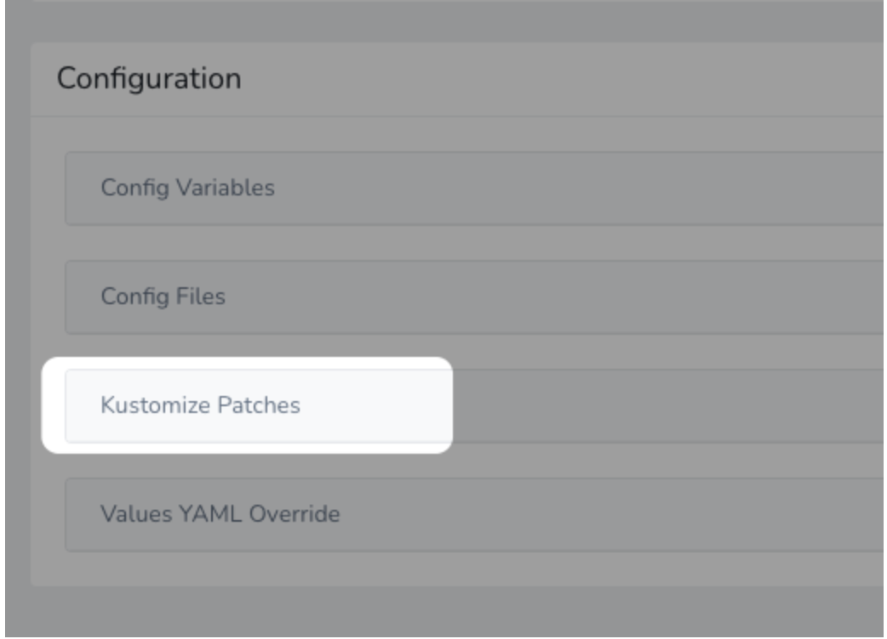
	+ Kustomize doesn't natively support variable substitution but Harness supports variable substitution using [Harness variable expressions](../firstgen-platform/techref-category/variables/variables.md) in Kustomize patches.
	+ You can also use [Harness secrets](../firstgen-platform/security/secrets-management/use-encrypted-text-secrets.md) in patches.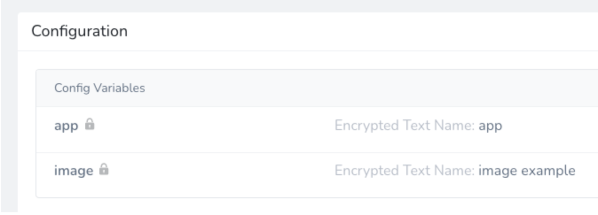
	+ You can override the Service settings for **Kustomize Patches** in a Harness Environment using **Service Configuration Overrides**.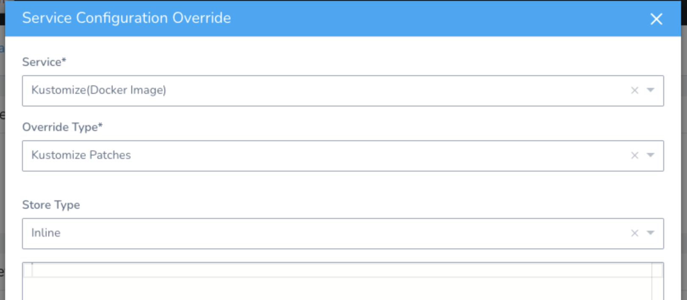
	+ See [Kustomize for Kubernetes Deployments](../continuous-delivery/kubernetes-deployments/use-kustomize-for-kubernetes-deployments.md).

#### Issues Fixed

* Nothing new in this release.

#### Component Versions

The following table lists the component versions in this release.


| **Component** | **Version** |
| --- | --- |
| UI | 73002 |
| Portal | 1.0.73717-000 |
| Delegate | 1.0.73717-000 |
| Watcher | 72702-000 |
| Verification | 1.0.73717-000 |
| Learning | 66100 |
| Event Service | 69318 |
| Command Library Service | 1.0.73717-000 |

### Minor Release 72900

Release Date: February 1, 2022

We're pleased to present Harness SaaS Release 72900.

#### General What's New and Early Access

* [New features added to Harness](https://changelog.harness.io/?categories=fix,improvement,new).
* [Features behind Feature Flags](https://changelog.harness.io/?categories=early-access) (Early Access).

#### New Features and Enhancements

* You can now add a non-containerized artifact for Harness Azure Web App deployment. You can deploy War, NuGet, and Zip on Azure Web Application from Artifact sources like Artifactory, Nexus, Jenkins, and Azure artifacts. Currently, this feature is behind the Feature Flag `AZURE_WEBAPP_NON_CONTAINER`. Contact [Harness Support](mailto:support@harness.io) to enable the feature.(CDP-19058, CDP-16747)
	+ See [Azure Web Deployment](../continuous-delivery/azure-deployments/azure-webapp-category/add-a-non-containerized-artifacts-for-azure-web-app-deployment.md).
* You can now manually pull Helm Charts for a specific chart version. Harness automatically pulls all the chart and version history metadata for its manifests. In the Harness Service, click **Manually pull artifact**, and then use **Manually Select a Manifest** to select the version. Currently, this feature is behind the feature flag `HELM_CHART_AS_ARTIFACT`. Contact [Harness Support](mailto:support@harness.io) to enable the feature. (CDC-16422)
	+ See [Deploy Helm Charts](../continuous-delivery/kubernetes-deployments/deploy-a-helm-chart-as-an-artifact.md).
* The **Skip Validation** checkbox has been added for ServiceNow and Artifactory connectors. Selecting this checkbox allows you to skip credential verification and creation / updation. Default behavior would be followed if the checkbox remains unselected. (CDC-15574, ZD-19001)

#### Issues Fixed

* Failure handling mentioned for 'Unknown errors' category in the failure strategies wasn't being considered. Pipeline kept running even after an approval step (Harness, Jira, or ServiceNow) was rejected by the approver. (CDC-16549, ZD-26346)

#### Component Versions

The following table lists the component versions in this release.


| **Component** | **Version** |
| --- | --- |
| UI | 72900 |
| Portal | 1.0.73609-000 |
| Delegate | 1.0.73609-000 |
| Watcher | 72702-000 |
| Verification | 1.0.73609-000 |
| Learning | 66100 |
| Event Service | 69318 |
| Command Library Service | 1.0.73609-000 |

### Minor Release 72800

Release Date: January 20, 2022

We're pleased to present Harness SaaS Release 72800.

#### General What's New and Early Access

* [New features added to Harness](https://changelog.harness.io/?categories=fix,improvement,new).
* [Features behind Feature Flags](https://changelog.harness.io/?categories=early-access) (Early Access).

#### New Features and Enhancements

* For Tanzu Application Deployments, validation for Verifying Manifests is enabled. This will help to track the verification of manifests and identify failures if any manifests are invalid. This will not impact any users as there is no change in the existing flow. (CDP-20015, ZD-21855)

#### Issues Fixed

* Nothing new in this release.

#### Component Versions

The following table lists the component versions in this release.


| **Component** | **Version** |
| --- | --- |
| UI | 72800 |
| Portal | 1.0.73503-000 |
| Delegate | 1.0.73503-000 |
| Watcher | 72702-000 |
| Verification | 1.0.73503-000 |
| Learning | 66100 |
| Event Service | 69318 |
| Command Library Service | 1.0.73503-000 |

### Minor Release 72700

Release Date: January 11, 2022

We're pleased to present Harness SaaS Release 72700.

#### General What's New and Early Access

* [New features added to Harness](https://changelog.harness.io/?categories=fix,improvement,new).
* [Features behind Feature Flags](https://changelog.harness.io/?categories=early-access) (Early Access).

#### New Features and Enhancements

* Nothing new in this release.

#### Issues Fixed

* Nothing new in this release.

#### Component Versions

The following table lists the component versions in this release.


| **Component** | **Version** |
| --- | --- |
| UI | 72700 |
| Portal | 1.0.73406-000 |
| Delegate | 1.0.73406-000 |
| Watcher | 72702-000 |
| Verification | 1.0.73406-000 |
| Learning | 66100 |
| Event Service | 69318 |
| Command Library Service | 1.0.73406-000 |

### Minor Release 72500

Release Date: January 6, 2022

We're pleased to present Harness SaaS Release 72500.

#### General What's New and Early Access

* [New features added to Harness](https://changelog.harness.io/?categories=fix,improvement,new).
* [Features behind Feature Flags](https://changelog.harness.io/?categories=early-access) (Early Access).

#### New Features and Enhancements

* Nothing new in this release.

#### Issues Fixed

* The downsizeOldVMSSS field in YAML had a typo in Config-as-Code for Azure VMSS BG workflow. (CDP-19407)
* API calls were made even for the collected versions to fetch the corresponding metadata when doing a collection for NuGet. (CDC-16359, ZD-20739)
* The `artifact.url` in Nexus 3 was picking up a random URL irrespective of the classifier and extension configured for the artifact source. (CDC-16156, ZD-20723)
* There was a race condition issue between the start and final stage of step execution. (CDC-15969, ZD-20175)

#### Component Versions

The following table lists the component versions in this release.


| **Component**  | **Version**  |
| --- | --- |
| UI | 72500 |
| Portal | 1.0.73316-000 |
| Delegate | 1.0.73316-000 |
| Watcher | 72702-000 |
| Verification | 1.0.73316-000 |
| Learning | 66100 |
| Event Service | 69318 |
| Command Library Service | 1.0.73221-000 |

