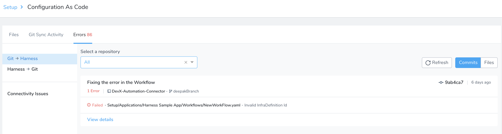
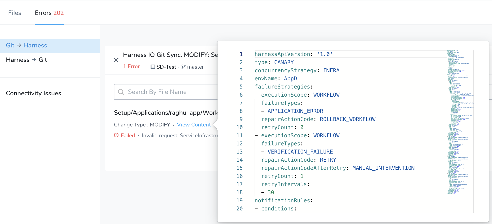
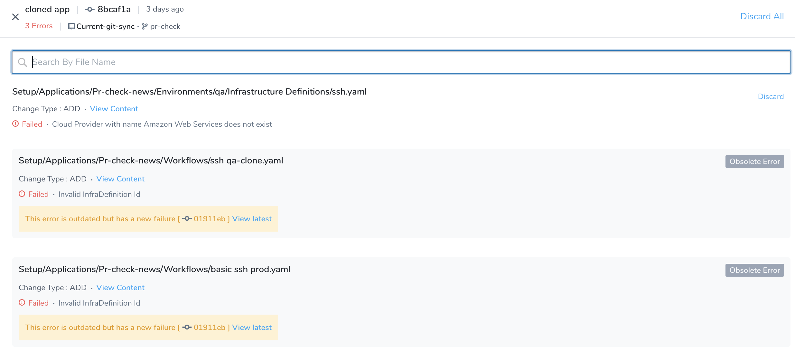
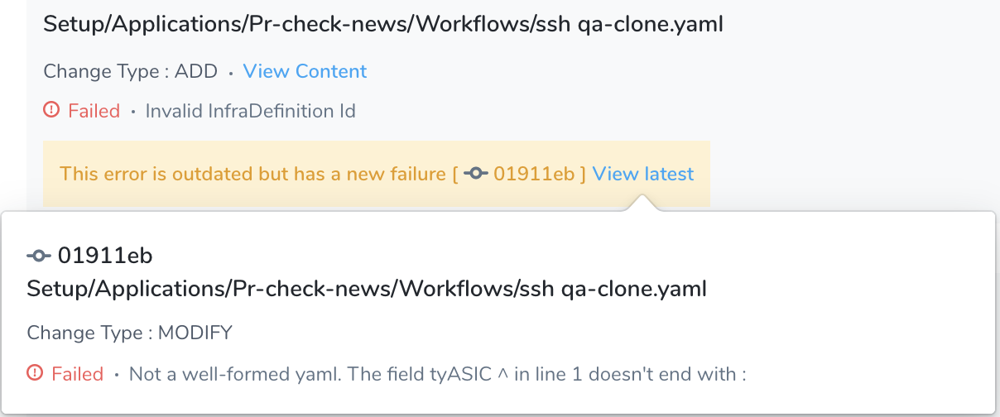
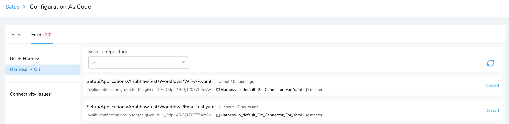
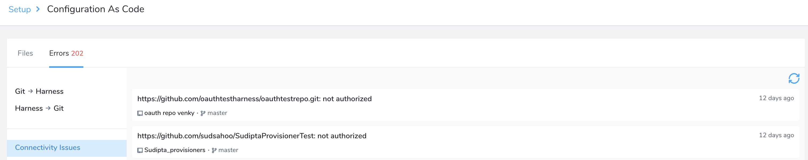

This topic helps you diagnose errors you might encounter during the Harness Git sync process. For example, when you sync a Harness Application or account with a Git repo, or when you sync an Application or Workflow in Git with Harness.

For information on viewing Git sync activity, see [View Harness Git Sync Activity](../firstgen-platform/config-as-code/view-harness-git-sync-activity.md).I
### Git Sync

Harness enables you to use YAML for all your account and Application components and sync it with a Git repo. Errors can occur during the Git sync process. Harness captures and displays the errors to help you fix them. For more information on how Git sync works, refer [Configuration as Code](../firstgen-platform/config-as-code/configuration-as-code.md).

### Review: Error Categories

The different error categories are:

* Git to Harness Sync Errors
* Harness to Git Sync Errors
* Connectivity Issues

These error messages disappear from the list when the error in that file is resolved.

#### Git to Harness Sync Errors

You can find all the errors that you might run into while syncing your Git repo with Harness account under this category. Here are some of the possible reasons for Git to Harness errors:

* Backend receives syntactically or semantically wrong input in the YAML file.
* Harness is not able to find the dependent entity. For example, when you add a Workflow and Harness is not able to find the Service on which the Workflow depends.
* The name of a YAML file changed (for example, a Cloud Provider name) and it is referenced in more than one file. If all the referenced files are not found it will lead to an error.

To fix the error, try one of the following:

* Fix the YAML content in Git and commit.
* Make the changes in the Harness Manager UI.

#### Harness to Git Sync Errors

You can find all the errors that you encounter while syncing your Harness account with your Git repo under this category. These errors occur while syncing Harness YAML with your Git repo for an entity.

To fix the error, try one of the following:

* Make the entity change from the Harness Manager UI.
* Fix from Git.

#### Connectivity Issues

All connection or network-related errors that occur during the Git Sync process appear under this category. Connectivity issues might occur because of the following reasons:

* Harness Delegate cannot connect to the Git because of credential issues.
* Connectivity issues between the Harness Delegate and Git repo.

### Step: Diagnose Git to Harness Sync Errors

1. Click **Setup**, and then click **Configuration As Code**.
2. In the **Errors** tab, click **Git → Harness**.
3. Errors are listed based on commit IDs or file names.
   * Select the **Commits** tab to list errors by commit IDs.
   * Select the **Files** tab to list errors by file name.

   

4. Filter errors for a specific repository. Select a repo from the **Select a repository** drop-down to view repo specific errors.
5. Click **View details** to see the details of the error encountered. You can see the complete path of the file where the error has occurred. It also specifies the type of change made to the file, for example, ADD, MODIFY, or DELETE.

:::note 
The commit ID, commit message, file path, error message, and initial commit message are truncated. You can hover over the mouse to view the full message.
:::

Here is a list of actions that you can perform under **View Details**:

* **Discard All:** To discard all the error messages. The discarded messages disappear from the list and cannot be retrieved.
* **Discard:** To discard the specific error message. The discarded message disappears from the list and cannot be retrieved.
* **View Content:** To view the content of the YAML file.

  
  
* **Obsolete Error:** Shows the original error when the commit was processed, but has a more recent failure in a later commit.

  

* **View Latest:** Provides the detail of the latest error encountered in the file.

  

### Step: Diagnose Harness to Git Sync Errors

1. Click **Setup**, and then click **Configuration As Code**.
2. In the **Errors** tab, click **Harness → Git**.

   

### Step: Diagnose Connectivity Issues

1. Click **Setup**, and then click **Configuration As Code**.
2. In the **Errors** tab, click **Connectivity Issues**.

   
   
### Review: RBAC with Diagnose Git Sync Errors

RBAC in Diagnose Git Sync Errors follows permissions set on the User Group to which you are a member. It follows standard Harness RBAC as described in  [Managing Users and Groups (RBAC)](../firstgen-platform/security/access-management-howtos/users-and-permissions.md).

Here are a few things to consider:

* If your User Group does not have permission to read a specific Application, then you will not be able to view the errors for that Application.
* Even if a Harness User Group has Read permissions on only one Application, its users can still read account-level settings. They simply cannot change them. Consequently, in Diagnose Git Sync Errors, the user can view account-level Git errors using **Setup**.
* The activity and errors of all account-level files are visible to all users, but a user can only see the content (**View Content**) of the files for which his User Group has permission.

### Files Unavailable Error

The `Files Unavailable Error` error can occur when Harness is unable to obtain information about files getting processed as a part of the commit during Git sync.

Had the Git sync been successful, you would have received information such as how many files were processed from the commit, how many of them were successfully processed, how many of them failed during processing, and how many of them got skipped during processing.

### Git Symbolic Link Errors

If your Git files use symlinks and a symlink cannot resolve to its reference, the Git sync will fail.

Ensure that you have no broken, or *dangling*, symlinks.

### See Also

* [View Harness Git Sync Activity](../firstgen-platform/config-as-code/view-harness-git-sync-activity.md)

