This topic contains general troubleshooting information for error messages and other issues that can arise.

:::note 
If you cannot find a resolution, please contact [Harness Support](mailto:support@harness.io) or [Harness Community Forum](https://community.harness.io/).
:::

### Login Issues

The following issues can occur when logging into Harness.

#### Logged Out Automatically

You are logged out of your Harness Manager session automatically, forcing you to log back in.

:::note 
If you log out of Harness Manager in one browser tab, Harness might log you out of all tabs.Typically, the solution is to clear local storage.
:::

##### Troubleshooting Steps

1. Log out of the Harness Manager from all Chrome tabs. (Harness only supports the Chrome desktop browser.)
2. Clear Chrome Local Storage for `app.harness.io` in **chrome://settings/siteData**.
3. Open a new tab and log into the Harness Manager.

You should not be logged out anymore.

##### Notes

* Chrome [Session Storage](https://developers.google.com/web/tools/chrome-devtools/storage/sessionstorage) is used by the Harness Manager. If you close all the tabs running the Harness Manager and then open a new tab running Harness Manager, you will likely need to log in again.
* A Chrome session will timeout after 5 minutes, but a session timeout can also happen if the tab running Harness Manager is idle for 24 hours. However, as long as the tab is not closed, Harness Manager will continue keep polling to check if a refresh is needed for the token. For example, if you have kept the tab open for 3 days, you might still be logged in, as long as the workstation has not been turned off or entered sleep mode preventing the refresh.

### Delegate Issues

The Harness Delegate runs as a service in your target deployment environment, on a host, a pod, a container, or as a task. It makes outbound HTTPS connections over port 443 and uses the credentials you provide in Harness connections such as Cloud Providers and Artifact Servers to run remote SSH and API calls.

Most Delegate issues arise from network connectivity where the Delegate is unable to connect to a Cloud Provider, Artifact Server, etc, because of network issues like port changes and proxy settings.

Some issues arise from invalid credentials due to expiry or access issues resulting from missing policies or cross project requirements in a cloud vendor.

The simplest way to detect if an issue is caused by Delegate connectivity is to run a cURL command on the Delegate host/pod and see if it works. If it does, the next step is to look at the credentials.

The following sections provide solutions to Delegate issues.

#### Failed to assign any Delegate to perpetual task

Harness does many background operations on a regular basis, such as collecting information about your cluster and deployed software. This ensures that the number of instances we report is correct, among other information.

This error message is related to these background operations. Subsequent, scheduled attempts typically clears these messages.

If these errors clear, typically a local or remote networking or similar issue is the cause.

#### Duplicate Output in Deployment Logs

This is a symptom of running duplicate Delegates. We call this the double Delegate problem.

If two Harness Delegates with the same name are running in different clusters, they will show up as one Delegate in the Harness Manager. This will make it seem as though only one Delegate is running.

Do not run Delegates with the same name in different clusters. Replace one of the Delegates and the issue will go away.

You might see errors such as `IllegalArgumentException` and multiple `Initializing` and `Rendering` lines:


```
Initializing..  
  
Rendering manifest files using go template  
Only manifest files with [.yaml] or [.yml] extension will be processed  
  
Initializing..  
  
Rendering manifest files using go template  
  
Only manifest files with [.yaml] or [.yml] extension will be processed  
  
 IllegalArgumentException: Custom Resource Definition Optional[destinationrules.networking.istio.io] is not found in cluster https://0.00.0.1:443/  
  
Failed.
```
#### Running Multiple Delegates on the Same Host

If deployment entities, such as ECS services, are getting added and removed in the same deployment, you might have two Delegates running on the same host.

Do not run multiple Delegates on the same host/pod/container. This will result in the Delegates overwriting each other's tasks.

#### Delegate Setup

Most often, Delegate errors are the result of Delegate setup issues. Ensure you are familiar with how the Delegate and Harness Manager work together. See [Delegate Installation and Management](../firstgen-platform/account/manage-delegates/delegate-installation.md).

Another common issue is the SSH key used by the Delegate to deploy to a target host is incorrect. This can happen if the SSH key in [Harness Secrets Management](../firstgen-platform/security/secrets-management/secret-management.md) was set up incorrectly, or if it is not the correct key for the target host, or the target host is not set up to allow SSH connections.

The Delegate is monitored locally using its Watcher component. The Watcher component has a watcher.log file that can provide Delete version information for troubleshooting.

#### Delegate Connection Failures To Harness Manager

If the Delegate cannot connect to the Harness Manager, try the following:

1. Use **ping** on the Delegate host to test if response times for **app.harness.io** or another URL are reasonable and consistent.
2. Use **traceroute** on **app.harness.io** to check the network route.
3. Use **nslookup** to confirm that DNS resolution is working for **app.harness.io**.
4. Connect using the IP address for **app.harness.io** (get the IP address using nslookup), for example: `http://35.23.123.321/#/login`.
5. Flush the client's DNS cache
	1. Windows: `ipconfig /flushdns`
	2. Mac/Linux: `sudo killall -HUP mDNSResponder;sudo killall mDNSResponderHelper;sudo dscacheutil -flushcache`
6. Check for local network issues, such as proxy errors or NAT license limits.
7. For some cloud platforms, like AWS EC2, ensure that security groups allow outbound traffic on HTTPS 443.
8. Try a different workstation or a smartphone to confirm the connection issue is not local to a single host.

#### Delegate Successes Followed By Failures

If you have incorrectly used the same Kubernetes Delegate YAML file for multiple Delegates, you will see Delegate successes followed by failures in the Delegate logs. This sequence is the result of one Delegate succeeding in its operation and the same operation failing with the second Delegate.

To avoid any Delegate conflicts, always use a new Kubernetes Delegate YAML download for each Delegate you install, and a unique name. For Kubernetes Delegates, you can increase the number of replicas run using a single Delegate download YAML file (change the `replicas` setting in the file), but to run multiple Delegates, use a new Delegate download from Harness for each Delegate.

#### No Delegates Could Reach The Resource

This error means that no Delegate could meet the URL criteria for validation. For more information, see [How Does Harness Manager Identify Delegates?](../firstgen-fa-qs/harness-delegate-faqs.md#how-does-harness-manager-identify-delegates).

#### WARNING: ulimit -n is too low (1024)

In Linux, you can change the maximum amount of open files allowed. You modify this number using the `ulimit` command. It grants you the ability to control the resources available for the shell or process started by it.

The Harness Shell Script Delegate requires a minimum of 10000. By default, most Linux virtual machines will have 1024.

To increase the ulimit, do the following:

1. Open an SSH session into your Linux virtual machine.
2. Open the limits configuration file as a root user:  
  
`$ sudo nano /etc/security/limits.conf`
3. Add the following settings:  
  
`* soft nofile 10000 * hard nofile 10000 root soft nofile 10000 root hard nofile 10000`  
You can also set the limit for a user named `fred` like this:  
  
`fred soft nofile 10000`  
`fred hard nofile 10000`
4. Save the limits configuration file (Ctrl+x).
5. Log out and back into the SSH session.
6. View the ulimit:  
  
`$ ulimit -n`  
`10000`
7. You may now navigate to the Shell Script Delegate folder and run the Delegate without encountering the ulimit error.

If you are simply testing a Delegate on your local Mac, use the following commands to display and raise the ulimit:

`$ launchctl limit maxfiles`

`$ sudo launchctl limit maxfiles 65536 200000`

#### Google Cloud Platform: Cluster has unschedulable pods

If you do not have enough space available in your Kubernetes cluster, you might receive the following error:

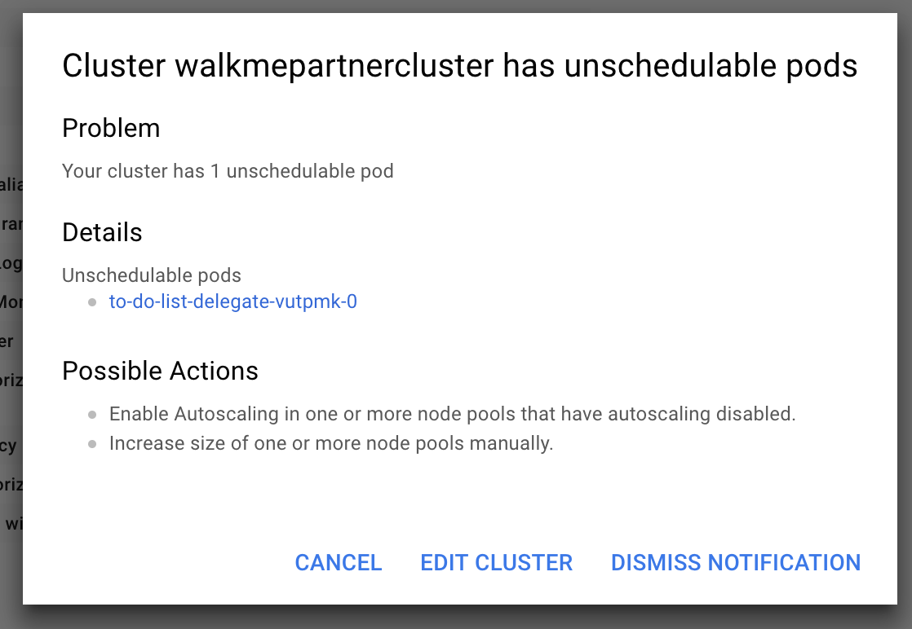##### Cause

Depending on the size of your cluster, without Autoscaling enabled or enough space, your cluster cannot run the delegate.

##### Solution

Add more space or turn on Autoscaling, wait for the cluster to restart, reconnect to the cluster, and then rerun the command:

`$ kubectl apply -f harness-delegate.yaml`

For more information, see [Autoscaling Deployments](https://cloud.google.com/kubernetes-engine/docs/how-to/scaling-apps#autoscaling_deployments) from Google.

#### Deleting a Kubernetes Delegate

In the case where you have to delete a Harness Delegate from your Kubernetes cluster, you can delete the StatefulSet for the Delegate. Once created, the StatefulSet ensures that the desired number of pods are running and available at all times. Deleting the pod without deleting the StatefulSet will result in the pod being recreated.

For example, if you have the Delegate pod name `mydelegate-vutpmk-0`, you can delete the StatefulSet with the following command:

`$ kubectl delete statefulset -n harness-delegate mydelegate-vutpmk`

Note that the `-0` suffix in the pod name is removed for the StatefulSet name.

#### Self Destruct Sequence Initiated

This very rare error can be noticed in Delegate logs:


```
Sending heartbeat...  
  
Delegate 0000 received heartbeat response 0s after sending. 26s since last response.  
  
Self destruct sequence initiated...
```
##### Cause

Delegate self-destructing because are two Delegates with same name, probably deployed to two different clusters.

##### Solution

Remove one Delegate. Typically, one Delegate is in the wrong cluster. Remove that Delegate.

#### Need to Use Long Polling for Delegate Connection to Harness Manager

By default, the Harness Delegate connects to the Harness Manager over a TLS-backed WebSocket connection, sometimes called a Secure WebSocket connection, using the `wss://` scheme ( [RFC 6455](https://tools.ietf.org/html/rfc6455#section-11.1.2)). Some network intermediaries, such as transparent proxy servers and firewalls that are unaware of WebSocket, might drop the WebSocket connection. To avoid this uncommon error, you can instruct the Delegate to use long polling.

To set up the Delegate to use long polling, you use the Delegate YAML file.

For a Kubernetes Delegate, you can set the `POLL_FOR_TASKS` setting to `true` in the **harness-delegate.yaml** file:


```
...  
        env:  
        ...  
        - name: POLL_FOR_TASKS  
          value: "true"  
...
```
For the Shell Script Delegate, edit the `pollForTasks` setting to `true` in the **config-delegate.yml** file:


```
pollForTasks: true
```
For the Docker Delegate, edit the `POLL_FOR_TASKS` setting to `true` in the **config-delegate.yml** file:


```
-e POLL_FOR_TASKS=true \
```
For the ECS Delegate, edit the `POLL_FOR_TASKS` setting in the **ecs-task-spec.json** file:


```
{  
 "name": "POLL_FOR_TASKS",  
 "value": "true"  
},
```
#### KubernetesClientException: Operation: [list] for kind: [Deployment] with name: [null] in namespace: [default] failed

If you have a proxy set up on the network where the Harness Kubernetes Delegate is running, you need to add the cluster master hostname or IP in the Delegate harness-delegate.yaml `NO_PROXY` list.

For example, you might see a log error like this:


```
io.fabric8.kubernetes.client.KubernetesClientException: Operation: [list]  for kind: [Deployment]  with name: [null]  in namespace: [default]  failed.
```
1. Obtain the cluster master hostname or IP (`kubectl cluster-info`).
2. Open the **harness-delegate.yaml** you used to create the Delegate, and add the cluster master hostname or IP to the `NO_PROXY` setting in the `StatefulSet` spec:


```
        - name: NO_PROXY  
          value: "192.0.2.0"
```
1. Apply harness-delegate.yaml again to restart the Kubernetes Delegate (`kubectl apply -f harness-delegate.yaml`).

### Artifact Collection

This section lists common errors you might receive when Harness attempts to collect artifacts.

#### Workflow Hanging on Artifact Collection

If a Delegate has been offline for an extended period of time, you might need to reset the Harness Cloud Provider credentials by manually pulling the artifact in the Harness Service.

See [Manually Select an Artifact](../continuous-delivery/model-cd-pipeline/setup-services/service-configuration.md#manually-select-an-artifact).

### Common Errors and Alerts

This section lists common error and alert messages you might receive.

#### No Delegates Could Reach The Resource

This error means that no Delegate could meet the URL criteria for validation. When a task is ready to be assigned, the Harness Manager first validates its lists of Delegates to see which Delegate should be assigned the task. It validates the Delegate using the URL in the task, such as a API call or SSH command. See  [How Does Harness Manager Identify Delegates](../firstgen-fa-qs/harness-delegate-faqs.md#how-does-harness-manager-identify-delegates)ates?.

#### Harness SecretStore Is Not Able to Encrypt/Decrypt

Error message:


```
Secret manager Harness SecretStore of type KMS is not able to encrypt/decrypt. Please check your setup
```
This error results when Harness Secret Manager (named **Harness SecretStore**) is not able to encrypt or decrypt keys stored in AWS KMS. The error is usually transitory and is caused by a network connectivity issue or brief service outage.

Check [Harness Site Status](https://status.harness.io/) and [AWS Status](https://status.aws.amazon.com/) (search for **AWS Key Management Service**).

#### Editing a Notification Group Based Rule Is Not Supported Anymore

When trying to edit the **Notification Strategy** section of a Workflow, you might see this error message:


```
Editing a Notification Group based rule is not supported anymore, please delete and create a new one
```
Your Workflow might have some unsupported Notification Strategy setting that was not migrated to the current method for notifications.

To fix this, remove the existing Notification Strategy.  Click the **X** next to the strategy in the Workflow's **Notification Strategy** section, and then create a new strategy.

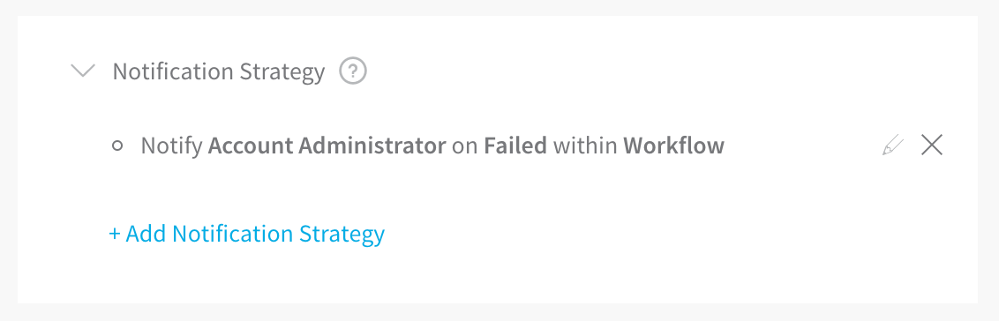

#### Trigger Rejected

If you use a **Webhook** Trigger to execute a Workflow or Pipeline deployment but the name for the artifact in the cURL command is different than the name of the artifact, you might receive this error:


```
Trigger Rejected. Reason: Artifacts Are Missing for Service Name(S)
```
This error can happen if a bad name for an artifact build version is placed in the cURL command. For example, a prefix in the artifact naming convention that was not added to the Trigger cURL command. Here is a cURL example showing a buildNumber **v1.0.4-RC8**:


```
curl -X POST -H 'content-type: application/json'   
--url https://app.harness.io/gateway/api/webhooks/TBsIRx. . .   
-d '{"application":"tavXGH . . z7POg","artifacts":[  
{"service":"app","buildNumber":"**v1.0.4-RC8**"}]}’
```
If the artifacts available for the Harness Service have a prefix or a different naming convention, such as **myApp/v1.0.4-RC8**, then the cURL command will not work.

Always ensure that the Webhook cURL command has the correct artifact name.

#### Exception in WinRM Session

When you deploy to a Windows environment, Harness makes a WinRM connection. Before it can make the connection, the Harness Delegate must be able to resolve any domain names for the target virtual network. If the target virtual network for a deployment does not have DNS enabled, you might see the following error:


```
Exception in WinrmSession. . . Buffer already closed for writing
```
Ensure that the virtual network allows DNS name resolution so that Harness can resolve names before running the WinRM connection. For more information, see [Delegate and Connectors for IIS](../continuous-delivery/dotnet-deployments/1-delegate-and-connectors-for-iis.md) and [IIS Environments in AWS and Azure](../continuous-delivery/dotnet-deployments/iis-environments.md).

#### You are not authorized to perform this operation: AmazonEC2: Status code 403

This error occurs when you are testing a Harness AWS Cloud Provider and the credentials used for the connection do not include a policy with the [DescribeRegions](https://docs.aws.amazon.com/AWSEC2/latest/APIReference/API_DescribeRegions.html) action.

The DescribeRegions action is required for all AWS Cloud Providers regardless of what AWS service you are using as your deployment target (AMI/ASG, ECS, Lambda, etc).

Harness tests the connection using an API call for the DescribeRegions action.

This is described in [Add Amazon Web Services Cloud Provider](../firstgen-platform/account/manage-connectors/add-amazon-web-services-cloud-provider.md).

Ensure that one of the IAM roles assigned to the user account used for AWS Cloud Provider credentials (either associated with the Harness Delegate's host instance or the access key) contains the DescribeRegions action.

#### Git-upload-pack not permitted

One possible cause of this error is if you are using a Personal Access Token (PAT) for your GitHub Connector and your GitHub organization uses SAML single sign-on (SSO).

To use a personal access token with a GitHub organization that uses SAML single sign-on (SSO), you must first authorize the token. See [Authorizing a personal access token for use with SAML single sign-on](https://docs.github.com/en/enterprise-cloud@latest/authentication/authenticating-with-saml-single-sign-on/authorizing-a-personal-access-token-for-use-with-saml-single-sign-on) from GitHub.


```
org.eclipse.jgit.api.errors.TransportException: https://github.com/*******/*******: git-upload-pack not permitted on 
```
### Naming Conventions

Some naming conventions in repositories and other artifact sources, or in target infrastructures, cannot be used by Harness. For example, if a Harness Trigger Webhook uses a Push notification from a Git repo branch that contains a dot in its name, the Trigger is unlikely to work.

Character support in Harness Environment and Infrastructure Definition entity names is restricted to alphanumeric characters, underlines, and hyphens. The restriction is due to compatibility issues with Harness backend components, database keys, and the YAML flow where Harness creates files with entity names on file systems.

### Secrets

The following issues can occur when using Harness secrets.

#### Secrets Values Hidden In Log Output

If a secret's unencrypted value shares some content with the value of another Harness variable, Harness will hide the secret's value in any logs. Harness replaces the secret's conflicting value with the secret's name in any log displays. This is for security only, and the actual value of the secrets and variables are still substituted correctly.

#### AWS KMS 403

The Harness Delegate runs in your target deployment environment and needs access to the default Harness AWS KMS for secrets management. If it does not have access, the following error can occur:


```
Service: AWSKMS; Status Code: 403
```
Ensure that the Delegate can reach the Harness KMS URL by logging into the Delegate host(s) and entering the following cURL command:


```
curl https://kms.us-east-1.amazonaws.com
```
Next, ensure that your proxies are not blocking the URL or port 443.

If this does not fix your error, and you are not using the default Harness KMS secret store, the AWS KMS access key provided in Harness for your own KMS store is likely invalid.

### Configure as Code and Git Sync

The following issues can occur when using Harness Configure as Code and Git Sync.

#### Git Push to Harness Fails

If your Harness Application is synched two-way with your Git repo, the Git push to Harness might not work unless all of the required Application settings are fully-configured in your Git YAML files before pushing your Application up to Harness.

For example, if you have defined an Infrastructure Definition in your Git YAML files, but its required fields are incomplete, the push to Harness will likely fail.

This is no different than trying to submit incomplete settings in the Harness Manager.

In many cases, it is best to first use Harness Manager to configure your Application, ensuring all required settings are configured, and then sync that with your repo. Unless you remove any required settings in the Git files, the Application will sync with Harness successfully.

#### Need to Reset History on Synced Git Repository

In some cases where you sync your Git repo with Harness, you might need to reset the Git repo history because of an error, such as accidentally adding a secret's value in the repo. For example, Git has a [Rewriting History](https://git-scm.com/book/en/v2/Git-Tools-Rewriting-History) option.

To repair this scenario, do the following:

1. Remove the Harness Webhook configured on your Git repo account (Github, Bitbucket, etc). This step is critical to ensure the Application history deletion does not propagate to Harness the next time it is synched.
2. Delete all of your Harness Applications on the Git account.
3. Re-sync each Harness Application using the Configuration As Code sync functionality. See [Configuration as Code](../firstgen-platform/config-as-code/configuration-as-code.md).
4. Confirm that all of your Applications are visible in your Git repo.
5. [Notify Harness](mailto:support@harness.io) to confirm we don't see any issues/errors in your account.
6. Enable the Webhook in Git repo and test syncing.

### Triggers

This section covers error messages you might see when creating, updating, deleting, or executing a Trigger. It includes authorization/permissions steps to resolve the errors.

#### zsh: no matches found

If you are using MacOS Catalina the default shell is zsh. The zsh shell requires that you escape the ? character in your cURL command or put quotes around the URL.

For example, this will fail:


```
curl -X POST -H 'content-type: application/json' --url https://app.harness.io/gateway/api/webhooks/xxx?accountId=xxx -d '{"application":"fCLnFhwsTryU-HEdKDVZ1g","parameters":{"Environment":"K8sv2","test":"foo"}}'
```
This will work:


```
curl -X POST -H 'content-type: application/json' --url "https://app.harness.io/gateway/api/webhooks/xxx?accountId=xxx -d '{"application":"fCLnFhwsTryU-HEdKDVZ1g","parameters":{"Environment":"K8sv2","test":"foo"}}'"
```
#### About Triggers and Authorizations

A Trigger involves multiple settings, including Service, Environment, and Workflow specifications. Harness examines these components as you set up a Trigger. You might be authorized for one component selected in a Trigger, such as a Service, but not another, such as an Environment. In these cases, an error message will alert you to missing authorizations.

To determine if you are authorized to create Triggers for a particular Environment or other components, review:

* All the permissions of your Harness User Group.
* The Usage Scope of the Cloud Provider, and of any other Harness connectors you have set up.

For further details, see [Managing Users and Groups (RBAC)](../firstgen-platform/security/access-management-howtos/users-and-permissions.md) and [Connectors Overview](../firstgen-platform/account/manage-connectors/harness-connectors.md).

#### User does not have "Deployment: execute" permission

Error messages of the form `User does not have "Deployment: execute" permission` indicate that your user group's **Application Permissions** > **Action** settings do not include **execute** in the scope of the specified Application and/or Environment. To resolve this, see [Application Permissions](../firstgen-platform/security/access-management-howtos/users-and-permissions.md#application-permissions).

#### User not authorized

The following error message indicates that a non-Administrator has tried to submit a Trigger whose **Workflow Variables: Environment** field is configured with a variable, rather than with a static Environment name:

`User not authorized: Only members of the Account Administrator user group can create or update  Triggers with parameterized variables`

Submitting a Pipeline Trigger that includes such a Workflow will generate the same error.

One resolution is to set the **Environment** field to a static value. But if the **Environment** setting must be dynamic, a member of the Account Administrator user group will need to configure and submit the Trigger.

### Deployments

The following issues can occur with manual or Trigger-based Deployments.

#### JSchException: channel is not opened

This error can happen in SSH deployments (also called [Traditional Deployments](../continuous-delivery/traditional-deployments/traditional-deployments-overview.md)) when the MaxSessions SSH settings on the target host(s) is less than 2.

The [default for MaxSessions](https://linux.die.net/man/5/sshd_config) is set in **/etc/ssh/sshd\_config** and is 10.

To fix this error, do the following:

1. Edit to /etc/ssh/sshd\_config on the target host(s).
2. Modify **MaxSessions 1** line and change it to **MaxSessions 2** or greater. The default is **MaxSessions 10**.
3. Restart SSD service: `sudo service sshd restart`
4. Try your deployment again.

Harness works with the default settings for SSH.

#### Some phases/steps are found to be invalid/incomplete

If a Workflow in a Pipeline is incomplete (missing information in a Workflow step), then the Pipeline Stage for that Workflow will indicate that the Workflow is incomplete:

[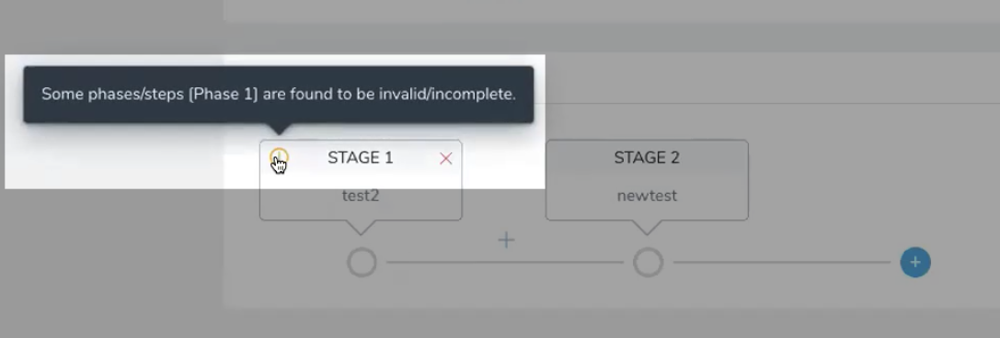](./static/troubleshooting-harness-08.png)Open the incomplete Workflow, complete it, and then return to the Pipeline.

Another example of an incomplete Workflow is a Workflow with Workflow variables that have not been given default values.

If you try to deploy a Pipeline with an incomplete Workflow, Harness will prevent you.

[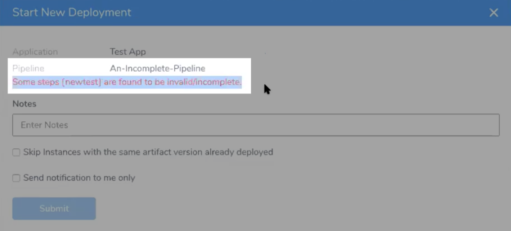](./static/troubleshooting-harness-10.png)Simply fix the Workflow and then deploy the Pipeline.

#### Trigger Policy Limits

Harness collects new artifacts from your repository on an interval basis. By default, if more than one of the same artifact is collected during the same polling interval, only the latest version will be used to initiate a Trigger set for **On New Artifact**.

If you prefer to have a deployment triggered for every single version of an artifact, Harness can implement a **per artifact** deployment.

Here is an example from the a log showing two `-pr-####` versions for an artifact collected at the same time which resulted in two deployments starting:


```
May 24 10:45:07 manager-XXXXXXXXXX-jhjwb manager-Harness-Prod-KUBERNETES  
INFO [1.0.32101] [notifyQueue-handler-XXXXXXX--XXXXXXX]  
INFO software.wings.delegatetasks.buildsource.BuildSourceCallback -  
[[XXXXXXXXXXXXXXXXXXXXXXXXXXXXXXX, XXXXXXXXXXXXXXXXXXXXXXXXXXXXXXX-branch-foo-bar-plugin-2-x,  
523ccXXXXXXXXXXXXXXXXXXXXXXXXXXXXXXX32a7**-pr-2462**, dd32432955979f5745ba606e50320f2a25f4bff4,  
dd324XXXXXXXXXXXXXXXXXXXXXXXXXXXXXXXbff4-branch-sku-lookup,  
dd324XXXXXXXXXXXXXXXXXXXXXXXXXXXXXXXbff4**-pr-2718**]] new artifacts collected for artifactStreamId XXXXXXXXXXXXXXX
```
The corresponding Trigger that looks for all `-pr` versions and starts a deployment using the `-pr-[0-9]+$` expression:

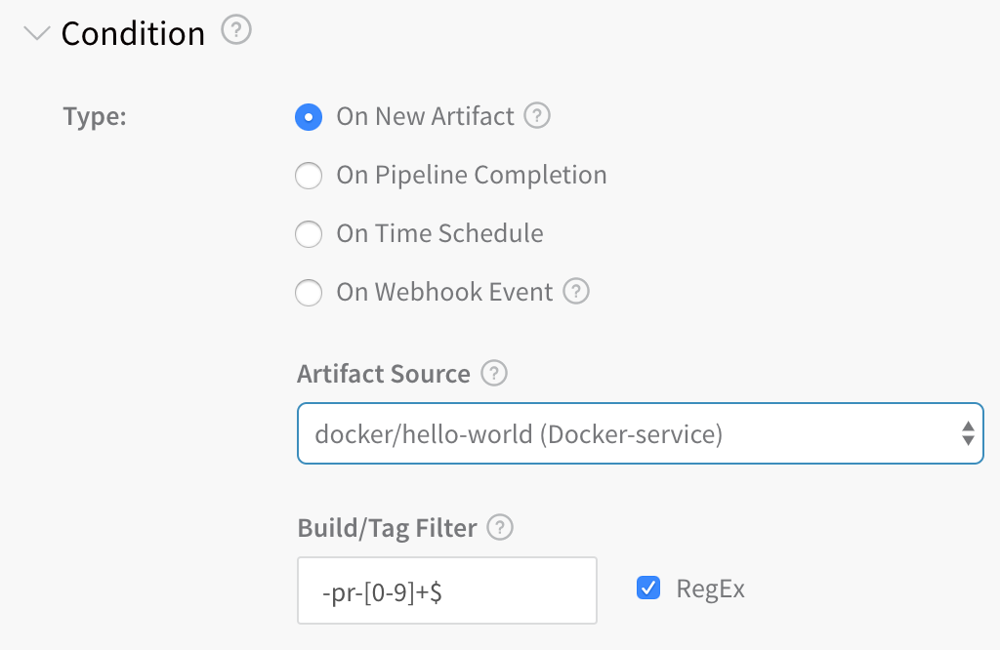

#### Deployment Rate Limits

If you've reached 85% of the limit, you will see:


```
85% of deployment rate limit reached. Some deployments may not be allowed. Please contact Harness support.
```
If you've reached 100% of the limit, you might see:


```
Deployment rate limit reached. Some deployments may not be allowed. Please contact Harness support.
```
Harness applies an hourly and daily deployment limit to each account to prevent configuration errors or external triggers from initiating too many undesired deployments. If you are notified that you have reached a limit, it is possible that undesired deployments are occurring. Please determine if a Trigger or other mechanism is initiating undesired deployments. If you continue to experience issues, contact [Harness Support](mailto:support@harness.io).

:::note 
* The daily limit is 400 deployments every 24 hours. The hourly limit is 160 deployments and is designed to detect any atypical upsurge of deployments.
* You can only use 40% of the daily deployment limit in a single hour.
:::

#### GraphQL API Deployment Rate Limits

Harness GraphQL API imposes the following limits:

* **Deployments:** 100 per 24 hours (rolling, not reset at 12am).
* **GraphQL:** 30 requests per minute.
* **GraphQL custom dashboard:** 30 requests per minute per paid account, 5 per Community and Essentials Editions.
* **Delegate:** 200 tasks acquired per minute per account. 10000 tasks acquired per minute per pod.
* **Export Executions:** 25 exports per 24 hours (rolling).
* **Logins:** 300 request per minute per pod.

##### Cloudflare Rate Limiting

Harness uses Cloudflare as part of its platform. As a result, the following limitations apply:

* 500 queries per minute per Harness account Id.
* If the limit is reached, queries are blocked for one minute.

If the limit is reached, you will see a 429 status code with the following response:


```
{  
  "code": "TOO_MANY_REQUESTS",  
  "message": "Too many requests received, please try again later - Rate-Limit Limit 500 reached",  
  "status": "Error"  
}
```
#### Failed to Create the File

If you have a SSH Service that uses the **Download Artifact** script and the path **Artifact Download Directory** setting does not exist on the target host, you will receive the `failed to create the file` error and the deployment will fail.

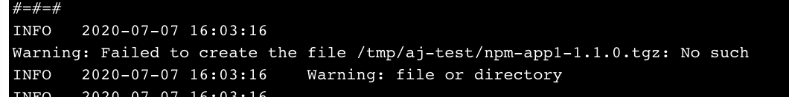Ensure that the path in **Artifact Download Directory** exists on the target host:

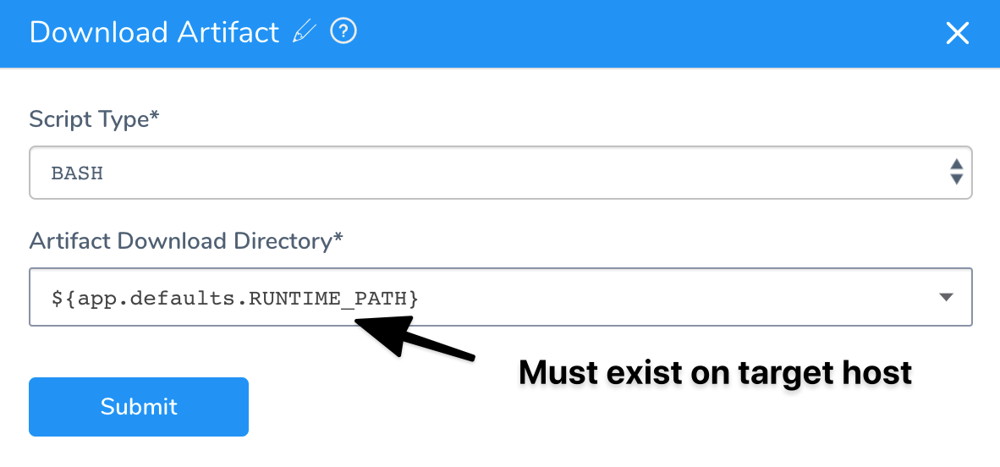See [Service Types and Artifact Sources](../continuous-delivery/model-cd-pipeline/setup-services/service-types-and-artifact-sources.md) for more information.

#### Error in Log When There is No Error

When Harness captures commands output, it captures both standard out (stdout) and standard error (stderr) to the screen. Information from stdout receives the prefix `INFO` while information from stderr receives the prefix `ERROR`. This is meant to allow our users to know where the information they see comes from.

Unfortunately, several Linux commands and applications use standard out as a way to print information to the screen that will not be captured if the output is captured to a file.

For example, the cURL command shows a download progress indication on the screen. If you redirect cURL output to a file the progress indicator is not captured in the file. This is done by showing the progress indicator in standard out. This is a very useful feature for many users, but for Harness is causes the progress indicator to be seen with the `ERROR` prefix.

You can test this for yourself with the following short example:


```
curl https://app.harness.io/version.txt >out.txt 2>err.txt  
  
cat out.txt  
  
cat err.txt
```
As you can see, the err.txt file has the cURL command output that in Harness will show with the `ERROR` prefix.

If Harness does not show standard error, then many errors will not be captured, confusing customers. Therefore, Harness shows the standard error in its logs.

### Verifications

The following issues can occur with verifications.

#### License Type Does Not Support Running This Verification

Harness Continuous Verification is not *fully* supported for Harness Essentials and Community Editions. If you are running one of those editions, you might receive the following error:

`Your license type does not support running this verification`

For Harness Essentials and Community, Continuous Verification on metrics is supported for Prometheus, CloudWatch, and Stackdriver only.

You can upgrade to Harness Professional or use Prometheus, CloudWatch, and Stackdriver.

#### Search Keyword Too Vague

If a 24/7 Service Guard or deployment verification is not reporting any data, the search keywords for verification provider might be too broad.

For example, when you set up the 24/7 Service Guard or deployment verification step, you might have `level:ERROR` in the **Search Keywords** setting.

If the **Search Keywords** settings in the verification provider settings are too broad, when you click the **Guide for Example** button for the **Host Name Field**, **Guide for Example** can return field names for application records other than your target application.

To fix this, click **Guide from Example** several times. This will give you different field lists for the different applications until you find the correct field for the host name. Refreshing the browser can also pick up a new sample.

### AWS AMI

The following errors might occur when setting up and deploying AMIs in Harness. For deployment steps, see [AWS AMI Deployments](/docs/category/aws-ami-deployments).

#### Auto Scaling Group Not Showing Up

When you configure an [Infrastructure Definition](../continuous-delivery/model-cd-pipeline/environments/environment-configuration.md#add-an-infrastructure-definition), the Infrastructure Definition **Auto Scale Group** setting is empty. This is expected behavior. Simply allow a few seconds for the drop-down to populate.

#### Couldn't Find Reference AutoScalingGroup

If a Workflow's [Setup AutoScaling Group](../continuous-delivery/aws-deployments/ami-deployments/ami-deployment.md#asg-setup-step) step fails with a message of the following form, this indicates that at least one Infrastructure Definition in the Workflow's Environment is configured with an ASG that is not currently available on AWS:

`Couldn't find reference AutoScalingGroup: [ECS\_\_QA\_\_Application\_AMI\_QA\_\_245] in region: [us‑east-1]`

To correct this:

1. In Harness Manager, navigate to your Application's **Environments** details page.
2. Open each Infrastructure Definition used by the Workflow that failed, then open the Infrastructure Definition's configuration section. Ensure that the **Auto Scaling Groups** field points to an ASG to which you currently have access in the AWS Console.
3. If this does not allow your deployment to proceed, you might also need to toggle the **Host Name Convention** field's entry between the `publicDnsName` and `privateDnsName` primitives. (This depends on whether the Launch Configuration that created your ASG template was configured to create a public DNS name.) For details, see AWS' [IP Addressing in a VPC](https://docs.aws.amazon.com/autoscaling/ec2/userguide/asg-in-vpc.html#as-vpc-ipaddress) topic.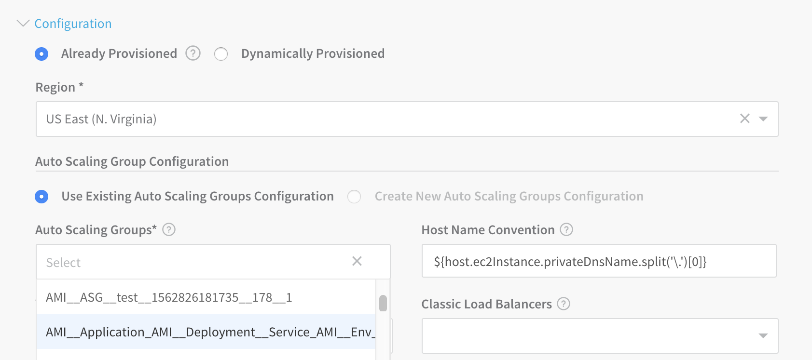

:::note 
Harness Manager will prevent you from simply removing a misconfigured Infrastructure Definition if it's referenced by any of your Application's Workflows.  
  
So in some cases, you might find it easiest to create a new Infrastructure Definition, reconfigure your Workflow to use that Infrastructure Definition, and then delete the misconfigured Infrastructure Definition.
:::


#### Valid Blue/Green Deployment Failed and Rolled Back in Harness

This can occur when Harness' steady state timeout setting is too restrictive, compared to the time AWS requires to swap your Target Groups' routes.

To resolve the rollbacks: In your Blue/Green Workflow's  [Step 1](../continuous-delivery/aws-deployments/ami-deployments/ami-blue-green.md#setup-asg-bg) (**Setup AutoScaling Group**), try raising the **Auto Scaling Steady State Timeout (mins)** setting to at least match the switchover interval you observe in the AWS Console.

#### AutoScaling Group Resize Operation Completed with Status:[FAILED]

This error can occur in an AMI/ASG deployment if the Harness Delegate stops running during task execution.

Validate that the Delegate is running. You can also scope the task to a Delegate using [Delegate Scoping](../firstgen-platform/account/manage-delegates/scope-delegates-to-harness-components-and-commands.md).

### AWS ECS

The following errors might occur when setting up and deploying ECS in Harness:

* [Rate Exceeded](#rate-exceeded)
* [New ARN and Resource ID Format Must be Enabled](#new-arn-and-resource-id-format-must-be-enabled)
* [Unable to Place a Task Because no Container Instance met all of its Requirements](#unable-to-place-a-task-because-no-container-instance-met-all-of-its-requirements)
* [Cannot Pull Container Image](#cannot-pull-container-image)
* [Invalid CPU or Memory Value Specified](#invalid-cpu-or-memory-value-specified)
* [ClientException: Fargate requires that 'cpu' be defined at the task level](#client-exception-fargate-requires-that-cpu-be-defined-at-the-task-level)
* [AWS Does not Expose Container Instances and EC2 Instances](#aws-does-not-expose-container-instances-and-ec2-instances)
* [ClientException: The 'memory' setting for container is greater than for the task](#client-exception-the-memory-setting-for-container-is-greater-than-for-the-task)
* [Could Not Reach Http://](#could-not-reach-http-ip-address-port-v1-tasks-to-fetch-container-meta-data)
* [AmazonElasticLoadBalancingException: Rate exceeded](#amazon-elastic-load-balancing-exception-rate-exceeded)
* [AWS Console Not Showing Harness Deployed Service](#aws-console-not-showing-harness-deployed-service)
* [ECS Upgrade Containers Step Times Out](#ecs-upgrade-containers-step-times-out)

For information on ECS troubleshooting, see [Amazon ECS Troubleshooting](https://docs.aws.amazon.com/AmazonECS/latest/developerguide/troubleshooting.html) from AWS.#### Rate Exceeded


A common issue with AWS deployments is exceeding an AWS rate limit for some AWS component, such as ECS clusters per region or maximum number of scaling policies per Auto Scaling Groups.

For steps to increase any AWS limits, see [AWS Service Limits](https://docs.aws.amazon.com/general/latest/gr/aws_service_limits.html) from AWS.

#### New ARN and Resource ID Format Must be Enabled

Harness uses tags for Blue/Green deployment, but ECS requires the new ARN and resource ID format be enabled to add tags to the ECS service.

If you have not opted into the new ECS ARN and resource ID format before you attempt Blue/Green deployment, you might receive the following error:

`InvalidParameterException: The new ARN and resource ID format must be enabled to add tags to the service. Opt in to the new format and try again.`

To solve this issue, opt into the new format and try again. For more information, see [Migrating your Amazon ECS deployment to the new ARN and resource ID format](https://aws.amazon.com/blogs/compute/migrating-your-amazon-ecs-deployment-to-the-new-arn-and-resource-id-format-2/) from AWS.

#### Unable to Place a Task Because no Container Instance met all of its Requirements

The Upgrade Containers step might show the following message:

`(service service-name) was unable to place a task because no container instance met all of its requirements.`

Review the CPU requirements in both the task size and container definition parameters of the task definition.

See [Service Event Messages](https://docs.aws.amazon.com/AmazonECS/latest/developerguide/service-event-messages.html#service-event-messages-list) from AWS.

#### Cannot Pull Container Image

You might see Docker errors indicating that when creating a task, the container image specified could not be retrieved.

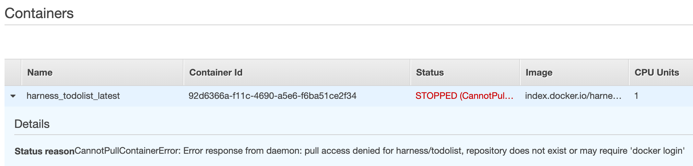See [Cannot Pull Container Image Error](https://docs.aws.amazon.com/AmazonECS/latest/developerguide/task_cannot_pull_image.html) from AWS.

#### Invalid CPU or Memory Value Specified

See the required settings in [Invalid CPU or Memory Value Specified](https://docs.aws.amazon.com/AmazonECS/latest/developerguide/task-cpu-memory-error.html) from AWS.

#### ClientException: Fargate requires that 'cpu' be defined at the task level

Ensure that you add the CPU and Memory settings in the Harness Service Container Specification section—for example:


```
"cpu" : "1",  
  
"memory" : "512"
```
#### AWS Does not Expose Container Instances and EC2 Instances

If you are trying to perform Harness verification on Fargate ECS deployments, you might receive the following error:


```
For Fargate tasks, AWS does not expose Container instances and EC2 instances, so there is no way to fetch dockerContainerId. Verification steps using containerId may not work
```
The error occurs because Harness verification needs the container metadata. Harness cannot obtain the EC2 instance data via the AWS API because Fargate does not expose underlying EC2 instances. Without the instance IP, Harness cannot pull the container ID needed.

#### ClientException: The 'memory' setting for container is greater than for the task

In the Harness Service **Container Specification** JSON, there are two settings for memory. The memory setting for the container must not be greater than the memory setting for the task:


```
{  
  
  "containerDefinitions" : [ {  
  
    "name" : "${CONTAINER_NAME}",  
  
    "image" : "${DOCKER_IMAGE_NAME}",  
  
    "memory" : 512,  
  
    ...  
  
  } ],  
  
  "executionRoleArn" : "${EXECUTION_ROLE}",  
  
  ...  
  
  "cpu" : "1",  
  
  "memory" : "512",  
  
  "networkMode" : "awsvpc"  
  
}
```
#### AmazonElasticLoadBalancingException: Rate exceeded

You might receive this error as a result of AWS Load Balancer rate limiting. For more information, see [Limits for Your Application Load Balancers](https://docs.aws.amazon.com/elasticloadbalancing/latest/application/load-balancer-limits.html) and [Limits for Your Classic Load Balancer](https://docs.aws.amazon.com/elasticloadbalancing/latest/classic/elb-limits.html) from AWS.

#### AWS Console Not Showing Harness Deployed Service

If you cannot see the deployed ECS service in the AWS Console, it is typically because of pagination in the AWS Console.

When searching in AWS for the deployed Harness service, the console only searches through the first 100 displayed services.

Click to the next 100 to search through records 101-200 and so on. You will find the ECS service and Tasks.

#### ECS Upgrade Containers Step Times Out

Timeouts can occur for a number of reasons, but if the ECS **Upgrade Containers** step is timing out, check the timeout setting in the preceding **ECS Service Setup** step.

The timeout for the **Upgrade Containers** step is inherited from the preceding **ECS Service Setup** step.

### AWS Lambda

The following troubleshooting steps should help address common Lambda issues.

#### User is not authorized to perform: lambda:GetFunction

When you deploy your Workflow you might receive this error:


```
Exception: User: arn:aws:sts::XXXXXXXXXXXX:assumed-role/iamRole_forDelegate/i-XXXXXXXXXXXX   
is not authorized to perform: lambda:GetFunction on resource:   
arn:aws:lambda:us-east-1:XXXXXXXXXXXX:function:ExampleApp-aws-lambda-Lambda-test   
(Service: AWSLambda; Status Code: 403; Error Code: AccessDeniedException;   
Request ID: 1e93ab96-985f-11e9-92b1-f7629978142c) while deploying function: ExampleApp-aws-lambda-Lambda-test
```
This error occurs because the IAM role attached to your EC2 or ECS Delegate host does not have the **AWSLambdaRole** (arn:aws:iam::aws:policy/service-role/AWSLambdaRole) role attached. The role contains the `lambda:InvokeFunction` needed:


```
{  
    "Version": "2012-10-17",  
    "Statement": [  
        {  
            "Effect": "Allow",  
            "Action": [  
                "lambda:InvokeFunction"  
            ],  
            "Resource": [  
                "*"  
            ]  
        }  
    ]  
}
```
Attach the AWSLambdaRole (arn:aws:iam::aws:policy/service-role/AWSLambdaRole) policy to the IAM role used by your Delegate host(s).

For more information, see [Identity-based IAM Policies for AWS Lambda](https://docs.aws.amazon.com/lambda/latest/dg/access-control-identity-based.html) from AWS.

#### Exception: The runtime parameter of nodejs6.10 is no longer supported

If you choose Node.js version 6.10 as the runtime for your Lambda function, you might receive this error.

AWS Lambda no longer supports Node.js version 6.10. Use a newer version.

### Azure

The following troubleshooting steps should help address common Azure issues.

#### Azure SDK and Authenticated Proxy

Harness uses the Azure SDK among other methods and Authenticated proxy is not supported for Azure SDK. Consequently, you cannot use Azure connections for artifacts, machine images, etc, that require proxy authentication. This is an Azure limitation, not a Harness limitation. This is a known Azure limitation with Java environment properties and their SDK.

#### Failed to pull image

Kubernetes might fail to pull the Docker image set up in your Service:


```
Event  : Pod   harness-example-deployment-6b8794c59-2z99v   Error: ErrImagePull   Failed  
Event  : Pod   harness-example-deployment-6b8794c59-2z99v   Failed to pull image   
"harnessexample.azurecr.io/todolist-sample:latest": rpc error: code = Unknown desc = Error response from daemon:   
Get https://harnessexample.azurecr.io/v2/todolist-sample/manifests/latest: unauthorized: authentication required   Failed
```
This is caused by the `createImagePullSecret` setting set to `false` in the values.yaml file in Service **Manifests**.

To fix this, set the `createImagePullSecret` setting set to `true`, as described in [Modify ImagePullSecret](../continuous-delivery/azure-deployments/aks-howtos/2-service-and-artifact-source.md#modify-image-pull-secret):


```
createImagePullSecret: true
```
#### Boot Diagnostic Error in the Harness Deployment Log

If you are receiving a boot diagnostic error in a deployment log, disable the Boot diagnostics setting in the VM scale set in Azure:


### Helm

The following troubleshooting information should help you diagnose common Helm problems:

* [Failed to Find the Previous Helm Release Version](#failed_to_find_the_previous_helm_release_version)
* [Helm Install/Upgrade Failed](#helm_install_upgrade_failed)
* [First Helm Deployment Goes to Upgrade Path](#first_helm_deployment_goes_to_upgrade_path)
* [Tiller and Helm in Different Namespaces](#tiller_and_helm_in_different_namespaces)
* [Unable to get an Update from the Chart Repository](#unable_to_get_an_update_from_the_chart_repository)

#### Failed to Find the Previous Helm Release Version

Make sure that the Helm client and Tiller are installed. Do the following:

* Verify that Helm is installed.
* Check if the Git connector being used in the Workflow and the Delegate can connect to the Git repo. Check in the Delegate logs for Git connectivity issues.

#### Helm Install/Upgrade Failed

Likely, there is an incompatible Helm client or Tiller. The Helm client needs to be lesser or equal to the Tiller version:

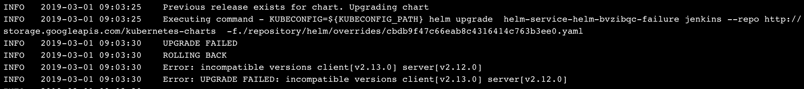To fix this, upgrade Tiller:

`helm init --upgrade`

#### First Helm Deployment Goes to Upgrade Path

In some cases, the first Helm deployment goes to the upgrade path even though the Helm version is working fine.

This is the result of a Helm issue: <https://github.com/helm/helm/issues/4169>.

The issue happens between Helm client versions 2.8.2 to 2.9.1. To fix this, upgrade the Helm client to the version after 2.9.1.

#### Tiller and Helm in Different Namespaces

A Helm install/upgrade can fail because Tiller is deployed in a namespace other than `kube-system`.

To fix this, pass the`--tiller-namespace <NAMESPACE>`as command flag in the Workflow **Helm Deploy** step.

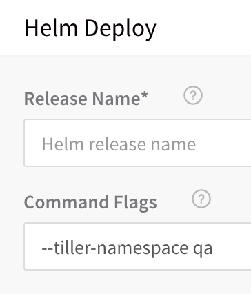

#### Unable to get an Update from the Chart Repository

If Harness cannot get an update from a chart repo you have set up for your Helm Service, during deployment you might see the error:


```
Unable to get an update from the "XYZ" chart repository ... read: connection reset by peer
```
To fix this, find the Delegate that the Helm update ran on, and then SSH to the Delegate host and run the Helm commands manually. This will confirm if you are having an issue with your Harness setup or a general connectivity issue.

### IIS (.NET)

The following problems can occur when deploying your IIS website, application, or virtual directory.

#### Error: No delegates could reach the resource

You receive this error when deploying your workflow.

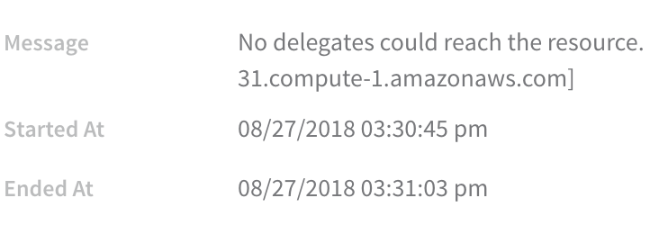##### Solutions

* Ensure your artifact can be deployed via WinRM onto a Windows instance. It's possible to select the wrong artifact in Service.
* Ensure you have access to the deployment environment, such as VPC, subnet, etc.
* Ensure your WinRM Connection can connect to your instances, and that your instances have the correct ports open.

#### Port Conflicts

Do not target the same port as another website. In **service**, in **Create Website**, ensure **$SitePort=80** points to a port that isn't in use. In the following example, the port was changed to **8080** to avoid the error:

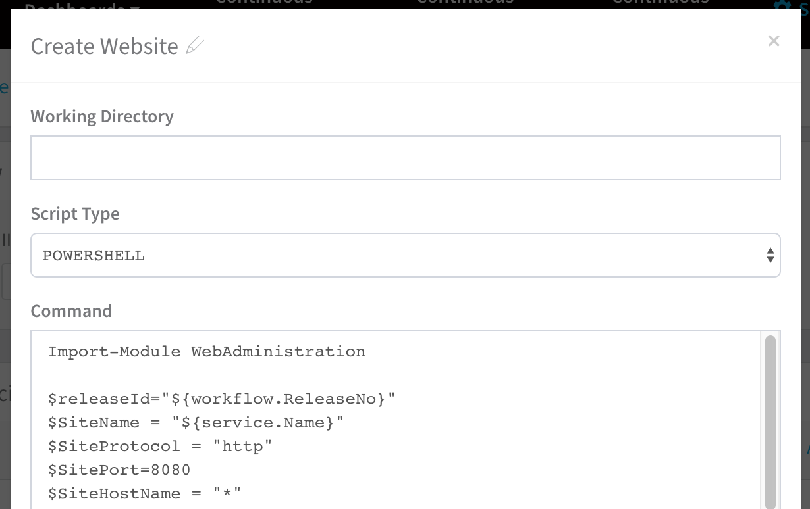You can keep the same port and use host header names to host multiple IIS sites using the same port.

For more information, search the Web for `use same port and use host header names to host multiple IIS sites`. There are multiple examples.

### Kubernetes

The following problems can occur when developing and deploying to Kubernetes.

#### Invalid Kubernetes resource name ${k8s.canaryWorkload}. Should be in format Kind/Name

The deployed Kubernetes object must reach steady state for Harness to be able to resolve the `${k8s.canaryWorkload}` expression.

Consequently, if the Canary Deployment step fails to deploy the workload to steady state, Harness cannot set the `${k8s.canaryWorkload}` expression and it will not execute successfully.

#### IndexableReport: unbound variable

If you are using the `${k8sResources.manifests}` expression to output the Kubernetes manifest in a Shell Script step, you might see an error like the following if the script is expecting a single line:


```
ERROR 2021-11-17 11:48:52 harness-ASDljasdljALSjd.sh: line 484: IndexableReport: unbound variable
```
Since the `${k8sResources.manifests}` expression results in a multiline output, any script expecting a single line will fail.

Instead, use `cat` like this:


```
cat <<EOF >> /manifestOutput.yaml  
${k8sResources.manifests}  
EOF  
  
cat /manifestOutput.yaml
```
#### The Deployment is invalid...may not be specified when `value` is not empty

Every Harness deployment creates a new release with an incrementally increasing number. Release history is stored in the Kubernetes cluster in a ConfigMap. This ConfigMap is essential for release tracking, versioning and rollback.

If the ConfigMap is edited using kubectl or another tool between deployments future deployments often fail.

This type of error is experienced in standard Kubernetes deployments when attempting to use `kubectl apply` on a manifest whose resources have been previously modified using `kubectl edit`. For example, see the comments in this [Kubernetes issue](https://github.com/kubernetes/kubernetes/issues/78607).

#### NullPointerException: Release Name is Reserved for Internal Harness ConfigMap

The release name you enter in the Infrastructure Definition **Release Name** is reserved for the internal Harness ConfigMap used for tracking the deployment.

Do not create a ConfigMap that uses the same name as the release name. Your ConfigMap will override the Harness internal ConfigMap and cause a NullPointerException.

See [Define Your Kubernetes Target Infrastructure](../continuous-delivery/kubernetes-deployments/define-your-kubernetes-target-infrastructure.md).

#### The server doesn't have a resource type "deployments"

When you attempt to connect to the Kubernetes cluster via **GCP**, the Kubernetes cluster must have **Basic authentication enabled** or the connection will fail. For more information, see [Control plane security](https://cloud.google.com/kubernetes-engine/docs/concepts/security-overview#control_plane_security) from GCP. From GCP:

You can handle cluster authentication in Google Kubernetes Engine by using Cloud IAM as the identity provider. However, legacy username-and-password-based authentication is enabled by default in Google Kubernetes Engine. For enhanced authentication security, you should ensure that you have disabled Basic Authentication by setting an empty username and password for the MasterAuth configuration. In the same configuration, you can also disable the client certificate which ensures that you have one less key to think about when locking down access to your cluster.

* If Basic authentication is inadequate for your security requirements, use the [Kubernetes Cluster](../firstgen-platform/account/manage-connectors/cloud-providers.md#kubernetes-cluster) Cloud Provider.
* While Harness recommends that you use the [Kubernetes Cluster Cloud Provider](../firstgen-platform/account/manage-connectors/cloud-providers.md#kubernetes-cluster) for Kubernetes cluster deployments, to use a Kubernetes cluster on Google GKE, Harness requires a combination of Basic Authentication and/or Client Certificate to be enabled on the cluster:

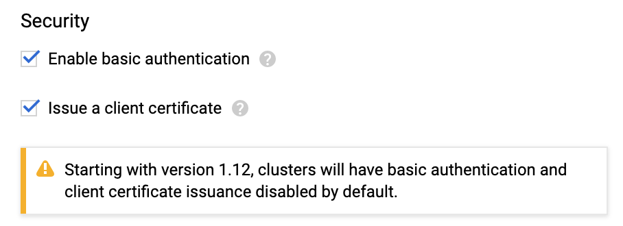This is required because some API classes, such as the [MasterAuth class](https://developers.google.com/resources/api-libraries/documentation/container/v1/java/latest/com/google/api/services/container/model/MasterAuth.html), require HTTP basic authentication or client certificates.

#### Invalid Value LabelSelector

If you are deploying different Harness Workflows to the same cluster during testing or experimentation, you might encounter a Selector error such as this:


```
The Deployment “harness-example-deployment” is invalid: spec.selector:   
  Invalid value: v1.LabelSelector{MatchLabels:map[string]string{“app”:“harness-example”},   
  MatchExpressions:[]v1.LabelSelectorRequirement{}}: field is immutable
```
This error means that, in the cluster, there is a Deployment with same name which uses a different pod selector.

Delete or rename the Deployment. Let's look at deleting the Deployment. First, get a list of the Deployments:


```
kubectl get all  
...  
  
NAME                                             TYPE           CLUSTER-IP      EXTERNAL-IP      PORT(S)        AGE  
service/kubernetes                               ClusterIP      10.83.240.1     <none>           443/TCP        18d  
  
NAME                                             DESIRED   CURRENT   UP-TO-DATE   AVAILABLE   AGE  
deployment.apps/harness-example-deployment       1         1         1            1           4d  
...
```
And then delete the Deployment:


```
kubectl delete deploy/harness-example-deployment svc/kubernetes  
  
deployment.extensions "harness-example-deployment" deleted  
  
service "kubernetes" deleted
```
Rerun the Harness deployment and the error should not occur.

#### Cannot Create Property

The following error message can appear if a property, such as the security settings (securityContext) in the pod or container, are located in the wrong place in the specification:


```
ConstructorException: Cannot create property=spec for JavaBean=class V1StatefulSet
```
Use a validation tool to ensure that your YAML specification is formed correctly. 

For steps on how to add a security context for a pod or container, see [Configure a Security Context for a Pod or Container](https://kubernetes.io/docs/tasks/configure-pod-container/security-context/) from Kubernetes.

Here is an example:


```
apiVersion: v1  
kind: Pod  
metadata:  
  name: security-context-demo-2  
spec:  
  securityContext:  
    runAsUser: 1000  
  containers:  
  - name: sec-ctx-demo-2  
    image: gcr.io/google-samples/node-hello:1.0  
    securityContext:  
      runAsUser: 2000  
      allowPrivilegeEscalation: false
```
#### Error processing Chart.yaml

The following error can occur if your are using a Helm chart but you have selected **Kubernetes Resource Spec from YAML** as the **Manifest Format** in the Harness Service:


```
Error processing Chart.yaml  
  
Invalid Kubernetes YAML Spec. Error processing yaml manifest. kind not found in spec
```
The **Manifest Format** changes the code path to use either go-templating or helm-templating.

Changing the **Manifest Format** to **Helm Chart from Source Repository** will fix the issue, typically.

### CloudWatch

The following are resolutions to common configuration problems with CloudWatch.

#### No Data in Harness API Calls

You can see data in CloudWatch but cannot see any data in Harness and the Harness API calls do not get any data either for deployment verification or for 24/7 Service Guard.

##### Cause

This situation can arise because of issues with permissions or due to incorrect setup or configuration.

##### Resolution

Run the following CLI commands on AWS to gather the required data to analyze the problem:

**For** **ECS**


```
aws cloudwatch get-metric-statistics --namespace AWS/ECS --metric-name CPUUtilization --dimensions Name=ClusterName,Value=<cluster-name> --statistics Average --start-time 2020-04-28T03:00:00Z --end-time 2020-04-28T04:00:00Z --period 60
```
**For ELB**


```
aws cloudwatch get-metric-statistics --namespace AWS/ELB --metric-name RequestCount --dimensions Name= LoadBalancerName,Value=<ELB-name> --statistics Average --start-time 2020-04-28T03:00:00Z --end-time 2020-04-28T04:00:00Z --period 60
```
### AppDynamics

The following are resolutions to common configuration problems.

#### No corresponding node found in appdynamics

Typically, this error occurs because the AppDynamics [Reuse Node Name property](https://docs.appdynamics.com/display/PRO45/Java+Agent+Configuration+Properties#JavaAgentConfigurationProperties-reusenodenameReuseNodeName) is set to true.

See [Do Not Use Reuse Node Name](../continuous-delivery/continuous-verification/appdynamics-verification/3-verify-deployments-with-app-dynamics.md#do-not-use-reuse-node-name) in the Harness AppDynamics setup topic.

### ELK Elasticsearch

The following are resolutions to common configuration problems.

#### Workflow Step Test Error

When you click **TEST** in the **ELK** workflow dialog **Expression for Host Name** popover, you should get provider information:

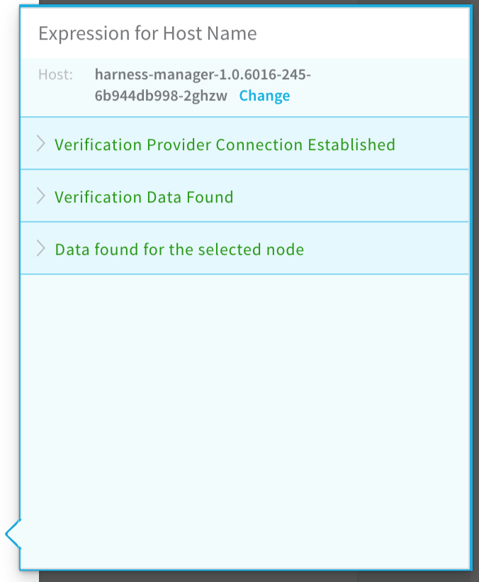

The following error message can occur when testing the New Relic verification step in your workflow:


```
ELK_CONFIGURATION_ERROR: Error while saving ELK configuration. No node with name ${hostName} found reporting to ELK
```
#### Cause

The expression in the **Expression for Host/Container name** field is incorrect. Typically, this occurs when the wrong hostName label is selected to create the expression in the **Expression for Host/Container name** field.

#### Solution

Following the steps in [Verify with ELK](../continuous-delivery/continuous-verification/elk-elasticsearch-verification/3-verify-deployments-with-elasticsearch.md) again to select the correct expression. Ensure that the **name** label selected is under the **host** section of the JSON.

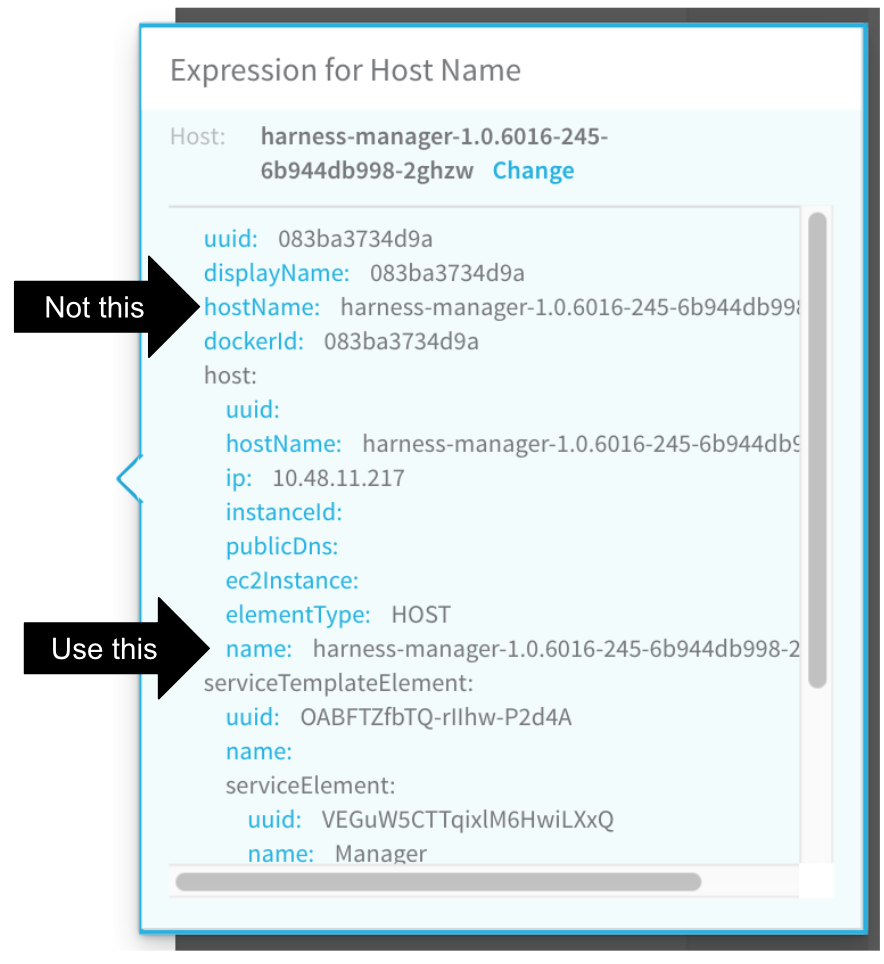

#### SocketTimeoutException

When you add an ELK verification provider and click SUBMIT, you might see the following error.

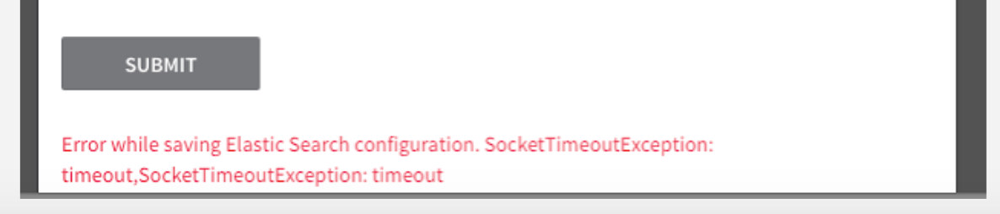

##### Cause

The Harness delegate does not have a valid connection to the ELK server.

##### Solution

On the same server or instance where the Harness delegate is running, run one of the following cURL commands to verify whether the delegate can connect to the ELK server.

If you do not have a username and password for the ELK server:


```
curl -i -X POST url/*/_search?size=1 -H 'Content-Type: application/json' -d '{"size":1,"query":{"match_all":{}},"sort":{"@timestamp":"desc"}}'
```
If you have username and password then use this command:


```
curl -i -X POST url/*/_search?size=1 -H 'Content-Type: application/json' -H 'Authorization: <Basic: Base64 encoded *username:password*>'-d '{"size":1,"query":{"match_all":{}},"sort":{"@timestamp":"desc"}}'
```
If you have token-based authentication, use this command:


```
curl -i -X POST url/*/_search?size=1 -H 'Content-Type: application/json' -H 'tokenKey: *tokenValue*'-d '{"size":1,"query":{"match_all":{}},"sort":{"@timestamp":"desc"}}'
```
If the cURL command cannot connect, it will fail.

If the cURL command can connect, it will return a HTTP 200, along with the JSON.

If the cURL command is successful, but you still see the SocketTimeoutException error in the ELK dialog, contact Harness Support ( [support@harness.io](mailto:support@harness.io)).

:::note 
It is possible that the response from the ELK server is just taking very long.
:::

### New Relic

The following are resolutions to common configuration problems.

#### Workflow Step Test Error

When you click **TEST** in the **New Relic** workflow dialog **Expression for Host Name** popover, you should get provider information:

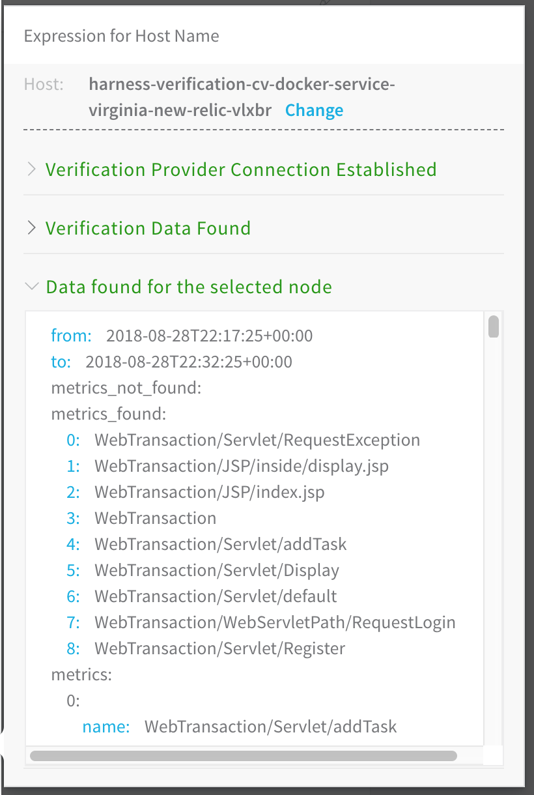The following error message can occur when testing the New Relic verification step in your workflow:


```
NEWRELIC_CONFIGURATION_ERROR: Error while saving New Relic configuration. No node with name ${hostName} found reporting to new relic
```
Here is the error in the Expression for Host Name popover:

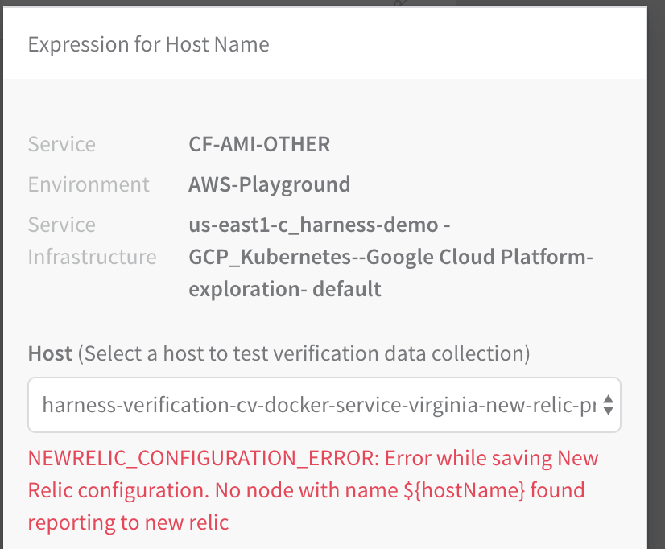

##### Cause

The expression in the **Expression for Host/Container name** field is incorrect. Typically, this occurs when the wrong hostName label is selected to create the expression in the **Expression for Host/Container name** field.

##### Solution

Following the steps in [Guide From Example](#guide_from_example) again to select the correct expression. Ensure that the **hostName** label selected is under the **host** section of the YAML.


### Stackdriver

The following are resolutions to common configuration problems with Stackdriver.

#### Failed to collect data / Delegate task timed out

With [Stackdriver Logs](../continuous-delivery/continuous-verification/stackdriver-verification/2-24-7-service-guard-for-stackdriver.md#troubleshooting), the Harness Delegate will sometimes report **Failed to collect data...Delegate task timed out** errors like these:

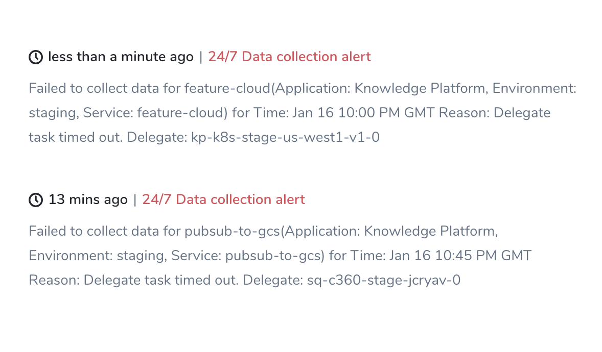

##### Cause

This can occur when Stackdriver enforces too low quota on log read requests from the Delegate.

##### Resolution

Ask GCP to increase your rate limit for log read requests.

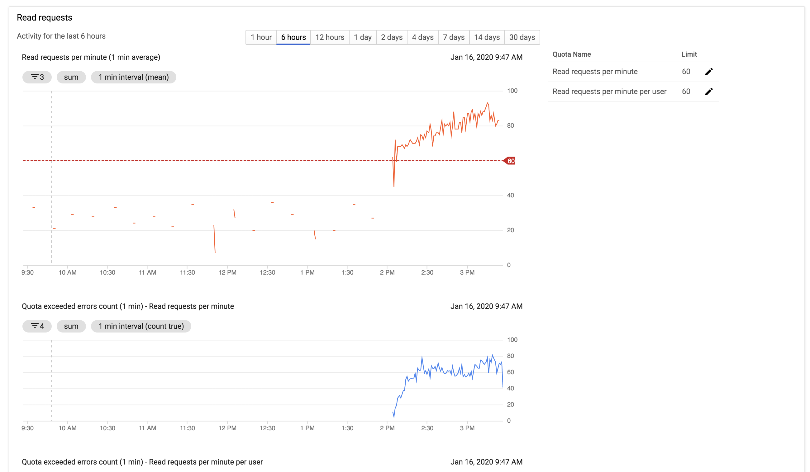

### Terraform

The following are resolutions to common configuration problems with [Terraform Infrastructure Provisioners](../continuous-delivery/concepts-cd/deployment-types/terraform-provisioning-with-harness.md).

#### Provisioned Resources Already Exist (Terraform State File Locked)

When a [Terraform Apply](../continuous-delivery/terraform-category/using-the-terraform-apply-command.md) steps fails because of a timeout, subsequent deployments might see following error message:


```
Error creating [object]. The [object] already exists.
```
Use a longer timeout for the Terraform Apply step.

When the Terraform Apply times out, Terraform locks the Terraform state file. A Terraform [Force Unlock](https://www.terraform.io/docs/language/state/locking.html#force-unlock) needs to be performed.

:::note 
Locking and unlocking of tfstate files is handled by Terraform automatically. You can disable state locking for most commands with the `-lock` flag but it is not recommended. See [State Locking](https://www.terraform.io/docs/language/state/locking.html) from Terraform.
:::

After timeout, no resources may be added to the state file. A manual cleanup of any resources created must be performed as well.

#### TerraformValidation - Terraform validation result: false

Harness performs the following validation when you use a Terraform Infrastructure Provisioner in a deployment:

1. Is Terraform installed on the Harness Delegate?
2. Can the Harness Delegate connect to the Git repo?

If the Harness Delegate does not have Terraform installed, you will see a log entry such as the following:


```
2020-04-21 19:26:19,134 INFO software.wings.delegatetasks.validation.TerraformValidation - Running terraform validation for task  
  
2020-04-21 19:26:19,157 INFO software.wings.delegatetasks.validation.TerraformValidation - Terraform validation result: false
```
The message `Terraform validation result: false` means Terraform is not installed on the Delegate.

Install Terraform on the Delegate to fix this. See [Set Up Your Harness Account for Terraform](../continuous-delivery/terraform-category/terraform-delegates.md).

#### Saved plan is stale

If you are performing a Terraform plan that doesn't have any change and then a Terraform apply, you might see the following error in the deployment logs:


```
Error: Saved plan is stale  
  
The given plan file can no longer be applied because the state was changed  
...  
Defaulting to accepting the action. the propagated failure types for state Terraform Apply are unknown
```
To fix this issue, select the **Skip Terraform Refresh when inheriting Terraform plan** option.

See [Add Terraform Scripts](../continuous-delivery/terraform-category/add-terraform-scripts.md).

### Terragrunt

The following are resolutions to common configuration problems with [Terragrunt Infrastructure Provisioners](../continuous-delivery/concepts-cd/deployment-types/terragrunt-provisioning-with-harness.md).

#### Saved plan is stale

If you are performing a Terragrunt plan that doesn't have any change and then a Terragrunt apply, you might see the following error in the deployment logs:


```
Error: Saved plan is stale  
  
The given plan file can no longer be applied because the state was changed  
...  
Defaulting to accepting the action. the propagated failure types for state Terragrunt Apply are unknown
```
To fix this issue, select the **Skip Terragrunt Refresh when inheriting Terraform plan** option.

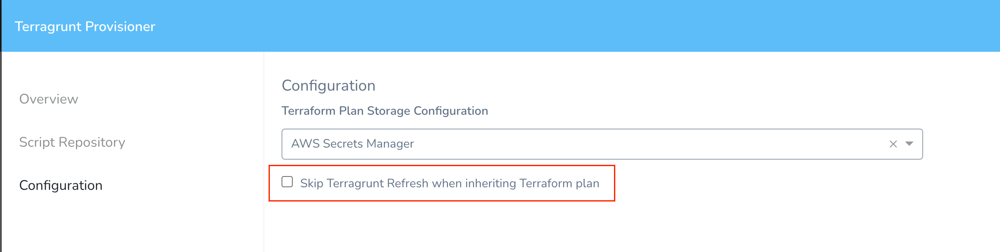See [Add Terragrunt Configuration Files](../continuous-delivery/terragrunt-category/add-terragrunt-configuration-files.md).

### Harness Secret Managers

If the Harness Delegate(s) cannot authenticate with a Secret Manager, you might see an error message such as this:


```
Was not able to login Vault using the AppRole auth method.   
Please check your credentials and try again
```
For most authentication issues, try to connect to the [Harness Secret Manager](../firstgen-platform/security/secrets-management/secret-management.md) from the host running your Harness Delegate(s). This is done simply by using a cURL command and the same login credentials you provided when you set up the Harness Secret Manager.

For example, here is a cURL command for HashiCorp Vault:


```
curl -X POST -d '{"role_id":"<APPROLE_ID>", "secret_id":"<SECRET_ID>"}' https://<HOST>:<PORT>/v1/auth/approle/login
```
If the Delegate fails to connect, it is likely because of the credentials or a networking issue.

### LDAP SSO

The following errors might occur during the set up or use of LDAP SSO.

#### Connection Query Error

When setting up the LDAP Provider and attempting the **Connection Query**, the following message appears.


```
Invalid request: No delegates could reach the resource.
```
Here is how the error appears in the LDAP Provider dialog.

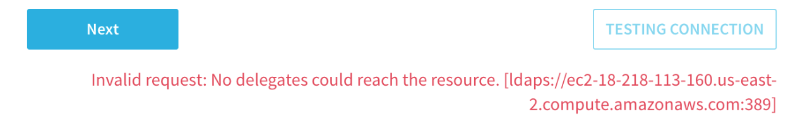

##### Cause

This can occur if the Harness delegate is unable to connect to the LDAP server.

##### Solution

* Ensure the delegate is running. In **Harness**, click **Setup**, click **Harness Delegates**, and then verify that the delegate is running. For more information, see [Delegate Installation](../firstgen-platform/account/manage-delegates/delegate-installation.md).
* Ensure that the delegate can connect to the LDAP server from its network location. If the delegate is running in a VPC, ensure that it a has outbound HTTPS and LDAP connections over ports 443 and 389.
* Ensure the password in the **Connection Query** is correct.
* Try to connect with SSL disabled. You might not have SSL configured on your LDAP server.
* The delegate attempts to resolve the hostname of the LDAP server using DNS. Ensure that the LDAP server host name can be resolved in DNS using **nslookup** and ping its IP address.

#### User Query Error

When attempting the **User Queries** in the **LDAP Provider** dialog, the following message appears.

```
Please check configuration. Server returned zero record for the configuration.
```
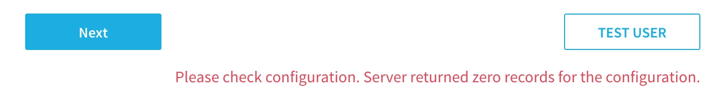

##### Cause

The User Query is unable to return users from the LDAP provider because its search settings do not match users in the LDAP directory.

##### Solution

* If the Connection Query is working, the failure of the User Query is likely because the Base DN does not have users in it. Try **CN=Users,DC=mycompany,DC=com** or **DC=mycompany,DC=com**.
* It is possible that the **Search Filter** does not return users. Try **(objectClass=person)** and **(objectClass=user)**.

#### No Members Returned from Link External LDAP Group Search

When you attempt to link a user group to an LDAP Provider, Harness uses the settings of the LDAP Provider you configured to locate the groups and group members in your LDAP directory.

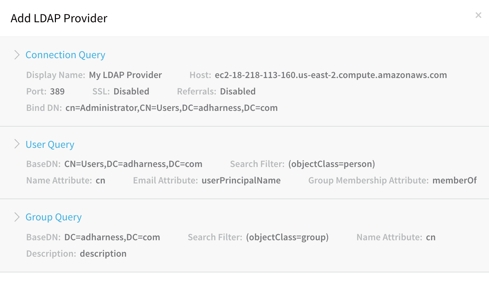In some cases, you might be unable to locate a group, or members of a group.

##### Cause

* LDAP Provider settings are incorrect, and cannot locate the group and users you want according to its **Connection**, **User**, and **Group Query** settings.

##### Solution

* Locate the group using your LDAP directory tools, such as **Active Directory Users and Groups**. Confirm the LDAP Base DN for the group and the members of the group. Use that Base DN in the User Query section of the LDAP Provider in Harness.

### SAML SSO

The following errors might occur during the set up or use of SAML SSO.

#### Signed in user is not assigned to a role for the application (Harness)

A user registered in the Harness application in Azure portal is not able to access the application and gets this error.

##### Cause

If the email address used in Harness is different from the email address in Azure app, you will get an error saying that the user is not assigned to a role for the Harness application.

##### Solution

Make sure the email address used in Harness matches with the email address in Azure app.

For more information about SAML SSO configuration with Azure, see [SAML SSO with Azure](../firstgen-platform/security/access-management-howtos/single-sign-on-sso-with-saml.md#saml-sso-with-azure).

### Harness Continuous Efficiency (CE)

The following errors might occur when setting up CE in Harness.

#### Initializing the Delegate to collect events. Events will arrive in a few minutes

Once you set up CE with a Cloud Provider, it can take up to 24 hours for data to arrive in CE. This latency is a result of cloud platform billing intervals.

#### Unable to collect events. The Delegate may be disconnected or deleted

1. Check the Delegate status.
2. Restart the Delegate.
	1. In the case of a Kubernetes Delegate, it can only be deleted if the StatefulSet for the Delegate is deleted. If this is the case, install a new Kubernetes Delegate in the cluster.
	2. For an ECS Delegate, if the ECS Delegate service is deleted, recreate it using the Delegate task definition you downloaded and registered in ECS.

#### No Delegate has all the requisites to access the cluster

Ensure that the user account, Service account, or IAM role used by the Delegate has the required permissions.

#### The cluster &lt;name&gt; has not published events since %s.

Most likely, a permission has changed. Verify that the permissions on the Delegate are correct.

#### Metrics server is not installed in this Kubernetes Cluster &lt;name&gt;

Install metrics server by running the following command on the Kubernetes cluster hosting the Delegate: 

`kubectl apply -f https://github.com/kubernetes-sigs/metrics-server/releases/download/v0.3.6/components.yaml`

See [Metrics Server](https://github.com/kubernetes-sigs/metrics-server) docs.

### Manual Intervention Timeouts

If a Workflow Failure Strategy has Manual Intervention set as its Action and a Workflow step such as a Shell Script step fails to complete, Harness will prompt you to manually intervene.

The manual intervention will not pause deployment forever. If you do not intervene, the deployment will fail.

### Shell Scripts

This section covers common problems experienced when using the Shell Script command.

#### FileNotFoundExeption inside shell script execution task

This error happens when you are publishing output and your Shell Script step exits early from its script.

If you exit from the script (`exit 0`), values for the context cannot be read.

If you publish output variables in your Shell Script command, structure your script with `if...else` blocks to ensure it always runs to the end of the script.

### Submit a Ticket

1. Click the Help button in the Harness Manager.
2. Click **Submit a Ticket** or **Send Screenshot**.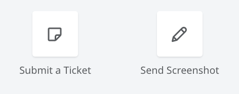
3. Fill out the ticket or screenshot forms and click **Submit ticket** or **Send Feedback**.

Harness Support will contact you as soon as possible.

