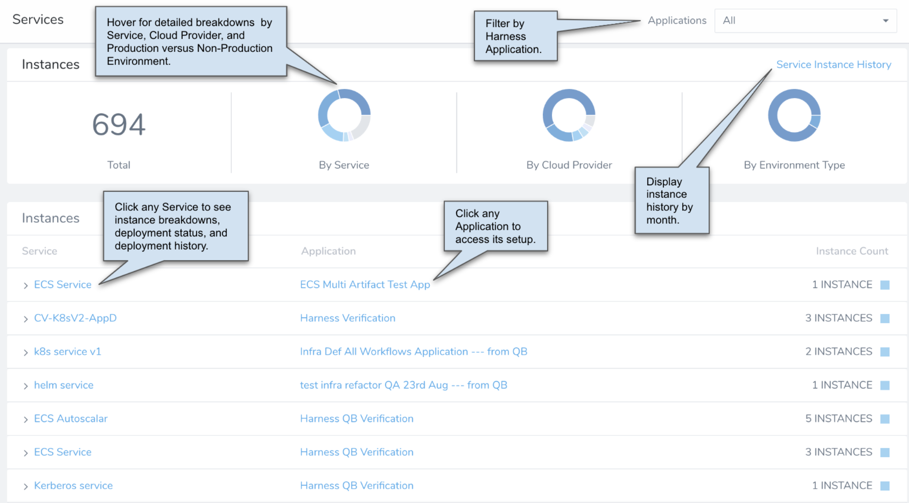

:::note
This content is for Harness [FirstGen](../../get-started/harness-first-gen-vs-harness-next-gen.md). Switch to [NextGen](../../get-started/harness-platform-architecture.md).
:::

This topic lists the different editions for the Harness CD and CE products.

### Harness Editions

:::note
See [Flexible Pricing for Every Team](https://harness.io/pricing).
:::

Harness is available in the following editions to meet different users' needs:

* **Enterprise:** This is our enterprise version, licensed by annual subscription based on your usage needs. It supports flexible scaling, custom integrations, and extended data analysis. It includes 24/7 support.
* **Team:** Designed for growing teams, this version provides most Harness Professional features at lower per-usage pricing. It limits or excludes some integrations and enterprise security features, and limits real-time support to standard business hours.
* **Free**: This is a free-forever edition with almost all Harness Professional features (excluding unlimited Services and license-based service Instances scaling).

Support for Harness Free is available through the [Harness Community Forum](https://community.harness.io/).

### What is a Service Instance in Harness?

Service Instances represent the dynamic instantiation of a service you deploy via Harness.

For example, for a service representing a Docker image, Service Instances are the number of pods running with the Docker image.

For a service that deploys a .NET web app, Service Instances are the number of VMs running the web app.

* For Services with more than 20 service instances (active pods or VMs for that service), additional Service Licenses will be counted for each 20 service instances. This typically happens when you have large monolith Services.
* For Serverless Functions, one Service License is counted for each 5 Serverless Functions.

Service instances are displayed on the **Services** dashboard:

You can use Harness to deploy instances where Harness does not deploy the underlying infrastructure, such as sidecar workloads and tasks. These are not considered Harness service instances, are not tracked by the Services dashboard, and are not part of licensing.

#### What if I add More Service Instance Infrastructure Outside of Harness

If you increase the Harness-deployed service instance infrastructure outside of Harness, Harness considers this increase part of the service instance infrastructure and licensing is applied.

#### When is a Service Instance Removed?

If Harness cannot find the service instance infrastructure it deployed, it removes it from the Services dashboard.

If Harness cannot connect to the service instance infrastructure, it will retry until it determines if the service instance infrastructure is still there.

### Comparing Editions

For a detailed comparison of the Harness editions' offerings, see the [Harness Pricing](https://harness.io/pricing/?module=cd) page.

### Migrating Between Editions

If you move from the full-featured Enterprise Harness trial to the Free Edition, you might need to remove or adjust any premium features you've configured.

For these migrations, please [contact Harness](https://harness.io/company/contact-sales).

