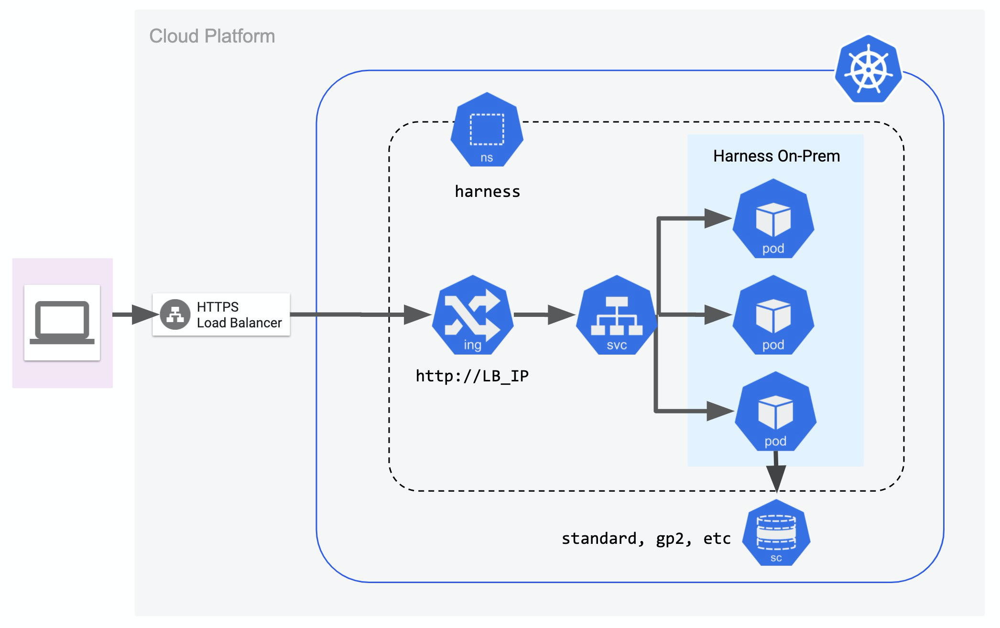
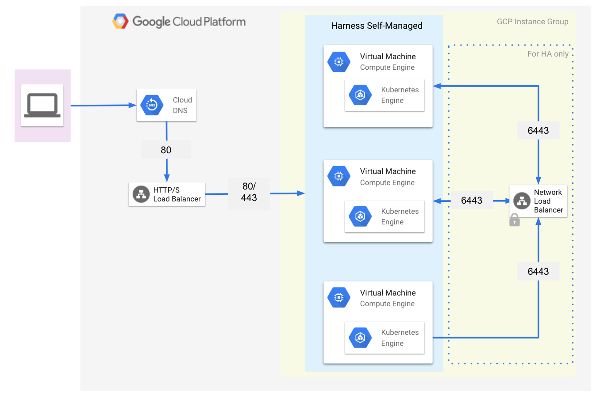
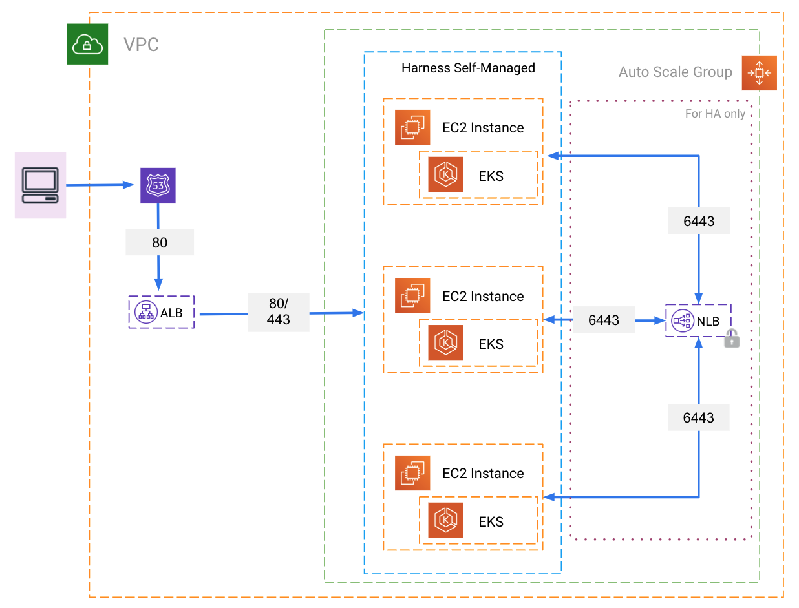

:::note
This content is for Harness [FirstGen](../../getting-started/harness-first-gen-vs-harness-next-gen.md). Switch to [NextGen](/docs/self-managed-enterprise-edition/introduction/getting-started).
:::

In addition to the Harness SaaS offering, Harness offers on-premises editions named Harness Self-Managed Enterprise Edition.

This topic describes the major difference between the SaaS and Harness Self-Managed Enterprise Edition offerings, and then describes the two Harness Self-Managed Enterprise Editions.

**Looking for the How-tos?** If you want to jump right to the How-to topics, see [Harness Self-Managed Enterprise Edition](/docs/category/self-managed-enterprise-edition-fg).

### Harness SaaS vs Self-Managed

The following table covers the major differences between our SaaS and Harness Self-Managed Enterprise editions. It can be useful when deciding on which edition to use.

|  |  |  |
| --- | --- | --- |
|  | **Harness SaaS** | **Harness Self-Managed Enterprise Edition** |
| **Platform Management** | Harness | Customer |
| **Hardware Cost** | — | ~$25,000 |
| **Hardware Maintenance** | — | Required |
| **Continuous Updates** | Daily | Weekly |
| **Security** | TLS/SSL Outbound | TLS/SSL Outbound |
| **Data Governance** | No Corporate Data Leaves Firewall | No Corporate Data Leaves Firewall |
| **Avg. Onboarding Time** | Days | Weeks |
| **Avg. Site Readiness** | Days | Weeks |
| **Avg. Support Res. Time** | Days | Weeks |

### Harness Self-Managed Enterprise Edition Offerings

Harness Self-Managed Enterprise Edition offerings provide both online and offline (air gapped) methods of installation and updates.

Let's looks at each offering:

* **Harness Self-Managed Enterprise Edition - Kubernetes Cluster:** use this option if you already have a Kubernetes cluster set up.
* **Harness Self-Managed Enterprise Edition - Virtual Machine:** use this option if you want to install on VMs.

#### Harness Self-Managed Enterprise Edition - Kubernetes Cluster

In Harness Self-Managed Enterprise Edition - Kubernetes Cluster, Harness installs into an existing Kubernetes cluster you have set up.

To set up Harness Self-Managed Enterprise Edition - Kubernetes Cluster, use the following topics:

1. [Harness Self-Managed Enterprise Edition - Kubernetes Cluster: Infrastructure Requirements](../fg-sme/k8s/existing-cluster-kubernetes-on-prem-infrastructure-requirements.md)
2. [Harness Self-Managed Enterprise Edition - Kubernetes Cluster Setup](../fg-sme/k8s/kubernetes-on-prem-existing-cluster-setup.md)

#### Harness Self-Managed Enterprise Edition - Virtual Machine

In Harness Self-Managed Enterprise Edition - Virtual Machine, Harness installs Kubernetes and the Harness Self-Managed Enterprise Edition cluster into your VMs.

|  |  |
| --- | --- |
| **GCP Architecture** | **AWS Architecture** |
|  |  |

To set up Harness Self-Managed Enterprise Edition - Virtual Machine, use the following topics:

1. [Harness Self-Managed Enterprise Edition - Virtual Machine: Infrastructure Requirements](../fg-sme/vm/embedded-kubernetes-on-prem-infrastructure-requirements.md)
2. [Harness Self-Managed Enterprise Edition - Virtual Machine: Installation Guide](../fg-sme/vm/on-prem-embedded-cluster-setup.md)

