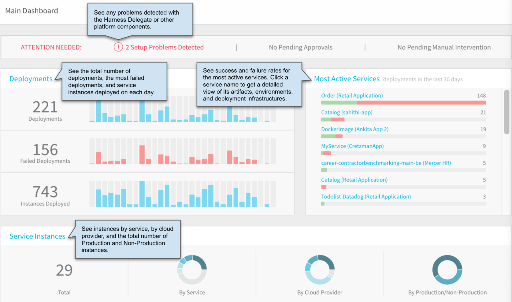
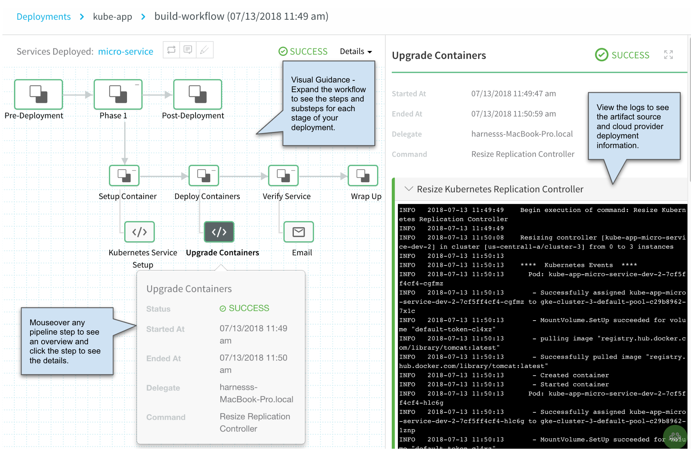
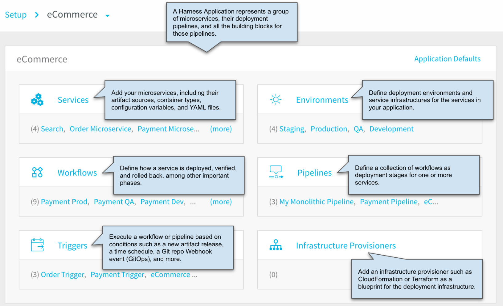
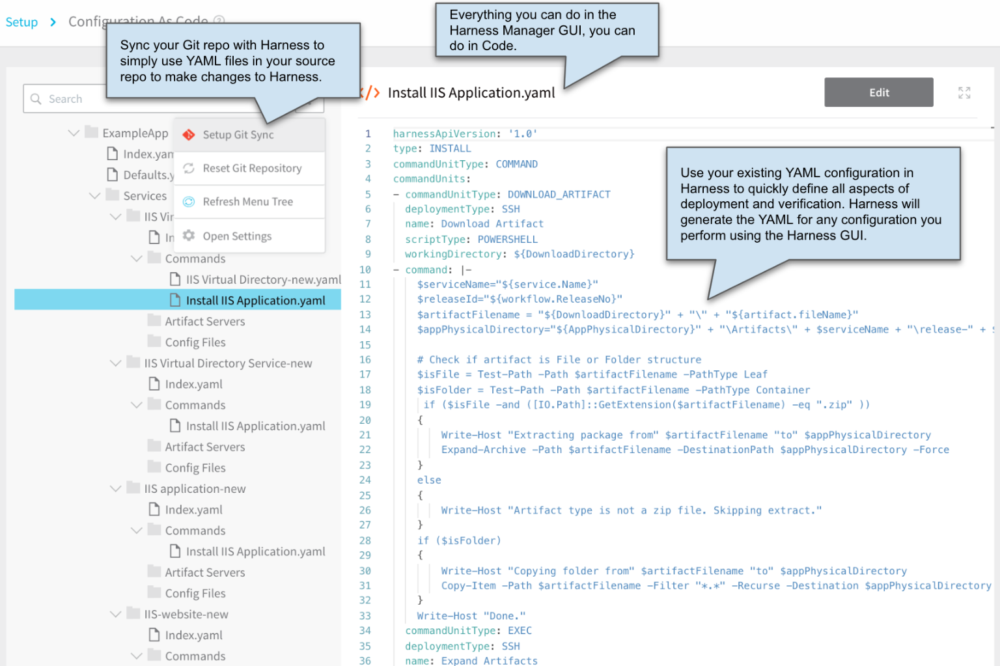
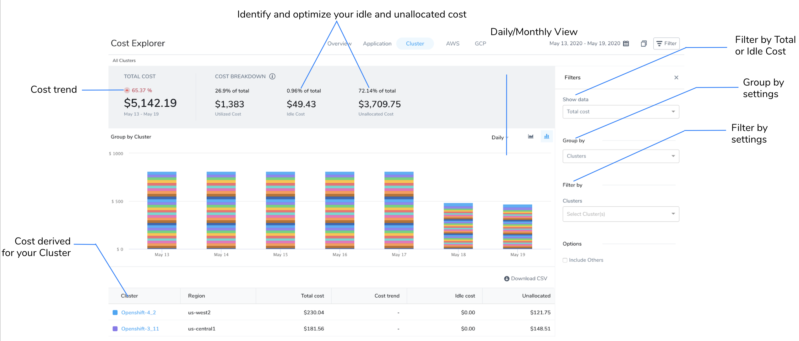
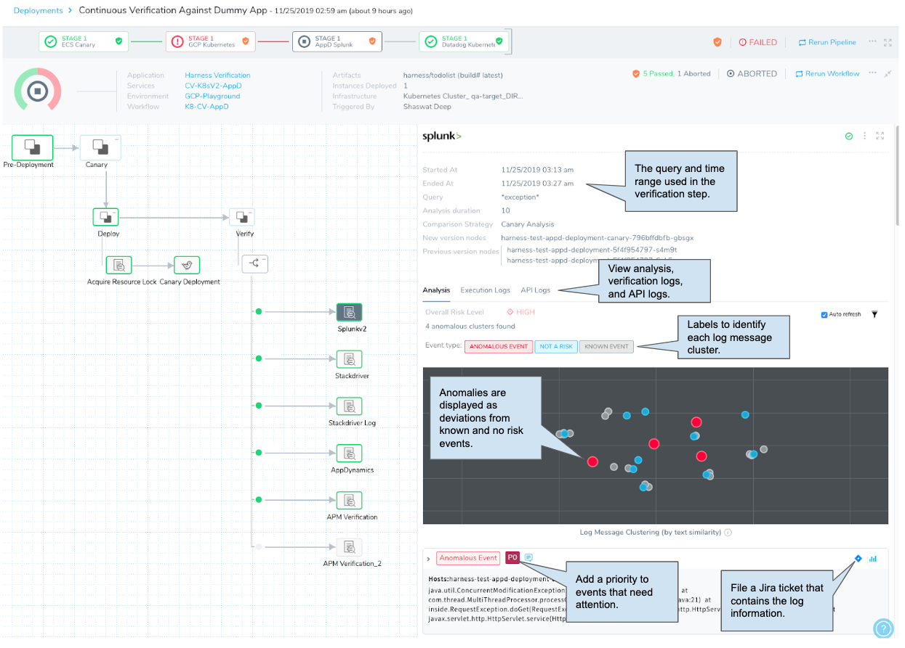
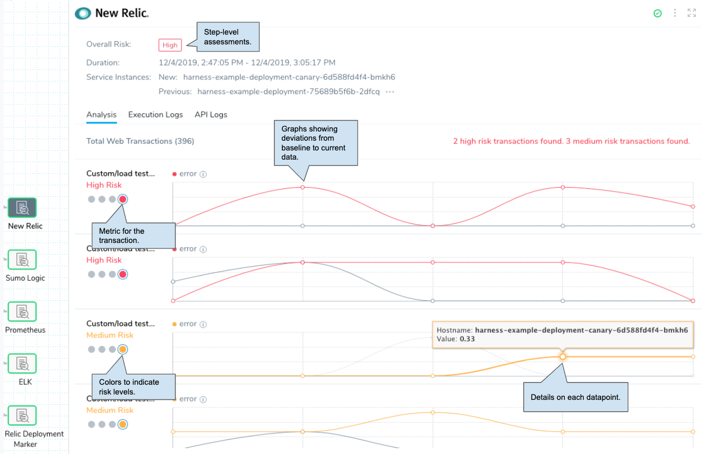
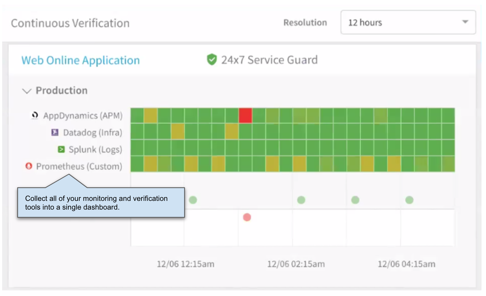
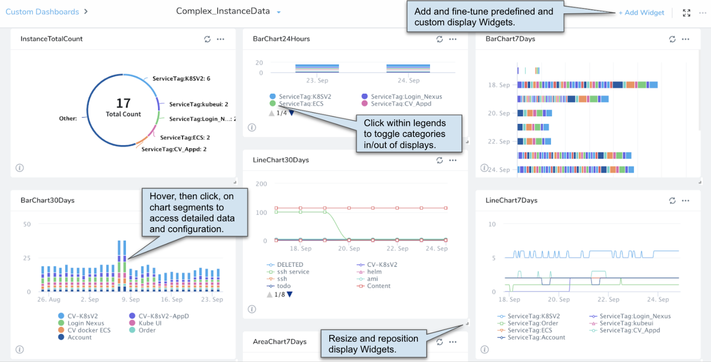

This content is for Harness [FirstGen](../../get-started/harness-first-gen-vs-harness-next-gen.md). Switch to [NextGen](../../get-started/tutorials).This article describes some of Harness Manager's key features.

## Main Dashboard

See all Deployments, Services, and Instances.

## Continuous Deployment

See all deployments, their stages, successes and failures.

### Deployment Details

## Set Up Your Deployment

Set up all stages of your deployment, from artifact source to Harness to Cloud provider. Set up your deployment in the Harness Manager GUI, or use the Harness Manager code editor (and sync with your Git repo). All your deployment entities are organized as applications, containing the artifacts, workflow steps, and cloud environment information for your service deployments.

### Do It All with Code

## Continuous Efficiency (CE)

Harness Continuous Efficiency (CE) is a Harness cloud cost management solution that provides engineers and DevOps granular detail of their resource consumption hourly. CE is designed to bring cloud cost analysis and management into the hands of the engineers consuming cloud resources.

See [Cost Explorer Walkthrough](../cloud-cost-management/concepts-ccm/a-cost-explorer-walkthrough.md).

## Continuous Verification Tools

Automatically verify cloud application and infrastructure performance across your deployment pipelines.

Verify using logging tools...

...and verify using Application Performance Management (APM) tool metrics:

### Harness 24/7 Service Guard

Harness 24/7 Service Guard monitors your microservices post-deployment, using Harness automated machine learning.

## Custom Dashboards

[Custom Dashboards](../firstgen-platform/fg-monitoring/custom-dashboards.md) provide a toolbox for building your own visual interface around Harness data. Predefined visualizations allow quick reporting on key DevOps metrics (like deployment frequency, lead time, change failure rate, and mean time to restore). You can customize the data filtering, grouping, and time intervals.

## Videos and Blogs

For videos and articles on many different Continuous Deployment topics, see the [Harness Blog](https://harness.io/blog/).

