:::note
This content is for Harness [FirstGen](../../getting-started/harness-first-gen-vs-harness-next-gen.md). Switch to [NextGen](../../getting-started/quickstarts.md).
:::

Harness includes a built-in Tour that walks you through deploying the Harness Sample App

You can use the Sample App’s Pipeline to deploy a Docker image to a Kubernetes cluster anytime.

Before you start, it's useful to review [Harness Key Concepts](harness-key-concepts.md).

:::note
While we use a specific artifact and deployment environment in this guide, the steps are very similar for all the service providers and deployment environments Harness supports.
:::

To start the Tour Guide, do the following:

1. Log into Harness. If you do not have a Harness account, sign up for a free account [here](https://app.harness.io/auth/#/signup).
2. Once you are logged in for the first time, the Tour will run.

## Tour the Quick Harness Sample Application Deployment

The sample application deployment tour takes only a few minutes. Everything has been set up in the Sample App. No input is required from you. To deploy the Harness Sample App, click **Quickly deploy a sample application**.

The infrastructure is prepared automatically.

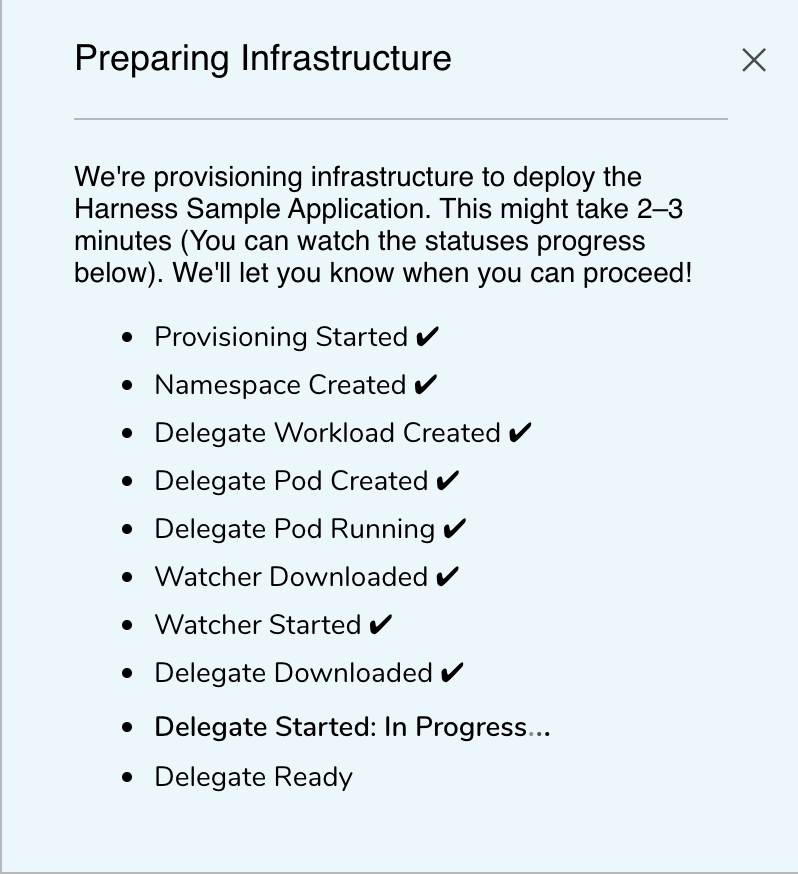Post this step you can deploy your sample application as described in the, [Deploy the Harness Sample Application](quick-start-setup-guide.md#deploy-the-harness-sample-application) section.

## Review the Harness Sample Application

The **Harness Sample App** shows you some of the settings that the Harness Application manages. To examine the Sample App, do the following:

1. In Harness Manager, click **Setup**.
2. Scroll to **Harness Sample App**, and click it. The Sample App appears.  
  
A Harness Application represents a group of microservices, their deployment pipelines, and all the building blocks for those pipelines. Harness models any release process using a logical group of one or more entities:

   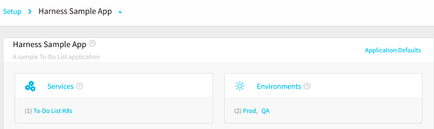
   
* **Services** - Services represent your microservices. You define the sources of artifacts for those services, and the services' container specs, configuration variables, and files.
* **Environments** - Environments represent one or more of your deployment infrastructures, such as Dev, QA, Stage, Production, etc.

  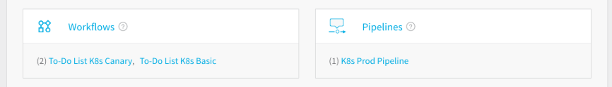
  
* **Workflows** - Workflows define the deployment orchestration steps, including how a Service is deployed, verified, rolled back, and more. Some of the common Workflow types are Canary, Blue/Green, and Rolling. An Application might have different deployment orchestration steps in different Environments.
* **Pipelines** - Pipelines define multiple workflows and approvals in sequential and/or parallel stages as a new build progresses through your release process.

  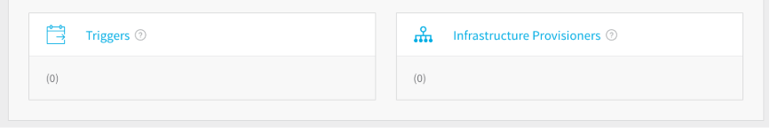

* **Triggers** - Triggers automate deployments using a variety of conditions, such as Git events, new artifacts, schedules, and the success of other pipelines.
* **Infrastructure Provisioners** - Infrastructure Provisioners define blueprints from known Infrastructure-as-Code technologies (Terraform, Cloud Formation, etc.), and map the outputs (such as load balancers, VPCs, etc.). They enable Workflows to provision infrastructure on the fly when deploying Services.

To sum up, Harness Applications organize all of the entities and configurations in Harness CI/CD. Now that you've seen the components of a Harness Application, let's look at the Account settings that connect Harness to your platforms and enable deployment.

## Review the Artifact and Cloud Connections

The Harness Sample App includes two built-in connections for cloud platforms and artifact providers:

* Cloud Provider — **Harness Sample K8s Cloud Provider**: Cloud Providers represent the infrastructure of your applications, such as a Kubernetes cluster, AWS account, Google Cloud Platform account, Azure subscription, or data center. The Harness Sample K8s Cloud Provider connects Harness to the Kubernetes cluster using the installed Delegate.

* Artifact Server — **Harness Docker Hub**: This connects Harness with Docker Hub, the public Docker registry. The Harness Sample App obtains its sample artifact, a To-Do List app, from Docker Hub.

You can use these as models for specifying a Cloud Provider and Artifact Server in your own Harness applications.

### Review the Artifact Server Settings

Harness can be integrated with different types of repositories and providers which are called as connectors. These connectors help you sync with repos, pull in artifacts, integrate verification and analytics tools, and leverage collaboration channels.

The Sample App uses one Artifact Server, and it is preconfigured for Docker Hub. To review the Artifact Server, do the following:

1. In **Setup**, click **Connectors**.
2. Click **Artifact Servers**, and then click **Harness Docker Hub**.
   
  The **Docker Artifact Server** settings appear. In this dialog, you can explore the following settings:

    * **Type** – **Docker Registry** is preselected. For the Sample App, a To-Do List image is hosted on the Docker Hub repository.
    * **Display Name** – This name is used to select this Artifact Server when you add an Artifact Source to a Harness Service.
    * **Docker Repository URL** – This is the URL of the public Docker Hub repo.
    * **Username and Password** – A username and password are not required for this repo.

3. Close the Docker Artifact Server dialog by clicking the **Close** or **SUBMIT** button.

### Review the Cloud Provider Settings

The sample Cloud Provider, **Harness Sample K8s Cloud Provider**, is a logical representation of a Kubernetes cluster. To view this Cloud Provider, do the following:

1. In **Harness Manager**, click **Setup**.
2. Click **Cloud Providers**.  
   
   On the **Cloud Providers** page, the built-in Cloud Provider, **Harness Sample K8s Cloud Provider** is listed.

   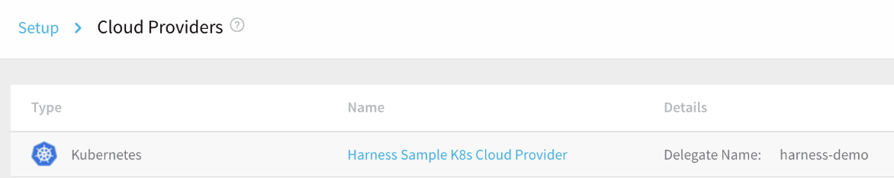

3. Click **Harness Sample K8s Cloud Provider**. The **Cloud Provider** settings appear.

    * **Type** – Kubernetes Cluster is one of the many platforms supported by Harness.
    * **Display Name** – You will use this name to select this Cloud Provider in Harness Infrastructure Definitions, and other settings.
    * **Inherit Cluster details from the selected Delegate** – For this guide, we will run the Delegate as a pod in the same cluster used to deploy the container. (Harness recommends this practice.)You can also use cluster credentials such as username/password, CA certs, or Service Account Tokens.
    * **Delegate Name** – This is the name of the sample Delegate: **harness-sample-k8s-delegate**.
    * **Skip Validation** – You would select this option when you first create a Cloud Provider.
    * **Usage Scope** – You can limit the use of a Cloud Provider to specific Harness Applications and Environments. For this tour, the default scope is used.

3. Click the **Close** or **SUBMIT** button.

We are done reviewing the Cloud Provider settings. The Sample App does not need any other connectors. 

## Harness Delegate

As covered in the [Harness Key Concepts](harness-key-concepts.md), the Harness Delegate is software you install in your target environment that connects to the Harness Manager and performs Continuous Delivery tasks.

A new Harness account includes a Harness Kubernetes Delegate already installed in a pod in a Kubernetes cluster managed by Harness. This is the target cluster that we will use for deployment.

To see the Delegate, do the following:

1. Click **Setup**, and then click **Harness Delegates**.

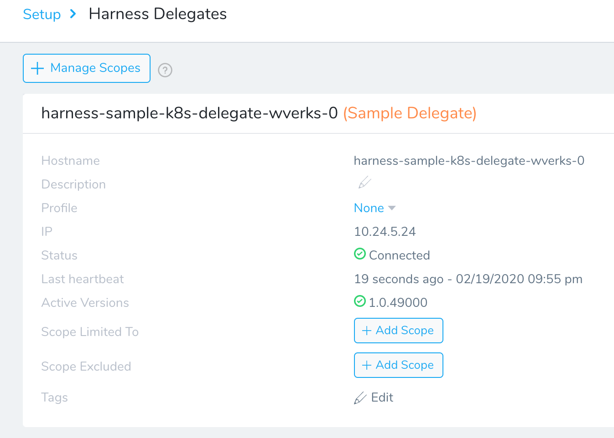If the Delegate is terminated, click **Provision Again** to automatically install and run the Delegate. This takes approximately 2–3 minutes to complete. You might need to refresh the page once the Delegate is provisioned.

The provisioned Delegate is available to use for one hour. After that, you need to provision it again.

## Deploy the Harness Sample Application

Here's what you've been waiting for. Let's explicitly deploy the Docker container to a Kubernetes cluster. In Harness Manager, click **Continuous Deployment**.

The Harness Continuous Deployment dashboard appears. If this is your account's first deployment, the dashboard will be blank.

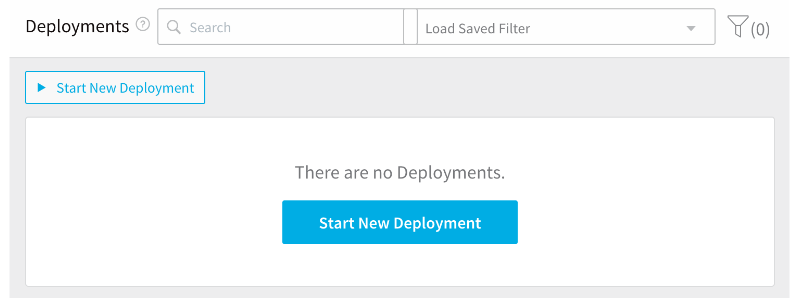Here you will see all deployments, with their stages, successes and failures.

You can deploy a Pipeline or a Workflow. We're going to deploy the Pipeline we looked at in [Review the Harness Sample Application](quick-start-setup-guide.md#review-the-harness-sample-application). To do so:

1. On the **Continuous Deployment** dashboard, click **Start New Deployment**. The **Start New Deployment** dialog appears.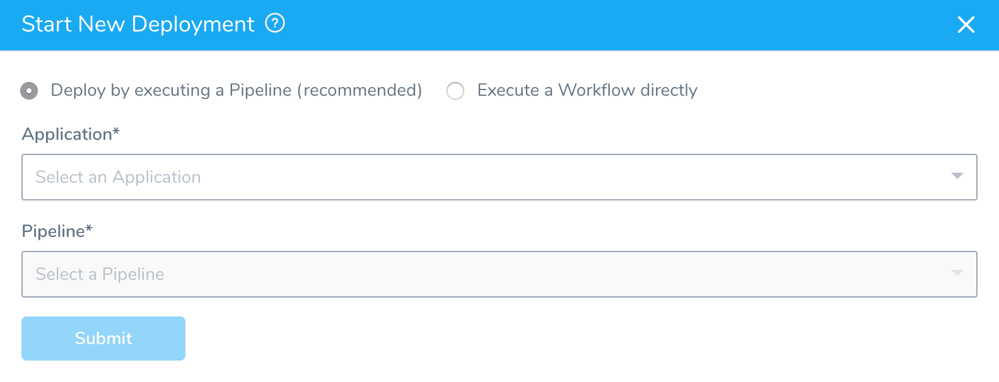
2. In **Application**, select the **Harness Sample App**.
3. In **Pipeline**, select **K8s Prod Pipeline**.  
  
   After you select the Pipeline, the Artifacts section appears. Harness generates a list of all of the artifacts available in the Artifact Source for the Service being deployed.

4. From **Build / Version** menu, select any **Build#**.
   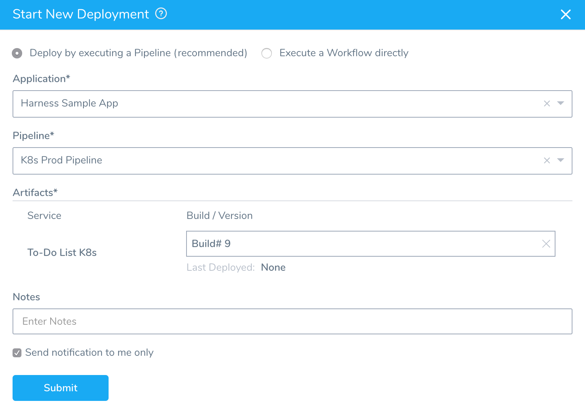
5. To begin deploying your Pipeline and artifact, click **SUBMIT**.  
  
Let's see at each of the deployment stages in detail.

### Stage 1 Deploying

The QA stage is the Pipeline's first stage of deployment. Here, you can watch the execution of each step of Stage 1 in the **To-Do List K8s** Workflow.

Once the QA stage is complete, the Approval stage starts.

### Stage 2 Approve Deployment

Your approval is required before the Pipeline can continue the release process. Click **Approve**.

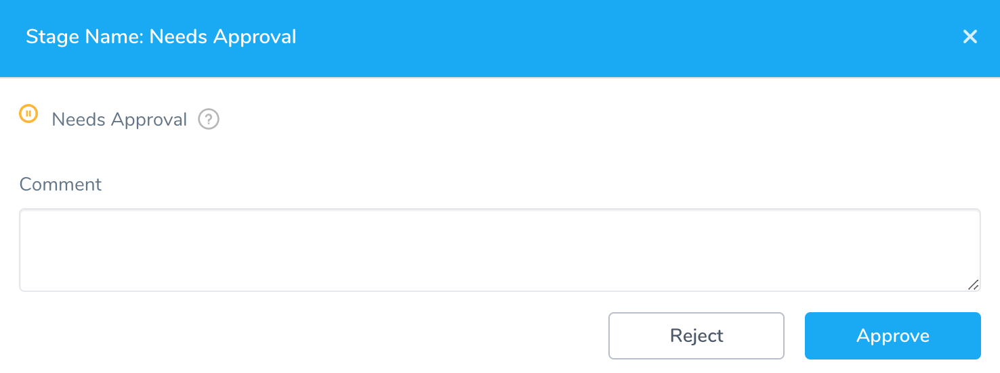If you are the Admin for the Harness account, or are listed in the Workflow’s Notification Strategy, you will receive an email notifying you of a pending approval:

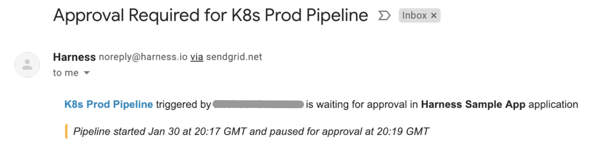

### Stage 3 Deploying

Watch Stage 3 deploy the Docker image from the **To-Do List K8s** Service to your Kubernetes cluster.

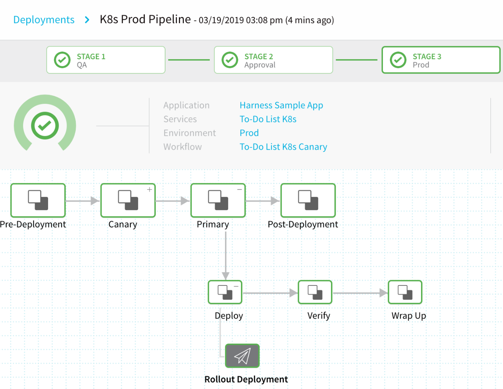

### Deployment Finished!

To see your deployed **To-Do List** app running in your browser, click the **Rollout Deployment** node in **Stage 3 Prod**, and then click the link to the right of **Load Balancer**.

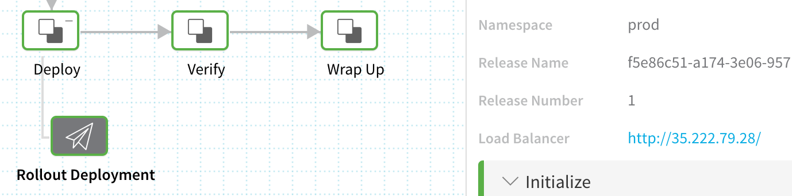

If the deployment timed out trying to set up the load balancer, it is most likely because the cloud account used for the Kubernetes cluster has reached its load balancer quota. For an example, see [Resource Quotas](https://cloud.google.com/compute/quotas) from Google Cloud.The **To-Do List** app opens in a new tab. Once you see the app, return to the browser tab for **Continuous Deployment**.

The **To-Do List** app is deployed and running in your Kubernetes cluster. This tour is now complete.

## Next Steps

Now that you've installed the Harness Sample App, proceed to our [Tour Harness Manager](meet-harness.md) topic or one of the [Quickstarts](/docs/category/quickstarts-1).

