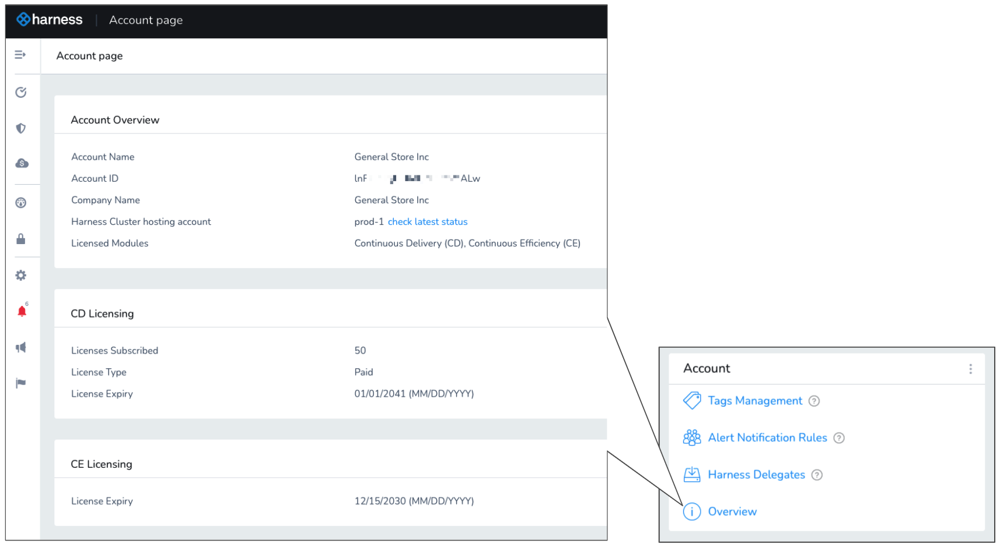
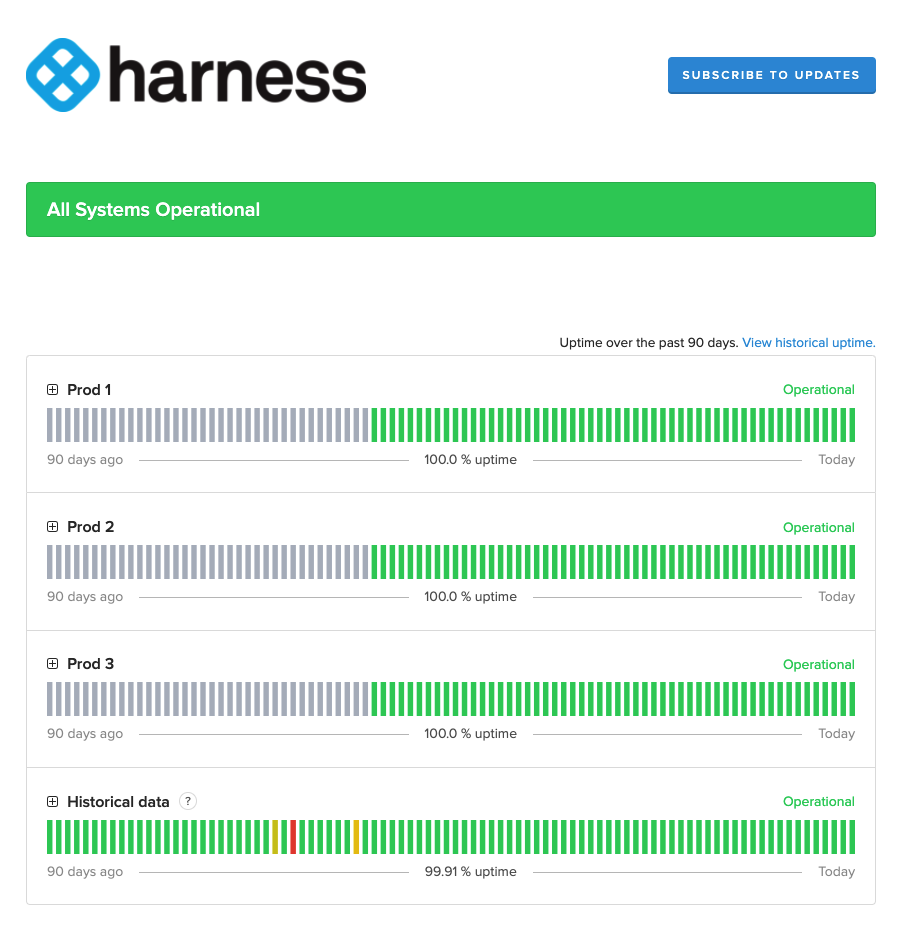

:::info note
This content is for Harness [FirstGen](../../getting-started/harness-first-gen-vs-harness-next-gen.md). Switch to [NextGen](../../getting-started/learn-harness-key-concepts.md).
:::

Harness provides a summary of your account information and enables you to subscribe to downtime alerts for the cluster hosting your Harness account.

To view your account information and subscribe to alerts, do the following:

1. In Harness, select **Setup**.

2. Select **Overview** to see an overview of your Harness account:

   You can see your account details, check hosting status, and view licensing for different Harness modules.

3. In **Harness Cluster hosting account**, select **check latest status**. The operational status of the cluster hosting your account is displayed.

   
   
4. Select **Subscribe to Updates** to get instant updates of the cluster's status.
