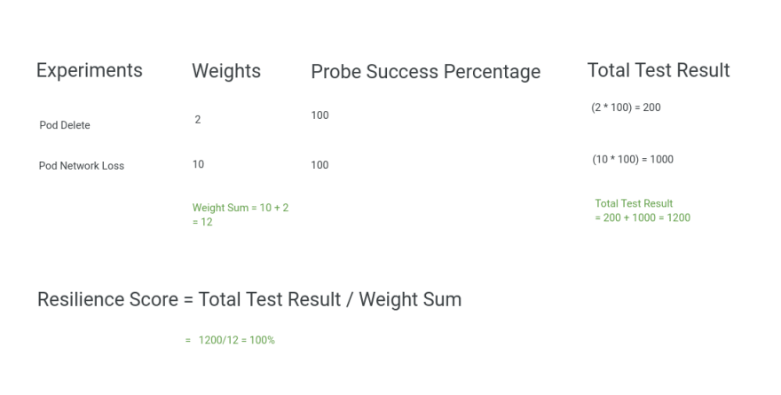

## General

For an overview of Harness support for platforms, methodologies, and related technologies, see [supported platforms and technologies](https://developer.harness.io/docs/getting-started/supported-platforms-and-technologies).

#### How to add and manage a custom ChaosHub?

You can navigate to ChaosHubs in the chaos module and click on `+ New ChaosHub` and fill in the details regarding your public or private hub. Make sure you have ChaosHub Read/Write permission enabled and also a GitHub connector configured for the repository you are about to connect.

#### How do I connect a private chaoshub?

To connect a private chaoshub repository you would need to first connect a Harness GitHub Connector by providing it your GitHub SSH key or Personal Access Token and mode of connecting either through a Harness Delegate or Git directly. Once done, you can choose that connector when selecting your connector while adding a ChaosHub.

#### How are faults different from experiments?

Faults refer to the failures that are injected into the target resource as part of an experiment. Whereas a chaos experiment is a set of different faults coupled together to achieve a desired chaos impact.

#### Possible reasons you can’t see tunables in **Tune Fault** UI

Since the tuning of a chaos experiment is highly declarative, sometimes it may cause parsing issues, these may be the possible reasons:

- The step name of the fault and the template name might have been changed due to custom editing.
- The step name has been removed completely.
- The template definition has been erased.

#### How are probes useful in an experiment?

A probe can help understand the underlying patterns and laws that govern the behavior of your systems, and you can use that understanding to predict or control their behavior. Probes can be used to test scenarios such as network partitioning, pod failures, and node failures, by adding additional checks, it can also be used to test the behavior of applications during such scenarios.

#### How is resilience score affected if a few of my probes fail?

The weighted average of probe success percentage of each of the probe determines the value of the overall resilience score of the experiment. The value depends on the successful outcome of the probe criteria based on the type and mode selected. There are two possible values of probe success percentage for each of the probe criterias, either 0(if the criteria assertion fails) or 100(if the criteria assertion passes).

```vim
Total Resilience for one single experiment = (Weight Given to that experiment * Probe Success Percentage)
```



#### I’m having trouble creating an experiment YAML from scratch, can I generate one?

Yes, you can generate a YAML by choosing the normal flow of creating an experiment (blank canvas or via template), in the YAML/Visual toggle you can see a generated YAML based on the inputs provided by you. A generated YAML can also be downloaded after navigating to `Chaos Experiments` and clicking on `Download Experiments`.

Additionally you can also leverage Harness Go SDK repository and generate a template
[https://github.com/harness/harness-go-sdk](https://github.com/harness/harness-go-sdk)

#### My issue is not mentioned here, how can I report it?

In order to report an issue which is not mentioned here head over to `Help` in Harness SaaS and click on `Submit a ticket` and provide your feedback.

## Security

#### What are the identity providers supported by Harness Chaos for user authentication? 

The Harness platform is fully integrated with several public OAuth providers with support for two-factor authentication and domain-whitelisting. 
Refer to the “Authentication Overview” documentation to learn more. 

#### How does the chaos infrastructure connect to the Harness SaaS control plane? What ports are needed to be opened in users’ environments?

The chaos infrastructure connects to the Harness control plane via outbound connectivity over HTTP(s) using port 443. Refer to [chaos infrastructures](https://developer.harness.io/docs/chaos-engineering/user-guides/connect-chaos-infrastructures/) for more details. 

#### What are the permissions and privileges necessary to deploy and run the Chaos Infrastructure?

The Chaos Infrastructure setup involves creation of CRDs, and RBAC resources and typically needs cluster-admin intervention. Refer to section of “Kubernetes Roles for the Chaos Infrastructure”.

#### How to control user actions on a given environment in Harness Chaos? 

The scope of users (their access to chaos resources) added to a given account/project in the Harness platform can be controlled by mapping a predefined or custom role to them. Refer to section on “Chaos Access Control”.

#### How to control the security blast radius in terms of access to application microservices/infrastructure resources in a user environment? 

The Chaos Infrastructure can be installed with a cluster-wide scope (with ability to discover and inject chaos on microservices across namespaces as well as on infra components such as nodes and volumes) OR in namespaced scope (where discovery and chaos injection is limited to resources within the said namespace). 
In addition, users can provide a custom serviceaccount with which to carry out experiments, thereby limiting the fault types in the user environment.
Refer to section on “Blast Radius Control via Permissions” 

#### How does Harness Chaos access cloud resources in the users’ environment?

Harness Chaos Experiment Pods consume Kubernetes Secrets containing access credentials which are leveraged to make (provider-specific) API calls to the cloud platform to inject chaos. Refer to section on “Secrets Management”.

#### Can cloud serviceaccounts be used instead of user credentials for access to cloud resources? 

In cases where the Chaos Infrastructure is deployed on EKS clusters, the experiments can leverage IAM serviceaccount (IRSA) instead of consuming secrets with user account access details. Refer to section “IRSA Support for AWS EKS”.

#### How does Harness Chaos access APM platforms to perform hypothesis validation? 

Harness Chaos Experiments can consume K8s secrets containing authENTICATION information for the desired APM and leverage it within the command-probe-pods that leverage this information to make the right (provider-specific) API calls to retrieve metrics and other pertinent data. Refer to section “Command Probes to Query Datadog”.

#### What are the details about the user and the user’s environment accessed and stored by Harness? 

The following information about the user environment is stored in the Harness database and object-store: 

- FQDNs/URLs/IPs of microservices in user clusters 
- Chaos experiment execution logs, with process information and results

The information is purged on a policy-basis, with defaults set at 'x' days.

#### How to track the actions by a user on the Harness platform? 

Harness makes an audit log available to the account admin, in which user actions on chaos resources are logged with timestamps. Refer to section “Audit Log”. 

#### Can Harness perform security chaos tests on the users’ environments?

Harness Chaos supports experiments can simulate DoS attacks on services by simulating very-high loads, which can render the system slow (if the right rate-limits are in place) or non-functional (if rate limiting is not implemented). Refer to “generic locust fault”.
