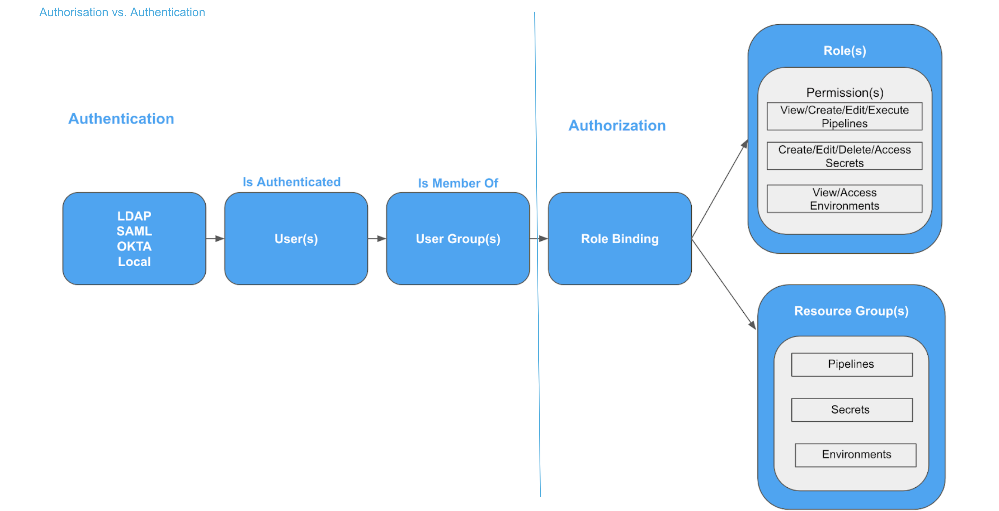
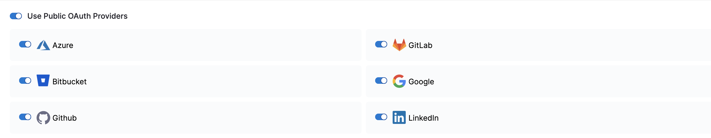

This article addresses some frequently asked questions about the security features in Harness.

For an overview of Harness' support for platforms, methodologies, and related technologies, go to [Supported platforms and technologies](../../getting-started/supported-platforms-and-technologies.md).

## General

### What security features does Harness provide?

The set of security features that Harness provides includes the following features:

* [User management](/docs/platform/role-based-access-control/add-users)
* [User group management](/docs/platform/role-based-access-control/add-user-groups)
* [Role management](../../platform/role-based-access-control/add-manage-roles)
* [Resource group management](../../platform/role-based-access-control/add-resource-groups)
* [RBAC in Harness](/docs/platform/role-based-access-control/rbac-in-harness)
* [Password policies](../../platform/3_Authentication/1-authentication-overview.md#enforce-password-policies)
* [Two-factor authentication](../../platform/3_Authentication/2-two-factor-authentication.md)
* [Single sign-on (SSO)](../../platform/3_Authentication/3-single-sign-on-saml.md#saml-sso-with-harness-overview)
* [Text encryption](/docs/platform/Secrets/add-use-text-secrets)
* [File encryption](/docs/platform/Secrets/add-file-secrets)
* [Auditing](/docs/platform/Governance/Audit-Trail/audit-trail)

### Are delegate communications secure?

Yes. All network connections from the delegate on your local network or VPC to Harness SaaS are HTTPS outbound-only.

For more information, go to [Delegates overview](/docs/platform/2_Delegates/delegate-concepts/delegate-overview.md).

### What data does the delegate send to Harness Manager?

The delegate and Harness Manager (SaaS) establish a Secure WebSocket channel (WebSocket over TLS) to send new delegate task event notifications (not the tasks themselves) and exchange connection heartbeats. In the case that the WebSocket connection is dropped, the Harness delegate falls back to outbound-only, polling-based task fetch.

* **Heartbeat:** The delegate sends a [heartbeat](https://en.wikipedia.org/wiki/Heartbeat_(computing)) to let Harness Manager know that it is running.
* **Deployment data:** The information from the API executions the delegate performs is sent to Harness Manager and shown on the **Deployments** page.
* **Time series and log data for Continuous Verification:** The delegate connects to the verification providers you have configured and sends their data to Harness Manager for display in Harness Continuous Verification.

For more information, go to [Delegates overview](/docs/platform/2_Delegates/delegate-concepts/delegate-overview.md).

## Harness role-based access control (RBAC)

### How does Harness implement RBAC?

Harness provides role-based access control (RBAC) that enables you to control user and group access to Harness resources according to their role binding.

<figure>

<figcaption>A representation of Harness RBAC, showing user authentication through user settings and authorization through user groups and role binding.</figcaption>
</figure>

For more information, go to [RBAC in Harness](/docs/platform/role-based-access-control/rbac-in-harness).

### How are users added?

You an add users manually or through automated provisioning.

When you add Harness users manually, you add them with their email addresses. The user then receives an email invite to your Harness account.

### Can users be added dynamically?

Yes, you can leverage your existing user management infrastructure by adding them through OAuth 2.0, LDAP, SAML, and SCIM.

For more information, go to:

* [Single sign-on (SSO) with SAML](../../platform/3_Authentication/3-single-sign-on-saml.md)
* [Single sign-on (SSO) with OAuth](../../platform/3_Authentication/4-single-sign-on-sso-with-oauth.md)
* [Provision users with Okta (SCIM)](/docs/platform/role-based-access-control/provision-users-with-okta-scim)
* [Provision users with OneLogin (SCIM)](/docs/platform/role-based-access-control/provision-users-and-groups-with-one-login-scim)
* [Provision users with Azure AD (SCIM)](/docs/platform/role-based-access-control/provision-users-and-groups-using-azure-ad-scim)

### Are there best practices for setting up Harness users?

Yes, you can add users for the most common application release scenario. This involves separate Harness user groups for app developers, DevOps engineers, and release approvers.

## Harness Authentication

### How are Harness users authenticated?

The default method is email address and password.

You can use several other methods, such as:

* [Single sign-on (SSO) with SAML](../../platform/3_Authentication/3-single-sign-on-saml.md)
* [Single sign-on (SSO) with OAuth](../../platform/3_Authentication/4-single-sign-on-sso-with-oauth.md)

### How is SAML SSO supported?

For information about SAML SSO, go to [SAML SSO with Harness overview](../../platform/3_Authentication/3-single-sign-on-saml.md#saml-sso-with-harness-overview).

### Can I adjust password policies?

Yes. You can adjust the:

* [Strength](../../platform/3_Authentication/1-authentication-overview.md#enforce-password-strength).
* [Expiration](../../platform/3_Authentication/1-authentication-overview.md#enforce-password-expiration) (refresh) period.
* [Lockout policy](../../platform/3_Authentication/1-authentication-overview.md#enforce-lockout-after-failed-logins) after failed logins.

### Do you support Single Sign-On (SSO)?

Yes. You can enable Harness logins via a range of single sign-on mechanisms. In your account's authentication settings, enable **Allow login via public OAuth providers**, and then [enable and configure OAuth providers](../../platform/3_Authentication/4-single-sign-on-sso-with-oauth.md).

For more information, go to:

* [Single sign-on (SSO) with SAML](../../platform/3_Authentication/3-single-sign-on-saml.md)
* [Single sign-on (SSO) with OAuth](../../platform/3_Authentication/4-single-sign-on-sso-with-oauth.md)

### Do you support Two-Factor Authentication (2FA)?

Yes. Two-Factor Authentication (2FA) can be managed in two ways:

* **Individual user:** You can set up 2FA for your own user profile without impacting other user accounts.
* **All account users:** If you have permission to manage your Harness account, you can enforce 2FA for all users in Harness. First, you set up 2FA for your own account, and then you can enforce 2FA account-wide in the Harness account's **Login Settings**.

For more information, go to [Two-factor authentication](../../platform/3_Authentication/2-two-factor-authentication.md).

## Secrets Management

### How are secrets managed in Harness?

Google Cloud Key Management Service is the default Secrets Manager in Harness, and you can use your own secrets manager with Harness. Harness integrates with these common secret managers:

* [Add Google KMS as a Harness secrets manager](/docs/platform/Secrets/Secrets-Management/add-google-kms-secrets-manager)
* [Add an AWS Secret Manager](/docs/platform/Secrets/Secrets-Management/add-an-aws-secret-manager)
* [Add an AWS KMS Secrets Manager](/docs/platform/Secrets/Secrets-Management/add-an-aws-kms-secrets-manager)
* [Add an Azure Key Vault Secrets Manager](/docs/platform/Secrets/Secrets-Management/azure-key-vault)
* [Add a HashiCorp Vault Secrets Manager](/docs/platform/Secrets/Secrets-Management/add-hashicorp-vault)

<figure>

<figcaption>A diagram illustrating how Harness handles secrets.</figcaption>
</figure>

For more information, go to [Harness secrets management overview](/docs/platform/Secrets/Secrets-Management/harness-secret-manager-overview).

### What kind of secrets are supported?

Harness supports:

* [Text encryption](/docs/platform/Secrets/add-use-text-secrets) (for strings, such as passwords).
* [File encryption](/docs/platform/Secrets/add-file-secrets) (for files, such as configuration files).
* [SSH connection credentials](/docs/platform/Secrets/add-use-ssh-secrets)

### Where can I use a secret?

You use secrets in many places in Harness, such as in Harness connector credentials to integrate with third party applications, such as cloud platforms, git repos, and artifact servers.

You also use secrets in Harness connections to target infrastructure, such as SSH keys, and when passing credentials as part of infrastructure provisioning.

### How do I create a secret?

In Harness Secrets Management, you pick a type of secret, and then enter the secret or upload a file.

For detailed instructions, go to:

* [Use encrypted text secrets](/docs/platform/Secrets/add-use-text-secrets)
* [Use encrypted file secrets](/docs/platform/Secrets/add-file-secrets)

### How do I use a secret?

In most cases, you select the encrypted text or file secret you created as part of the credentials or value for a setting.

You can also use Harness expressions to reference secrets:

* Expression syntax to reference text secrets: `<+secrets.getValue("your_secret")>`
* Expression syntax to reference file secrets at the project scope: `<+secrets.getValue("file-secret")>`
* Expression syntax to reference file secrets at the org scope: `<+secrets.getValue("org.file-secret")>`
* Expression syntax to reference file secrets at the account scope: `<+secrets.getValue("account.platformSecret")>`

For more information, go to:

* [Use encrypted text secrets](/docs/platform/Secrets/add-use-text-secrets)
* [Use encrypted file secrets](/docs/platform/Secrets/add-file-secrets)

### Are my secrets exposed in logs?

*Text* secrets are not exposed, as long as they are not exported in output variables. Harness sanitizes logs and masks text secrets.

File secrets *are not masked* in Harness logs. These can be encoded in different formats, but they are not masked in logs.

:::caution

If an output variable value contains a secret, be aware that the secret will be visible in the [build details](/docs/continuous-integration/use-ci/viewing-builds.md):

*  On the **Output** tab of the step where the output variable originates.
*  In the build logs for any later steps that reference that variable.

For information about best practices for using secrets in pipelines, go to the [Secrets documentation](/docs/category/secrets).

:::

## Auditing

### Can I view all my setup events and changes in Harness?

Yes. Harness provides auditing of events for Harness resources within your account. The [Audit trail](/docs/platform/Governance/Audit-Trail/audit-trail) enables you to track and review all events in one place.

### What is recorded on the Audit Trail?

For each event, you can see details such as the:

* **Time**, including the date, of the change.
* **User** who made the change.
* **Action** by the user like create, update, delete.
* Harness entity (**Resource**) affected.
* **Organization** corresponding to the affected entity.
* **Project** corresponding to the affected entity.
* **Module** corresponding to the affected entity.

### Can I set a date range for an audit?

Yes. You can restrict the Audit Trail's displayed events by date and time, or define detailed filters by these and other criteria.

### Can I filter audit events?

Yes, extensively. You can set multiple conditions on the events displayed.

You can save your filters, too.

## Governance

### Does Harness provide governance features?

Yes. The Harness [pipeline governance](/docs/platform/Governance/Policy-as-code/harness-governance-overview) feature enables you to measure how conformant your pipelines are with your regulatory and operations standards.

### How do I set up governance?

Harness provides governance using Open Policy Agent (OPA), Policy Management, and Rego policies. You can use Harness Governance to ensure that Harness entities like Pipelines meet specific compliance requirements when specific events happen (On Save, On Run, etc.).

The Harness OPA server is an OPA server managed by Harness.

In Harness, you add Rego policies to a Policy Set and select the Harness entities for evaluation (e.g. Pipelines). At that point, policies are configured on the Harness OPA Server via a Kubernetes ConfigMap.

When certain events happen (e.g. saving or running a Pipeline), Harness reaches out to the Harness OPA server to evaluate the action using the Policy Set.

## API keys

### Can I register Harness with third-party apps?

Yes, by using Harness [API keys](/docs/platform/Resource-Development/APIs/add-and-manage-api-keys).

To integrate Harness with some third-party apps, you need to register Harness with the app and then supply a Harness API key.

The API key is a simple encrypted string that other applications can use to access Harness without a private Harness account.
