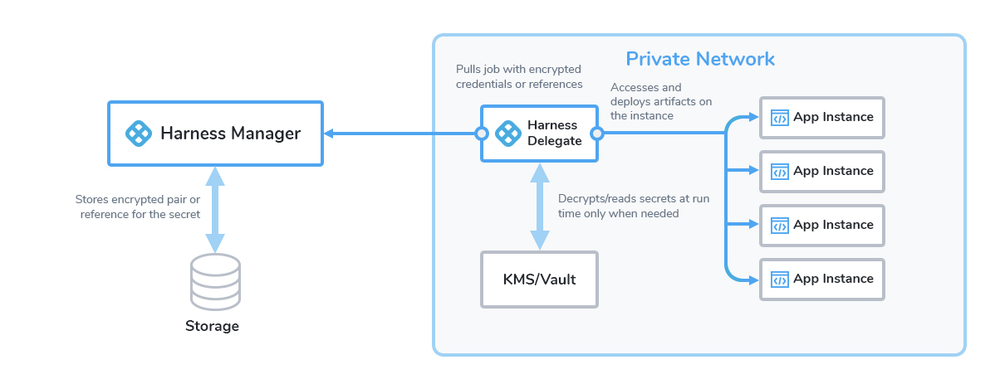

This article addresses some frequently asked questions about the security features in Harness.

In this topic:

* [General](#general)
	+ [What security features does Harness provide?](#what_security_features_does_harness_provide)
	+ [Are delegate communications secure?](#are_delegate_communications_secure)
	+ [What data does the delegate send to Harness Manager?](#what_data_does_the_delegate_send_to_the_harness_manager)
* [Harness role-based access control (RBAC)](#harness_role_based_access_control_rbac)
	+ [How does Harness implement RBAC?](#how_does_harness_implement_rbac)
	+ [How are users added?](#how_are_users_added)
	+ [Can users be added dynamically?](#can_users_be_added_dynamically)
	+ [Are there best practices for setting up Harness users?](#are_there_best_practices_for_setting_up_harness_users)
* [Harness Authentication](#harness_authentication)
	+ [How are Harness users authenticated?](#how_are_harness_users_authenticated)
	+ [How is SAML SSO supported?](#how_is_saml_sso_supported)
	+ [Can I adjust password policies?](#can_i_adjust_password_policies)
	+ [Do you support single sign-on (SSO)?](#do_you_support_single_sign_on_sso)
	+ [Do you support two-factor authentication (2FA)?](#do_you_support_two_factor_authentication_2fa)
* [Secrets management](#secrets_management)
	+ [How are secrets managed in Harness?](#how_are_secrets_managed_in_harness)
	+ [What kind of secrets are supported?](#what_kind_of_secrets_are_supported)
	+ [Where can I use a secret?](#where_can_i_use_a_secret)
	+ [How do I create a secret?](#how_do_i_create_a_secret)
	+ [How do I use a secret?](#how_do_i_use_a_secret)
	+ [Are my secrets exposed in logs?](#are_my_secrets_exposed_in_logs)
* [Auditing](#auditing)
	+ [Can I view all my setup events and changes in Harness?](#can_i_view_all_my_setup_events_and_changes_in_harness)
	+ [What can I see on the audit trail?](#what_can_i_see_on_the_audit_trail)
	+ [Can I set a date range for an audit?](#can_i_set_a_date_range_for_an_audit)
	+ [Can I filter audit events?](#can_i_filter_audit_events)
* [Governance](harness-security-faqs.md#governance)
	+ [Does Harness provide governance features?](harness-security-faqs.md#does-harness-provide-governance-features)
	+ [How to set up governance?](harness-security-faqs.md#how-to-setup-governance)
* [API keys](#api_keys)
	+ [Can I register Harness with third-party apps?](#can_i_register_harness_with_third_party_apps)

### General

For an overview of Harness' support for platforms, methodologies, and related technologies, see [Supported platforms and technologies](../../getting-started/supported-platforms-and-technologies.md).

#### What security features does Harness provide?

The set of security features that Harness provides includes the following features:

* [User management](../../platform/4_Role-Based-Access-Control/3-add-users.md)
* [User group management](../../platform/4_Role-Based-Access-Control/4-add-user-groups.md)
* [Role management](../../platform/4_Role-Based-Access-Control/9-add-manage-roles.md)
* [Resource group management](../../platform/4_Role-Based-Access-Control/8-add-resource-groups.md)
* [Access management (for example, RBAC)](../../platform/4_Role-Based-Access-Control/1-rbac-in-harness.md)
* [Password policies](../../platform/3_Authentication/1-authentication-overview.md#enforce-password-policies)
* [Two-factor authentication](../../platform/3_Authentication/2-two-factor-authentication.md)
* [Single sign-on (SSO)](../../platform/3_Authentication/3-single-sign-on-saml.md#saml-sso-with-harness-overview)
* [Text encryption](../../platform/6_Security/2-add-use-text-secrets.md)
* [File encryption](../../platform/6_Security/3-add-file-secrets.md)
* [Auditing](../../platform/15_Audit-Trail/audit-trail.md)

#### Are delegate communications secure?

Yes. All network connections from the delegate on your local network or VPC to Harness SaaS are HTTPS outbound-only.

See [Delegates overview](../../platform/2_Delegates/delegates-overview.md).

#### What data does the delegate send to Harness Manager?

The delegate and Harness Manager (SaaS) establish a Secure WebSocket channel (WebSocket over TLS) to send new delegate task event notifications (not the tasks themselves) and exchange connection heartbeats. In the case that the WebSocket connection is dropped, the Harness delegate falls back to outbound-only, polling-based task fetch.

* **Heartbeat** - The delegate sends a [heartbeat](https://en.wikipedia.org/wiki/Heartbeat_(computing)) to let Harness Manager know that it is running.
* **Deployment data** - The information from the API executions the delegate performs is sent to Harness Manager for display on the **Deployments** page.
* **Time series and log data for Continuous Verification** - The delegate connects to the verification providers you have configured and sends their data to Harness Manager for display in Harness Continuous Verification.  
See [Delegates overview](../../platform/2_Delegates/delegates-overview.md).

### Harness role-based access control (RBAC)

For an overview of Harness' support for platforms, methodologies, and related technologies, see [Supported platforms and technologies](../../getting-started/supported-platforms-and-technologies.md).

#### How does Harness implement RBAC?

Harness provides role-based access control (RBAC) that enables you to control user and group access to Harness resources according to their role assignment.

Here is an overview of Harness RBAC. It shows user authentication via its User settings and authorization via its [User group](../../platform/4_Role-Based-Access-Control/1-rbac-in-harness.md#defining-and-assigning-permissions) and [Role assignment](../../platform/4_Role-Based-Access-Control/1-rbac-in-harness.md#role-assignment).

See [Access management (RBAC)](../../platform/4_Role-Based-Access-Control/1-rbac-in-harness.md).

#### How are users added?

When you add Harness users manually, they are added using email addresses. When a user is added, they receive an email invite to the Harness account.

#### Can users be added dynamically?

Yes, you can leverage your existing user management infrastructure by adding them using OAuth 2.0, LDAP, SAML, and SCIM.

See:

* [Single sign-on (SSO) with SAML](../../platform/3_Authentication/3-single-sign-on-saml.md)
* [Single sign-on (SSO) with OAuth](../../platform/3_Authentication/4-single-sign-on-sso-with-oauth.md)
* [Provision users with Okta (SCIM)](../../platform/3_Authentication/6-provision-users-with-okta-scim.md)
* [Provision users with OneLogin (SCIM)](../../platform/3_Authentication/7provision-users-and-groups-with-one-login-scim.md)
* [Provision users with Azure AD (SCIM)](../../platform/3_Authentication/8-provision-users-and-groups-using-azure-ad-scim.md)

#### Are there best practices for setting up Harness users?

Yes, you can add users for the most common application release scenario. This involves separate Harness user groups for app developers, DevOps engineers, and release approvers.

### Harness Authentication

For an overview of Harness' support for platforms, methodologies, and related technologies, see [Supported platforms and technologies](../../getting-started/supported-platforms-and-technologies.md).

#### How are Harness users authenticated?

The default method is email address and password.

You can use several other methods:

* [Single sign-on (SSO) with SAML](../../platform/3_Authentication/3-single-sign-on-saml.md)
* [Single sign-on (SSO) with OAuth](../../platform/3_Authentication/4-single-sign-on-sso-with-oauth.md)

#### How is SAML SSO supported?

See [SAML SSO with Harness overview](../../platform/3_Authentication/3-single-sign-on-saml.md#saml-sso-with-harness-overview).

#### Can I adjust password policies?

Yes. You can adjust:

* [Strength](../../platform/3_Authentication/1-authentication-overview.md#enforce-password-strength)
* [Expiration](../../platform/3_Authentication/1-authentication-overview.md#enforce-password-expiration) (refresh) period
* [Lockout policy](../../platform/3_Authentication/1-authentication-overview.md#enforce-lockout-after-failed-logins) after failed logins

#### Do you support Single Sign-On (SSO)?

Yes. You can enable Harness logins via a range of single sign-on mechanisms. Enable the **Allow login via public OAuth providers** slider to expose sliders for enabling individual [OAuth](../../platform/3_Authentication/4-single-sign-on-sso-with-oauth.md) providers.

See:
* [Single sign-on (SSO) with SAML](../../platform/3_Authentication/3-single-sign-on-saml.md)
* [Single sign-on (SSO) with OAuth](../../platform/3_Authentication/4-single-sign-on-sso-with-oauth.md)

#### Do you support Two-Factor Authentication (2FA)?

Yes. Two-Factor Authentication (2FA) can be managed in two ways:

* **Individual user:** You can set up 2FA for your own **User Profile** without impacting other user accounts.
* **All account users:** If you have **Manage Account** permissions, you can enforce 2FA for all users in Harness. First, you set up 2FA for your own account, and then you can enforce 2FA account-wide in the Harness account's **Login Settings**.

See [Two-factor authentication](../../platform/3_Authentication/2-two-factor-authentication.md).

### Secrets Management

For an overview of Harness' support for platforms, methodologies, and related technologies, see [Supported platforms and technologies](../../getting-started/supported-platforms-and-technologies.md).

#### How are secrets managed in Harness?

See [Harness secrets management overview](../../platform/6_Security/1-harness-secret-manager-overview.md).

Google Cloud Key Management Service is the default Secrets Manager in Harness.

You can use your own secrets manager with Harness. Harness integrates with all of the common secret managers:

* [Add Google KMS as a Harness secrets manager](../../platform/6_Security/10-add-google-kms-secrets-manager.md)
* [Add an AWS Secret Manager](../../platform/6_Security/6-add-an-aws-secret-manager.md)
* [Add an AWS KMS Secrets Manager](../../platform/6_Security/7-add-an-aws-kms-secrets-manager.md)
* [Add an Azure Key Vault Secrets Manager](../../platform/6_Security/8-azure-key-vault.md)
* [Add a HashiCorp Vault Secrets Manager](../../platform/6_Security/12-add-hashicorp-vault.md)

This diagram shows how Harness handles secrets:

#### What kind of secrets are supported?

Harness supports:

* [Text encryption](../../platform/6_Security/2-add-use-text-secrets.md) (for strings such as passwords)
* [File encryption](../../platform/6_Security/3-add-file-secrets.md) (for files such as configuration files)
* [SSH connection credentials](../../platform/6_Security/4-add-use-ssh-secrets.md)

#### Where can I use a secret?

You use secrets in many places in Harness.

You use secrets for credentials for Harness connections to third party integrations, such as cloud platforms, git repos, and artifact servers.

You use secrets in Harness connections to target infrastructure, such as SSH keys, and also when passing credentials as part of infrastructure provisioning.

#### How do I create a secret?

In Harness Secrets Management, you pick a type of secret, and then enter the secret or upload a file.

See:

* [Use encrypted text secrets](../../platform/6_Security/2-add-use-text-secrets.md)
* [Use encrypted file secrets](../../platform/6_Security/3-add-file-secrets.md)

#### How do I use a secret?

In most cases, you select the encrypted text or file secret you created as part of the credentials or value for a setting.

You can also reference a secret using an expression.

You reference a text secret in a script using the expression `<+secrets.getValue("your_secret")>`.

For an Encrypted File secret at the Project scope, you reference the secret in a Resource using the expression `<+secrets.getValue("file-secret")>`.

You can reference a secret at the Org scope using the expression `<+secrets.getValue(“org.file-secret”)>`.

If your secret is scoped at the Account level, you can refer it using the expression`<+secrets.getValue(“account.platformSecret”)>`.

See:

* [Use encrypted text secrets](../../platform/6_Security/2-add-use-text-secrets.md)
* [Use encrypted file secrets](../../platform/6_Security/3-add-file-secrets.md)

#### Are my secrets exposed in logs?

No. Text secrets are not exposed. Harness sanitizes logs and secrets are masked.

:::note 
File secrets are not masked in Harness logs. As noted above they can be encoded in different formats, but they are not masked from users. 
:::

# Auditing

For an overview of Harness' support for platforms, methodologies, and related technologies, see [Supported platforms and technologies](../../getting-started/supported-platforms-and-technologies.md).

#### Can I view all my setup events and changes in Harness?

Yes. Harness provides auditing of events for Harness resources within your account. The Audit Trail enables you to track and review all events in one place.

See [Audit trail](../../platform/15_Audit-Trail/audit-trail.md).

#### What can I see on the audit trail?

For each event, you can see details such as:

* Date and time (**Time**).
* The user who made the change (**User)**.
* **Action** by the user like create, update, delete.
* Harness entity affected (**Resource**).
* **Organization** corresponding to the affected entity.
* **Project** corresponding to the affected entity.
* **Module** corresponding to the affected entity.

#### Can I set a date range for an audit?

Yes. You can restrict the Audit Trail's displayed events by date and time, or define detailed filters by these and other criteria.

#### Can I filter audit events?

Yes, extensively. You can set multiple conditions on the events displayed.

You can save your filters too.

### Governance

For an overview of Harness' support for platforms, methodologies, and related technologies, see [Supported platforms and technologies](../../getting-started/supported-platforms-and-technologies.md).

#### Does Harness provide governance features?

Yes. Harness Pipeline Governance feature enables you to measure how conformant your Pipelines are with your regulatory and operations standards.

See [Pipeline governance](../../platform/14_Policy-as-code/harness-governance-overview.md).

#### How do I set up governance?

Harness provides governance using Open Policy Agent (OPA), Policy Management, and Rego policies. You can use Harness Governance to ensure that Harness entities like Pipelines meet specific compliance requirements when specific events happen (On Save, On Run, etc.).

The Harness OPA server is an OPA server managed by Harness.

In Harness, you add Rego policies to a Policy Set and select the Harness entities for evaluation (e.g. Pipelines). At that point, policies are configured on the Harness OPA Server via a Kubernetes ConfigMap.

When certain events happen (e.g. saving or running a Pipeline), Harness reaches out to the Harness OPA server to evaluate the action using the Policy Set.

### API keys

For an overview of Harness' support for platforms, methodologies, and related technologies, see [Supported platforms and technologies](../../getting-started/supported-platforms-and-technologies.md).

#### Can I register Harness with third-party apps?

Yes, by using Harness API keys.

To integrate Harness with some third-party apps, you need to register Harness with the app and then supply a Harness API key.

The API key is a simple encrypted string that other applications can use to access Harness without a private Harness account.

See [API keys](../../platform/4_Role-Based-Access-Control/7-add-and-manage-api-keys.md).

